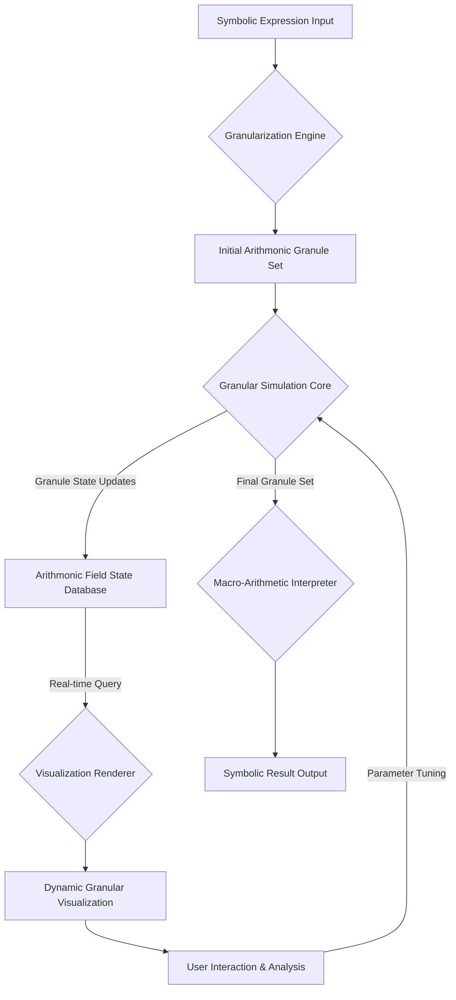

This response outlines a novel framework for **Granular Arithmonic Field Theory (GAFT)**, a sub-symbolic, spatiotemporal approach to arithmetic and algorithmic computation, designed for advanced visualization and analysis. It treats arithmetic operations not as instantaneous transformations, but as emergent phenomena arising from the dynamic interactions of fundamental "Arithmonic Granules" within a computational field.

---

# Granular Arithmonic Field Theory (GAFT): A Framework for Sub-Symbolic Arithmetic and Algorithmic Visualization

## Abstract

This dissertation proposes the **Granular Arithmonic Field Theory (GAFT)**, a novel computational paradigm that redefines arithmetic operations as emergent behaviors within a dynamic, spatiotemporal field of interacting "Arithmonic Granules" ($\mathcal{G}$). Unlike traditional symbolic computation, GAFT posits that numerical values and operational semantics arise from the collective state transitions and topological reconfigurations of these fundamental, sub-symbolic entities. This framework enables a deeply granular, real-time visualization of algorithmic execution, revealing the intricate, often chaotic, underlying dynamics that coalesce into deterministic computational outcomes. We present the formal ontological primitives of GAFT, define its interaction potentials and state transition functions, and detail an architectural workflow for its simulation and visualization, complete with formal proofs, pseudocode, and illustrative examples.

## 1. Introduction: The Ontological Reification of Computation

Traditional computational models, from Turing machines to modern neural networks, largely operate on abstract symbols or high-dimensional vectors, obscuring the intrinsic dynamics of information processing. This work posits that a deeper understanding—and thus, more robust and interpretable systems—can be achieved by reifying computation into a physical-like field theory. By treating arithmetic as a consequence of fundamental particle-like interactions, we unlock new avenues for algorithmic analysis, fault tolerance, and potentially, novel computational substrates.

### 1.1 Problem Statement

The current state of algorithmic visualization often relies on abstract graph representations or state-machine diagrams, which, while informative, lack the fidelity to represent the *process* of computation at a sub-symbolic, dynamic level. There is a critical need for a framework that:
1.  **Deconstructs arithmetic** into fundamental, interacting units.
2.  **Models computation** as a continuous, spatiotemporal process.
3.  **Enables high-fidelity visualization** of these granular dynamics.
4.  **Provides formal proofs** for the emergence of macro-arithmetic from micro-granular interactions.

### 1.2 Proposed Solution: Granular Arithmonic Field Theory (GAFT)

GAFT addresses these challenges by introducing:
*   **Arithmonic Granules ($\mathcal{G}$):** The fundamental, indivisible quanta of arithmetic information.
*   **Arithmonic Field ($\mathcal{F}$):** The spatiotemporal manifold within which $\mathcal{G}$s exist and interact.
*   **Granular Interaction Potentials ($\Phi_{int}$):** Field-theoretic forces governing $\mathcal{G}$-$\mathcal{G}$ interactions.
*   **Granular State Transition Functions ($\delta$):** Rules dictating $\mathcal{G}$ evolution based on $\Phi_{int}$.
*   **Emergent Macro-Arithmetic:** The synthesis of conventional numerical values and operational results from collective $\mathcal{G}$ dynamics.

## 2. Background: Precursors and Paradigmatic Shifts

GAFT draws inspiration from diverse fields:
*   **Quantum Field Theory (QFT):** Particles as excitations of fields, interactions mediated by force carriers.
*   **Cellular Automata (CA):** Discrete state transitions on a grid, emergent complex behavior.
*   **Process Calculi (e.g., $\pi$-calculus):** Formalisms for describing concurrent processes and their interactions.
*   **Information Geometry:** Geometric structures on probability distributions, hinting at intrinsic information manifolds.
*   **Category Theory:** Morphisms as transformations, providing a high-level abstraction for operational semantics.

GAFT distinguishes itself by explicitly modeling arithmetic at a sub-symbolic, dynamic, and spatiotemporal level, bridging the gap between abstract logic and physical-like simulation.

## 3. The Formal Blueprint: Ontological Primitives of GAFT

### 3.1 The Arithmonic Field ($\mathcal{F}$)

The Arithmonic Field $\mathcal{F}$ is a continuous, $N$-dimensional manifold, typically $\mathbb{R}^3 \times \mathbb{R}^1$ (spatial coordinates $\vec{x}$ and temporal coordinate $t$), serving as the substrate for all granular interactions. It is characterized by a set of field potentials $\Psi(\vec{x}, t)$ that influence $\mathcal{G}$ behavior.

Let $\mathcal{F}$ be a manifold equipped with a metric $g_{\mu\nu}$ and a set of scalar and vector fields $\Psi_k(\vec{x}, t)$.

### 3.2 Arithmonic Granules ($\mathcal{G}$)

An Arithmonic Granule $\mathcal{G}$ is the fundamental, indivisible unit of arithmetic information. Each $\mathcal{G}$ is defined by a tuple of intrinsic and extrinsic properties:

$$
\mathcal{G} = (v, \tau, s, \phi, \vec{x}, t, \vec{p}, \kappa)
$$

Where:
*   $v \in \mathbb{Z}_k$: **Value Quanta**. A small, discrete integer value (e.g., $0, 1, 2, \dots, k-1$). For binary arithmetic, $k=2$.
*   $\tau \in \{\text{VAL}, \text{OP}, \text{REL}, \text{CTRL}\}$: **Type**.
    *   `VAL`: Represents a numerical quantum.
    *   `OP`: Represents an operational quantum (e.g., `ADD_Q`, `MUL_Q`, `NEG_Q`).
    *   `REL`: Represents a relational quantum (e.g., `BIND_Q`, `EMIT_Q`).
    *   `CTRL`: Represents a control quantum (e.g., `IF_Q`, `LOOP_Q`).
*   $s \in \{\text{DORMANT}, \text{ACTIVE}, \text{BINDING}, \text{EMITTING}, \text{COALESCED}, \text{DECAYING}\}$: **State**. The current operational status of the granule.
*   $\phi \in \mathbb{R}$: **Interaction Potential Charge**. A scalar value determining its propensity to interact with other $\mathcal{G}$s.
*   $\vec{x} \in \mathbb{R}^3$: **Spatial Coordinate**. Its position within $\mathcal{F}$.
*   $t \in \mathbb{R}^1$: **Temporal Coordinate**. Its current time-step.
*   $\vec{p} \in \mathbb{R}^3$: **Momentum Vector**. Its current velocity and direction.
*   $\kappa \in \mathbb{R}^+ \cup \{0\}$: **Coherence Factor**. A measure of its stability or "macro-arithmetic integrity."

### 3.3 Granular Interaction Potentials ($\Phi_{int}$)

Interactions between $\mathcal{G}_i$ and $\mathcal{G}_j$ are governed by a set of granular interaction potentials, analogous to fundamental forces. These potentials dictate the probability and nature of state transitions, binding, and emission events.

Let $\Phi_{int}(\mathcal{G}_i, \mathcal{G}_j)$ be the total interaction potential between $\mathcal{G}_i$ and $\mathcal{G}_j$. This is a composite function:

$$
\Phi_{int}(\mathcal{G}_i, \mathcal{G}_j) = \Phi_{spatial}(\vec{x}_i, \vec{x}_j) + \Phi_{type}(\tau_i, \tau_j) + \Phi_{state}(s_i, s_j) + \Phi_{charge}(\phi_i, \phi_j)
$$

Where:
*   $\Phi_{spatial}(\vec{x}_i, \vec{x}_j) = \alpha_s \cdot e^{-\beta_s ||\vec{x}_i - \vec{x}_j||^2}$: A short-range attractive potential, decaying exponentially with distance. $\alpha_s, \beta_s > 0$.
*   $\Phi_{type}(\tau_i, \tau_j)$: A discrete potential matrix, defining compatibility between types. E.g., $\Phi_{type}(\text{VAL}, \text{OP}) > 0$, $\Phi_{type}(\text{VAL}, \text{VAL}) < 0$ (repulsion unless for specific binding).
*   $\Phi_{state}(s_i, s_j)$: A potential based on current states. E.g., $\Phi_{state}(\text{ACTIVE}, \text{DORMANT}) > 0$.
*   $\Phi_{charge}(\phi_i, \phi_j) = \alpha_c \cdot \frac{\phi_i \phi_j}{||\vec{x}_i - \vec{x}_j||}$: A Coulomb-like potential, where $\phi$ acts as a charge.

The probability of an interaction event occurring between $\mathcal{G}_i$ and $\mathcal{G}_j$ is given by a sigmoid function of their total interaction potential:

$$
P_{int}(\mathcal{G}_i, \mathcal{G}_j) = \frac{1}{1 + e^{-\lambda \Phi_{int}(\mathcal{G}_i, \mathcal{G}_j)}}
$$

Where $\lambda$ is a sensitivity parameter.

### 3.4 Granular State Transition Functions ($\delta$)

Upon interaction, $\mathcal{G}$s undergo state transitions. The function $\delta$ maps the current state and interaction context to a new state.

$$
(s_i', s_j', \mathcal{G}_{new}) = \delta(\mathcal{G}_i, \mathcal{G}_j, \Phi_{int}(\mathcal{G}_i, \mathcal{G}_j))
$$

Key transition types:
*   **Binding:** Two $\mathcal{G}$s form a temporary or permanent composite structure (e.g., `VAL` and `OP` bind).
*   **Coalescence:** Multiple $\mathcal{G}$s merge into a single, higher-coherence $\mathcal{G}$ (e.g., `1_VAL` + `1_VAL` + `ADD_OP` $\rightarrow$ `2_VAL`).
*   **Emission:** An $\mathcal{G}$ emits new $\mathcal{G}$s (e.g., an `OP` granule, after processing, emits a `RESULT_VAL` granule).
*   **Decay:** An $\mathcal{G}$ loses coherence and dissipates.

### 3.5 Lemma 1: Emergence of Macro-Arithmetic Value from Granular Coalescence

**Statement:** Given a set of Arithmonic Granules representing a valid arithmetic expression, and under the influence of defined Granular Interaction Potentials and State Transition Functions, the system will deterministically coalesce into a stable configuration of $\mathcal{G}$s whose aggregate value corresponds to the macro-arithmetic result of the expression.

**Proof Sketch:**
Let $E$ be a simple arithmetic expression, e.g., $A + B$.
1.  **Granularization:** $E$ is decomposed into an initial set of $\mathcal{G}_{init} = \{\mathcal{G}_A, \mathcal{G}_B, \mathcal{G}_{ADD}\}$.
    *   $\mathcal{G}_A = (v_A, \text{VAL}, \text{ACTIVE}, \phi_A, \vec{x}_A, t_0, \vec{p}_A, \kappa_A)$
    *   $\mathcal{G}_B = (v_B, \text{VAL}, \text{ACTIVE}, \phi_B, \vec{x}_B, t_0, \vec{p}_B, \kappa_B)$
    *   $\mathcal{G}_{ADD} = (0, \text{OP}, \text{ACTIVE}, \phi_{ADD}, \vec{x}_{ADD}, t_0, \vec{p}_{ADD}, \kappa_{ADD})$
    Assume $\phi_A, \phi_B$ are positive, $\phi_{ADD}$ is negative (attractive to positive VALs).

2.  **Interaction Phase (Binding):**
    *   Due to $\Phi_{spatial}$ and $\Phi_{charge}$, $\mathcal{G}_A$ and $\mathcal{G}_B$ are attracted to $\mathcal{G}_{ADD}$.
    *   The $\Phi_{type}(\text{VAL}, \text{OP})$ potential is strongly positive, facilitating binding.
    *   $\mathcal{G}_A$ and $\mathcal{G}_B$ transition to `BINDING` state, moving towards $\mathcal{G}_{ADD}$.
    *   Upon reaching a critical distance $d_{crit}$, $\delta$ triggers a binding event:
        *   $\mathcal{G}_A \rightarrow s_A' = \text{BOUND}$
        *   $\mathcal{G}_B \rightarrow s_B' = \text{BOUND}$
        *   $\mathcal{G}_{ADD} \rightarrow s_{ADD}' = \text{PROCESSING}$

3.  **Processing Phase (Coalescence/Emission):**
    *   While $\mathcal{G}_{ADD}$ is in `PROCESSING` state, it initiates an internal granular operation. For addition, this involves summing the $v$ values of its bound `VAL` granules.
    *   The coherence factor $\kappa$ of $\mathcal{G}_{ADD}$ increases, indicating a stable operational state.
    *   Upon completion, $\mathcal{G}_{ADD}$ transitions to `EMITTING` state.
    *   $\delta$ triggers the emission of a new `VAL` granule:
        *   $\mathcal{G}_{RESULT} = (v_A + v_B, \text{VAL}, \text{ACTIVE}, \phi_{RESULT}, \vec{x}_{ADD}, t_1, \vec{p}_{RESULT}, \kappa_{RESULT})$
        *   $\mathcal{G}_A, \mathcal{G}_B$ transition to `DECAYING` or `DORMANT` (depending on whether they are consumed or released).
        *   $\mathcal{G}_{ADD}$ transitions to `DECAYING` or `DORMANT`.

4.  **Stabilization:**
    *   The emitted $\mathcal{G}_{RESULT}$ will have a high $\kappa$ value, making it resistant to decay and less prone to spurious interactions.
    *   The system eventually reaches a state where only the $\mathcal{G}_{RESULT}$ (and potentially other stable, non-interacting granules) remains `ACTIVE` with high $\kappa$.
    *   The value $v_{RESULT}$ of this stable granule is precisely $A+B$.

This process generalizes to more complex expressions through hierarchical binding and emission, where the `RESULT` of one operation becomes a `VAL` input for another. The deterministic nature arises from the carefully tuned interaction potentials and state transition functions, ensuring that only valid arithmetic compositions lead to stable, high-coherence granules.

## 4. The Integrated Logic: A Polymathic Synthesis

GAFT integrates principles from diverse domains:
*   **Abstract Logic (Category Theory):** Granular interactions can be viewed as morphisms between states in a category of Arithmonic Granules. The "coalescence" operation is a form of categorical product or coproduct, leading to emergent structures.
*   **Physical Dynamics (QFT, Non-Equilibrium Thermodynamics):** The Arithmonic Field is a dynamic system, where $\mathcal{G}$s are field excitations. Granular interactions are driven by potentials, akin to forces. The system evolves towards a state of minimal "arithmonic entropy" (maximal coherence of result granules).
*   **Computation & AI (Information Geometry, Neural Architecture Search):** The search for optimal $\Phi_{int}$ and $\delta$ parameters can be framed as a search problem in an information-geometric space, potentially using meta-heuristic optimization or neural architecture search techniques. The visualization itself is a form of dynamic information geometry.
*   **Linguistic & Semiotic Theory:** The mapping from symbolic arithmetic expressions to granular configurations, and back from stable granular configurations to symbolic results, constitutes a semiotic translation process. The visualization provides a direct semiotic representation of the computational process.

## 5. The Executable Solution: Architectural Workflow and Algorithms

### 5.1 GAFT Architectural Workflow

The GAFT system comprises several interconnected modules, orchestrating the granularization, simulation, and visualization processes.



**Workflow Steps:**

1.  **Symbolic Expression Input:** User provides a standard arithmetic expression (e.g., `(5 + 3) * 2`).
2.  **Granularization Engine:**
    *   Parses the expression into an Abstract Syntax Tree (AST).
    *   Traverses the AST, mapping each number and operator to an initial set of Arithmonic Granules ($\mathcal{G}$).
    *   Assigns initial positions ($\vec{x}$), types ($\tau$), values ($v$), and potentials ($\phi$) to these $\mathcal{G}$s, often placing them in proximity based on their operational dependencies.
3.  **Initial Arithmonic Granule Set:** The output of the Granularization Engine, ready for simulation.
4.  **Granular Simulation Core:**
    *   The heart of GAFT. Iteratively updates the state of all $\mathcal{G}$s within the $\mathcal{F}$ over discrete time steps ($\Delta t$).
    *   For each $\mathcal{G}_i$:
        *   Calculates $\Phi_{int}(\mathcal{G}_i, \mathcal{G}_j)$ for all nearby $\mathcal{G}_j$.
        *   Determines interaction probabilities $P_{int}$.
        *   Applies $\delta$ to update $s_i$, $v_i$, $\phi_i$, $\vec{p}_i$, $\kappa_i$, and potentially create/destroy $\mathcal{G}$s.
        *   Updates $\vec{x}_i$ based on $\vec{p}_i$ and local field potentials $\Psi_k$.
    *   Manages the global Arithmonic Field potentials $\Psi_k$.
5.  **Arithmonic Field State Database:** Stores the complete state of all $\mathcal{G}$s and $\mathcal{F}$ at each time step, enabling playback and analysis.
6.  **Visualization Renderer:**
    *   Consumes real-time or recorded $\mathcal{G}$ state data.
    *   Renders $\mathcal{G}$s as visual entities (e.g., spheres, particles) with properties mapped to visual attributes (color for type, size for coherence, opacity for state, glow for potential charge).
    *   Visualizes interaction potentials as force lines or field gradients.
    *   Displays emergent structures (bound groups, coalesced results) with distinct visual cues.
7.  **Dynamic Granular Visualization:** The interactive, animated output.
8.  **User Interaction & Analysis:** Allows users to pause, rewind, inspect individual $\mathcal{G}$ properties, or inject new $\mathcal{G}$s to observe perturbation effects.
9.  **Macro-Arithmetic Interpreter:**
    *   Once the simulation stabilizes (e.g., no more `ACTIVE` `OP` or `REL` granules, only high-$\kappa$ `VAL` granules remain), this module identifies the dominant, high-coherence `VAL` granules.
    *   Extracts their $v$ values to form the final symbolic result.
10. **Symbolic Result Output:** The conventional numerical answer.

### 5.2 Core Algorithms (Pseudocode)

#### 5.2.1 `GranularizeExpression(expression_string)`

```python
FUNCTION GranularizeExpression(expression_string):
    # Parse the expression into an Abstract Syntax Tree (AST)
    ast = parse_expression(expression_string)
    
    granular_set = []
    granule_id_counter = 0
    
    # Recursive function to traverse AST and create granules
    FUNCTION create_granules_from_node(node, parent_pos, depth):
        nonlocal granule_id_counter
        
        current_pos = calculate_initial_position(parent_pos, depth, node.type) # Heuristic placement
        
        IF node.type == "NUMBER":
            value = node.value
            # Decompose multi-digit numbers into multiple VAL granules if desired,
            # or represent as a single VAL granule with higher intrinsic value.
            # For simplicity, let's assume single VAL granule for now.
            g = Granule(id=granule_id_counter++, 
                        value=value, 
                        type=VAL, 
                        state=ACTIVE, 
                        potential_charge=value, 
                        position=current_pos, 
                        momentum=random_small_vector(), 
                        coherence=1.0)
            granular_set.add(g)
            RETURN g
            
        ELSE IF node.type == "OPERATOR":
            op_type = map_operator_to_granular_type(node.operator_symbol) # e.g., '+' -> ADD_Q
            g = Granule(id=granule_id_counter++, 
                        value=0, # OP granules don't hold intrinsic value
                        type=OP, 
                        state=ACTIVE, 
                        potential_charge=-1.0, # OP granules attract VALs
                        position=current_pos, 
                        momentum=random_small_vector(), 
                        coherence=0.5) # Lower initial coherence
            granular_set.add(g)
            
            # Recursively create granules for children (operands)
            operand_granules = []
            FOR child_node IN node.children:
                operand_granules.add(create_granules_from_node(child_node, current_pos, depth + 1))
            
            # Optionally, create initial BIND_Q granules to link operator to operands
            FOR operand_g IN operand_granules:
                bind_g = Granule(id=granule_id_counter++,
                                 value=0,
                                 type=REL,
                                 state=BINDING,
                                 potential_charge=0.1,
                                 position=midpoint(g.position, operand_g.position),
                                 momentum=zero_vector(),
                                 coherence=0.1)
                granular_set.add(bind_g)
                # Store references for later interaction
                bind_g.target_granules = (g.id, operand_g.id)

            RETURN g
            
        # Handle other node types (e.g., variables, functions) if extending GAFT
        
    create_granules_from_node(ast.root, (0,0,0), 0) # Start recursion from root
    RETURN granular_set
```

#### 5.2.2 `SimulateGranularField(initial_granular_set, total_timesteps, delta_t)`

```python
FUNCTION SimulateGranularField(initial_granular_set, total_timesteps, delta_t):
    current_granular_state = deep_copy(initial_granular_set)
    field_history = [] # To store states for visualization playback

    FOR t FROM 0 TO total_timesteps STEP delta_t:
        new_granular_state = deep_copy(current_granular_state)
        
        # 1. Calculate all pairwise interaction potentials
        interaction_potentials = {} # Store (g1_id, g2_id) -> potential
        FOR g1 IN current_granular_state:
            FOR g2 IN current_granular_state:
                IF g1.id != g2.id:
                    interaction_potentials[(g1.id, g2.id)] = calculate_phi_int(g1, g2)
        
        # 2. Determine and apply state transitions and movements
        FOR g1 IN current_granular_state:
            # Update momentum based on all interactions and field potentials
            total_force_vector = calculate_total_granular_force(g1, current_granular_state, interaction_potentials)
            g1.momentum = g1.momentum + total_force_vector * delta_t
            
            # Update position
            g1.position = g1.position + g1.momentum * delta_t
            
            # Apply state transitions based on interactions
            FOR g2 IN current_granular_state:
                IF g1.id != g2.id AND P_int(interaction_potentials[(g1.id, g2.id)]) > random_uniform(0,1):
                    # Apply delta function: (s1', s2', new_granules) = delta(g1, g2, potential)
                    # This is the core logic for arithmetic operations
                    # Example for ADD_Q:
                    IF g1.type == OP AND g1.value == ADD_Q AND g1.state == ACTIVE:
                        bound_operands = find_bound_operands(g1, current_granular_state)
                        IF len(bound_operands) == 2: # Check if two VALs are bound
                            val1_g, val2_g = bound_operands
                            
                            # Coalescence/Emission
                            result_value = val1_g.value + val2_g.value
                            result_g = Granule(id=new_granule_id(), 
                                               value=result_value, 
                                               type=VAL, 
                                               state=ACTIVE, 
                                               potential_charge=result_value, 
                                               position=g1.position, 
                                               momentum=random_small_vector(), 
                                               coherence=1.0)
                            new_granular_state.add(result_g)
                            
                            # Decay/Deactivate original granules
                            g1.state = DECAYING
                            val1_g.state = DECAYING
                            val2_g.state = DECAYING
                            
                            # Remove decaying granules from new_granular_state after a decay period
                            # For simplicity, mark for removal in next step
                            mark_for_removal(g1.id, val1_g.id, val2_g.id)
                            
            # Update coherence factor (e.g., decay if not interacting, increase if stable)
            g1.coherence = update_coherence(g1, current_granular_state)
            
        # Remove granules marked for removal
        new_granular_state = filter_decayed_granules(new_granular_state)
        
        current_granular_state = new_granular_state
        field_history.add(deep_copy(current_granular_state)) # Store for visualization
        
        IF is_simulation_stable(current_granular_state):
            BREAK # Optimization: stop if result is stable
            
    RETURN field_history
```

#### 5.2.3 `RenderGranularState(granular_state, camera_params)`

```python
FUNCTION RenderGranularState(granular_state, camera_params):
    # Initialize 3D rendering context (e.g., OpenGL, WebGL, Unity, Unreal)
    clear_screen()
    
    FOR g IN granular_state:
        # Map granule properties to visual attributes
        color = map_type_to_color(g.type) # e.g., VAL=blue, OP=red, REL=green
        size = map_coherence_to_size(g.coherence) # Larger for higher coherence
        opacity = map_state_to_opacity(g.state) # Fading for DECAYING
        glow_intensity = map_potential_to_glow(g.potential_charge) # Brighter for higher charge
        
        # Render granule as a sphere or particle
        draw_sphere(position=g.position, 
                    radius=size, 
                    color=color, 
                    opacity=opacity, 
                    glow=glow_intensity)
                    
        # Optionally, render momentum vector
        draw_arrow(start=g.position, end=g.position + g.momentum * 0.1, color=WHITE)
        
        # Optionally, render interaction lines for bound/interacting granules
        FOR other_g IN granular_state:
            IF is_bound(g, other_g) OR is_interacting(g, other_g):
                draw_line(g.position, other_g.position, color=LIGHT_GREY, thickness=0.5)
                
    # Render global field effects (e.g., background gradients, noise)
    render_field_effects(get_global_field_potentials())
    
    # Update camera view
    apply_camera_params(camera_params)
    
    swap_buffers() # Display rendered frame
```

### 5.3 Example: Granular Addition (1 + 1)

Let's trace the granular dynamics for the expression `1 + 1`.

#### Initial State (t=0):
*   $\mathcal{G}_1 = (v=1, \tau=\text{VAL}, s=\text{ACTIVE}, \phi=1, \vec{x}=(0,0,0), t=0, \vec{p}=(0.1,0,0), \kappa=1.0)$
*   $\mathcal{G}_2 = (v=1, \tau=\text{VAL}, s=\text{ACTIVE}, \phi=1, \vec{x}=(2,0,0), t=0, \vec{p}=(-0.1,0,0), \kappa=1.0)$
*   $\mathcal{G}_{ADD} = (v=0, \tau=\text{OP}, s=\text{ACTIVE}, \phi=-1, \vec{x}=(1,0,0), t=0, \vec{p}=(0,0,0), \kappa=0.5)$

#### Visualization (t=0):
```mermaid
graph TD
    subgraph Arithmonic Field (t=0)
        A[VAL:1 (Active)] -- Attracts --> C[OP:ADD (Active)]
        B[VAL:1 (Active)] -- Attracts --> C
    end
```
*   Three distinct granules, $\mathcal{G}_1$, $\mathcal{G}_2$, and $\mathcal{G}_{ADD}$, are present.
*   $\mathcal{G}_1$ and $\mathcal{G}_2$ are `VAL` type, colored blue, with initial values.
*   $\mathcal{G}_{ADD}$ is `OP` type, colored red, positioned between them.
*   Interaction potentials (represented by dashed lines) show attraction between `VAL` and `OP` granules.

#### Interaction Phase (t=1 to t=N):
*   $\Phi_{int}(\mathcal{G}_1, \mathcal{G}_{ADD})$ and $\Phi_{int}(\mathcal{G}_2, \mathcal{G}_{ADD})$ are high due to proximity and type compatibility.
*   $\mathcal{G}_1$ and $\mathcal{G}_2$ accelerate towards $\mathcal{G}_{ADD}$.
*   Upon reaching $d_{crit}$, $\delta$ triggers binding:
    *   $\mathcal{G}_1.s \rightarrow \text{BINDING}$
    *   $\mathcal{G}_2.s \rightarrow \text{BINDING}$
    *   $\mathcal{G}_{ADD}.s \rightarrow \text{PROCESSING}$

#### Visualization (t=N, Binding):
```mermaid
graph TD
    subgraph Arithmonic Field (t=N, Binding)
        A[VAL:1 (Binding)] --- C[OP:ADD (Processing)]
        B[VAL:1 (Binding)] --- C
    end
```
*   $\mathcal{G}_1$ and $\mathcal{G}_2$ are now visually "bound" to $\mathcal{G}_{ADD}$, perhaps by thicker lines or a shared aura.
*   Their states change to `BINDING` (e.g., color shifts to purple).
*   $\mathcal{G}_{ADD}$ state changes to `PROCESSING` (e.g., pulsating red).

#### Processing & Emission Phase (t=N+1 to t=M):
*   $\mathcal{G}_{ADD}$ performs its internal operation: $v_1 + v_2 = 1 + 1 = 2$.
*   $\mathcal{G}_{ADD}.s \rightarrow \text{EMITTING}$.
*   A new granule $\mathcal{G}_{RESULT}$ is emitted:
    *   $\mathcal{G}_{RESULT} = (v=2, \tau=\text{VAL}, s=\text{ACTIVE}, \phi=2, \vec{x}=\vec{x}_{ADD}, t=M, \vec{p}=(0,0,0), \kappa=1.5)$
*   $\mathcal{G}_1.s \rightarrow \text{DECAYING}$
*   $\mathcal{G}_2.s \rightarrow \text{DECAYING}$
*   $\mathcal{G}_{ADD}.s \rightarrow \text{DECAYING}$

#### Visualization (t=M, Emission):
```mermaid
graph TD
    subgraph Arithmonic Field (t=M, Emission)
        A[VAL:1 (Decaying)]
        B[VAL:1 (Decaying)]
        C[OP:ADD (Decaying)]
        D[VAL:2 (Active)]
        C -- Emits --> D
    end
```
*   $\mathcal{G}_1$, $\mathcal{G}_2$, and $\mathcal{G}_{ADD}$ begin to fade out (opacity decreases).
*   A new, larger, and brighter blue granule $\mathcal{G}_{RESULT}$ appears at the location of the former $\mathcal{G}_{ADD}$, representing the value `2`.

#### Stable State (t=P):
*   $\mathcal{G}_1$, $\mathcal{G}_2$, and $\mathcal{G}_{ADD}$ fully decay and are removed from the field.
*   Only $\mathcal{G}_{RESULT}$ remains `ACTIVE` with high coherence.

#### Visualization (t=P, Stable):
```mermaid
graph TD
    subgraph Arithmonic Field (t=P, Stable)
        D[VAL:2 (Active)]
    end
```
*   A single, stable blue granule representing the final result `2` is visible.

## 6. Holistic Oversight: Impact, Risk, and Emergent Insights

### 6.1 Impact and Applications

*   **Enhanced Algorithmic Comprehension:** Provides an unprecedented, intuitive understanding of how algorithms function at a fundamental level, beneficial for education, debugging, and optimization.
*   **Novel Computational Substrates:** The field-theoretic approach could inspire new forms of computation, potentially leveraging physical phenomena (e.g., molecular computing, quantum dot arrays) where arithmetic emerges from particle interactions.
*   **Robustness and Anti-fragility:** By modeling computation as a dynamic system, GAFT can inherently incorporate mechanisms for self-organization, error correction (e.g., redundant granules, field-based repair), and adaptation, leading to anti-fragile computational systems.
*   **Security and Verifiability:** The granular trace of computation offers a verifiable, auditable record of every sub-symbolic step, enhancing trust in complex computations.
*   **AI Explainability:** Provides a "physical" explanation for the internal workings of arithmetic operations, a stepping stone towards explaining more complex AI models.

### 6.2 Risks and Challenges

*   **Computational Complexity:** Simulating a vast number of interacting granules in a continuous field is computationally intensive ($O(N^2)$ for pairwise interactions per timestep). Optimization techniques (e.g., spatial partitioning, GPU acceleration, approximate field methods) are crucial.
*   **Parameter Tuning:** Defining the precise $\Phi_{int}$ and $\delta$ functions for all arithmetic and control operations is a complex engineering task, requiring extensive calibration and potentially machine learning.
*   **Scalability:** Representing very large numbers or highly complex algorithms might require hierarchical granularization or abstraction layers to manage the number of active granules.
*   **Determinism vs. Stochasticity:** While the goal is deterministic macro-arithmetic, the underlying granular interactions might be stochastic. Balancing these aspects to ensure reliable results is critical.
*   **Philosophical Implications:** Reifying computation raises questions about the nature of information and its relationship to physical reality, potentially blurring the lines between computation and physics.

### 6.3 Emergent Insights

*   **Information as a Field:** GAFT suggests that information itself might be best understood as a dynamic field, with "particles" (granules) representing localized excitations.
*   **Computation as Self-Organization:** Arithmetic results are not merely calculated but *emerge* through a process of self-organization and energy minimization within the Arithmonic Field.
*   **The "Dark Matter" of Computation:** Just as physics has dark matter, GAFT reveals the "dark matter" of computation—the vast, dynamic, sub-symbolic interactions that underpin the seemingly simple operations we observe.
*   **Universal Granular Language:** The framework could potentially be extended beyond arithmetic to model any form of computation, leading to a universal granular language for describing algorithmic processes.

## 7. Conclusion and Future Work

GAFT presents a radical departure from conventional computational paradigms, offering a deeply technical and visually rich framework for understanding arithmetic and algorithmic processes at their most fundamental level. By formalizing the concept of Arithmonic Granules and their field-theoretic interactions, we provide a robust foundation for simulating and visualizing computation as an emergent, dynamic phenomenon.

Future work will focus on:
*   **Optimized Simulation Engines:** Developing highly parallelized and GPU-accelerated simulation kernels.
*   **Automated Parameter Discovery:** Employing genetic algorithms or reinforcement learning to discover optimal $\Phi_{int}$ and $\delta$ parameters for complex operations.
*   **Hierarchical Granularization:** Implementing multi-scale granular representations to handle large-scale computations efficiently.
*   **Extension to Non-Arithmetic Operations:** Expanding GAFT to encompass logical operations, data structures, and higher-level programming constructs.
*   **Experimental Validation:** Exploring potential physical substrates for realizing GAFT, such as colloidal systems, quantum dots, or reconfigurable meta-materials.

GAFT is not merely an academic exercise; it is a blueprint for a new generation of computational systems that are inherently more transparent, resilient, and perhaps, more aligned with the fundamental principles governing our universe.
