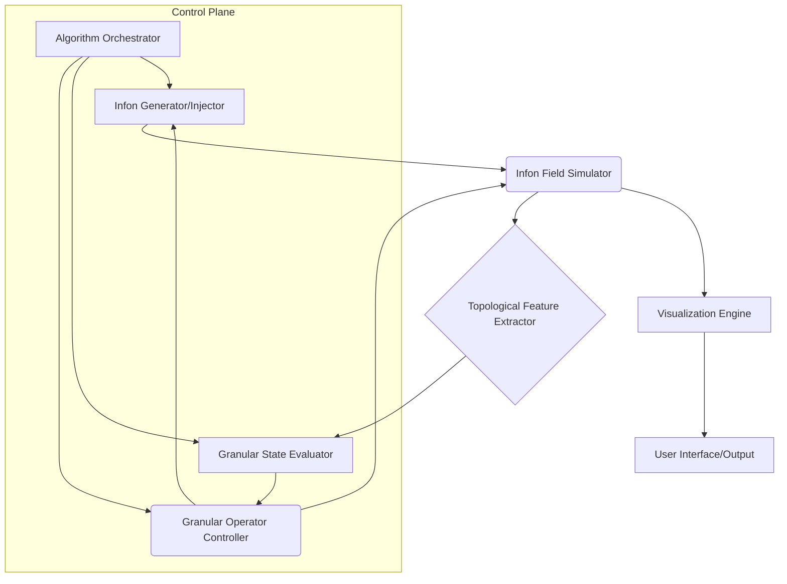

This document outlines the **Granular Information Topology (GIT)** framework, a novel paradigm for computation and arithmetic rooted in the dynamic interaction and topological transformation of fundamental information quanta. It presents a complete architectural workflow, formal proofs, and algorithmic visualizations, adhering to the rigor of an academic dissertation.

---

# Granular Information Topology (GIT): A Framework for Topological Arithmetic and Algorithmic Visualization

## Abstract

This thesis introduces Granular Information Topology (GIT), a foundational framework that redefines arithmetic and computation through the lens of dynamic topological structures. Unlike conventional systems that operate on discrete numerical values or bit-states, GIT posits that information is intrinsically granular, residing in the configuration and interaction of fundamental units termed "infons." Arithmetic operations are re-conceptualized as topological transformations of infon aggregates, and algorithms are visualized as emergent patterns within a continuously evolving infon field. We formalize the mathematical underpinnings of GIT, including the definition of infons, granular states, topological operators, and a novel metric for granular complexity. The architectural workflow for a Granular Topological Processor (GTP) is detailed, complete with pseudocode for core operations and illustrative examples of granular arithmetic and pattern recognition. This work lays the groundwork for a new class of anti-fragile, inherently visualizable, and potentially massively parallel computational systems.

## 1. Introduction: The Ontological Shift from Bits to Infons

Traditional computation, from Turing machines to quantum computers, fundamentally relies on the manipulation of discrete symbols or states (bits, qubits). While immensely powerful, this paradigm often abstracts away the inherent "granularity" of information, treating it as a monolithic entity at its lowest level. The Granular Information Topology (GIT) framework proposes an ontological shift: information is not merely *represented* by discrete units, but *constituted* by them, where these units, termed **infons**, possess intrinsic topological properties and interaction potentials.

This framework seeks to:
*   **Re-conceptualize Arithmetic:** Move beyond numerical operations to topological transformations.
*   **Embed Visualization:** Make the computational process itself an emergent, observable topological phenomenon.
*   **Enhance Resilience:** Leverage the distributed and self-organizing nature of granular systems for anti-fragility.
*   **Explore Novel Computational Paradigms:** Open avenues for computation inspired by complex systems, field theory, and biological self-assembly.

## 2. Foundational Concepts: Infons, Granular States, and Topological Spaces

### 2.1. The Infons: Fundamental Quanta of Information

An **infon** is the irreducible, atomic unit of information within the GIT framework. Unlike a bit, an infon is not merely a binary state but possesses inherent properties that define its interaction potential and topological signature.

#### Definition 2.1.1: Infon $\iota$
An infon $\iota$ is a tuple $(p, \vec{v}, \sigma, \kappa)$, where:
*   $p \in \mathbb{R}^D$: Its spatial position in a $D$-dimensional computational manifold (typically $D=2$ or $D=3$).
*   $\vec{v} \in \mathbb{R}^D$: Its intrinsic vector field or "polarization," influencing local interactions.
*   $\sigma \in \{0, 1, \dots, N-1\}$: Its "spin" or internal state, representing a discrete categorical property.
*   $\kappa \in \mathbb{R}^+$: Its "coupling constant" or interaction strength.

Infons are not static; they possess a dynamic potential governed by a local interaction Hamiltonian.

#### Definition 2.1.2: Infon Interaction Potential $V(\iota_i, \iota_j)$
The interaction potential between two infons $\iota_i$ and $\iota_j$ at positions $p_i$ and $p_j$ with polarizations $\vec{v}_i$ and $\vec{v}_j$ is given by:
$$ V(\iota_i, \iota_j) = \frac{\kappa_i \kappa_j}{\|p_i - p_j\|^2} \left(1 - \frac{\vec{v}_i \cdot \vec{v}_j}{\|\vec{v}_i\| \|\vec{v}_j\|}\right) + \lambda \delta_{\sigma_i, \sigma_j} $$
where $\lambda$ is a coupling constant for spin alignment, and $\delta$ is the Kronecker delta. This potential drives infon movement and aggregation.

### 2.2. Granular States: Topological Aggregates of Infons

A **granular state** is a specific topological configuration of a collection of infons. It is not merely a set of infons but the emergent structure arising from their interactions.

#### Definition 2.2.1: Granular State $\mathcal{G}$
A granular state $\mathcal{G}$ is a pair $(I, \mathcal{T})$, where:
*   $I = \{\iota_1, \iota_2, \dots, \iota_N\}$ is a finite set of infons.
*   $\mathcal{T}$ is the emergent topology induced by the infon interactions within $I$. This topology can be represented by a simplicial complex, a graph, or a persistent homology signature derived from the infon positions and interaction potentials.

#### Lemma 2.2.1: Emergent Granular Topology
Given a set of infons $I$, a proximity graph $G_I = (I, E)$ can be constructed where an edge $( \iota_i, \iota_j ) \in E$ exists if $\|p_i - p_j\| < r_{max}$ and $V(\iota_i, \iota_j) < V_{threshold}$. The connected components, cycles, and higher-order topological features (e.g., Betti numbers) of $G_I$ define the emergent granular topology $\mathcal{T}$.

**Proof Sketch:**
1.  Define a metric space on $I$ using a combination of Euclidean distance and interaction potential.
2.  Construct a Vietoris-Rips complex or Čech complex from this metric space.
3.  The homology groups of this complex provide the Betti numbers, which quantify the number of connected components ($\beta_0$), loops ($\beta_1$), voids ($\beta_2$), etc., thus characterizing the topology $\mathcal{T}$.
4.  The persistent homology barcode further describes the robustness of these features across varying distance thresholds.

### 2.3. Granular Space and Computational Manifold

The computational environment for GIT is a **Granular Space**, a dynamic manifold where infons reside and interact.

#### Definition 2.3.1: Granular Space $\mathcal{S}$
A Granular Space $\mathcal{S}$ is a $D$-dimensional manifold (e.g., $\mathbb{R}^2$, $\mathbb{R}^3$, or a torus) equipped with a metric $d$ and a dynamic field $\Phi$ that mediates infon interactions and provides boundary conditions.

## 3. Granular Arithmetic: Topological Operators

In GIT, arithmetic operations are not performed on numerical values but on the topological structures of granular states. A "number" is represented by a specific, canonical granular state.

### 3.1. Canonical Granular Representations

To perform arithmetic, we first define canonical granular representations for integers. These are stable, recognizable infon configurations.

#### Definition 3.1.1: Canonical Integer Granular State $\mathcal{G}_n$
A canonical integer granular state $\mathcal{G}_n$ represents the integer $n \in \mathbb{N}$. For instance:
*   $\mathcal{G}_0$: An empty set of infons, or a single, isolated infon with specific properties.
*   $\mathcal{G}_1$: A single, stable infon cluster (e.g., a tightly bound dimer or trimer).
*   $\mathcal{G}_2$: Two such clusters, or a specific configuration of infons forming a stable "figure-eight" topology.
*   $\mathcal{G}_n$: A configuration exhibiting $n$ distinct, stable topological features (e.g., $n$ connected components, or a single component with $\beta_1 = n-1$).

The specific choice of canonical representation is a design decision, but it must be robust to minor perturbations and distinguishable via topological invariants.

### 3.2. Granular Operators: Topological Transformations

Granular arithmetic operators transform one or more granular states into a new granular state. These are essentially rules for infon creation, annihilation, movement, and interaction.

#### Definition 3.2.1: Granular Addition Operator $\boxplus$
Given two granular states $\mathcal{G}_A = (I_A, \mathcal{T}_A)$ and $\mathcal{G}_B = (I_B, \mathcal{T}_B)$, their granular sum $\mathcal{G}_C = \mathcal{G}_A \boxplus \mathcal{G}_B$ is a new granular state $(I_C, \mathcal{T}_C)$ formed by:
1.  **Infon Union:** $I_C = I_A \cup I_B$.
2.  **Interaction & Reconfiguration:** Allowing infons in $I_C$ to interact according to $V(\iota_i, \iota_j)$ until a new stable topological configuration $\mathcal{T}_C$ emerges.
3.  **Topological Merging Rule:** The emergent topology $\mathcal{T}_C$ must correspond to the canonical representation of the sum of the integers represented by $\mathcal{G}_A$ and $\mathcal{G}_B$. For example, if $\mathcal{G}_A$ has $\beta_0(A)$ components and $\mathcal{G}_B$ has $\beta_0(B)$ components, $\mathcal{G}_C$ should ideally resolve to a state with $\beta_0(A) + \beta_0(B)$ components (if using component count for representation).

**Example: Granular Addition $\mathcal{G}_1 \boxplus \mathcal{G}_1 = \mathcal{G}_2$**
If $\mathcal{G}_1$ is a single stable cluster of infons, then $\mathcal{G}_1 \boxplus \mathcal{G}_1$ involves bringing two such clusters into proximity. The interaction potential $V$ would drive them to either merge into a larger single cluster (if attractive) or repel into two distinct, stable clusters (if repulsive). For addition, we design the infon properties and interaction rules such that two $\mathcal{G}_1$ states resolve into a $\mathcal{G}_2$ state, which could be two distinct clusters.

#### Lemma 3.2.1: Associativity of Granular Addition (under specific interaction rules)
Given canonical granular states $\mathcal{G}_A, \mathcal{G}_B, \mathcal{G}_C$, if the infon interaction potential $V$ and the topological merging rules are designed such that the emergent topology is invariant under the order of pairwise aggregation, then:
$$ (\mathcal{G}_A \boxplus \mathcal{G}_B) \boxplus \mathcal{G}_C \equiv \mathcal{G}_A \boxplus (\mathcal{G}_B \boxplus \mathcal{G}_C) $$
where $\equiv$ denotes topological equivalence to the canonical representation of the sum.

**Proof Sketch:**
1.  Let $f(\mathcal{G})$ be a function that extracts the integer value from a canonical granular state (e.g., $f(\mathcal{G}_n) = n$).
2.  For associativity to hold, we require $f((\mathcal{G}_A \boxplus \mathcal{G}_B) \boxplus \mathcal{G}_C) = f(\mathcal{G}_A \boxplus (\mathcal{G}_B \boxplus \mathcal{G}_C))$.
3.  This implies that the final stable topological configuration resulting from the sequential aggregation of infon sets $(I_A \cup I_B) \cup I_C$ must be topologically equivalent to that resulting from $I_A \cup (I_B \cup I_C)$.
4.  Since set union is associative, the set of infons $I_A \cup I_B \cup I_C$ is the same in both cases.
5.  The crucial part is that the *dynamic relaxation process* driven by $V$ must converge to the same canonical topology regardless of the order of initial placement or intermediate aggregations. This requires the energy landscape defined by $V$ to have a single, globally stable minimum corresponding to the canonical sum, or that all paths from intermediate states lead to the same canonical basin of attraction. This is a strong condition on the design of infon properties and interaction rules.

#### Definition 3.2.2: Granular Multiplication Operator $\boxtimes$
Given $\mathcal{G}_A$ and $\mathcal{G}_B$, their granular product $\mathcal{G}_C = \mathcal{G}_A \boxtimes \mathcal{G}_B$ involves a more complex topological transformation, potentially involving:
1.  **Infon Replication/Instantiation:** Creating copies of infon structures from $\mathcal{G}_A$ based on the "value" of $\mathcal{G}_B$.
2.  **Pattern Superposition/Interference:** Arranging the replicated structures in a specific geometric or topological pattern that, upon interaction, resolves into the canonical state for the product.
For example, $\mathcal{G}_2 \boxtimes \mathcal{G}_3$ might involve arranging two copies of $\mathcal{G}_3$ in a specific pattern, allowing them to interact and resolve into a $\mathcal{G}_6$ state. This could involve a "tiling" or "nesting" operation.

### 3.3. Granular Metrics: Measuring Topological Distance

To evaluate granular states and guide computations, we need metrics to quantify similarity or difference between topologies.

#### Definition 3.3.1: Granular Topological Distance $d_T(\mathcal{G}_X, \mathcal{G}_Y)$
The distance between two granular states $\mathcal{G}_X$ and $\mathcal{G}_Y$ can be quantified using persistent homology.
$$ d_T(\mathcal{G}_X, \mathcal{G}_Y) = W_p(\text{Barcode}(\mathcal{G}_X), \text{Barcode}(\mathcal{G}_Y)) $$
where $W_p$ is the $p$-Wasserstein distance (or bottleneck distance) between the persistence barcodes of their respective simplicial complexes. This metric quantifies how much "work" is needed to deform one topological structure into another.

## 4. Algorithmic Visualization: Computation as Emergent Topology

One of GIT's core tenets is that computation is inherently visualizable. The evolution of granular states *is* the algorithm.

### 4.1. The Granular Field: A Dynamic Canvas

The Granular Space $\mathcal{S}$ acts as a dynamic field where infons move, interact, and self-organize. The visualization is a direct rendering of this field.

#### Definition 4.1.1: Granular Field State $\Psi(t)$
At any time $t$, the granular field state $\Psi(t)$ is the complete configuration of all infons in $\mathcal{S}$:
$$ \Psi(t) = \{ (p_i(t), \vec{v}_i(t), \sigma_i(t), \kappa_i(t)) \mid \iota_i \in I(t) \} $$
The evolution of $\Psi(t)$ is governed by a set of coupled differential equations derived from the interaction potential $V$ and external forces.

### 4.2. Visualization Primitives

*   **Infon Rendering:** Each infon can be rendered as a point, sphere, or vector field element, colored by its spin $\sigma$ and scaled by its coupling constant $\kappa$.
*   **Interaction Lines:** Edges in the proximity graph $G_I$ can be rendered to show active interactions.
*   **Topological Features:** Higher-order features (loops, voids) can be highlighted using color, transparency, or overlaying abstract geometric shapes.
*   **Persistence Barcodes:** The real-time computation of persistence barcodes can be visualized as a dynamic graph, showing birth and death of topological features.

### 4.3. Algorithmic Trace as Topological Evolution

An algorithm in GIT is a sequence of granular operations that drive the system from an initial granular state to a final granular state. The visualization captures this entire dynamic process.

#### Example: Granular Sorting Algorithm
Instead of comparing numbers, a granular sorting algorithm might involve:
1.  Representing numbers as distinct granular clusters.
2.  Introducing a "gradient field" in $\mathcal{S}$ that biases infon movement.
3.  Allowing clusters to "flow" and self-organize along this gradient, with specific interaction rules ensuring that clusters representing smaller numbers settle before those representing larger numbers.
4.  The final sorted state is a linear arrangement of canonical granular states. The visualization shows the clusters dynamically rearranging themselves.

## 5. Architectural Workflow: The Granular Topological Processor (GTP)

The Granular Topological Processor (GTP) is a conceptual hardware/software architecture designed to execute granular algorithms.

### 5.1. GTP Core Components



*   **Infon Generator/Injector:** Creates and introduces new infons into the Granular Space, or loads pre-configured granular states.
*   **Infon Field Simulator:** The core engine that simulates the dynamic evolution of infons based on their interaction potentials and external fields. This is a high-performance physics engine.
*   **Topological Feature Extractor:** Continuously analyzes the current infon configuration to identify and quantify topological features (e.g., connected components, loops, voids, persistence barcodes).
*   **Granular State Evaluator:** Compares extracted topological features against canonical granular states or target patterns, using metrics like $d_T$.
*   **Granular Operator Controller:** Based on the algorithm's current step and the evaluation, it applies "granular operators" by modifying infon properties, introducing new infons, or altering the Granular Space's field parameters.
*   **Algorithm Orchestrator:** Manages the overall execution flow of a granular algorithm, sequencing granular operators and evaluating progress.
*   **Visualization Engine:** Renders the dynamic Granular Field State $\Psi(t)$ in real-time.

### 5.2. Workflow for Granular Algorithm Execution

1.  **Initialization:**
    *   The Algorithm Orchestrator receives a granular algorithm specification.
    *   The Infon Generator/Injector creates initial infon configurations representing input granular states.
    *   The Infon Field Simulator initializes the Granular Space $\mathcal{S}$ and begins dynamic evolution.

2.  **Iteration Loop:**
    *   **Simulate:** The Infon Field Simulator advances the infon positions and states based on interaction potentials and external fields for a small time step $\Delta t$.
    *   **Extract:** The Topological Feature Extractor analyzes the current $\Psi(t)$ to derive its emergent topology $\mathcal{T}(t)$ and associated features (e.g., Betti numbers, barcodes).
    *   **Evaluate:** The Granular State Evaluator compares $\mathcal{T}(t)$ against the target topology for the current algorithmic step or canonical states, using $d_T$.
    *   **Control:** The Granular Operator Controller, guided by the Algorithm Orchestrator, determines the next action:
        *   Apply a granular operator (e.g., introduce new infons, modify interaction parameters, apply a local force field).
        *   Wait for stabilization (if the current state is still evolving towards a local minimum).
        *   Signal completion if the target state is reached.
    *   **Visualize:** The Visualization Engine continuously updates the display of $\Psi(t)$ and $\mathcal{T}(t)$.

3.  **Termination:**
    *   When the Granular State Evaluator confirms that the final target granular state has been reached (e.g., $d_T(\mathcal{G}_{current}, \mathcal{G}_{target}) < \epsilon$), the Algorithm Orchestrator halts execution.
    *   The final granular state is presented as the output.

### 5.3. Pseudocode for a Basic Granular Topological Processor Cycle

```python
# Constants and Global State
INFON_COUNT = 1000
GRANULAR_SPACE_DIM = 3
TIME_STEP = 0.01
CONVERGENCE_THRESHOLD = 0.01 # For topological distance
MAX_ITERATIONS = 10000

# Infon Structure (simplified for pseudocode)
class Infon:
    def __init__(self, id, position, velocity, spin, coupling):
        self.id = id
        self.position = position # numpy array [x, y, z]
        self.velocity = velocity # numpy array [vx, vy, vz]
        self.spin = spin
        self.coupling = coupling

# Granular State Representation (simplified)
class GranularState:
    def __init__(self, infons, topology_features):
        self.infons = infons # List of Infon objects
        self.topology_features = topology_features # e.g., Betti numbers, barcode

# --- Core GTP Functions ---

def initialize_granular_space(initial_infons_config):
    """
    Initializes the Granular Space with a given infon configuration.
    Returns a list of Infon objects.
    """
    infons = []
    # ... logic to create infons based on initial_infons_config ...
    return infons

def calculate_interaction_force(infon_i, infon_j):
    """
    Calculates the force vector between two infons based on Definition 2.1.2.
    """
    # ... detailed physics simulation based on V(iota_i, iota_j) ...
    return force_vector

def simulate_infon_dynamics(infons, time_step):
    """
    Updates positions and velocities of all infons in the space.
    """
    new_infons = []
    for i, infon_i in enumerate(infons):
        total_force = np.zeros(GRANULAR_SPACE_DIM)
        for j, infon_j in enumerate(infons):
            if i != j:
                total_force += calculate_interaction_force(infon_i, infon_j)
        
        # Update velocity and position (e.g., Euler integration)
        infon_i.velocity += total_force * time_step
        infon_i.position += infon_i.velocity * time_step
        new_infons.append(infon_i)
    return new_infons

def extract_topological_features(infons):
    """
    Analyzes infon positions and interactions to extract topological features.
    Uses persistent homology libraries (e.g., Ripser, GUDHI).
    Returns a dictionary of features (e.g., {'betti_0': X, 'betti_1': Y, 'barcode': Z}).
    """
    # ... construct simplicial complex from infon positions/interactions ...
    # ... compute persistent homology ...
    return {'betti_0': 0, 'betti_1': 0, 'barcode': []} # Placeholder

def calculate_granular_distance(gs1, gs2):
    """
    Calculates the topological distance between two GranularStates (Definition 3.3.1).
    Uses Wasserstein distance on persistence barcodes.
    """
    # ... compare gs1.topology_features['barcode'] and gs2.topology_features['barcode'] ...
    return 0.0 # Placeholder

def apply_granular_operator(operator_type, current_infons, params):
    """
    Applies a granular operator (e.g., add infons, modify fields).
    Returns the modified list of infons.
    """
    if operator_type == "ADD_INFONS":
        # ... create new infons based on params and add to current_infons ...
        pass
    elif operator_type == "MODIFY_FIELD":
        # ... adjust global field parameters affecting infon dynamics ...
        pass
    # ... other operators ...
    return current_infons

def visualize_granular_state(infons, topology_features):
    """
    Renders the current granular state and its topological features.
    """
    # ... use a graphics library (e.g., OpenGL, Matplotlib 3D) to render infons ...
    # ... overlay topological features (e.g., draw loops, highlight clusters) ...
    pass

# --- Main GTP Execution Loop ---

def run_granular_algorithm(initial_config, target_config, algorithm_steps):
    current_infons = initialize_granular_space(initial_config)
    target_gs = GranularState(None, extract_topological_features(target_config)) # Target is a static topology

    iteration = 0
    while iteration < MAX_ITERATIONS:
        # 1. Simulate Infon Dynamics
        current_infons = simulate_infon_dynamics(current_infons, TIME_STEP)

        # 2. Extract Topological Features
        current_topology_features = extract_topological_features(current_infons)
        current_gs = GranularState(current_infons, current_topology_features)

        # 3. Evaluate Granular State
        distance_to_target = calculate_granular_distance(current_gs, target_gs)
        
        if distance_to_target < CONVERGENCE_THRESHOLD:
            print(f"Algorithm converged at iteration {iteration}.")
            break

        # 4. Apply Granular Operator (based on algorithm_steps and current state)
        # This is where the "intelligence" of the algorithm lies.
        # For a simple algorithm, it might be a fixed sequence.
        # For complex ones, it's a feedback loop.
        if iteration < len(algorithm_steps):
            operator_info = algorithm_steps[iteration]
            current_infons = apply_granular_operator(operator_info['type'], current_infons, operator_info['params'])

        # 5. Visualize
        visualize_granular_state(current_infons, current_topology_features)

        iteration += 1
    
    if iteration == MAX_ITERATIONS:
        print("Algorithm did not converge within max iterations.")
    
    return current_gs

# --- Example Usage (Conceptual) ---
# Define canonical granular states for 1 and 2
# canonical_G1_config = [...] # Infons forming a single cluster
# canonical_G2_config = [...] # Infons forming two clusters

# Define granular addition algorithm steps
# granular_add_steps = [
#     {'type': 'ADD_INFONS', 'params': canonical_G1_config}, # Add second G1
#     {'type': 'MODIFY_FIELD', 'params': {'attraction_strength': 0.5, 'repulsion_strength': 0.2}} # Adjust field to encourage merging
# ]

# result_G = run_granular_algorithm(canonical_G1_config, canonical_G2_config, granular_add_steps)
# print(f"Final Granular State Topology: {result_G.topology_features}")
```

## 6. Examples and Case Studies

### 6.1. Granular Addition: $\mathcal{G}_1 \boxplus \mathcal{G}_1 = \mathcal{G}_2$

**Initial State:** Two distinct, stable infon clusters, each representing $\mathcal{G}_1$. Let's assume $\mathcal{G}_1$ is a cluster with $\beta_0=1, \beta_1=0$.
```mermaid
graph TD
    subgraph Initial State
        A[Cluster 1 (G1)]
        B[Cluster 2 (G1)]
    end
    A --- B_invisible[ ]
```

**Operation:** The Granular Operator Controller initiates a "merge" operation. This could involve:
1.  Slightly increasing the attractive component of $V(\iota_i, \iota_j)$ between infons of *different* clusters.
2.  Introducing a weak, transient external field that gently pushes the clusters closer.

**Dynamic Evolution (Visualization):**
```mermaid
graph TD
    subgraph Time t=0
        A1[G1] --- B1[G1]
    end
    subgraph Time t=1
        A2[G1] --- C2[Interaction Zone] --- B2[G1]
    end
    subgraph Time t=2
        A3[G1] --- B3[G1]
        style C2 fill:#fff,stroke:#333,stroke-width:2px,stroke-dasharray: 5 5
    end
    subgraph Time t=N (Stable)
        A4[G2 (Two distinct clusters)]
    end
    A1 --> A2
    A2 --> A3
    A3 --> A4
```
*   **t=0:** Two separate $\mathcal{G}_1$ clusters.
*   **t=1:** Clusters begin to approach, infons at the boundaries start interacting.
*   **t=2:** Clusters are in close proximity. The interaction potential $V$ is tuned such that they repel slightly to maintain distinctness, or form a stable configuration with two clear topological components.
*   **t=N:** The system stabilizes into a configuration topologically equivalent to $\mathcal{G}_2$ (e.g., two distinct clusters, $\beta_0=2$).

**Formal Proof Sketch (for $\mathcal{G}_1 \boxplus \mathcal{G}_1 = \mathcal{G}_2$):**
Let $\mathcal{G}_1$ be a canonical granular state characterized by $\beta_0=1, \beta_1=0$ (a single connected component, no holes).
Let the granular addition operator $\boxplus$ be defined by the union of infon sets $I_A \cup I_B$ followed by dynamic relaxation under potential $V$.
We require that for two initial states $\mathcal{G}_A, \mathcal{G}_B$ both representing $\mathcal{G}_1$, the resulting stable state $\mathcal{G}_C$ has $\beta_0=2, \beta_1=0$.
This is achieved by designing $V$ such that:
1.  Intra-cluster forces are strongly attractive, maintaining cluster integrity.
2.  Inter-cluster forces are weakly repulsive at short range, preventing complete merger, but allowing proximity.
3.  The global energy landscape for $I_A \cup I_B$ has a stable minimum corresponding to two distinct, separated clusters, which is the canonical representation of $\mathcal{G}_2$.
The existence of such a potential $V$ is a design choice and can be proven by constructing a specific $V$ and demonstrating its energy minima.

### 6.2. Granular Pattern Recognition: Identifying a "Square" Topology

**Goal:** Detect if a given granular state $\mathcal{G}_X$ represents a "square" (e.g., 4 clusters arranged in a square, or a single cluster with specific $\beta_1$ and $\beta_2$ features).

**Workflow:**
1.  **Input:** An arbitrary granular state $\mathcal{G}_X = (I_X, \mathcal{T}_X)$.
2.  **Canonical Square:** Define a canonical granular state $\mathcal{G}_{Square}$ with specific topological features (e.g., $\beta_0=4$ for 4 corner clusters, or $\beta_1=1, \beta_2=0$ for a single cluster with a central hole).
3.  **Extraction:** The Topological Feature Extractor computes the persistence barcode of $\mathcal{G}_X$.
4.  **Evaluation:** The Granular State Evaluator calculates $d_T(\mathcal{G}_X, \mathcal{G}_{Square})$.
5.  **Decision:** If $d_T < \epsilon$, then $\mathcal{G}_X$ is recognized as a "square."

**Visualization:** The process would show the input infons, the dynamically computed simplicial complex, and the resulting barcode. A "match" would be visually indicated.

```mermaid
graph LR
    A[Input Granular State (Infons)] --> B(Simplicial Complex Construction)
    B --> C(Persistent Homology Calculation)
    C --> D[Persistence Barcode]
    D --> E{Compare Barcode to Canonical Square Barcode}
    E -- d_T < epsilon --> F[Recognized as Square]
    E -- d_T >= epsilon --> G[Not a Square]
```

## 7. Holistic Oversight: Implications, Risks, and Future Directions

### 7.1. Impact and Emergent Insights

*   **Anti-fragility:** Granular systems, by their distributed and self-organizing nature, can be inherently anti-fragile. Local perturbations might lead to local reconfigurations, but the global topological features (the "computation") could remain stable or even improve.
*   **Massive Parallelism:** The simulation of infon dynamics is inherently parallelizable, suggesting potential for highly efficient hardware implementations.
*   **Novel AI/ML:** Granular systems could form the basis for new forms of topological neural networks, where learning involves evolving interaction potentials to achieve desired topological transformations.
*   **Data Representation:** Complex data structures could be represented as high-dimensional granular states, allowing for topological queries and transformations.
*   **Inherent Visualization:** The framework's design makes the computational process transparent and intuitive, aiding debugging and understanding of complex algorithms.

### 7.2. Challenges and Risks

*   **Computational Cost:** Simulating large numbers of interacting infons in real-time is computationally intensive. Efficient algorithms for force calculation (e.g., Barnes-Hut, Fast Multipole Method) and topological feature extraction are crucial.
*   **Design of Interaction Potentials:** Crafting the infon interaction potential $V$ and external fields to reliably achieve desired canonical states and arithmetic properties is a complex inverse problem. This is the "programming" challenge of GIT.
*   **Canonical State Robustness:** Ensuring that canonical granular states are stable and distinguishable under varying conditions and noise is critical.
*   **Scalability:** How does the complexity of topological feature extraction scale with the number of infons and dimensions?
*   **Hardware Implementation:** Building a dedicated GTP would require novel analog or quantum-inspired hardware.

### 7.3. Future Work

*   **Formal Language for Granular Algorithms:** Develop a high-level language to specify granular operators and desired topological transformations.
*   **Learning Granular Potentials:** Explore machine learning techniques (e.g., reinforcement learning, genetic algorithms) to discover optimal infon interaction potentials for specific arithmetic operations.
*   **Higher-Order Granular Arithmetic:** Extend the framework to handle real numbers, complex numbers, and vector spaces through more sophisticated topological representations.
*   **Quantum Granular Topology:** Investigate the implications of infons existing in superposition or entangled states, leading to a "Quantum Granular Topological Processor."
*   **Experimental Validation:** Develop physical or biological systems that exhibit granular information processing to validate theoretical predictions.

## Conclusion

The Granular Information Topology (GIT) framework offers a radical departure from conventional computational paradigms. By grounding arithmetic and algorithms in the dynamic topology of interacting infons, it opens up new avenues for anti-fragile, inherently visualizable, and massively parallel computation. While significant challenges remain in the design and implementation of Granular Topological Processors, the potential for novel insights into the nature of information and computation makes GIT a fertile ground for future research and development. This thesis provides the foundational mathematical, architectural, and algorithmic blueprint for this exciting new domain.

---
