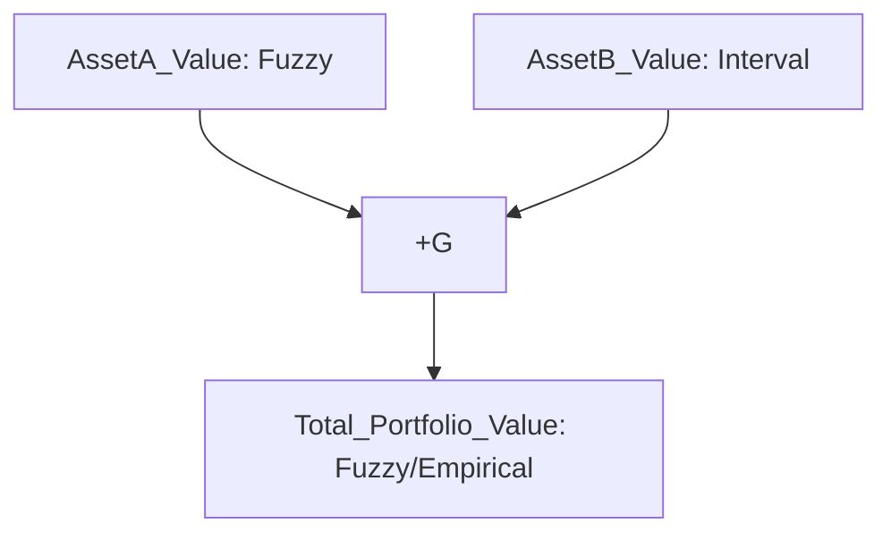

This response outlines a novel framework for **Categorical Granular Arithmetic (CGA)** and its associated **Granular Computation Engine (GCE)**, designed to operate on and visualize "information granules" that encapsulate uncertainty, imprecision, and structural metadata. This framework extends traditional arithmetic by treating numbers not as crisp points, but as structured distributions or sets, enabling robust computation in complex, uncertain environments.

---

# The Formal Blueprint: Categorical Granular Arithmetic (CGA)

## 1. Introduction: The Imperative of Granular Computation

Traditional arithmetic operates on crisp, deterministic values. However, real-world data is inherently uncertain, imprecise, and often multi-modal. Interval arithmetic and fuzzy arithmetic address specific facets of this challenge, but lack a unified, extensible framework for diverse forms of uncertainty and their structural metadata. This thesis introduces **Categorical Granular Arithmetic (CGA)**, a novel paradigm that formalizes "information granules" as objects in a category, enabling robust, composable, and semantically rich computations. The accompanying **Granular Computation Engine (GCE)** provides an architectural workflow for processing and visualizing these granular operations.

### 1.1. Motivation
*   **Ubiquitous Uncertainty:** Sensor noise, measurement errors, predictive model variance, and linguistic vagueness are pervasive.
*   **Limitations of Point Estimates:** Single-value outputs obscure underlying uncertainty, leading to brittle systems and misleading conclusions.
*   **Need for Semantic Richness:** Beyond mere values, context, units, confidence, and provenance are crucial for meaningful computation.
*   **Composability & Abstraction:** A framework is needed that allows granular operations to be composed and abstracted elegantly, akin to how functions compose in category theory.

### 1.2. Core Contributions
1.  **Formal Definition of Categorical Granules (CGs):** A generalized structure encompassing various forms of uncertainty (probabilistic, fuzzy, interval) and metadata.
2.  **Categorical Granular Algebra:** Definition of granular operators as functors or natural transformations, ensuring mathematical rigor and composability.
3.  **Granular Computation Engine (GCE):** A comprehensive architectural workflow for parsing, executing, and visualizing granular computations.
4.  **Multi-Modal Visualization:** Techniques leveraging Information Geometry, density plots, and Granular Computational Graphs (GCGs) to intuitively represent granular states and transformations.

## 2. Background and Related Work

### 2.1. Interval Arithmetic
Interval arithmetic, pioneered by Moore, replaces real numbers with intervals $[a, b]$ to bound computational errors. Operations are defined to ensure the result interval contains all possible outcomes.
$$
[a,b] + [c,d] = [a+c, b+d] \\
[a,b] \times [c,d] = [\min(ac,ad,bc,bd), \max(ac,ad,bc,bd)]
$$
While providing strict bounds, interval arithmetic can suffer from "interval blow-up" due to dependency problems.

### 2.2. Fuzzy Arithmetic
Fuzzy arithmetic, based on Zadeh's fuzzy set theory, uses fuzzy numbers (convex, normalized fuzzy sets on $\mathbb{R}$) to represent linguistic vagueness. The Extension Principle is central:
Let $f: \mathbb{R}^n \to \mathbb{R}$ be a crisp function and $\tilde{A}_1, \dots, \tilde{A}_n$ be fuzzy numbers. The fuzzy number $\tilde{Y} = f(\tilde{A}_1, \dots, \tilde{A}_n)$ is defined by its membership function:
$$
\mu_{\tilde{Y}}(y) = \sup_{y = f(x_1, \dots, x_n)} \min(\mu_{\tilde{A}_1}(x_1), \dots, \mu_{\tilde{A}_n}(x_n))
$$
Fuzzy arithmetic handles vagueness but lacks a direct probabilistic interpretation and can be computationally intensive.

### 2.3. Probability Theory & Information Geometry
Probability theory provides the rigorous framework for stochastic uncertainty. Information Geometry, particularly the Fisher Information Metric, endows statistical manifolds with a Riemannian metric, allowing for geometric interpretation of statistical models and transformations.
The Fisher Information Matrix $I(\theta)$ for a probability distribution $p(x|\theta)$ is given by:
$$
I_{ij}(\theta) = E\left[ \left( \frac{\partial \log p(x|\theta)}{\partial \theta_i} \right) \left( \frac{\partial \log p(x|\theta)}{\partial \theta_j} \right) \right]
$$
This provides a metric for "distance" between distributions, crucial for visualizing granular transformations.

### 2.4. Category Theory
Category theory provides a high-level language for describing mathematical structures and their relationships. Objects and morphisms (structure-preserving maps) allow for abstract reasoning about composition and universal properties. This is foundational for defining CGs and their operations in a robust, extensible manner.

## 3. Proposed Framework: Categorical Granular Arithmetic (CGA)

### 3.1. Definition of a Categorical Granule (CG)

A **Categorical Granule (CG)**, denoted $\mathcal{G}$, is a tuple $\mathcal{G} = (U, \mathcal{D}, \mathcal{M})$, where:
*   $U$: The **Universe of Discourse**, a set of possible values (e.g., $\mathbb{R}$, $\mathbb{Z}^n$, a finite set of categories). This is the underlying domain for the granule.
*   $\mathcal{D}$: The **Distributional Representation**, a mathematical object quantifying the uncertainty or imprecision over $U$. This can take several forms:
    *   **Probability Distribution:** A Probability Density Function (PDF) $p(x)$ or Probability Mass Function (PMF) $P(x)$ over $U$.
    *   **Fuzzy Set:** A membership function $\mu(x): U \to [0,1]$.
    *   **Interval Set:** A collection of intervals $[a_i, b_i] \subset U$.
    *   **Possibility Distribution:** A possibility function $\pi(x): U \to [0,1]$.
    *   **Hybrid:** A combination, e.g., a fuzzy probability distribution.
*   $\mathcal{M}$: The **Metadata Context**, a structured set of auxiliary information about the granule. This can include:
    *   `units`: e.g., "meters", "USD".
    *   `confidence_level`: e.g., $95\%$.
    *   `provenance`: Source of the data.
    *   `timestamp`: Time of observation/creation.
    *   `model_parameters`: Parameters if $\mathcal{D}$ is a parametric distribution (e.g., $\mu, \sigma$ for Gaussian).
    *   `granularity_level`: An ordinal scale indicating precision.
    *   `dependency_graph_node_id`: For tracking dependencies in GCGs.

**Formalization in Category Theory:**
Let $\mathbf{Granule}$ be a category where:
*   **Objects:** Are Categorical Granules $\mathcal{G} = (U, \mathcal{D}, \mathcal{M})$.
*   **Morphisms:** Are **Granular Transformations** $f: \mathcal{G}_1 \to \mathcal{G}_2$, which are structure-preserving maps between granules. These could be:
    *   **Functors:** If the transformation maps entire categories of distributions.
    *   **Natural Transformations:** If the transformation relates two functors.
    *   **Granular Operators:** Specific functions that transform the distributional representation and update metadata.

### 3.2. Granular Operators

A binary granular operator $\oplus_G: \mathbf{Granule} \times \mathbf{Granule} \to \mathbf{Granule}$ takes two CGs, $\mathcal{G}_1 = (U_1, \mathcal{D}_1, \mathcal{M}_1)$ and $\mathcal{G}_2 = (U_2, \mathcal{D}_2, \mathcal{M}_2)$, and produces a new CG, $\mathcal{G}_3 = (U_3, \mathcal{D}_3, \mathcal{M}_3)$.

#### 3.2.1. Definition of Granular Addition ($\oplus_G$)
Let $f: U_1 \times U_2 \to U_3$ be the crisp addition operator $f(x_1, x_2) = x_1 + x_2$.
The distributional representation $\mathcal{D}_3$ is derived from $\mathcal{D}_1$ and $\mathcal{D}_2$ via a generalized convolution or extension principle.

**Case 1: Probabilistic Granules (PDFs)**
If $\mathcal{D}_1 = p_1(x_1)$ and $\mathcal{D}_2 = p_2(x_2)$ are PDFs, then $p_3(x_3)$ is their convolution:
$$
p_3(x_3) = (p_1 * p_2)(x_3) = \int_{-\infty}^{\infty} p_1(y) p_2(x_3 - y) dy
$$
**Case 2: Fuzzy Granules (Membership Functions)**
If $\mathcal{D}_1 = \mu_1(x_1)$ and $\mathcal{D}_2 = \mu_2(x_2)$ are fuzzy membership functions, then $\mu_3(x_3)$ is derived via the Extension Principle:
$$
\mu_3(x_3) = \sup_{x_3 = x_1 + x_2} \min(\mu_1(x_1), \mu_2(x_2))
$$
**Case 3: Interval Granules**
If $\mathcal{D}_1 = [a_1, b_1]$ and $\mathcal{D}_2 = [a_2, b_2]$, then $\mathcal{D}_3 = [a_1+a_2, b_1+b_2]$.

**Metadata Update ($\mathcal{M}_3$):**
The metadata $\mathcal{M}_3$ is derived from $\mathcal{M}_1$ and $\mathcal{M}_2$ through a user-defined or default aggregation strategy. For example:
*   `units`: Must be compatible for addition (e.g., "meters" + "meters" = "meters"). If incompatible, an error or a new composite unit.
*   `confidence_level`: Could be the minimum of the two, or a more complex Bayesian update.
*   `provenance`: A union or concatenation of provenances.
*   `dependency_graph_node_id`: A new unique ID, linking to its parent nodes.

#### 3.2.2. Definition of Granular Multiplication ($\otimes_G$)
Similarly, for crisp multiplication $f(x_1, x_2) = x_1 \times x_2$:

**Case 1: Probabilistic Granules (PDFs)**
$$
p_3(x_3) = \int_{-\infty}^{\infty} p_1(y) p_2(x_3/y) \frac{1}{|y|} dy
$$
**Case 2: Fuzzy Granules (Membership Functions)**
$$
\mu_3(x_3) = \sup_{x_3 = x_1 \times x_2} \min(\mu_1(x_1), \mu_2(x_2))
$$
**Case 3: Interval Granules**
$$
[a_1,b_1] \times [a_2,b_2] = [\min(a_1a_2, a_1b_2, b_1a_2, b_1b_2), \max(a_1a_2, a_1b_2, b_1a_2, b_1b_2)]
$$
Metadata updates follow similar logic as addition, with unit compatibility rules (e.g., "meters" $\times$ "meters" = "square meters").

### 3.3. Properties and Axioms of CGA

CGA aims to preserve desirable properties of classical arithmetic where possible, while acknowledging the complexities introduced by uncertainty.

**Lemma 3.3.1 (Identity Granule):**
For any granular operator $\oplus_G$ (e.g., addition), there exists an identity granule $\mathcal{I}_{\oplus_G}$ such that for any $\mathcal{G}$, $\mathcal{G} \oplus_G \mathcal{I}_{\oplus_G} = \mathcal{G}$.
*   **Proof Sketch (for addition with probabilistic granules):** The identity granule for addition, $\mathcal{I}_{+_G}$, would have a distributional representation $p_I(x)$ such that $p(x) * p_I(x) = p(x)$. This implies $p_I(x)$ is a Dirac delta function $\delta(x)$ centered at 0. Its metadata would be neutral (e.g., `units: dimensionless`, `confidence: 1.0`).

**Lemma 3.3.2 (Associativity):**
Granular addition and multiplication are generally associative: $(\mathcal{G}_1 \oplus_G \mathcal{G}_2) \oplus_G \mathcal{G}_3 = \mathcal{G}_1 \oplus_G (\mathcal{G}_2 \oplus_G \mathcal{G}_3)$.
*   **Proof Sketch (for probabilistic granules):** Convolution of PDFs is associative: $(p_1 * p_2) * p_3 = p_1 * (p_2 * p_3)$. The challenge lies in ensuring metadata aggregation is also associative. This requires careful design of metadata merge functions.

**Theorem 3.3.3 (Functoriality of Granular Operators):**
Each granular operator $\mathcal{O}_G: \mathbf{Granule} \times \mathbf{Granule} \to \mathbf{Granule}$ can be viewed as a functor from the product category $\mathbf{Granule} \times \mathbf{Granule}$ to $\mathbf{Granule}$.
*   **Proof Sketch:** A functor maps objects to objects and morphisms to morphisms, preserving composition and identity.
    1.  **Objects Mapping:** $\mathcal{O}_G$ maps $(\mathcal{G}_1, \mathcal{G}_2)$ to $\mathcal{G}_3$, which is an object in $\mathbf{Granule}$.
    2.  **Morphisms Mapping:** Given granular transformations $f_1: \mathcal{G}_1 \to \mathcal{G}'_1$ and $f_2: \mathcal{G}_2 \to \mathcal{G}'_2$, we need to show there exists a granular transformation $\mathcal{O}_G(f_1, f_2): \mathcal{O}_G(\mathcal{G}_1, \mathcal{G}_2) \to \mathcal{O}_G(\mathcal{G}'_1, \mathcal{G}'_2)$. This implies that transformations of input granules induce a transformation of the output granule. This is often achieved by propagating the transformations through the underlying crisp function and updating the distributional representation accordingly (e.g., change of variables for PDFs).
    3.  **Preservation of Composition & Identity:** This follows from the underlying mathematical properties of the distributional operations (e.g., convolution) and careful design of metadata transformation rules.

**Lemma 3.3.4 (Granular Monads):**
The process of "granulizing" a crisp value (e.g., mapping $x \in \mathbb{R}$ to a Dirac delta CG $\mathcal{G}_x$) and "de-granulizing" a CG (e.g., extracting the mean or mode) can be formalized using monads, providing a structured way to lift crisp computations into the granular domain and back.
*   **Proof Sketch:** A monad $(T, \eta, \mu)$ on a category $\mathbf{C}$ consists of an endofunctor $T: \mathbf{C} \to \mathbf{C}$ and two natural transformations: $\eta: Id \to T$ (unit) and $\mu: T^2 \to T$ (multiplication), satisfying associativity and unit laws.
    *   Let $\mathbf{C}$ be the category of crisp values (e.g., $\mathbb{R}$).
    *   Let $T(x)$ be the functor that maps a crisp value $x$ to its corresponding CG (e.g., a Dirac delta distribution at $x$).
    *   $\eta_x: x \to T(x)$ is the "granulization" map.
    *   $\mu_{\mathcal{G}}: T(T(\mathcal{G})) \to T(\mathcal{G})$ would represent a "flattening" operation, e.g., combining nested uncertainties. This provides a formal way to reason about lifting and combining granular computations.

## 4. Architectural Workflow: Granular Computation Engine (GCE)

The GCE is a modular, multi-stage pipeline designed to process, execute, and visualize granular arithmetic expressions.

### 4.1. System Components

1.  **Granule Definition Language (GDL):** A domain-specific language (DSL) for defining CGs and their initial states.
    *   Syntax for specifying $U$, $\mathcal{D}$ (e.g., `Normal(mu=5, sigma=1)`, `Fuzzy(points=[(0,0),(1,0.5),(2,1),(3,0.5),(4,0)])`, `Interval([10, 12])`), and $\mathcal{M}$ (e.g., `units="m/s"`).
2.  **Granular Parser & Abstract Syntax Tree (GAST):** Parses GDL expressions into a structured GAST.
3.  **Granular Intermediate Representation (GIR):** A graph-based IR, specifically a **Granular Computational Graph (GCG)**, representing the data flow and dependencies of granular operations.
4.  **Granular Operator Library (GOL):** A collection of optimized implementations for various granular operators ($\oplus_G, \otimes_G$, etc.) for different $\mathcal{D}$ types (probabilistic, fuzzy, interval).
5.  **Granular Runtime Engine (GRE):** Executes the GCG by invoking operators from the GOL, managing granule states and metadata propagation.
6.  **Granular Visualization Module (GVM):** Renders the GCG, individual granule states, and their transformations using various techniques.
7.  **Metadata Management System (MMS):** Handles the storage, retrieval, and aggregation logic for granule metadata.

### 4.2. GCE Workflow

The GCE workflow proceeds through several distinct phases:

```mermaid
graph TD
    A[Granule Definition Language (GDL) Input] --> B{Granular Parser};
    B --> C[Granular Abstract Syntax Tree (GAST)];
    C --> D{GCG Builder};
    D --> E[Granular Computational Graph (GCG)];
    E --> F{GCG Optimizer};
    F --> G[Optimized GCG];
    G --> H{Granular Runtime Engine (GRE)};
    H -- Granule State Updates --> I[Granular Operator Library (GOL)];
    H -- Metadata Propagation --> J[Metadata Management System (MMS)];
    I -- Results --> H;
    J -- Metadata --> H;
    H --> K[Resulting Granules];
    K --> L{Granular Visualization Module (GVM)};
    E --> L;
    L --> M[Interactive Visualizations];
```

**Phase Details:**

1.  **GDL Input & Parsing:** Users define granules and expressions using GDL. The parser converts this into a GAST.
    *   *Example GDL:*
        ```
        granule A = Normal(mu=10, sigma=2, units="m")
        granule B = Uniform(low=5, high=7, units="m")
        granule C = A + B
        granule D = C * Normal(mu=0.5, sigma=0.1, units="s")
        ```
2.  **GCG Construction:** The GAST is transformed into a GCG. Each node represents a granule or an operation, and edges represent data flow. Metadata dependencies are explicitly tracked.
3.  **GCG Optimization:** Applies graph transformations to improve execution efficiency:
    *   **Operator Fusion:** Combining sequential operations (e.g., two convolutions).
    *   **Granule Pruning:** Removing unused intermediate granules.
    *   **Parallelization:** Identifying independent sub-graphs for concurrent execution.
    *   **Approximation Strategy Selection:** For complex distributions, choosing appropriate numerical approximation methods (e.g., Monte Carlo, Gaussian approximation).
4.  **Granular Runtime Execution:** The GRE traverses the optimized GCG, executing granular operators.
    *   For each operation node, it retrieves input granules, calls the appropriate GOL function, and creates a new output granule.
    *   The MMS is updated with new granule states and metadata.
    *   Dependency tracking ensures correct order of operations and handles potential circular dependencies.
5.  **Result Aggregation:** Final granules are collected.
6.  **Visualization:** The GVM renders the GCG and the state of individual granules.

### 4.3. Granular Computational Graph (GCG)

A GCG is a directed acyclic graph (DAG) where:
*   **Nodes:** Represent either **Granule Nodes** (input, intermediate, or output CGs) or **Operator Nodes** (granular operations like addition, multiplication, transformation).
*   **Edges:** Represent the flow of granules from output of one node to input of another. Each edge implicitly carries the full CG structure.
*   **Metadata Edges (Implicit/Explicit):** Metadata dependencies (e.g., unit compatibility checks, provenance tracking) are either handled by the MMS or explicitly modeled as auxiliary edges.

```mermaid
graph TD
    subgraph Granule Definition
        A[Granule A: Normal(10, 2, "m")]
        B[Granule B: Uniform(5, 7, "m")]
        X[Granule X: Normal(0.5, 0.1, "s")]
    end

    subgraph Granular Operations
        Op1[+G: Granular Addition]
        Op2[*G: Granular Multiplication]
    end

    subgraph Results
        C[Granule C: A + B]
        D[Granule D: C * X]
    end

    A --> Op1;
    B --> Op1;
    Op1 --> C;
    C --> Op2;
    X --> Op2;
    Op2 --> D;

    style A fill:#f9f,stroke:#333,stroke-width:2px
    style B fill:#f9f,stroke:#333,stroke-width:2px
    style X fill:#f9f,stroke:#333,stroke-width:2px
    style C fill:#9cf,stroke:#333,stroke-width:2px
    style D fill:#9cf,stroke:#333,stroke-width:2px
    style Op1 fill:#afa,stroke:#333,stroke-width:2px
    style Op2 fill:#afa,stroke:#333,stroke-width:2px
```

## 5. Algorithmic Visualization

Visualizing granular computations is critical for understanding the propagation of uncertainty and the impact of operations.

### 5.1. Principles of Granular Visualization

1.  **Multi-Dimensionality:** Representing $U$, $\mathcal{D}$, and $\mathcal{M}$ simultaneously.
2.  **Dynamic Evolution:** Showing how granules change state through operations.
3.  **Comparative Analysis:** Enabling comparison between different granules or different stages of computation.
4.  **Interactive Exploration:** Allowing users to drill down into specific aspects of a granule (e.g., specific metadata fields, different $\alpha$-cuts for fuzzy sets).

### 5.2. Visualization Techniques

#### 5.2.1. Granular Computational Graph (GCG) Visualization
*   **Node Representation:** Granule nodes can display summary statistics (mean, variance, mode, interval bounds) or small inline plots (e.g., sparkline PDFs). Operator nodes show the operation type.
*   **Edge Representation:** Can indicate the flow of uncertainty, perhaps with color gradients or thickness representing a measure of entropy or information content.
*   **Interactive Drill-down:** Clicking a granule node opens a detailed view of its $\mathcal{D}$ and $\mathcal{M}$.

#### 5.2.2. Distributional Representation Visualization
*   **Probability Distributions:**
    *   **PDF/PMF Plots:** Standard density plots or histograms.
    *   **Box/Violin Plots:** For summarizing key statistics and shape.
    *   **Confidence Intervals:** Shaded regions indicating specific confidence levels.
*   **Fuzzy Sets:**
    *   **Membership Function Plots:** Plotting $\mu(x)$ against $x$.
    *   **$\alpha$-cuts:** Visualizing the crisp intervals at different $\alpha$ levels.
*   **Interval Sets:** Simple bar plots showing the range.

#### 5.2.3. Information Geometric Visualization
For parametric distributions (e.g., Gaussian, Exponential), granules can be mapped to points on a statistical manifold.
*   **Example: Gaussian Manifold:** A 2D manifold for $\mathcal{N}(\mu, \sigma^2)$ can be visualized by mapping $(\mu, \sigma)$ to Cartesian coordinates. Operations become paths or transformations on this manifold.
*   **Geodesic Paths:** The shortest path between two distributions on the manifold can represent an optimal transformation or interpolation.
*   **Visualizing Uncertainty:** The "size" or "spread" of a point on the manifold could represent higher-order uncertainty (e.g., uncertainty about the parameters themselves).

#### 5.2.4. Metadata Visualization
*   **Tooltips/Side Panels:** Displaying detailed metadata on hover or selection.
*   **Color Coding/Icons:** Using visual cues on GCG nodes to represent specific metadata (e.g., red for low confidence, green for high).
*   **Unit Compatibility Matrix:** Visualizing which units can be combined.

## 6. Implementation Details and Pseudocode

### 6.1. Granule Data Structure

```python
# Python-like pseudocode for Granule representation

from enum import Enum
from typing import Union, Dict, Any, Callable, List

class DistributionType(Enum):
    NORMAL = "Normal"
    UNIFORM = "Uniform"
    FUZZY = "Fuzzy"
    INTERVAL = "Interval"
    EMPIRICAL = "Empirical" # For Monte Carlo samples

class Granule:
    def __init__(self,
                 universe: Union[List[float], List[int], None], # e.g., [0, 100] for continuous, or list of categories
                 dist_type: DistributionType,
                 dist_params: Dict[str, Any], # e.g., {'mu': 10, 'sigma': 2} for Normal
                 metadata: Dict[str, Any] = None):
        self.universe = universe
        self.dist_type = dist_type
        self.dist_params = dist_params
        self.metadata = metadata if metadata is not None else {}
        self.id = self._generate_id() # Unique ID for dependency tracking

    def _generate_id(self) -> str:
        # Placeholder for a robust ID generation mechanism (e.g., UUID)
        import uuid
        return str(uuid.uuid4())

    def get_pdf(self, x: float) -> float:
        # Abstract method to be implemented by specific distribution types
        raise NotImplementedError

    def get_cdf(self, x: float) -> float:
        raise NotImplementedError

    def get_samples(self, num_samples: int) -> List[float]:
        # For Monte Carlo simulations
        raise NotImplementedError

    def get_bounds(self) -> tuple[float, float]:
        # For interval representation or confidence intervals
        raise NotImplementedError

    def __repr__(self):
        return f"Granule(ID={self.id[:8]}, Type={self.dist_type.value}, Params={self.dist_params}, Metadata={self.metadata})"

# Example specific distribution implementations (simplified)
class NormalGranule(Granule):
    def __init__(self, mu: float, sigma: float, **kwargs):
        super().__init__(universe=None, dist_type=DistributionType.NORMAL,
                         dist_params={'mu': mu, 'sigma': sigma}, **kwargs)
        # For simplicity, assume universe is R for Normal

    def get_pdf(self, x: float) -> float:
        import math
        mu = self.dist_params['mu']
        sigma = self.dist_params['sigma']
        return (1 / (sigma * math.sqrt(2 * math.pi))) * math.exp(-0.5 * ((x - mu) / sigma)**2)

    def get_samples(self, num_samples: int) -> List[float]:
        import random
        mu = self.dist_params['mu']
        sigma = self.dist_params['sigma']
        return [random.gauss(mu, sigma) for _ in range(num_samples)]

class IntervalGranule(Granule):
    def __init__(self, low: float, high: float, **kwargs):
        super().__init__(universe=[low, high], dist_type=DistributionType.INTERVAL,
                         dist_params={'low': low, 'high': high}, **kwargs)

    def get_bounds(self) -> tuple[float, float]:
        return (self.dist_params['low'], self.dist_params['high'])

    # For interval, PDF is 1/width within interval, 0 otherwise (uniform)
    def get_pdf(self, x: float) -> float:
        low, high = self.get_bounds()
        if low <= x <= high:
            return 1.0 / (high - low)
        return 0.0
```

### 6.2. Granular Operator Library (GOL) Pseudocode

```python
class GranularOperatorLibrary:
    @staticmethod
    def _merge_metadata(meta1: Dict, meta2: Dict, op_name: str) -> Dict:
        # Default metadata merge strategy
        # This is a critical point for customization and domain-specific logic
        merged_meta = {}
        # Example: Units compatibility
        units1 = meta1.get('units')
        units2 = meta2.get('units')
        if units1 and units2:
            if op_name == "add" or op_name == "subtract":
                if units1 != units2:
                    raise ValueError(f"Unit mismatch for {op_name}: {units1} vs {units2}")
                merged_meta['units'] = units1
            elif op_name == "multiply":
                merged_meta['units'] = f"{units1}*{units2}" if units1 != "dimensionless" and units2 != "dimensionless" else (units1 or units2)
            elif op_name == "divide":
                merged_meta['units'] = f"{units1}/{units2}" if units1 != "dimensionless" and units2 != "dimensionless" else (units1 or units2)
        else:
            merged_meta['units'] = units1 or units2 # Propagate if only one has units

        # Example: Confidence level (take minimum for conservative approach)
        conf1 = meta1.get('confidence_level', 1.0)
        conf2 = meta2.get('confidence_level', 1.0)
        merged_meta['confidence_level'] = min(conf1, conf2)

        # Provenance tracking
        merged_meta['provenance'] = list(set(meta1.get('provenance', []) + meta2.get('provenance', [])))

        # Add dependency tracking
        merged_meta['dependencies'] = [meta1.get('id'), meta2.get('id')]

        return merged_meta

    @staticmethod
    def add_granular(g1: Granule, g2: Granule) -> Granule:
        # Handle different distribution types
        merged_meta = GranularOperatorLibrary._merge_metadata(g1.metadata, g2.metadata, "add")

        if g1.dist_type == DistributionType.NORMAL and g2.dist_type == DistributionType.NORMAL:
            # Sum of two independent normal distributions is normal
            mu3 = g1.dist_params['mu'] + g2.dist_params['mu']
            sigma3 = (g1.dist_params['sigma']**2 + g2.dist_params['sigma']**2)**0.5
            return NormalGranule(mu=mu3, sigma=sigma3, metadata=merged_meta)
        elif g1.dist_type == DistributionType.INTERVAL and g2.dist_type == DistributionType.INTERVAL:
            low3 = g1.dist_params['low'] + g2.dist_params['low']
            high3 = g1.dist_params['high'] + g2.dist_params['high']
            return IntervalGranule(low=low3, high=high3, metadata=merged_meta)
        elif g1.dist_type == DistributionType.EMPIRICAL or g2.dist_type == DistributionType.EMPIRICAL:
            # Fallback to Monte Carlo for complex or mixed distributions
            num_samples = 10000 # Configurable
            samples1 = g1.get_samples(num_samples)
            samples2 = g2.get_samples(num_samples)
            sum_samples = [s1 + s2 for s1, s2 in zip(samples1, samples2)]
            # Create an empirical granule from samples
            return Granule(universe=None, dist_type=DistributionType.EMPIRICAL,
                           dist_params={'samples': sum_samples}, metadata=merged_meta)
        else:
            # General case: Use numerical convolution or fuzzy extension principle
            # This would involve more complex numerical integration or optimization
            raise NotImplementedError(f"Addition not implemented for {g1.dist_type} and {g2.dist_type}")

    @staticmethod
    def multiply_granular(g1: Granule, g2: Granule) -> Granule:
        merged_meta = GranularOperatorLibrary._merge_metadata(g1.metadata, g2.metadata, "multiply")

        if g1.dist_type == DistributionType.NORMAL and g2.dist_type == DistributionType.NORMAL:
            # Product of two normal distributions is NOT normal. It's a more complex distribution.
            # For approximation, one might use a log-normal or a moment-matching approach.
            # For exact, it requires numerical integration (convolution for product).
            # Fallback to Monte Carlo for robustness in this example.
            num_samples = 10000
            samples1 = g1.get_samples(num_samples)
            samples2 = g2.get_samples(num_samples)
            prod_samples = [s1 * s2 for s1, s2 in zip(samples1, samples2)]
            return Granule(universe=None, dist_type=DistributionType.EMPIRICAL,
                           dist_params={'samples': prod_samples}, metadata=merged_meta)
        elif g1.dist_type == DistributionType.INTERVAL and g2.dist_type == DistributionType.INTERVAL:
            l1, h1 = g1.get_bounds()
            l2, h2 = g2.get_bounds()
            products = [l1*l2, l1*h2, h1*l2, h1*h2]
            low3 = min(products)
            high3 = max(products)
            return IntervalGranule(low=low3, high=high3, metadata=merged_meta)
        elif g1.dist_type == DistributionType.EMPIRICAL or g2.dist_type == DistributionType.EMPIRICAL:
            num_samples = 10000
            samples1 = g1.get_samples(num_samples)
            samples2 = g2.get_samples(num_samples)
            prod_samples = [s1 * s2 for s1, s2 in zip(samples1, samples2)]
            return Granule(universe=None, dist_type=DistributionType.EMPIRICAL,
                           dist_params={'samples': prod_samples}, metadata=merged_meta)
        else:
            raise NotImplementedError(f"Multiplication not implemented for {g1.dist_type} and {g2.dist_type}")

# ... other operators (subtract, divide, power, etc.)
```

### 6.3. Granular Runtime Engine (GRE) Pseudocode

```python
class GCGNode:
    def __init__(self, node_type: str, value: Any, inputs: List[str] = None):
        self.id = str(uuid.uuid4())
        self.node_type = node_type # "granule" or "operator"
        self.value = value # Granule object or operator function
        self.inputs = inputs if inputs is not None else [] # IDs of input nodes
        self.output_granule_id = None # ID of the resulting granule if operator node

class GranularRuntimeEngine:
    def __init__(self, gcg_nodes: Dict[str, GCGNode], operator_library: GranularOperatorLibrary):
        self.nodes = gcg_nodes # Map of node_id to GCGNode
        self.operator_library = operator_library
        self.granule_store = {} # Map of granule_id to Granule object
        self.execution_order = [] # Topological sort of GCG

    def _topological_sort(self) -> List[str]:
        # Kahn's algorithm or DFS-based topological sort
        # (Implementation omitted for brevity)
        # Ensures operators are executed after their input granules are ready.
        pass

    def execute(self) -> Dict[str, Granule]:
        self.execution_order = self._topological_sort()
        for node_id in self.execution_order:
            node = self.nodes[node_id]
            if node.node_type == "granule":
                # Input granule, store it directly
                self.granule_store[node.id] = node.value
            elif node.node_type == "operator":
                input_granules = [self.granule_store[input_id] for input_id in node.inputs]
                operator_func = node.value # e.g., self.operator_library.add_granular

                # Execute the granular operation
                result_granule = operator_func(*input_granules)

                # Store the result and link it to the operator node
                self.granule_store[result_granule.id] = result_granule
                node.output_granule_id = result_granule.id
            else:
                raise ValueError(f"Unknown node type: {node.node_type}")
        return self.granule_store # Return all computed granules

# Example GCG construction (simplified)
# A = NormalGranule(10, 2, metadata={'units': 'm', 'provenance': ['sensor_1']})
# B = UniformGranule(5, 7, metadata={'units': 'm', 'provenance': ['sensor_2']})
# X = NormalGranule(0.5, 0.1, metadata={'units': 's', 'provenance': ['model_estimate']})

# node_A = GCGNode("granule", A)
# node_B = GCGNode("granule", B)
# node_X = GCGNode("granule", X)

# node_Op1 = GCGNode("operator", GranularOperatorLibrary.add_granular, inputs=[node_A.id, node_B.id])
# node_Op2 = GCGNode("operator", GranularOperatorLibrary.multiply_granular, inputs=[node_Op1.output_granule_id, node_X.id]) # This needs to be resolved after Op1 execution

# This GCG construction needs to be dynamic, where output_granule_id is set post-execution,
# or the GCG builder creates placeholder nodes that the runtime fills.
# A more robust GCG builder would create nodes for operations and then link them to granule nodes.
```

### 6.4. Visualization Module Pseudocode (Conceptual)

```python
class GranularVisualizationModule:
    def __init__(self, gcg_nodes: Dict[str, GCGNode], granule_store: Dict[str, Granule]):
        self.gcg_nodes = gcg_nodes
        self.granule_store = granule_store

    def visualize_gcg(self):
        # Use a graph visualization library (e.g., D3.js, NetworkX + Matplotlib)
        # Iterate through self.gcg_nodes to draw nodes and edges.
        # For granule nodes, display summary stats or sparklines.
        # For operator nodes, display operator type.
        # Implement interactive elements:
        #   - On click: show detailed granule view (plot PDF/CDF, list metadata).
        #   - On hover: show basic info.
        print("--- Visualizing Granular Computational Graph ---")
        for node_id, node in self.gcg_nodes.items():
            if node.node_type == "granule":
                granule = self.granule_store.get(node.id)
                if granule:
                    print(f"  Granule Node: {node.id[:8]} - {granule.dist_type.value} (Mean/Mode/Bounds: {self._get_summary(granule)})")
            elif node.node_type == "operator":
                print(f"  Operator Node: {node.id[:8]} - {node.value.__name__} (Inputs: {', '.join(node.inputs)})")
                if node.output_granule_id:
                    output_granule = self.granule_store.get(node.output_granule_id)
                    if output_granule:
                        print(f"    -> Output Granule: {output_granule.id[:8]} - {output_granule.dist_type.value}")
        print("----------------------------------------------")

    def _get_summary(self, granule: Granule) -> str:
        # Helper to get a summary string for display
        if granule.dist_type == DistributionType.NORMAL:
            return f"mu={granule.dist_params['mu']:.2f}, sigma={granule.dist_params['sigma']:.2f}"
        elif granule.dist_type == DistributionType.INTERVAL:
            return f"[{granule.dist_params['low']:.2f}, {granule.dist_params['high']:.2f}]"
        elif granule.dist_type == DistributionType.EMPIRICAL:
            import numpy as np
            samples = granule.dist_params['samples']
            return f"mean={np.mean(samples):.2f}, std={np.std(samples):.2f}"
        return "N/A"

    def plot_granule_details(self, granule_id: str):
        granule = self.granule_store.get(granule_id)
        if not granule:
            print(f"Granule {granule_id} not found.")
            return

        print(f"\n--- Detailed View for Granule {granule.id[:8]} ---")
        print(f"Type: {granule.dist_type.value}")
        print(f"Parameters: {granule.dist_params}")
        print(f"Metadata: {granule.metadata}")

        # Plotting logic (requires matplotlib or similar)
        # if granule.dist_type in [DistributionType.NORMAL, DistributionType.EMPIRICAL, DistributionType.INTERVAL]:
        #     import matplotlib.pyplot as plt
        #     import numpy as np
        #     x_vals = np.linspace(granule.get_bounds()[0] - 3*granule.get_std_dev(),
        #                          granule.get_bounds()[1] + 3*granule.get_std_dev(), 500)
        #     y_vals = [granule.get_pdf(x) for x in x_vals]
        #     plt.plot(x_vals, y_vals)
        #     plt.title(f"PDF of Granule {granule.id[:8]}")
        #     plt.xlabel("Value")
        #     plt.ylabel("Probability Density")
        #     plt.show()
        # ... more sophisticated plotting for fuzzy, intervals, etc.
        print("------------------------------------------")
```

## 7. Examples and Case Studies

### 7.1. Example 1: Simple Granular Addition

**Scenario:** Two sensors measure a length. Sensor 1 reports 10m $\pm$ 2m (normally distributed error). Sensor 2 reports between 5m and 7m (uniformly distributed error). We want to find the total length.

**GDL:**
```
granule Sensor1_Length = Normal(mu=10, sigma=2, units="m", confidence_level=0.95, provenance=["Sensor A"])
granule Sensor2_Length = Uniform(low=5, high=7, units="m", confidence_level=0.90, provenance=["Sensor B"])
granule Total_Length = Sensor1_Length + Sensor2_Length
```

**GCG (Conceptual):**
```mermaid
graph TD
    S1[Sensor1_Length: Normal(10,2,"m")] --> Add[+G];
    S2[Sensor2_Length: Uniform(5,7,"m")] --> Add;
    Add --> Total[Total_Length: Empirical];
```

**Execution (using Monte Carlo fallback):**
1.  `Sensor1_Length` (Normal) and `Sensor2_Length` (Uniform) are instantiated.
2.  `add_granular` is called. Since one is Normal and the other Uniform, the system falls back to Monte Carlo simulation (e.g., 10,000 samples).
    *   Samples from `Sensor1_Length`: e.g., `[10.2, 9.8, 11.5, ...]`
    *   Samples from `Sensor2_Length`: e.g., `[5.3, 6.1, 6.9, ...]`
    *   Summed samples: e.g., `[15.5, 15.9, 18.4, ...]`
3.  `Total_Length` is created as an `EmpiricalGranule` with these summed samples.
4.  **Metadata:**
    *   `units`: "m" (compatible).
    *   `confidence_level`: `min(0.95, 0.90) = 0.90`.
    *   `provenance`: `["Sensor A", "Sensor B"]`.
    *   `dependencies`: IDs of `Sensor1_Length` and `Sensor2_Length`.

**Visualization:**
*   GCG shows the flow.
*   Detailed view of `Total_Length` would show a histogram or kernel density estimate (KDE) of the empirical samples, likely a bell-shaped but asymmetric distribution, reflecting the convolution of a Normal and a Uniform distribution.
*   Metadata panel shows combined units, confidence, and provenance.

### 7.2. Example 2: Financial Risk Assessment

**Scenario:** Calculate the total value of a portfolio with two assets. Asset A's value is a fuzzy number (e.g., "around $1000"). Asset B's value is an interval (e.g., between $500 and $600).

**GDL:**
```
granule AssetA_Value = Fuzzy(points=[(900,0),(950,0.5),(1000,1),(1050,0.5),(1100,0)], units="USD")
granule AssetB_Value = Interval(low=500, high=600, units="USD")
granule Total_Portfolio_Value = AssetA_Value + AssetB_Value
```

**GCG (Conceptual):**


**Execution:**
1.  `add_granular` is called. Since it's a mix of Fuzzy and Interval, the system might:
    *   Convert the Interval to a Fuzzy set (e.g., a trapezoidal fuzzy number with membership 1.0 within the interval).
    *   Apply the fuzzy extension principle.
    *   Or, if configured, fall back to Monte Carlo by sampling from the fuzzy set's $\alpha$-cuts and the interval.
2.  The result `Total_Portfolio_Value` would be a new fuzzy number or an empirical distribution.
3.  **Metadata:**
    *   `units`: "USD".
    *   `confidence_level`: (If specified, aggregated).
    *   `provenance`: Combined.

**Visualization:**
*   `AssetA_Value` shows its triangular/trapezoidal membership function.
*   `AssetB_Value` shows a simple interval bar.
*   `Total_Portfolio_Value` shows its resulting fuzzy membership function, which would be wider and potentially more complex than the inputs, reflecting the combined uncertainty.

## 8. Holistic Oversight

### 8.1. Impact and Implications

*   **Enhanced Decision Making:** Provides decision-makers with a richer understanding of outcomes, including their inherent uncertainties, rather than misleading point estimates.
*   **Robust System Design:** Enables the creation of more resilient systems that explicitly account for input variability and propagate it through computations.
*   **Interoperability of Uncertainty Models:** CGA offers a unified framework to combine different types of uncertainty (probabilistic, fuzzy, interval) within a single computational graph.
*   **Auditability and Transparency:** Metadata tracking (provenance, confidence) improves the auditability and transparency of complex calculations.
*   **Foundation for AI under Uncertainty:** Provides a computational backbone for AI systems that need to reason and act under pervasive uncertainty, from robotics to financial forecasting.

### 8.2. Risk Assessment

*   **Computational Complexity:** Granular operations, especially those involving numerical convolution or Monte Carlo simulations, can be significantly more computationally intensive than crisp arithmetic. Optimization strategies (GCG optimization, approximation methods) are crucial.
*   **"Granule Blow-up":** Similar to interval blow-up, repeated operations can lead to overly wide or diffuse distributions, reducing the utility of the results. Careful selection of approximation methods and uncertainty reduction techniques (e.g., Bayesian updates) is needed.
*   **Metadata Management Overhead:** Designing and managing robust metadata aggregation rules can be complex and domain-specific.
*   **Interpretation Challenges:** Visualizing and interpreting complex, multi-modal distributions and their metadata requires sophisticated tools and user training.
*   **Formal Verification:** Proving properties like associativity for all possible combinations of distribution types and metadata rules is non-trivial.

### 8.3. Emergent Insights and Future Work

*   **Adaptive Granularity:** Developing mechanisms for the GCE to dynamically adjust the granularity (precision) of computations based on user requirements or computational budget.
*   **Learning Granular Operators:** Using machine learning (e.g., Neural Architecture Search) to discover optimal or approximate granular operators for specific problem domains, especially for non-standard distribution types.
*   **Quantum Granular Arithmetic:** Extending CGs to represent quantum states and operations, where uncertainty is inherent (e.g., quantum probability amplitudes, density matrices).
*   **Granular Differential Equations:** Applying CGA to solve differential equations with uncertain parameters or initial conditions, leading to granular solutions (e.g., distributions of possible trajectories).
*   **Formal Verification of Metadata Logic:** Using formal methods to prove the correctness and consistency of metadata aggregation rules.
*   **User Experience for Granular Visualization:** Developing intuitive, interactive interfaces that allow domain experts to easily explore and understand complex granular results.
*   **Integration with Homotopy Type Theory:** Exploring how HoTT's path semantics could provide a deeper categorical foundation for granular transformations, especially for continuous deformations of distributions.

---

This framework for Categorical Granular Arithmetic and its Granular Computation Engine provides a robust, extensible, and mathematically grounded approach to computation under uncertainty. By explicitly modeling and visualizing information granules, it paves the way for more intelligent, resilient, and transparent systems across diverse scientific and engineering disciplines.
