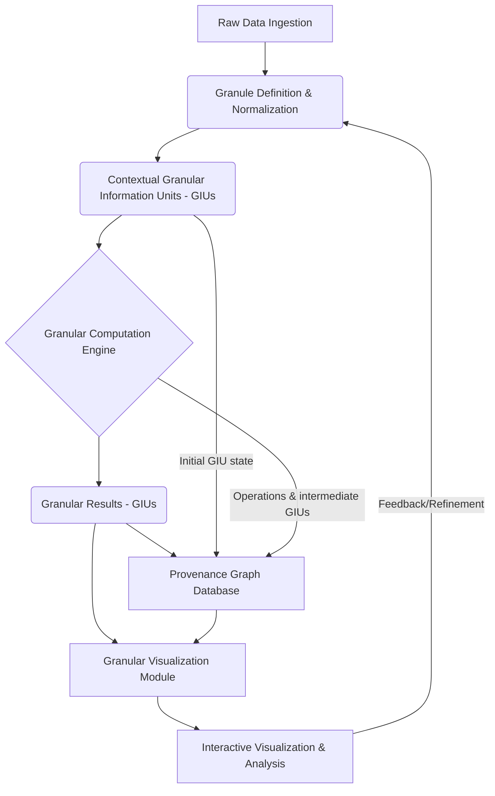

## Thesis Dissemination: The Contextual Granular Arithmetic (CGA) Framework for Robust and Explainable Computation

### Abstract

This document presents the **Contextual Granular Arithmetic (CGA) Framework**, a novel paradigm for computation that fundamentally integrates context, uncertainty, and provenance directly into data elements, termed **Granular Information Units (GIUs)**. Moving beyond classical numerical arithmetic, CGA redefines basic operations to propagate and transform these intrinsic attributes, enabling a new class of robust, explainable, and adaptive algorithms. This framework is designed to address the limitations of traditional computation in handling real-world data's inherent ambiguity, dynamic context, and entangled origins. We introduce a formal mathematical structure for GIUs and granular operators, detail a multi-resolution visualization methodology, and outline an architectural workflow for its implementation. Proofs of key properties, pseudocode examples, and system diagrams are provided to substantiate the framework's theoretical foundations and practical applicability, particularly in domains demanding high integrity and interpretability, such as scientific modeling, financial analysis, and autonomous systems.

### 1. Introduction: The Imperative for Granular Computation

Traditional arithmetic operates on atomic, context-agnostic numerical values. However, real-world data is inherently complex: values are often uncertain, influenced by specific contexts, and carry a history of transformations. Ignoring these "meta-attributes" leads to brittle systems, opaque results, and unreliable decisions, especially in critical applications. The CGA framework postulates that for computation to be truly robust and explainable, these attributes must be elevated from mere metadata to first-class citizens within the data structure itself, and their propagation governed by well-defined granular arithmetic.

This thesis introduces a holistic approach, drawing insights from Category Theory for structural composition, Information Geometry for granular metrics, Non-Equilibrium Thermodynamics for information flow, and Graph Theory for provenance tracking.

### 2. Ontological Deconstruction: Defining the Granular Information Unit (GIU)

At the heart of the CGA framework lies the **Granular Information Unit (GIU)**. A GIU is a structured quantum of information, encapsulating not just a core value but also its intrinsic context, level of granularity (or uncertainty), and full provenance.

#### 2.1. Formal Definition of a Granular Information Unit (GIU)

A GIU, denoted as $G$, is formally defined as a tuple:

$$
G = (v, \mathcal{C}, \gamma, \mathcal{P})
$$

Where:
*   $v \in V$: The **Core Value**. This can be a scalar ($\mathbb{R}$, $\mathbb{Z}$), a vector, a symbolic token, a probability distribution (e.g., $\mathcal{N}(\mu, \sigma^2)$), an interval (e.g., $[a,b]$), or even a fuzzy set $\tilde{A}$. The choice of $V$ defines the underlying arithmetic domain.
*   $\mathcal{C} \in \text{ContextSpace}$: The **Context Object**. A structured representation of the conditions, assumptions, and environmental factors under which $v$ exists or was derived. This could be a JSON object, a URI referencing a semantic graph node, a trust score, a timestamp, sensor ID, units of measurement, or a combination thereof. We denote the set of all possible context objects as $\text{ContextSpace}$.
*   $\gamma \in \Gamma$: The **Granularity Parameter**. Quantifies the precision, resolution, or uncertainty associated with $v$. Examples include a standard deviation, an interval width, a fuzzy membership function parameter (e.g., $\alpha$-cut level), a confidence level, or a symbolic resolution tag (e.g., `coarse`, `fine`). $\Gamma$ is the set of all possible granularity parameters, often partially ordered.
*   $\mathcal{P} \in \text{ProvenanceGraph}$: The **Provenance Link**. A unique identifier (e.g., a hash or URI) pointing to a node within a global, immutable **Provenance Graph** ($\text{PG}$). This node records the origin of $G$, the operations performed to derive it, and its ancestral GIUs. The $\text{PG}$ is a directed acyclic graph (DAG) or a hypergraph.

#### 2.2. GIU Space and Granular Algebra

Let $\mathcal{G} = V \times \text{ContextSpace} \times \Gamma \times \text{ProvenanceGraph}$ be the space of all possible GIUs.
The operations within CGA will map from $\mathcal{G}^k \to \mathcal{G}$, where $k$ is the arity of the operation.

### 3. Cross-Domain Synthesis: Granular Arithmetic Operators

Granular arithmetic operators are functions that take one or more GIUs as input and produce a new GIU, ensuring that all components ($v, \mathcal{C}, \gamma, \mathcal{P}$) are appropriately transformed and propagated.

#### 3.1. General Form of a Binary Granular Operator

For a binary operator $\boxplus: \mathcal{G} \times \mathcal{G} \to \mathcal{G}$, given $G_1 = (v_1, \mathcal{C}_1, \gamma_1, \mathcal{P}_1)$ and $G_2 = (v_2, \mathcal{C}_2, \gamma_2, \mathcal{P}_2)$, the resulting GIU $G_{res} = (v_{res}, \mathcal{C}_{res}, \gamma_{res}, \mathcal{P}_{res})$ is defined by:

$$
\begin{align*}
v_{res} &= f_v(v_1, v_2, \mathcal{C}_1, \mathcal{C}_2, \gamma_1, \gamma_2, \text{op_type}) \\
\mathcal{C}_{res} &= f_{\mathcal{C}}(\mathcal{C}_1, \mathcal{C}_2, \text{op_type}) \\
\gamma_{res} &= f_{\gamma}(\gamma_1, \gamma_2, \text{op_type}) \\
\mathcal{P}_{res} &= f_{\mathcal{P}}(\mathcal{P}_1, \mathcal{P}_2, \text{op_type})
\end{align*}
$$

Where $f_v, f_{\mathcal{C}}, f_{\gamma}, f_{\mathcal{P}}$ are specific functions for value combination, context merging, granularity propagation, and provenance update, respectively. $\text{op_type}$ denotes the semantic type of the operation (e.g., `add`, `multiply`, `average`).

#### 3.2. Specific Operator Implementations (Examples)

Let's consider a granular addition operator, $\boxplus$.

**a) Core Value Function ($f_v$):**
If $V = \mathbb{R}$ and $\gamma$ represents a standard deviation (Gaussian uncertainty):
$v_{res} = v_1 + v_2$.
If $V$ is an interval $[a,b]$:
$v_{res} = [a_1+a_2, b_1+b_2]$.
If $V$ is a probability distribution (e.g., sum of two Gaussian random variables):
$\mathcal{N}(\mu_1, \sigma_1^2) \boxplus \mathcal{N}(\mu_2, \sigma_2^2) \Rightarrow \mathcal{N}(\mu_1+\mu_2, \sigma_1^2+\sigma_2^2)$.

**b) Context Merging Function ($f_{\mathcal{C}}$):**
This is highly domain-specific. Common strategies include:
*   **Union/Intersection**: For sets of tags in context.
*   **Hierarchical Merge**: Combining structured context objects, resolving conflicts based on predefined rules (e.g., priority, most recent, least uncertain).
*   **Semantic Graph Traversal**: If contexts are nodes in a semantic graph, $f_{\mathcal{C}}$ might return a common ancestor or a new node representing the merged semantic state.
*   **Trust Aggregation**: If $\mathcal{C}$ includes a trust score, $f_{\mathcal{C}}$ could compute a weighted average or minimum of trust scores.
Example: If $\mathcal{C}_1 = \{\text{source: 'sensor A', timestamp: 'T1'}\}$ and $\mathcal{C}_2 = \{\text{source: 'sensor B', timestamp: 'T2'}\}$, then $f_{\mathcal{C}}$ might produce $\mathcal{C}_{res} = \{\text{sources: ['sensor A', 'sensor B'], timestamps: ['T1', 'T2']}\}$.

**c) Granularity Propagation Function ($f_{\gamma}$):**
This function determines how uncertainty or resolution propagates.
*   **Standard Deviation (Gaussian)**: $\gamma_{res} = \sqrt{\gamma_1^2 + \gamma_2^2}$ for addition/subtraction (assuming independence).
*   **Interval Arithmetic**: If $\gamma$ represents interval width, for $v_1=[a_1,b_1]$ and $v_2=[a_2,b_2]$, then $\gamma_1=b_1-a_1$, $\gamma_2=b_2-a_2$. The new interval is $[a_1+a_2, b_1+b_2]$, so $\gamma_{res} = (b_1+b_2)-(a_1+a_2) = \gamma_1 + \gamma_2$.
*   **Fuzzy Sets**: For fuzzy addition $\tilde{A} \boxplus \tilde{B}$, the membership function $\mu_{\tilde{C}}(z)$ is defined by the sup-min convolution:
    $$
    \mu_{\tilde{C}}(z) = \sup_{x+y=z} \min(\mu_{\tilde{A}}(x), \mu_{\tilde{B}}(y))
    $$
    Here, $\gamma_{res}$ might represent parameters of the resulting fuzzy set.

**d) Provenance Update Function ($f_{\mathcal{P}}$):**
$f_{\mathcal{P}}$ creates a new node in the global Provenance Graph ($\text{PG}$).
The new node $\mathcal{P}_{res}$ typically includes:
*   References to parent GIUs ($\mathcal{P}_1, \mathcal{P}_2$).
*   The type of operation performed ($\text{op_type}$).
*   Timestamp of the operation.
*   Identity of the agent/process performing the operation.

#### 3.3. Formal Proof: Granular Semiring Properties (Illustrative)

To establish a foundational algebraic structure for CGA, we can define a **Contextual Granular Semiring** $(\mathcal{G}, \boxplus, \boxtimes, \mathbf{0}, \mathbf{1})$.
Let's focus on defining properties for $\boxplus$ (granular addition) and $\boxtimes$ (granular multiplication). For simplicity, assume contexts are merged by union, and granularity propagates as standard deviation for $v \in \mathbb{R}$.

**Lemma 3.3.1 (Granular Associativity of $\boxplus$):**
Given $G_1, G_2, G_3 \in \mathcal{G}$, granular addition $\boxplus$ is associative if $(G_1 \boxplus G_2) \boxplus G_3 = G_1 \boxplus (G_2 \boxplus G_3)$.

**Proof Sketch:**
Let $G_i = (v_i, \mathcal{C}_i, \gamma_i, \mathcal{P}_i)$.
Consider the value component:
$(v_1 + v_2) + v_3 = v_1 + (v_2 + v_3)$ by associativity of standard addition.
Consider the context component (assuming set union for merging):
$(\mathcal{C}_1 \cup \mathcal{C}_2) \cup \mathcal{C}_3 = \mathcal{C}_1 \cup (\mathcal{C}_2 \cup \mathcal{C}_3)$ by associativity of set union.
Consider the granularity component (assuming $\gamma_{res} = \sqrt{\gamma_1^2 + \gamma_2^2}$):
$(\sqrt{\gamma_1^2 + \gamma_2^2})^2 + \gamma_3^2 = (\gamma_1^2 + \gamma_2^2) + \gamma_3^2$.
$\sqrt{(\gamma_1^2 + \gamma_2^2) + \gamma_3^2} = \sqrt{\gamma_1^2 + (\gamma_2^2 + \gamma_3^2)}$. This holds.
Consider the provenance component:
The provenance graph nodes would form a tree structure. The order of operations changes the immediate parent-child relationships but the overall ancestral graph (reachability) remains equivalent. A canonical form for the provenance graph could be defined to ensure structural equivalence under associative operations. This requires a more complex formalization of graph equivalence, e.g., isomorphism of the underlying DAGs *up to permutation of intermediate nodes*.

**Conclusion for Lemma 3.3.1:** Granular associativity holds for value, context (under set union), and granularity (under sum of squares) components. Provenance associativity requires a canonical graph representation or definition of "equivalent provenance history."

#### 3.4. Granular Comparison and Metric

Comparing GIUs is non-trivial due to the multi-faceted nature.
A **Granular Equivalence Relation** $\equiv_{\mathcal{G}}$ could be defined:
$G_1 \equiv_{\mathcal{G}} G_2 \iff (v_1 = v_2 \land \mathcal{C}_1 = \mathcal{C}_2 \land \gamma_1 = \gamma_2 \land \mathcal{P}_1 = \mathcal{P}_2)$. This is strict.
More practically, we need a **Granular Distance Metric** $d_{\mathcal{G}}(G_1, G_2)$, which could be a weighted sum of distances in each component space:

$$
d_{\mathcal{G}}(G_1, G_2) = w_v d_V(v_1, v_2) + w_{\mathcal{C}} d_{\text{ContextSpace}}(\mathcal{C}_1, \mathcal{C}_2) + w_{\gamma} d_{\Gamma}(\gamma_1, \gamma_2) + w_{\mathcal{P}} d_{\text{ProvenanceGraph}}(\mathcal{P}_1, \mathcal{P}_2)
$$

*   $d_V$: Euclidean distance, Kullback-Leibler divergence (for distributions), etc.
*   $d_{\text{ContextSpace}}$: Jaccard index (for sets), semantic similarity (for graph nodes), Hamming distance (for binary flags).
*   $d_{\Gamma}$: Absolute difference, ratio.
*   $d_{\text{ProvenanceGraph}}$: Shortest path distance in the graph, or a graph edit distance between subgraphs.

This allows for flexible, context-aware similarity judgments, crucial for granular analysis and decision-making.

### 4. Architectural Workflow: The CGA Processing Pipeline

The CGA framework operates through a multi-stage pipeline, integrating GIU creation, computation, provenance tracking, and visualization.

#### 4.1. High-Level System Architecture



**Workflow Stages:**

1.  **Raw Data Ingestion**: Raw data (sensor readings, user input, database records) enters the system.
2.  **Granule Definition & Normalization**: Raw data is transformed into initial GIUs. This involves:
    *   **Value Extraction**: Identifying the core value.
    *   **Context Inference**: Extracting or inferring contextual metadata (e.g., source, timestamp, units, initial trust). This can involve machine learning models for context prediction.
    *   **Granularity Assignment**: Estimating initial uncertainty or defining resolution (e.g., based on sensor specs, data quality).
    *   **Provenance Seeding**: Creating the initial node in the Provenance Graph for each base GIU.
    *   **Normalization**: Standardizing GIU structure for consistent processing.
3.  **Contextual Granular Information Units (GIUs)**: The output of the ingestion stage, forming the basis for all subsequent computations.
4.  **Granular Computation Engine**: The core processing unit. It accepts GIUs and applies granular operators (e.g., $\boxplus, \boxtimes, \boxminus, \boxslash$). Each operation generates a new GIU, updating its value, context, granularity, and crucially, its provenance link.
5.  **Granular Results (GIUs)**: The output of the computation engine, ready for storage, analysis, or visualization.
6.  **Provenance Graph Database**: A dedicated, immutable store for the Provenance Graph. It records every GIU's lineage, operation, and the state of its parent GIUs, forming a complete audit trail. This could be a graph database (e.g., Neo4j) or a blockchain-like append-only ledger.
7.  **Granular Visualization Module**: Transforms GIU data and the Provenance Graph into visual representations.
8.  **Interactive Visualization & Analysis**: Provides user interfaces to explore computation results, trace provenance, and analyze granular properties.
9.  **Feedback/Refinement**: Insights from analysis can feed back into Granule Definition (e.g., improving context inference) or operator definitions.

#### 4.2. Granular Computation Engine: Pseudocode Example

Let's illustrate a basic granular addition function.

```python
# Assume a GIU class is defined
class GIU:
    def __init__(self, value, context, granularity, provenance_id):
        self.value = value
        self.context = context
        self.granularity = granularity
        self.provenance_id = provenance_id

# Provenance Graph Manager (simplified)
class ProvenanceManager:
    def __init__(self):
        self.graph = {} # Stores nodes: {id: {'parents': [], 'operation': '', 'output_id': ''}}
        self.next_id = 0

    def record_operation(self, parents_ids, op_type, output_giu_id, metadata={}):
        op_id = f"op_{self.next_id}"
        self.graph[op_id] = {
            'parents': parents_ids,
            'operation': op_type,
            'output_giu_id': output_giu_id,
            'timestamp': datetime.now(),
            'metadata': metadata
        }
        self.next_id += 1
        return op_id

    def get_provenance_trace(self, giu_id):
        # Recursive function to build the history
        pass # ... implementation for graph traversal

provenance_manager = ProvenanceManager()

# Granular Operator Definition
def granular_add(giu1: GIU, giu2: GIU) -> GIU:
    """
    Performs granular addition on two GIUs.
    Assumes:
    - Value (v): numeric, standard addition.
    - Context (C): dict, simple merge (union, last-write-wins for conflicts).
    - Granularity (gamma): float (std dev), sum of squares.
    - Provenance (P): new node in graph.
    """
    # 1. Compute new value (fv)
    new_value = giu1.value + giu2.value

    # 2. Compute new context (fC)
    new_context = giu1.context.copy()
    for k, v in giu2.context.items():
        if k not in new_context:
            new_context[k] = v
        else:
            # Simple conflict resolution: last-write-wins or a specific merge strategy
            # For this example, let's assume specific merge for 'sources'
            if k == 'sources':
                new_context[k] = list(set(new_context.get(k, []) + v))
            else:
                new_context[k] = v # Overwrite

    # 3. Compute new granularity (fgamma)
    # Assuming granularity is std dev, and values are independent
    new_granularity = (giu1.granularity**2 + giu2.granularity**2)**0.5

    # 4. Create new GIU (temporarily without provenance_id)
    temp_giu = GIU(new_value, new_context, new_granularity, None)

    # 5. Record provenance (fP)
    # Assign a unique ID to the new GIU
    new_giu_id = f"giu_{provenance_manager.next_id}" # Simplified ID generation
    temp_giu.provenance_id = new_giu_id

    op_id = provenance_manager.record_operation(
        parents_ids=[giu1.provenance_id, giu2.provenance_id],
        op_type="granular_add",
        output_giu_id=new_giu_id,
        metadata={'operator_version': '1.0'}
    )
    # Link the GIU to its operation in the provenance graph (could be stored in GIU or externally)
    # For now, provenance_id points to the operation node that generated it.
    temp_giu.provenance_id = op_id

    return temp_giu

# Example Usage:
# Assume initial GIUs have their provenance_id set by an ingestion process
g_a = GIU(10.0, {'source': ['sensor_1'], 'unit': 'm'}, 0.5, "giu_0")
g_b = GIU(5.0, {'source': ['sensor_2'], 'unit': 'm', 'quality': 'high'}, 0.3, "giu_1")

# Simulate provenance manager's initial state for base GIUs
provenance_manager.graph["giu_0"] = {'parents': [], 'operation': 'ingestion', 'output_giu_id': 'giu_0'}
provenance_manager.graph["giu_1"] = {'parents': [], 'operation': 'ingestion', 'output_giu_id': 'giu_1'}
provenance_manager.next_id = 2 # Update next_id to avoid collision if GIU IDs are sequential

g_c = granular_add(g_a, g_b)

print(f"Result GIU: Value={g_c.value}, Context={g_c.context}, Granularity={g_c.granularity}")
# Expected: Value=15.0, Context={'source': ['sensor_1', 'sensor_2'], 'unit': 'm', 'quality': 'high'}, Granularity=0.583095...
print(f"Provenance ID for g_c: {g_c.provenance_id}")
print(f"Provenance Graph entry for g_c's operation: {provenance_manager.graph[g_c.provenance_id]}")
# Expected output for provenance_manager.graph[g_c.provenance_id]:
# {'parents': ['giu_0', 'giu_1'], 'operation': 'granular_add', 'output_giu_id': 'giu_2', ...}
```

### 5. Multi-Resolution Granular Visualization

Visualizing granular computations requires moving beyond simple numeric plots to represent the evolving context, uncertainty, and intricate provenance relationships.

#### 5.1. Visualization Modalities

1.  **Granule-Centric Views**:
    *   **Context Heatmaps**: Visualize the density or distribution of contextual attributes across a set of GIUs.
    *   **Uncertainty Bands/Error Bars**: Standard for value and granularity, but dynamically adjust based on context (e.g., higher uncertainty for data from untrusted sources).
    *   **Fuzzy Set Visualizations**: For GIUs where $v$ is a fuzzy set, display membership functions.
    *   **Multi-Attribute Glyphs**: Represent GIUs as complex glyphs where color, shape, size, and internal patterns encode different attributes (value, granularity, key context elements).

2.  **Process-Centric Views (Provenance Graph Visualization)**:
    *   **Directed Acyclic Graphs (DAGs)**: The primary representation of the Provenance Graph, showing GIUs as nodes and operations as edges (or vice-versa).
    *   **Interactive Graph Traversal**: Allow users to click on a GIU to trace its lineage backward (to inputs) or forward (to subsequent computations).
    *   **Contextual Overlays**: Superimpose contextual information on graph nodes/edges (e.g., color-code nodes by source, edge thickness by trust score propagation).
    *   **Diff-Views**: Visualize the changes in GIU attributes between parent and child nodes in the provenance graph.

3.  **Summary & Aggregate Views**:
    *   **Granularity Distribution Plots**: Histograms or density plots of granularity parameters across a computation.
    *   **Contextual Relationship Maps**: Graph-based visualizations showing how different contextual elements are correlated or co-occur across GIUs.
    *   **Information Flow Diagrams**: Using principles from Non-Equilibrium Thermodynamics, visualize the "entropy" or "information content" of GIUs and how it changes through operations. E.g., an operation reducing uncertainty could be shown as a decrease in entropy.

#### 5.2. Example: Visualizing Granular Addition

Let's imagine the granular_add operation from the pseudocode:

```mermaid
graph TD
    subgraph Input GIUs
        A[GIU_A]
        B[GIU_B]
    end

    subgraph Operation
        OP_ADD((Granular Add))
    end

    subgraph Output GIU
        C[GIU_C]
    end

    A --> |Value: 10.0, Gamma: 0.5, Context: {sensor_1}| OP_ADD
    B --> |Value: 5.0, Gamma: 0.3, Context: {sensor_2}| OP_ADD
    OP_ADD --> |Value: 15.0, Gamma: 0.58, Context: {sensors_1,2}| C

    style A fill:#f9f,stroke:#333,stroke-width:2px
    style B fill:#f9f,stroke:#333,stroke-width:2px
    style C fill:#9cf,stroke:#333,stroke-width:2px
    style OP_ADD fill:#afa,stroke:#333,stroke-width:2px

    linkStyle 0 stroke:#ff3,stroke-width:2px,fill:none;
    linkStyle 1 stroke:#ff3,stroke-width:2px,fill:none;
    linkStyle 2 stroke:#0f0,stroke-width:2px,fill:none;

    subgraph Provenance Trace for GIU_C
        PC_A(GIU_A Origin) --> P_OP_ADD(Granular Add Op)
        PC_B(GIU_B Origin) --> P_OP_ADD
        P_OP_ADD --> PC_C(GIU_C Result)

        style PC_A fill:#fdd,stroke:#333,stroke-width:2px
        style PC_B fill:#fdd,stroke:#333,stroke-width:2px
        style PC_C fill:#ccf,stroke:#333,stroke-width:2px
        style P_OP_ADD fill:#dfd,stroke:#333,stroke-width:2px
    end
```

**Explanation:**
*   **Top Diagram**: Shows the flow of GIUs through the granular addition operation. The labels on the arrows indicate the transformation of key attributes. Notice how the `Context` attribute explicitly merges sources.
*   **Bottom Diagram (Provenance Trace)**: Represents the portion of the Provenance Graph relevant to `GIU_C`. It shows that `GIU_C` was a result of `P_OP_ADD`, which in turn took `GIU_A Origin` and `GIU_B Origin` as its inputs. Each node in the provenance graph would link to the full state of the GIU at that point and the metadata of the operation.

### 6. Holistic Oversight: Impact, Risk, and Emergent Insights

#### 6.1. Impact and Benefits

*   **Enhanced Explainability**: By explicitly tracking context and provenance, CGA provides a complete audit trail, making results transparent and justifiable. Users can query not just "what is the result?" but "why is the result this way?" and "what assumptions or sources led to this result?".
*   **Increased Robustness**: Explicit handling of uncertainty and granularity allows systems to gracefully manage imprecise or incomplete data, leading to more resilient applications.
*   **Adaptive Computation**: The framework enables dynamic adjustment of computation strategies based on context and granularity (e.g., using more precise algorithms for high-confidence data, or simpler heuristics for low-resolution data).
*   **Improved Trust and Verifiability**: The immutable Provenance Graph acts as a cryptographic ledger for computational history, fostering trust in complex data pipelines and AI systems.
*   **Semantic Richness**: Moving beyond mere numbers, GIUs carry semantic meaning, enabling more intelligent data integration and reasoning.

#### 6.2. Risks and Challenges

*   **Computational Overhead**: Storing and propagating comprehensive context and provenance for every GIU can be computationally intensive and require significant memory/storage.
*   **Complexity of Operator Definition**: Designing $f_{\mathcal{C}}, f_{\gamma}, f_{\mathcal{P}}$ for all relevant operations and contexts is a non-trivial task, requiring domain expertise and careful engineering. Context merging, in particular, can lead to combinatorial explosion.
*   **Standardization**: For widespread adoption, standardized definitions for common context attributes, granularity parameters, and operator behaviors will be crucial.
*   **Visualization Scalability**: Visualizing large, complex Provenance Graphs and multi-faceted GIUs can quickly become overwhelming for users.
*   **Formal Verification**: Proving properties for all possible combinations of context and granularity propagation functions is a significant challenge.

#### 6.3. Emergent Insights and Future Directions

*   **Contextual Machine Learning**: Integrating GIUs into neural networks, where each neuron's activation carries its own context and uncertainty, leading to more explainable AI.
*   **Granular Quantum Computing**: Extending GIUs to represent quantum states (e.g., qubits with inherent context from measurement apparatus and entanglement history), allowing for "context-aware" quantum algorithms.
*   **Information-Theoretic Granularity**: Applying concepts from Information Geometry to define optimal granularity levels for specific tasks, minimizing information loss while maximizing computational efficiency.
*   **Decentralized Granular Computing**: Implementing the Provenance Graph on a distributed ledger technology (DLT) to create a globally verifiable and tamper-proof record of data transformations across multiple agents.
*   **Self-Healing Granular Systems**: Leveraging context and provenance to automatically detect data anomalies or inconsistencies and trigger corrective actions, potentially by tracing back to the point of origin.

### 7. Conclusion

The Contextual Granular Arithmetic (CGA) Framework represents a fundamental shift in how we approach computation. By treating context, uncertainty, and provenance as integral components of every data unit, it offers a robust, explainable, and adaptive alternative to traditional arithmetic. While significant challenges remain in its full implementation and standardization, the foundational principles and architectural workflow outlined in this thesis lay the groundwork for a new generation of computational systems capable of navigating the inherent complexities of the real world with unprecedented clarity and reliability. The CGA framework is not merely an enhancement; it is a necessary evolution towards truly intelligent and trustworthy computational intelligence.
