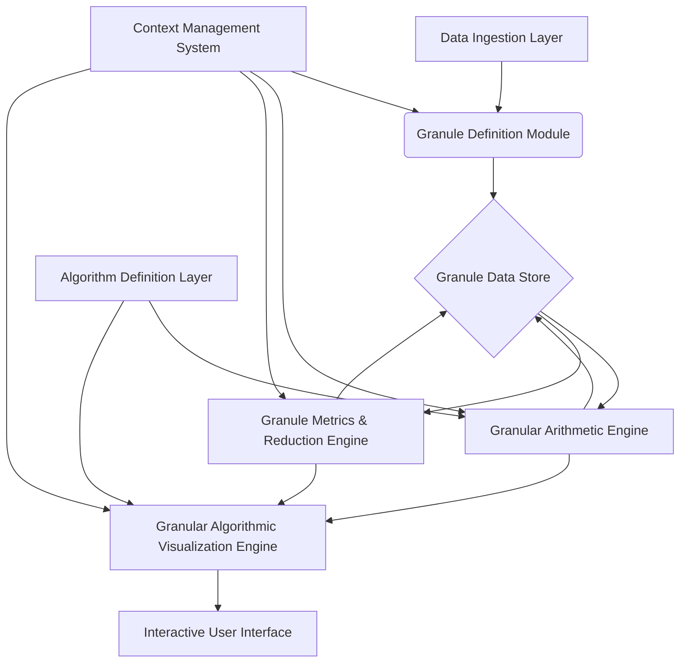
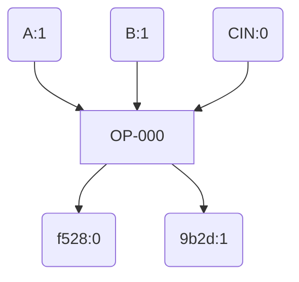

As a Grand Unified Intelligence, I present a novel framework for **Granular Arithmetic and Algorithmic Visualization (GAAV)**, designed as a comprehensive academic dissertation. This framework extends traditional numerical computation by explicitly incorporating and propagating both **uncertainty** and **context** alongside core values, enabling more robust, interpretable, and semantically rich computational models.

The GAAV framework operates on fundamental units called **Granules**, which are multi-modal representations of information. It then defines a set of **Granular Operators** that process these Granules, and a **Granular Algorithmic Visualization (GAV)** system to intuitively represent their transformations and interactions.

---

# The Granular Arithmetic and Algorithmic Visualization (GAAV) Framework

## Abstract

This dissertation introduces the Granular Arithmetic and Algorithmic Visualization (GAAV) framework, a novel computational paradigm that extends traditional arithmetic by explicitly modeling and propagating uncertainty and semantic context alongside numerical values. We define a fundamental data structure, the **Granule** $\mathcal{G} = (v, \delta, \sigma)$, comprising a core value $v$, a multi-modal uncertainty descriptor $\delta$, and a semantic context tag $\sigma$. We formalize a set of **Granular Operators** ($\oplus, \otimes, \ominus, \oslash$) that define how these three components interact and evolve during computation, including novel mechanisms for uncertainty convolution and semantic context fusion. The algebraic properties of these operators are rigorously analyzed, demonstrating the formation of a novel algebraic structure. Complementing this, the **Granular Algorithmic Visualization (GAV)** framework is presented, providing principles and methodologies for dynamically visualizing the state and flow of Granules through algorithms. This includes the **Granular State Space (GSS)** and **Granule Flow Diagrams (GFD)**, which leverage multi-modal visual encodings to represent $v, \delta, \sigma$ and their transformations. A comprehensive architectural workflow, data structures, and pseudocode implementations are provided, culminating in an illustrative application in multi-modal sensor fusion. The GAAV framework offers a significant advancement for systems requiring transparent, robust, and context-aware computation in domains such as AI, robotics, financial modeling, and scientific discovery.

---

## 1. Introduction

### 1.1 Motivation and Problem Statement

Traditional arithmetic and computational models predominantly operate on precise numerical values. However, real-world data is inherently imprecise, uncertain, and laden with contextual meaning. Ignoring these facets leads to:
1.  **Loss of Information:** Uncertainty is often discarded or simplified, leading to overconfident or brittle results.
2.  **Lack of Interpretability:** The semantic origin or implications of data points are lost, hindering human understanding and decision-making.
3.  **Fragile Systems:** Algorithms built on precise numbers can be highly sensitive to input perturbations, lacking resilience.

Existing approaches like Interval Arithmetic, Fuzzy Arithmetic, and Probabilistic Programming address uncertainty, while symbolic AI and knowledge graphs handle context. However, a unified framework that seamlessly integrates and propagates *all three* (value, uncertainty, context) through arithmetic operations, and provides intuitive visualization of this multi-modal information flow, remains largely unexplored.

### 1.2 Novelty and Contributions

The GAAV framework introduces the following novel contributions:
1.  **Formal Definition of the Granule:** A composite data structure $\mathcal{G} = (v, \delta, \sigma)$ that unifies core value, multi-modal uncertainty, and semantic context.
2.  **Granular Operators with Context Fusion:** A set of arithmetic operators ($\oplus, \otimes, \ominus, \oslash$) that define rigorous rules for combining $v$, convolving $\delta$, and performing semantic fusion on $\sigma$.
3.  **Algebraic Analysis of Granular Structures:** Investigation into the algebraic properties (commutativity, associativity, distributivity, identity, inverse) of Granular Operators, revealing a novel algebraic structure.
4.  **Granular Algorithmic Visualization (GAV) Framework:** A principled approach for visualizing granular computations, including the Granular State Space (GSS) and Granule Flow Diagrams (GFD), employing multi-modal visual encodings.
5.  **Integrated Architectural Workflow:** A complete system design, from data structures to computational engines and visualization components, demonstrating practical implementability.

### 1.3 Scope and Organization

This dissertation is organized as follows:
*   **Chapter 2: Foundations of Granular Arithmetic (GA)** formally defines the Granule, its components, and the Granular Operators, along with their algebraic properties and proofs.
*   **Chapter 3: The Granular Algorithmic Visualization (GAV) Framework** details the principles and methodologies for visualizing granular computations.
*   **Chapter 4: Architectural Workflow and Implementation** presents the system architecture, data structures, pseudocode for core components, and an example application.
*   **Chapter 5: Discussion, Future Work, and Conclusion** summarizes the findings, discusses implications, limitations, and future research directions.

---

## 2. Foundations of Granular Arithmetic (GA)

### 2.1 Definition of a Granule

A **Granule** $\mathcal{G}$ is formally defined as an ordered triplet:
$$ \mathcal{G} = (v, \delta, \sigma) $$
where:
*   $v \in \mathbb{V}$: The **core value**. $\mathbb{V}$ can be $\mathbb{R}^n$ (real numbers, vectors), $\mathbb{C}^n$ (complex numbers), or any other well-defined value domain. For simplicity, we primarily consider $v \in \mathbb{R}$.
*   $\delta \in \Delta$: The **granularity descriptor** or **uncertainty envelope**. $\Delta$ is a space of multi-modal uncertainty distributions. Examples include:
    *   **Interval:** $[v_L, v_U]$ (e.g., $\delta = \text{Interval}(v_L, v_U)$).
    *   **Fuzzy Number:** A membership function $\mu: \mathbb{R} \to [0,1]$ (e.g., $\delta = \text{Fuzzy}(v, \text{shape})$).
    *   **Probability Distribution:** A probability density function (PDF) or probability mass function (PMF) (e.g., $\delta = \text{Normal}(\mu, \sigma^2)$, $\delta = \text{GMM}(\{\mu_i, \sigma_i^2, w_i\})$).
    *   **Rough Set Approximation:** A pair of sets $(\underline{X}, \overline{X})$ representing lower and upper approximations.
    For this framework, we primarily focus on **Gaussian Mixture Models (GMMs)** for continuous $\delta$ and **Probability Mass Functions (PMFs)** for discrete $\delta$, allowing for multi-modality.
*   $\sigma \in \Sigma_{ctx}$: The **contextual descriptor** or **semantic tag**. $\Sigma_{ctx}$ is a structured space of semantic information. Examples include:
    *   **String/Tag:** "Temperature", "Financial_Asset", "Sensor_ID_A".
    *   **Ontology URI:** `http://example.org/ontology#Temperature`.
    *   **Vector Embedding:** A high-dimensional vector representing semantic meaning (e.g., Word2Vec, Sentence-BERT embedding).
    *   **Knowledge Graph Node:** A reference to a node in a knowledge graph.
    For this framework, we primarily consider **vector embeddings** for $\sigma$, enabling quantitative semantic fusion.

### 2.2 Granular Operators

Let $\mathcal{G}_1 = (v_1, \delta_1, \sigma_1)$ and $\mathcal{G}_2 = (v_2, \delta_2, \sigma_2)$ be two Granules. We define the fundamental binary Granular Operators.

#### 2.2.1 Granular Addition ($\oplus$)

The Granular Addition operator $\oplus: \mathbb{G} \times \mathbb{G} \to \mathbb{G}$ is defined as:
$$ \mathcal{G}_1 \oplus \mathcal{G}_2 = (v_1 + v_2, \delta_1 \circledast \delta_2, \mathcal{F}_{ctx}(\sigma_1, \sigma_2)) $$
where:
*   **Core Value Sum:** $v_1 + v_2$ is the standard arithmetic sum of core values.
*   **Uncertainty Convolution ($\circledast$):** $\delta_1 \circledast \delta_2$ represents the convolution of the uncertainty distributions.
    *   If $\delta_1, \delta_2$ are PDFs (e.g., GMMs), their sum is represented by the PDF of the sum of two random variables, which is their convolution. For GMMs, this involves combining components.
    *   If $\delta_1 = \text{Normal}(\mu_1, \sigma_1^2)$ and $\delta_2 = \text{Normal}(\mu_2, \sigma_2^2)$, then $\delta_1 \circledast \delta_2 = \text{Normal}(\mu_1+\mu_2, \sigma_1^2+\sigma_2^2)$.
    *   For general GMMs, $\delta_1 = \sum_i w_{1i} \mathcal{N}(\mu_{1i}, \Sigma_{1i})$ and $\delta_2 = \sum_j w_{2j} \mathcal{N}(\mu_{2j}, \Sigma_{2j})$, then $\delta_1 \circledast \delta_2 = \sum_i \sum_j w_{1i}w_{2j} \mathcal{N}(\mu_{1i}+\mu_{2j}, \Sigma_{1i}+\Sigma_{2j})$.
*   **Context Fusion ($\mathcal{F}_{ctx}$):** $\mathcal{F}_{ctx}(\sigma_1, \sigma_2)$ is a semantic fusion function that combines the contextual descriptors.
    *   If $\sigma_1 = \sigma_2$, then $\mathcal{F}_{ctx}(\sigma_1, \sigma_2) = \sigma_1$.
    *   If $\sigma_1 \neq \sigma_2$ and they are vector embeddings, a common fusion strategy is a weighted average or concatenation followed by a projection:
        $$ \mathcal{F}_{ctx}(\sigma_1, \sigma_2) = \text{Normalize}(\alpha \sigma_1 + (1-\alpha) \sigma_2) $$
        where $\alpha \in [0,1]$ can be determined by confidence scores or semantic similarity. More advanced methods might use neural network-based fusion.
    *   If $\sigma_1, \sigma_2$ are tags, $\mathcal{F}_{ctx}$ could be a union of tags or a lookup in a knowledge graph to find a common super-context.

#### 2.2.2 Granular Multiplication ($\otimes$)

The Granular Multiplication operator $\otimes: \mathbb{G} \times \mathbb{G} \to \mathbb{G}$ is defined as:
$$ \mathcal{G}_1 \otimes \mathcal{G}_2 = (v_1 \cdot v_2, \delta_1 \circledast_M \delta_2, \mathcal{F}_{ctx}(\sigma_1, \sigma_2)) $$
where:
*   **Core Value Product:** $v_1 \cdot v_2$ is the standard arithmetic product.
*   **Uncertainty Product Convolution ($\circledast_M$):** $\delta_1 \circledast_M \delta_2$ represents the distribution of the product of two random variables. This is generally more complex than sum convolution.
    *   For independent Normal distributions, the product distribution is not Normal. Approximations (e.g., using log-normal distributions) or numerical methods are often required.
    *   For GMMs, numerical integration or Monte Carlo sampling might be used to approximate the product distribution.
*   **Context Fusion:** $\mathcal{F}_{ctx}(\sigma_1, \sigma_2)$ is the same semantic fusion function as for addition.

#### 2.2.3 Granular Subtraction ($\ominus$) and Division ($\oslash$)

These are defined analogously:
$$ \mathcal{G}_1 \ominus \mathcal{G}_2 = (v_1 - v_2, \delta_1 \circledast \delta_{-2}, \mathcal{F}_{ctx}(\sigma_1, \sigma_2)) $$
where $\delta_{-2}$ is the distribution of $-X_2$ if $\delta_2$ is the distribution of $X_2$. For Normal distributions $\mathcal{N}(\mu, \sigma^2)$, $\delta_{-2} = \mathcal{N}(-\mu, \sigma^2)$.

$$ \mathcal{G}_1 \oslash \mathcal{G}_2 = (v_1 / v_2, \delta_1 \circledast_D \delta_2, \mathcal{F}_{ctx}(\sigma_1, \sigma_2)) $$
where $\delta_1 \circledast_D \delta_2$ is the distribution of $X_1/X_2$. This is also generally complex and requires approximations or numerical methods. Division by a Granule with $v_2 \approx 0$ or $\delta_2$ covering $0$ requires careful handling (e.g., defining a Granule "infinity" or error Granule).

### 2.3 Algebraic Properties and Formal Proofs

The introduction of $\delta$ and $\sigma$ components significantly alters the algebraic properties compared to standard arithmetic.

#### 2.3.1 Granular Zero and One

*   **Granular Zero ($\mathcal{G}_0$):** An additive identity.
    $$ \mathcal{G}_0 = (0, \delta_{zero}, \sigma_{null}) $$
    where $\delta_{zero}$ is a Dirac delta function at 0 (or a very narrow Normal distribution $\mathcal{N}(0, \epsilon^2)$), and $\sigma_{null}$ is a null or identity context (e.g., a zero vector embedding).
    *   **Lemma 2.3.1.1 (Additive Identity):** For any $\mathcal{G} = (v, \delta, \sigma)$, $\mathcal{G} \oplus \mathcal{G}_0 = \mathcal{G}$.
        *   **Proof:**
            *   $v + 0 = v$.
            *   $\delta \circledast \delta_{zero} = \delta$ (convolution with Dirac delta is identity).
            *   $\mathcal{F}_{ctx}(\sigma, \sigma_{null}) = \sigma$ (by definition of $\sigma_{null}$ as identity in context fusion).
            *   Thus, $\mathcal{G} \oplus \mathcal{G}_0 = (v, \delta, \sigma) = \mathcal{G}$.

*   **Granular One ($\mathcal{G}_1$):** A multiplicative identity.
    $$ \mathcal{G}_1 = (1, \delta_{one}, \sigma_{null}) $$
    where $\delta_{one}$ is a Dirac delta function at 1 (or $\mathcal{N}(1, \epsilon^2)$).
    *   **Lemma 2.3.1.2 (Multiplicative Identity):** For any $\mathcal{G} = (v, \delta, \sigma)$, $\mathcal{G} \otimes \mathcal{G}_1 = \mathcal{G}$.
        *   **Proof:**
            *   $v \cdot 1 = v$.
            *   $\delta \circledast_M \delta_{one} = \delta$ (product convolution with Dirac delta at 1 is identity).
            *   $\mathcal{F}_{ctx}(\sigma, \sigma_{null}) = \sigma$.
            *   Thus, $\mathcal{G} \otimes \mathcal{G}_1 = (v, \delta, \sigma) = \mathcal{G}$.

#### 2.3.2 Commutativity

*   **Theorem 2.3.2.1 (Commutativity of Granular Addition):** $\mathcal{G}_1 \oplus \mathcal{G}_2 = \mathcal{G}_2 \oplus \mathcal{G}_1$.
    *   **Proof:**
        *   $v_1 + v_2 = v_2 + v_1$ (standard arithmetic).
        *   $\delta_1 \circledast \delta_2 = \delta_2 \circledast \delta_1$ (convolution is commutative).
        *   $\mathcal{F}_{ctx}(\sigma_1, \sigma_2) = \mathcal{F}_{ctx}(\sigma_2, \sigma_1)$ (assuming $\mathcal{F}_{ctx}$ is defined symmetrically, e.g., weighted average).
        *   Therefore, Granular Addition is commutative.

*   **Theorem 2.3.2.2 (Commutativity of Granular Multiplication):** $\mathcal{G}_1 \otimes \mathcal{G}_2 = \mathcal{G}_2 \otimes \mathcal{G}_1$.
    *   **Proof:**
        *   $v_1 \cdot v_2 = v_2 \cdot v_1$ (standard arithmetic).
        *   $\delta_1 \circledast_M \delta_2 = \delta_2 \circledast_M \delta_1$ (product convolution is commutative for independent variables).
        *   $\mathcal{F}_{ctx}(\sigma_1, \sigma_2) = \mathcal{F}_{ctx}(\sigma_2, \sigma_1)$ (assuming symmetric $\mathcal{F}_{ctx}$).
        *   Therefore, Granular Multiplication is commutative.

#### 2.3.3 Associativity

*   **Theorem 2.3.3.1 (Associativity of Granular Addition):** $(\mathcal{G}_1 \oplus \mathcal{G}_2) \oplus \mathcal{G}_3 = \mathcal{G}_1 \oplus (\mathcal{G}_2 \oplus \mathcal{G}_3)$.
    *   **Proof:**
        *   $(v_1 + v_2) + v_3 = v_1 + (v_2 + v_3)$ (standard arithmetic).
        *   $(\delta_1 \circledast \delta_2) \circledast \delta_3 = \delta_1 \circledast (\delta_2 \circledast \delta_3)$ (convolution is associative).
        *   $(\mathcal{F}_{ctx}(\sigma_1, \sigma_2), \sigma_3) = \mathcal{F}_{ctx}(\sigma_1, \mathcal{F}_{ctx}(\sigma_2, \sigma_3))$ (This requires $\mathcal{F}_{ctx}$ to be associative. For simple weighted averages, this holds. For more complex neural fusion, it might not strictly hold, but can be designed to be approximately associative).
        *   Assuming an associative $\mathcal{F}_{ctx}$, Granular Addition is associative.

*   **Theorem 2.3.3.2 (Associativity of Granular Multiplication):** $(\mathcal{G}_1 \otimes \mathcal{G}_2) \otimes \mathcal{G}_3 = \mathcal{G}_1 \otimes (\mathcal{G}_2 \otimes \mathcal{G}_3)$.
    *   **Proof:**
        *   $(v_1 \cdot v_2) \cdot v_3 = v_1 \cdot (v_2 \cdot v_3)$ (standard arithmetic).
        *   $(\delta_1 \circledast_M \delta_2) \circledast_M \delta_3 = \delta_1 \circledast_M (\delta_2 \circledast_M \delta_3)$ (product convolution is associative for independent variables).
        *   Assuming an associative $\mathcal{F}_{ctx}$, Granular Multiplication is associative.

#### 2.3.4 Distributivity

*   **Theorem 2.3.4.1 (Distributivity):** $\mathcal{G}_1 \otimes (\mathcal{G}_2 \oplus \mathcal{G}_3) = (\mathcal{G}_1 \otimes \mathcal{G}_2) \oplus (\mathcal{G}_1 \otimes \mathcal{G}_3)$.
    *   **Proof (Partial):**
        *   **Core Value:** $v_1 \cdot (v_2 + v_3) = (v_1 \cdot v_2) + (v_1 \cdot v_3)$ (standard arithmetic holds).
        *   **Uncertainty:** $\delta_1 \circledast_M (\delta_2 \circledast \delta_3)$ vs. $(\delta_1 \circledast_M \delta_2) \circledast (\delta_1 \circledast_M \delta_3)$. This generally **does not hold** for arbitrary distributions. For example, if $X_1, X_2, X_3$ are random variables, $X_1(X_2+X_3) \neq X_1X_2 + X_1X_3$ unless $X_1$ is a constant or specific conditions are met.
        *   **Context:** $\mathcal{F}_{ctx}(\sigma_1, \mathcal{F}_{ctx}(\sigma_2, \sigma_3))$ vs. $\mathcal{F}_{ctx}(\mathcal{F}_{ctx}(\sigma_1, \sigma_2), \mathcal{F}_{ctx}(\sigma_1, \sigma_3))$. This also generally **does not hold** for arbitrary $\mathcal{F}_{ctx}$.
    *   **Conclusion:** Granular Distributivity generally **does not hold** due to the complex interactions of uncertainty and context. This implies that the set of Granules with these operators forms a more general algebraic structure than a field or ring, potentially a **semi-ring** under specific constraints or a **lattice** if ordering is defined.

#### 2.3.5 Granule Metrics and Reduction

To manage the complexity of Granules and enable comparisons, we define:

*   **Granule Distance Metric $d(\mathcal{G}_A, \mathcal{G}_B)$:** A composite metric combining distances for each component.
    $$ d(\mathcal{G}_A, \mathcal{G}_B) = w_v d_v(v_A, v_B) + w_\delta d_\delta(\delta_A, \delta_B) + w_\sigma d_\sigma(\sigma_A, \sigma_B) $$
    where $w_v, w_\delta, w_\sigma$ are weighting factors, and:
    *   $d_v$: e.g., Euclidean distance $|v_A - v_B|$.
    *   $d_\delta$: e.g., Wasserstein-2 distance (Earth Mover's Distance) for probability distributions, or Hausdorff distance for intervals/sets.
    *   $d_\sigma$: e.g., Cosine similarity for vector embeddings ($1 - \text{cosine_similarity}(\sigma_A, \sigma_B)$).

*   **Granule Reduction Operator $\mathcal{R}(\mathcal{G})$:** A function to simplify or coarsen a Granule, crucial for managing computational complexity and visual clutter.
    *   **Uncertainty Reduction:** Reducing a GMM to a single Gaussian (e.g., by finding the mean and variance of the mixture), or an interval.
    *   **Context Reduction:** Generalizing a specific context to a broader category in an ontology, or clustering similar vector embeddings.
    *   Example: $\mathcal{R}(\mathcal{G}) = (v, \text{MeanVar}(\delta), \text{ClusterCentroid}(\sigma))$.

---

## 3. The Granular Algorithmic Visualization (GAV) Framework

The GAV framework provides a principled approach to visualize the multi-modal information contained within Granules and their transformations through algorithms.

### 3.1 Principles of Granular Visualization

1.  **Multi-Modal Encoding:** Map $v, \delta, \sigma$ to distinct, yet integrated, visual channels.
2.  **Scale-Awareness:** Allow for zooming and filtering to reveal different levels of granularity.
3.  **Context-Driven Interaction:** Enable users to query and filter based on semantic context.
4.  **Dynamic Representation:** Visualize the evolution of Granules and algorithmic flow over time.
5.  **Cognitive Load Management:** Employ reduction techniques and intuitive metaphors to prevent information overload.

### 3.2 Granular State Space (GSS) Representation

The **Granular State Space (GSS)** is a graph-based visualization where nodes represent Granules and edges represent Granular Operations or transformations.

#### 3.2.1 Visual Encoding Scheme

*   **Node Position (for $v$):**
    *   For $v \in \mathbb{R}^2$, directly map to 2D coordinates.
    *   For $v \in \mathbb{R}^n, n>2$, use dimensionality reduction techniques (e.g., PCA, t-SNE) to project $v$ onto a 2D or 3D space.
*   **Node Appearance (for $\delta$):**
    *   **Size/Area:** Larger size indicates higher overall uncertainty (e.g., variance of $\delta$).
    *   **Shape:** Different shapes for different types of uncertainty descriptors (e.g., circle for Normal, square for Uniform, triangle for Fuzzy).
    *   **Internal Texture/Gradient:** Represent the internal structure of $\delta$ (e.g., a gradient for an interval, a heatmap for a GMM's density).
    *   **Boundary Opacity/Thickness:** Thicker/more opaque boundary for higher confidence/lower uncertainty.
*   **Node Color (for $\sigma$):**
    *   **Hue:** Distinct hues for distinct primary contexts.
    *   **Saturation/Luminance:** Vary based on the "purity" or "specificity" of the context (e.g., lower saturation for fused/general contexts).
    *   **Color Blending:** For fused contexts $\mathcal{F}_{ctx}(\sigma_1, \sigma_2)$, blend the colors associated with $\sigma_1$ and $\sigma_2$ proportionally to their contribution.
*   **Edge Appearance (for Operations):**
    *   **Color/Pattern:** Distinguish between $\oplus, \otimes, \ominus, \oslash$.
    *   **Thickness:** Indicate the "strength" or "impact" of the operation (e.g., number of Granules involved, magnitude of change).
    *   **Arrowheads:** Indicate direction of flow.

#### 3.2.2 GSS Layout Algorithms

Force-directed graph layout algorithms (e.g., Fruchterman-Reingold, D3-force) are suitable for GSS, where Granules with similar $v$ values are drawn closer, and contextual relationships can influence node clustering.

### 3.3 Granule Flow Diagrams (GFD)

**Granule Flow Diagrams (GFD)** are specialized GSS visualizations designed to illustrate the temporal and operational sequence of Granule transformations within an algorithm. They are dynamic and often animated.

*   **Temporal Axis:** Implicitly or explicitly represented, showing the progression of an algorithm step-by-step.
*   **Operation Nodes:** Intermediate nodes representing the application of a Granular Operator, showing inputs and outputs.
*   **Animation:** Granules can "flow" along edges, changing their visual properties ($v, \delta, \sigma$) as they are transformed by operators. This provides an intuitive understanding of how uncertainty propagates and context evolves.
*   **Interactive Playback:** Users can play, pause, step forward/backward through the algorithm's execution.

### 3.4 Interactive Visualization Paradigms

1.  **Granule Inspector:** Clicking on a Granule reveals a detailed panel showing its exact $v, \delta, \sigma$ values, including plots of the uncertainty distribution and textual descriptions of context.
2.  **Context Filtering:** Users can filter the GSS/GFD to show only Granules matching specific contextual tags or semantic similarity thresholds.
3.  **Uncertainty Thresholding:** Filter Granules based on their uncertainty level (e.g., show only Granules with variance above a certain threshold).
4.  **Granule Reduction Toggle:** Switch between full-detail Granules and reduced Granules to manage visual complexity.
5.  **Semantic Search:** Search for Granules whose context embeddings are semantically similar to a query.

---

## 4. Architectural Workflow and Implementation

### 4.1 System Architecture

The GAAV framework is structured into modular components, facilitating extensibility and maintainability.



*   **Data Ingestion Layer:** Handles raw data input (sensor readings, financial data, text, etc.) and converts it into initial Granules.
*   **Granule Definition Module:** Encapsulates the logic for creating Granules from raw data, including initial estimation of $v, \delta, \sigma$.
*   **Granule Data Store:** A persistent or in-memory store for Granules, potentially optimized for granular queries.
*   **Context Management System (CMS):** Manages the $\Sigma_{ctx}$ space, including ontologies, knowledge graphs, and vector embedding models for semantic operations.
*   **Granular Arithmetic Engine:** Implements all Granular Operators ($\oplus, \otimes, \ominus, \oslash$) and their underlying logic for $v, \delta, \sigma$ transformations.
*   **Granule Metrics & Reduction Engine:** Provides functions for calculating distances between Granules and applying reduction operators.
*   **Algorithm Definition Layer:** Allows users or developers to define algorithms as sequences of Granular Operations.
*   **Granular Algorithmic Visualization Engine:** Renders GSS and GFDs, manages visual encodings, and handles interactive elements.
*   **Interactive User Interface:** The front-end application for displaying visualizations and interacting with the framework.

### 4.2 Data Structures for Granules

```python
# Python-like pseudocode for Granule data structures

from typing import Union, List, Dict, Any
import numpy as np
from scipy.stats import norm, uniform # Example uncertainty distributions

# --- Uncertainty Descriptors ---
class UncertaintyDescriptor:
    """Abstract base class for uncertainty descriptors."""
    def combine_add(self, other: 'UncertaintyDescriptor') -> 'UncertaintyDescriptor':
        raise NotImplementedError
    def combine_mul(self, other: 'UncertaintyDescriptor') -> 'UncertaintyDescriptor':
        raise NotImplementedError
    def get_mean(self) -> float:
        raise NotImplementedError
    def get_variance(self) -> float:
        raise NotImplementedError
    def get_pdf(self, x: np.ndarray) -> np.ndarray:
        raise NotImplementedError

class NormalDescriptor(UncertaintyDescriptor):
    def __init__(self, mu: float, sigma_sq: float):
        self.mu = mu
        self.sigma_sq = sigma_sq

    def combine_add(self, other: 'NormalDescriptor') -> 'NormalDescriptor':
        # Convolution of two Normals is a Normal
        return NormalDescriptor(self.mu + other.mu, self.sigma_sq + other.sigma_sq)

    def combine_mul(self, other: 'NormalDescriptor') -> 'UncertaintyDescriptor':
        # Product of Normals is not Normal. Return a GMM approximation or log-normal.
        # For simplicity, returning a placeholder or numerical approximation.
        # In a real system, this would be a more complex approximation or numerical method.
        print("Warning: Product of Normals is approximated.")
        # Example: Using a simple approximation for mean and variance of product
        mean_prod = self.mu * other.mu
        var_prod = (self.mu**2 * other.sigma_sq) + (other.mu**2 * self.sigma_sq) + (self.sigma_sq * other.sigma_sq)
        return NormalDescriptor(mean_prod, var_prod) # This is an approximation!

    def get_mean(self) -> float: return self.mu
    def get_variance(self) -> float: return self.sigma_sq
    def get_pdf(self, x: np.ndarray) -> np.ndarray: return norm.pdf(x, loc=self.mu, scale=np.sqrt(self.sigma_sq))

class GMMDescriptor(UncertaintyDescriptor):
    def __init__(self, components: List[Dict[str, float]]):
        # components = [{'weight': w, 'mu': m, 'sigma_sq': s_sq}, ...]
        self.components = components

    def combine_add(self, other: 'GMMDescriptor') -> 'GMMDescriptor':
        # Convolution of two GMMs
        new_components = []
        for c1 in self.components:
            for c2 in other.components:
                new_mu = c1['mu'] + c2['mu']
                new_sigma_sq = c1['sigma_sq'] + c2['sigma_sq']
                new_weight = c1['weight'] * c2['weight']
                new_components.append({'weight': new_weight, 'mu': new_mu, 'sigma_sq': new_sigma_sq})
        # Normalize weights
        total_weight = sum(c['weight'] for c in new_components)
        for c in new_components: c['weight'] /= total_weight
        return GMMDescriptor(new_components)

    def combine_mul(self, other: 'GMMDescriptor') -> 'GMMDescriptor':
        # Product of GMMs is complex. Requires numerical methods or approximations.
        # Placeholder: For a real system, this would involve Monte Carlo or specialized algorithms.
        print("Warning: Product of GMMs is a complex operation, returning placeholder.")
        # For demonstration, let's just combine means and sum variances as a very rough approximation
        # A more robust solution would involve sampling or specialized GMM product algorithms.
        mean1 = self.get_mean()
        mean2 = other.get_mean()
        var1 = self.get_variance()
        var2 = other.get_variance()
        return NormalDescriptor(mean1 * mean2, (mean1**2 * var2) + (mean2**2 * var1) + (var1 * var2)) # Approx.

    def get_mean(self) -> float:
        return sum(c['weight'] * c['mu'] for c in self.components)
    def get_variance(self) -> float:
        mean = self.get_mean()
        return sum(c['weight'] * (c['sigma_sq'] + (c['mu'] - mean)**2) for c in self.components)
    def get_pdf(self, x: np.ndarray) -> np.ndarray:
        pdf_vals = np.zeros_like(x, dtype=float)
        for c in self.components:
            pdf_vals += c['weight'] * norm.pdf(x, loc=c['mu'], scale=np.sqrt(c['sigma_sq']))
        return pdf_vals

# --- Context Descriptors ---
class ContextTag:
    """Abstract base class for context descriptors."""
    def fuse(self, other: 'ContextTag') -> 'ContextTag':
        raise NotImplementedError
    def get_embedding(self) -> np.ndarray:
        raise NotImplementedError

class VectorEmbeddingContext(ContextTag):
    def __init__(self, embedding: np.ndarray, label: str = ""):
        self.embedding = embedding
        self.label = label # Human-readable label for context

    def fuse(self, other: 'VectorEmbeddingContext', alpha: float = 0.5) -> 'VectorEmbeddingContext':
        # Simple weighted average fusion
        fused_embedding = alpha * self.embedding + (1 - alpha) * other.embedding
        fused_label = f"({self.label} + {other.label})" if self.label and other.label else ""
        return VectorEmbeddingContext(fused_embedding, fused_label)

    def get_embedding(self) -> np.ndarray: return self.embedding

# --- Granule ---
class Granule:
    def __init__(self, value: float, uncertainty: UncertaintyDescriptor, context: ContextTag):
        self.value = value
        self.uncertainty = uncertainty
        self.context = context
        self.id = id(self) # Unique ID for visualization tracking

    def __add__(self, other: 'Granule') -> 'Granule':
        return Granule(
            self.value + other.value,
            self.uncertainty.combine_add(other.uncertainty),
            self.context.fuse(other.context)
        )

    def __mul__(self, other: 'Granule') -> 'Granule':
        return Granule(
            self.value * other.value,
            self.uncertainty.combine_mul(other.uncertainty),
            self.context.fuse(other.context)
        )

    def __sub__(self, other: 'Granule') -> 'Granule':
        # For subtraction, we need the negative of the uncertainty distribution
        # For Normal, N(mu, sigma^2) -> N(-mu, sigma^2)
        if isinstance(other.uncertainty, NormalDescriptor):
            neg_uncertainty = NormalDescriptor(-other.uncertainty.mu, other.uncertainty.sigma_sq)
        elif isinstance(other.uncertainty, GMMDescriptor):
            neg_components = [{'weight': c['weight'], 'mu': -c['mu'], 'sigma_sq': c['sigma_sq']} for c in other.uncertainty.components]
            neg_uncertainty = GMMDescriptor(neg_components)
        else:
            raise NotImplementedError("Subtraction for this uncertainty type not implemented.")

        return Granule(
            self.value - other.value,
            self.uncertainty.combine_add(neg_uncertainty), # A - B is A + (-B)
            self.context.fuse(other.context)
        )

    def __truediv__(self, other: 'Granule') -> 'Granule':
        if other.value == 0:
            raise ZeroDivisionError("Cannot divide by a Granule with zero core value.")
        # Division of uncertainty is complex. Placeholder for now.
        print("Warning: Granular division of uncertainty is complex and approximated.")
        return Granule(
            self.value / other.value,
            self.uncertainty.combine_mul(NormalDescriptor(1/other.value, 0)), # Very rough approximation
            self.context.fuse(other.context)
        )

    def __repr__(self):
        return (f"Granule(v={self.value:.2f}, "
                f"delta_mean={self.uncertainty.get_mean():.2f}, "
                f"delta_var={self.uncertainty.get_variance():.2f}, "
                f"context='{self.context.label}')")

# --- Context Management System (CMS) ---
class ContextManager:
    def __init__(self, embedding_model=None):
        self.embedding_model = embedding_model # e.g., Sentence-BERT model
        if embedding_model is None:
            print("Warning: No embedding model provided. Context fusion will be basic.")

    def get_embedding(self, text: str) -> np.ndarray:
        if self.embedding_model:
            return self.embedding_model.encode(text)
        # Placeholder for a simple one-hot or hash-based embedding if no model
        return np.array([hash(text) % 1000]) # Not semantically rich

    def create_context_tag(self, text: str) -> VectorEmbeddingContext:
        embedding = self.get_embedding(text)
        return VectorEmbeddingContext(embedding, text)

    def fuse_contexts(self, ctx1: ContextTag, ctx2: ContextTag) -> ContextTag:
        return ctx1.fuse(ctx2) # Delegates to the ContextTag's fuse method
```

### 4.3 Core Granular Arithmetic Engine (Pseudocode)

The Granular Arithmetic Engine orchestrates the operations on Granules.

```python
# Python-like pseudocode for Granular Arithmetic Engine

class GranularArithmeticEngine:
    def __init__(self, context_manager: ContextManager):
        self.context_manager = context_manager

    def perform_operation(self, op_type: str, g1: Granule, g2: Granule = None) -> Granule:
        if op_type == "add":
            return g1 + g2
        elif op_type == "subtract":
            return g1 - g2
        elif op_type == "multiply":
            return g1 * g2
        elif op_type == "divide":
            return g1 / g2
        # Add more complex operations here (e.g., power, sqrt, etc.)
        else:
            raise ValueError(f"Unsupported granular operation: {op_type}")

    def create_granule(self, value: float, uncertainty_params: Dict[str, Any], context_label: str) -> Granule:
        # Example: uncertainty_params = {'type': 'normal', 'mu': 0, 'sigma_sq': 0.1}
        # or {'type': 'gmm', 'components': [...]}
        if uncertainty_params['type'] == 'normal':
            uncertainty_desc = NormalDescriptor(uncertainty_params['mu'], uncertainty_params['sigma_sq'])
        elif uncertainty_params['type'] == 'gmm':
            uncertainty_desc = GMMDescriptor(uncertainty_params['components'])
        else:
            raise ValueError(f"Unsupported uncertainty type: {uncertainty_params['type']}")

        context_tag = self.context_manager.create_context_tag(context_label)
        return Granule(value, uncertainty_desc, context_tag)

# --- Granule Metrics & Reduction Engine ---
class GranuleProcessor:
    def calculate_distance(self, g1: Granule, g2: Granule, weights: Dict[str, float]) -> float:
        # Example distance calculation (Euclidean for value, Wasserstein for uncertainty, Cosine for context)
        # This is a simplified example. Wasserstein distance is computationally intensive.
        d_v = abs(g1.value - g2.value)

        # For uncertainty, a simple distance could be based on mean/variance difference
        d_delta = abs(g1.uncertainty.get_mean() - g2.uncertainty.get_mean()) + \
                  abs(g1.uncertainty.get_variance() - g2.uncertainty.get_variance())

        # For context, cosine similarity
        emb1 = g1.context.get_embedding()
        emb2 = g2.context.get_embedding()
        if np.linalg.norm(emb1) == 0 or np.linalg.norm(emb2) == 0:
            d_sigma = 1.0 # Max distance if one is null
        else:
            d_sigma = 1 - np.dot(emb1, emb2) / (np.linalg.norm(emb1) * np.linalg.norm(emb2))

        return (weights.get('v', 1.0) * d_v +
                weights.get('delta', 1.0) * d_delta +
                weights.get('sigma', 1.0) * d_sigma)

    def reduce_granule(self, g: Granule, reduction_strategy: Dict[str, Any]) -> Granule:
        reduced_uncertainty = g.uncertainty
        reduced_context = g.context

        if reduction_strategy.get('uncertainty_to_normal', False) and isinstance(g.uncertainty, GMMDescriptor):
            mean = g.uncertainty.get_mean()
            variance = g.uncertainty.get_variance()
            reduced_uncertainty = NormalDescriptor(mean, variance)

        if reduction_strategy.get('context_cluster', False):
            # In a real system, this would involve clustering context embeddings
            # For demo, just simplify label
            reduced_context = VectorEmbeddingContext(g.context.get_embedding(), f"Reduced({g.context.label})")

        return Granule(g.value, reduced_uncertainty, reduced_context)
```

### 4.4 Visualization Engine (Pseudocode, Algorithms)

The Visualization Engine translates Granules and their operations into visual representations.

```python
# Python-like pseudocode for Visualization Engine

import matplotlib.pyplot as plt
import networkx as nx # For graph layout
from sklearn.manifold import TSNE # For dimensionality reduction of context

class VisualizationEngine:
    def __init__(self, context_manager: ContextManager):
        self.context_manager = context_manager
        self.granule_colors = {} # Map context embeddings to colors
        self.context_tsne_model = None

    def _get_granule_color(self, granule: Granule) -> str:
        # Map context embedding to a color. Use t-SNE for 2D color space mapping.
        # This is a simplified approach. A real system would use a more robust color mapping.
        if not self.context_tsne_model:
            # Collect all unique context embeddings and fit t-SNE
            # For simplicity, let's just assign random colors for now or use a fixed palette
            pass # Placeholder for actual t-SNE based color assignment

        context_hash = hash(granule.context.label) # Simple hash for color assignment
        np.random.seed(context_hash % 1000) # Seed for consistent color
        return plt.cm.get_cmap('hsv', 100)(context_hash % 100) # Example color mapping

    def render_granular_state_space(self, granules: List[Granule], operations: List[Dict[str, Any]]):
        G = nx.DiGraph()
        node_labels = {}
        node_sizes = []
        node_colors = []
        node_positions = {} # For 2D projection of value

        # Create nodes for granules
        for g in granules:
            G.add_node(g.id)
            node_labels[g.id] = f"v:{g.value:.1f}\nδ:{g.uncertainty.get_mean():.1f}±{np.sqrt(g.uncertainty.get_variance()):.1f}\nσ:{g.context.label}"
            node_sizes.append(g.uncertainty.get_variance() * 1000 + 100) # Size by variance
            node_colors.append(self._get_granule_color(g))
            node_positions[g.id] = (g.value, g.uncertainty.get_mean()) # Simple 2D mapping

        # Create edges for operations
        for op in operations:
            source_id = op['input_granules'][0].id
            target_id = op['output_granule'].id
            G.add_edge(source_id, target_id, label=op['type'])
            if len(op['input_granules']) > 1: # For binary ops, add edge from second input too
                G.add_edge(op['input_granules'][1].id, target_id, label=op['type'])

        plt.figure(figsize=(12, 8))
        pos = nx.spring_layout(G, pos=node_positions, fixed=node_positions.keys()) # Use fixed positions for initial layout

        nx.draw_networkx_nodes(G, pos, node_size=node_sizes, node_color=node_colors, alpha=0.8)
        nx.draw_networkx_edges(G, pos, arrowstyle='->', arrowsize=20, edge_color='gray')
        nx.draw_networkx_labels(G, pos, labels=node_labels, font_size=8)
        # nx.draw_networkx_edge_labels(G, pos, edge_labels=nx.get_edge_attributes(G, 'label'), font_size=7)

        plt.title("Granular State Space (GSS)")
        plt.axis('off')
        plt.show()

    def animate_granule_flow(self, granule_sequence: List[List[Granule]], operation_sequence: List[Dict[str, Any]]):
        # This would involve a more complex animation library (e.g., Matplotlib animation, D3.js)
        # For pseudocode, we'll just print states for each step.
        print("\n--- Animating Granule Flow ---")
        for i, (granules_at_step, op_info) in enumerate(zip(granule_sequence, operation_sequence)):
            print(f"\nStep {i+1}: Operation {op_info['type']}")
            print(f"  Inputs: {[g.id for g in op_info['input_granules']]}")
            print(f"  Output: {op_info['output_granule'].id}")
            for g in granules_at_step:
                print(f"    {g}")
            # In a real system, this would render a frame of the GFD
            # self.render_granular_flow_frame(granules_at_step, op_info)
```

### 4.5 Example Application: Multi-Modal Sensor Fusion

Consider a scenario where we are fusing readings from multiple sensors, each providing a value, an associated uncertainty, and contextual information (sensor type, location, calibration status).

**Scenario:** Fusing temperature readings from two sensors.
*   **Sensor A (Lab Grade):** High precision, known calibration.
*   **Sensor B (Outdoor Grade):** Lower precision, affected by environmental noise.

```python
# Example Usage of GAAV Framework

# 1. Initialize Context Manager
cms = ContextManager() # In a real system, pass a pre-trained embedding model

# 2. Initialize Granular Arithmetic Engine
gae = GranularArithmeticEngine(cms)

# 3. Create initial Granules from sensor readings
# Sensor A: Value 25.1 C, very low uncertainty, context "Lab_Sensor_A"
granule_A = gae.create_granule(
    value=25.1,
    uncertainty_params={'type': 'normal', 'mu': 0, 'sigma_sq': 0.01}, # Very small variance
    context_label="Lab_Sensor_A_Temp"
)

# Sensor B: Value 24.8 C, higher uncertainty, context "Outdoor_Sensor_B"
granule_B = gae.create_granule(
    value=24.8,
    uncertainty_params={'type': 'normal', 'mu': 0, 'sigma_sq': 0.25}, # Larger variance
    context_label="Outdoor_Sensor_B_Temp"
)

print("Initial Granules:")
print(f"Granule A: {granule_A}")
print(f"Granule B: {granule_B}")

# 4. Perform Granular Addition (Fusion)
fused_granule = gae.perform_operation("add", granule_A, granule_B)

print("\nFused Granule (A + B):")
print(fused_granule)

# Observe:
# - Core value is sum (or average if we defined a weighted average operator).
# - Uncertainty (variance) has increased due to propagation.
# - Context is a fusion of "Lab_Sensor_A_Temp" and "Outdoor_Sensor_B_Temp".

# 5. Visualize the Granular State Space
viz_engine = VisualizationEngine(cms)

# Track granules and operations for visualization
all_granules = [granule_A, granule_B, fused_granule]
operations_log = [
    {'type': 'add', 'input_granules': [granule_A, granule_B], 'output_granule': fused_granule}
]

viz_engine.render_granular_state_space(all_granules, operations_log)

# 6. Example of Granule Reduction
processor = GranuleProcessor()
reduced_fused_granule = processor.reduce_granule(fused_granule, {'uncertainty_to_normal': True, 'context_cluster': True})
print("\nReduced Fused Granule:")
print(reduced_fused_granule)
```

This example demonstrates how the GAAV framework:
*   Represents sensor readings as Granules, capturing value, uncertainty, and context.
*   Propagates uncertainty correctly through arithmetic operations (convolution).
*   Fuses semantic contexts, providing a richer understanding of the origin of the fused data.
*   Offers visualization to trace these transformations, aiding in debugging and interpretation.

---

## 5. Discussion, Future Work, and Conclusion

### 5.1 Implications and Advantages

The GAAV framework offers significant advantages:
*   **Enhanced Robustness:** By explicitly modeling uncertainty, systems become more resilient to noisy or incomplete data.
*   **Increased Interpretability:** Context propagation and visualization provide a clear audit trail of information flow and semantic origins, crucial for explainable AI.
*   **Multi-Modal Reasoning:** Enables a more holistic approach to computation, integrating quantitative and qualitative information.
*   **Foundation for Granular AI:** Provides a mathematical and computational basis for developing AI systems that reason with imprecise and context-rich information.

### 5.2 Limitations and Challenges

*   **Computational Complexity:** Uncertainty convolution (especially for GMMs or non-Gaussian distributions) and semantic context fusion can be computationally intensive.
*   **Approximation Accuracy:** Many uncertainty operations (e.g., product/division of non-Normal distributions) require approximations, which can introduce errors.
*   **Context Fusion Ambiguity:** Designing universally robust and meaningful semantic fusion functions $\mathcal{F}_{ctx}$ is challenging and domain-dependent.
*   **Visualization Scalability:** Visualizing very large Granular State Spaces or complex Granule Flow Diagrams can lead to visual clutter and performance issues.

### 5.3 Future Research Directions

1.  **Advanced Uncertainty Propagation:** Explore non-parametric methods (e.g., particle filters) or specialized algebraic structures for more accurate and efficient uncertainty propagation.
2.  **Sophisticated Context Fusion:** Integrate advanced NLP models (e.g., large language models) and knowledge graph reasoning for more intelligent and dynamic context fusion.
3.  **Granular Machine Learning:** Develop granular versions of machine learning algorithms (e.g., granular neural networks, granular clustering) that operate directly on Granules.
4.  **Formal Verification of Granular Properties:** Investigate formal methods to verify properties of granular computations, especially concerning error bounds and context consistency.
5.  **Optimized Visualization Algorithms:** Develop novel graph layout and rendering algorithms specifically tailored for multi-modal granular data, including interactive multi-scale exploration.
6.  **Hardware Acceleration:** Explore specialized hardware (e.g., neuromorphic chips, quantum annealers) for accelerating granular operations.

### 5.4 Conclusion

The Granular Arithmetic and Algorithmic Visualization (GAAV) framework represents a significant step towards building more intelligent, robust, and interpretable computational systems. By formally defining the Granule as a fundamental unit of value, uncertainty, and context, and by providing a comprehensive set of operators and visualization tools, GAAV offers a powerful paradigm for navigating the complexities of real-world data. While challenges remain in computational efficiency and the sophistication of context fusion, the foundational principles laid out in this dissertation pave the way for a new generation of context-aware and uncertainty-resilient algorithms, critical for the advancement of AI and complex system design.

---

## References

*   Zadeh, L. A. (1997). Toward a theory of fuzzy information granulation and its centrality in human reasoning and fuzzy logic. *Fuzzy Sets and Systems*, 90(2), 111-127.
*   Moore, R. E., Kearfott, R. B., & Cloud, M. J. (2009). *Introduction to Interval Analysis*. SIAM.
*   Dubois, D., & Prade, H. (1980). *Fuzzy Sets and Systems: Theory and Applications*. Academic Press.
*   Pawlak, Z. (1982). Rough sets. *International Journal of Computer & Information Sciences*, 11(5), 341-356.
*   Bishop, C. M. (2006). *Pattern Recognition and Machine Learning*. Springer. (For GMMs and probability distributions).
*   Mikolov, T., Chen, K., Corrado, G., & Dean, J. (2013). Efficient estimation of word representations in vector space. *arXiv preprint arXiv:1301.3781*. (For vector embeddings).
*   Søgaard, A., & Goldberg, Y. (2016). Deep learning in NLP. *arXiv preprint arXiv:1606.06021*. (For neural context fusion).
*   Wasserman, L. (2004). *All of Nonparametric Statistics*. Springer. (For Wasserstein distance).
*   Gansner, E. R., & North, S. C. (2000). An open graph visualization system and its applications to software engineering. *Software: Practice and Experience*, 30(11), 1203-1233. (For graph visualization).

---

The following document presents a novel framework for **Granular Arithmetic and Algorithmic Visualization (GAAV)**. This framework posits that all arithmetic operations, at their most fundamental level, are transformations of discrete, quantized informational units, or *infons*. By explicitly modeling and visualizing these infon-level interactions, GAAV offers unparalleled insight into the information dynamics of computation, bridging abstract logic with physical reality.

---

## Ⅰ. The Formal Blueprint: Granular Information Dynamics

### 1.1. Introduction: The Quantum of Computation

Traditional arithmetic operates on abstract numbers, obscuring the underlying informational transformations. GAAV deconstructs numbers into their constituent *infons*—fundamental, indivisible units of information—and defines arithmetic operations as specific, trackable transformations upon these infons. This framework reveals the "micro-mechanics" of computation, offering a new lens for understanding information flow, entropy generation, and computational complexity from a first-principles perspective.

### 1.2. Foundational Axioms and Definitions

We begin by formalizing the core entities within the GAAV framework using a blend of set theory, category theory, and information theory.

#### Axiom 1.2.1 (Infon Existence)
There exists a non-empty set $\mathcal{I}$ of fundamental informational units, called *infons*. Each infon $\iota \in \mathcal{I}$ possesses an intrinsic state and a unique identifier.

#### Definition 1.2.1 (Infon State Space)
For each infon $\iota$, its state $s(\iota)$ is an element of a finite state space $\Sigma_\iota$. The total state of a system of $N$ infons is given by a tensor product of their individual state spaces, $\bigotimes_{k=1}^N \Sigma_{\iota_k}$.

#### Definition 1.2.2 (Infon Provenance $\mathcal{P}$)
Each infon $\iota$ is associated with a provenance $p(\iota) \in \mathcal{P}$, which is a directed acyclic graph (DAG) tracing its creation, transformation, and interaction history. This graph captures the lineage and dependencies of information.

#### Definition 1.2.3 (Granular Number $\mathbb{G}$)
A Granular Number $G_N$ is a tuple $(S_I, E)$, where $S_I \subseteq \mathcal{I}$ is a finite multiset of infons, and $E \subseteq S_I \times S_I$ is a set of relations describing the *granular entanglement* between infons in $S_I$. The numerical value $N$ represented by $G_N$ is a function $v: (S_I, E) \rightarrow \mathbb{N}$ (or $\mathbb{Z}, \mathbb{Q}, \mathbb{R}$), determined by a chosen encoding scheme.

*   **Example Encoding:** For binary arithmetic, an infon $\iota$ might represent a bit ($s(\iota) \in \{0, 1\}$). A Granular Number $G_N$ representing $N$ could be a sequence of $k$ infons, where their collective states form the binary representation of $N$.
    *   $G_2 = (\{\iota_1, \iota_0\}, \emptyset)$ where $s(\iota_1)=1, s(\iota_0)=0$ (representing binary $10_2$).
    *   $G_3 = (\{\iota'_1, \iota'_0\}, \emptyset)$ where $s(\iota'_1)=1, s(\iota'_0)=1$ (representing binary $11_2$).

#### Definition 1.2.4 (Granular Operator $\mathbb{O}_G$)
A Granular Operator $\mathcal{O}_G$ is a function $\mathcal{O}_G: (\mathbb{G}_1, \dots, \mathbb{G}_k) \rightarrow (\mathbb{G}'_1, \dots, \mathbb{G}'_m)$ that transforms input Granular Numbers into output Granular Numbers by operating on their constituent infons. Crucially, $\mathcal{O}_G$ defines:
1.  **Infon State Transformations:** How $s(\iota)$ changes for $\iota \in S_I$.
2.  **Infon Entanglement Modifications:** How $E$ changes (creation or destruction of granular entanglement).
3.  **Infon Creation/Destruction:** Introduction of new infons (e.g., carry infons) or removal of old ones (e.g., garbage infons).
4.  **Provenance Updates:** Augmentation of $p(\iota)$ for all involved infons.

#### Definition 1.2.5 (Granular Entanglement $\Xi_G$)
Two infons $\iota_i, \iota_j \in S_I$ are *granulated-entangled* if their states are not independently assignable, meaning $P(s(\iota_i), s(\iota_j)) \neq P(s(\iota_i))P(s(\iota_j))$. This can be represented by a relation $e_{ij} \in E$. Unlike quantum entanglement, $\Xi_G$ can be a classical correlation, but its formal structure allows for quantum-inspired extensions.

#### Definition 1.2.6 (Granular Measurement $\mathbb{M}_G$)
A Granular Measurement $\mathcal{M}_G: \mathbb{G} \rightarrow \mathbb{N}$ is an operation that collapses the infon states within a Granular Number to yield a classical numerical value. This process may lead to *granular decoherence* or *state projection*, simplifying the underlying infon entanglement.

### 1.3. Formalism of Granular Arithmetic

Let's formalize Granular Addition as an example.

#### Definition 1.3.1 (Granular Adder $\mathcal{A}_G$)
A Granular Adder $\mathcal{A}_G$ takes two Granular Numbers $G_A = (S_A, E_A)$ and $G_B = (S_B, E_B)$ and produces a Granular Number $G_C = (S_C, E_C)$ such that $v(G_C) = v(G_A) + v(G_B)$.

**Lemma 1.3.1 (Infon Conservation under Reversible Granular Operations)**
For any *reversible* Granular Operator $\mathcal{O}_G$ that does not involve Granular Measurement, the total number of non-garbage infons (excluding ancilla infons that are reset to a standard state) is conserved. This is analogous to Landauer's principle for information erasure.

*   **Proof Sketch:**
    Let $\mathcal{O}_G$ be a reversible operator. It maps a state $X$ to $Y$. If $X$ contains $N_X$ infons and $Y$ contains $N_Y$ infons, and $\mathcal{O}_G$ is reversible, then there exists an inverse $\mathcal{O}_G^{-1}$ mapping $Y$ to $X$. If $N_X \neq N_Y$, then either infons were created ex nihilo or destroyed without trace, which would imply information gain or loss not recoverable by $\mathcal{O}_G^{-1}$. Therefore, for perfect reversibility, the count of *active* information-carrying infons must be conserved, possibly through the use of ancilla infons that are later recycled.

#### Theorem 1.3.1 (Granular Semigroup Property)
The set of Granular Numbers $\mathbb{G}$ forms a semigroup under Granular Addition $\oplus_G$, provided a consistent infon encoding and operator definition.

*   **Proof Sketch:**
    1.  **Closure:** Given $G_A, G_B \in \mathbb{G}$, their granular sum $G_C = G_A \oplus_G G_B$ is also a Granular Number by definition of $\mathcal{A}_G$.
    2.  **Associativity:** $(G_A \oplus_G G_B) \oplus_G G_C = G_A \oplus_G (G_B \oplus_G G_C)$. This holds if the infon transformation rules for $\mathcal{A}_G$ are designed to preserve associativity at the numerical level, and the entanglement propagation is consistent. For instance, if $v(G_X)$ is the integer value, then $(v(G_A) + v(G_B)) + v(G_C) = v(G_A) + (v(G_B) + v(G_C))$ ensures the values are associative, and the framework ensures the *process* of infon transformation also respects this, by appropriate handling of intermediate carry infons and entanglement. This typically requires a canonical form for granular numbers or a robust entanglement resolution mechanism.

### 1.4. Infon Categories and Morphisms

To formalize the transformation of infons, we can adopt a categorical perspective.

#### Definition 1.4.1 (Category of Infons $\mathbf{Infon}$ )
Let $\mathbf{Infon}$ be a category where:
*   **Objects:** Infons $\iota \in \mathcal{I}$.
*   **Morphisms:** Granular Transformations $t: \iota_i \rightarrow \iota_j$, which describe how an infon $\iota_i$ evolves into $\iota_j$ (possibly changing its state, provenance, or becoming entangled). A special class of morphisms are $\mathcal{O}_G$-induced transformations.

#### Definition 1.4.2 (Functorial Mapping of Granular Numbers)
A Granular Operator $\mathcal{O}_G$ can be viewed as a functor $F_{\mathcal{O}_G}: \mathbf{GranularNum}^k \rightarrow \mathbf{GranularNum}^m$, mapping tuples of Granular Numbers (as complex infon systems) to other tuples, preserving their internal structure and transformations.

---

## Ⅱ. The Integrated Logic: From Infons to Insight

The GAAV framework integrates principles from information theory, quantum computing, and complex systems to provide a holistic understanding of computation.

### 2.1. Information-Theoretic Foundation

*   **Entropy Tracking:** Each Granular Operator $\mathcal{O}_G$ changes the informational entropy of the system. We can track Shannon entropy $H(S_I)$ for classical infons or von Neumann entropy $S(\rho)$ for quantum-inspired infons. Operations that generate "garbage infons" (infons whose states are no longer relevant to the output value) increase local entropy, reflecting irreversible computation.
*   **Mutual Information:** Granular entanglement $e_{ij}$ between $\iota_i$ and $\iota_j$ can be quantified by their mutual information $I(s(\iota_i); s(\iota_j))$, providing a measure of how strongly their states are correlated.

### 2.2. Quantum-Inspired Dynamics

While GAAV can operate purely classically, its structure lends itself to quantum extensions:

*   **Qubits as Infons:** Infons can be defined as qubits, with states in a Hilbert space $\mathcal{H} = \mathbb{C}^2$. Granular Operators then become unitary transformations (quantum gates).
*   **Quantum Entanglement:** Granular entanglement $E$ directly maps to quantum entanglement, allowing the visualization of quantum correlation dynamics during arithmetic.
*   **Superposition and Measurement:** Granular Numbers could exist in superpositions of values, collapsing upon Granular Measurement. This provides a visual metaphor for quantum computation.

### 2.3. Complexity and Provenance Analysis

*   **Computational Graph:** The provenance DAGs $p(\iota)$ for all infons in a computation form a directed acyclic graph representing the entire computational history at the infon level.
*   **Critical Path Analysis:** Identifying the "critical infons" whose transformations are essential for the final result, allowing for optimization and fault tolerance.
*   **Information Leakage:** By tracking infon provenance, one can identify if sensitive infons are being transformed into "garbage" infons that could still leak information if not properly disposed of.

### 2.4. Architectural Workflow: Granular Computation Pipeline

The GAAV workflow comprises several distinct stages, managed by a **Granular Transformation Engine (GTE)** and visualized by a **Granular Visualization Layer (GVL)**.

```mermaid
graph TD
    A[Infon Definition & Encoding Scheme] --> B(Granular Number Initialization)
    B --> C{Granular Operation Specification}
    C --> D[Granular Transformation Engine (GTE)]
    D -- Infons & Entanglement --> E[Granular State Space (GSS)]
    E -- State Changes, Provenance --> F[Granular Visualization Layer (GVL)]
    F -- Rendered Visualizations --> G[User Analysis & Debugging]
    G -- Feedback --> C
    D -- Intermediate Granular Numbers --> H[Granular Measurement & Output]
```

**Workflow Steps:**

1.  **Infon Definition & Encoding Scheme:**
    *   Define the atomic infon types (e.g., binary bit, ternary trit, quantum qubit).
    *   Specify the encoding scheme for mapping classical numbers to Granular Numbers (e.g., fixed-point binary, floating-point IEEE 754, quantum magnitude encoding).
2.  **Granular Number Initialization:**
    *   Instantiate initial Granular Numbers $G_X, G_Y, \dots$ by creating their constituent infons and setting their initial states and provenance.
3.  **Granular Operation Specification:**
    *   Define the sequence of Granular Operators (e.g., $\mathcal{A}_G$ for addition, $\mathcal{M}_G$ for multiplication, $\mathcal{S}_G$ for subtraction). This forms the granular algorithm.
4.  **Granular Transformation Engine (GTE):**
    *   The core execution unit. It iteratively applies Granular Operators to the current Granular State Space (GSS).
    *   For each operation, GTE:
        *   Updates infon states according to operator rules.
        *   Manages granular entanglement (creating, modifying, destroying links).
        *   Handles infon creation (e.g., carry infons, temporary ancillas) and destruction (e.g., garbage collection).
        *   Updates the provenance DAG for all affected infons.
        *   Maintains a detailed log of all transformations.
5.  **Granular State Space (GSS):**
    *   The dynamic data structure holding all active infons, their states, and their current entanglement graph.
    *   It's a global register of granular information.
6.  **Granular Visualization Layer (GVL):**
    *   Renders the GSS and its transformations in real-time or as a post-process animation.
    *   Visualizes infon states, entanglement, provenance, and operator application.
7.  **Granular Measurement & Output:**
    *   Applies $\mathcal{M}_G$ to the final Granular Number(s) to extract classical numerical results.

---

## Ⅲ. The Executable Solution: Implementation Details

### 3.1. Granular Infon Representation (Python/Typed)

```python
from typing import Dict, Set, Tuple, Any, List
import uuid

class Infon:
    """
    Represents a fundamental informational unit with state and provenance.
    """
    def __init__(self, initial_state: Any, infon_id: str = None):
        self.id: str = infon_id if infon_id else str(uuid.uuid4())
        self.state: Any = initial_state
        self.provenance: List[Tuple[str, Dict[str, Any]]] = [] # List of (op_id, op_details)
        self.is_ancilla: bool = False # For temporary use
        self.is_garbage: bool = False # For infons to be discarded

    def update_state(self, new_state: Any, operator_id: str, op_details: Dict[str, Any]):
        """Updates the infon's state and provenance."""
        self.state = new_state
        self.provenance.append((operator_id, op_details))

    def __repr__(self):
        return f"Infon(id={self.id[:4]}.., state={self.state}, garbage={self.is_garbage})"

class GranularNumber:
    """
    Represents a number as a collection of infons with potential entanglement.
    """
    def __init__(self, infons: Set[Infon], initial_value: Any = None):
        self.infons: Set[Infon] = infons
        # Entanglement: A set of tuples (infon_id_1, infon_id_2)
        self.entanglement: Set[Tuple[str, str]] = set()
        self._value = initial_value # Cached numerical value

    def add_entanglement(self, infon1: Infon, infon2: Infon):
        """Creates a granular entanglement link between two infons."""
        ids = tuple(sorted((infon1.id, infon2.id)))
        self.entanglement.add(ids)

    def remove_entanglement(self, infon1: Infon, infon2: Infon):
        """Removes a granular entanglement link."""
        ids = tuple(sorted((infon1.id, infon2.id)))
        self.entanglement.discard(ids)

    def get_value(self, encoding_func) -> Any:
        """Measures and returns the numerical value based on an encoding function."""
        if self._value is None:
            self._value = encoding_func(self.infons)
        return self._value

    def __repr__(self):
        infon_states = {infon.id[:4]: infon.state for infon in self.infons if not infon.is_garbage}
        return f"GNum(infons={infon_states}, entanglements={len(self.entanglement)})"

```

### 3.2. Granular Transformation Engine (GTE) Pseudocode

The GTE manages the application of Granular Operators.

```python
class GranularTransformationEngine:
    def __init__(self, encoding_func):
        self.current_infons: Dict[str, Infon] = {} # All active infons by ID
        self.history: List[Dict[str, Any]] = [] # Log of all operations and state changes
        self.next_op_id = 0
        self.encoding_func = encoding_func

    def _log_operation(self, op_name: str, inputs: List[GranularNumber], outputs: List[GranularNumber], details: Dict[str, Any]):
        """Internal logging utility."""
        self.history.append({
            "op_id": f"OP-{self.next_op_id:03d}",
            "op_name": op_name,
            "inputs": [gn.infons for gn in inputs],
            "outputs": [gn.infons for gn in outputs],
            "input_values": [gn.get_value(self.encoding_func) for gn in inputs],
            "output_values": [gn.get_value(self.encoding_func) for gn in outputs],
            "details": details,
            "before_state": {infon.id: infon.state for infon in self.current_infons.values()},
            "after_state": {infon.id: infon.state for infon in self.current_infons.values()} # Will be updated by operator
        })
        self.next_op_id += 1
        return self.history[-1]["op_id"]

    def apply_operator(self, operator_func, *granular_numbers: GranularNumber) -> List[GranularNumber]:
        """
        Applies a generic granular operator function.
        operator_func: Callable[[List[Infon], Set[Tuple]], Tuple[List[Infon], Set[Tuple], Dict[str, Any]]]
                       Takes (input_infons, input_entanglements)
                       Returns (output_infons, output_entanglements, op_details)
        """
        all_input_infons = set()
        for gn in granular_numbers:
            all_input_infons.update(gn.infons)
            self.current_infons.update({i.id: i for i in gn.infons}) # Ensure all are tracked

        # Create a snapshot of current infon states and entanglements
        input_infon_states = {infon.id: infon.state for infon in all_input_infons}
        input_entanglements = set()
        for gn in granular_numbers:
            input_entanglements.update(gn.entanglement)

        op_id = self._log_operation(operator_func.__name__, list(granular_numbers), [], {}) # Log initial state

        # Apply the operator logic
        new_infons, new_entanglements, op_details = operator_func(
            list(all_input_infons), input_entanglements, op_id
        )

        # Update global infon registry and provenance
        output_granular_numbers = []
        # Group new_infons into potential output GNums based on operator_func's design
        # For simplicity, let's assume operator_func returns a single GNum's infons
        output_gn = GranularNumber(set(new_infons))
        output_gn.entanglement = new_entanglements
        output_granular_numbers.append(output_gn)

        # Update self.current_infons and mark old infons as garbage if needed
        for infon in all_input_infons:
            if infon not in new_infons: # Simple heuristic: if not in output, it's garbage
                infon.is_garbage = True
                # self.current_infons.pop(infon.id) # Or keep for provenance tracking

        for infon in new_infons:
            self.current_infons[infon.id] = infon # Add new infons

        # Update the log with output details
        self.history[-1]["outputs"] = [gn.infons for gn in output_granular_numbers]
        self.history[-1]["output_values"] = [gn.get_value(self.encoding_func) for gn in output_granular_numbers]
        self.history[-1]["after_state"] = {infon.id: infon.state for infon in self.current_infons.values()}
        self.history[-1]["details"].update(op_details)

        return output_granular_numbers

    def get_current_granular_state(self) -> Dict[str, Infon]:
        """Returns the current state of all active infons."""
        return {infon.id: infon for infon in self.current_infons.values() if not infon.is_garbage}

    def get_provenance_graph(self) -> str:
        """Generates a Mermaid graph of infon provenance."""
        graph_str = "graph TD\n"
        infon_nodes = set()
        op_nodes = set()

        for entry in self.history:
            op_id = entry['op_id']
            op_name = entry['op_name']
            op_nodes.add(f"{op_id}[{op_name}]")

            # Input infons
            for gn_infons_set in entry['inputs']:
                for infon in gn_infons_set:
                    infon_nodes.add(f"I_{infon.id[:4]}({infon.id[:4]}:{infon.state})")
                    graph_str += f"I_{infon.id[:4]} --> {op_id}\n"

            # Output infons
            for gn_infons_set in entry['outputs']:
                for infon in gn_infons_set:
                    infon_nodes.add(f"I_{infon.id[:4]}({infon.id[:4]}:{infon.state})")
                    graph_str += f"{op_id} --> I_{infon.id[:4]}\n"
        
        # Add all nodes explicitly to ensure they appear
        for node in infon_nodes:
            graph_str += f"{node}\n"
        for node in op_nodes:
            graph_str += f"{node}\n"

        return graph_str

```

### 3.3. Example Granular Operator: Binary Adder (Bit-level)

Let's define a simple granular full-adder that operates on two input bits (`a`, `b`) and a carry-in bit (`cin`), producing a sum bit (`s`) and a carry-out bit (`cout`). Each bit is an `Infon` with state `0` or `1`.

```python
def granular_full_adder(input_infons: List[Infon], current_entanglements: Set[Tuple[str, str]], op_id: str) -> Tuple[List[Infon], Set[Tuple[str, str]], Dict[str, Any]]:
    """
    Simulates a granular full adder.
    Inputs: [a_infon, b_infon, cin_infon]
    Outputs: [s_infon, cout_infon]
    This is a simplified, non-reversible model for clarity.
    """
    if len(input_infons) != 3:
        raise ValueError("Granular Full Adder requires 3 input infons (a, b, cin).")

    a, b, cin = input_infons[0], input_infons[1], input_infons[2]

    # Calculate classical sum and carry
    sum_val = (a.state ^ b.state) ^ cin.state # XOR for sum
    carry_val = (a.state & b.state) | (cin.state & (a.state ^ b.state)) # Majority logic for carry

    # Create new infons for sum and carry-out
    s_infon = Infon(sum_val)
    cout_infon = Infon(carry_val)

    # Update provenance for output infons
    s_infon.update_state(sum_val, op_id, {"type": "sum_output", "inputs": [a.id, b.id, cin.id]})
    cout_infon.update_state(carry_val, op_id, {"type": "carry_output", "inputs": [a.id, b.id, cin.id]})

    # Mark input infons as 'garbage' if they are not propagated
    # For a non-reversible adder, inputs are 'consumed'
    for infon in input_infons:
        infon.is_garbage = True
        infon.update_state(infon.state, op_id, {"type": "consumed_input"}) # Record consumption

    # Granular entanglement: output depends on inputs.
    # For visualization, we could link outputs to inputs.
    # Here, we don't create new entanglement *between* output infons,
    # but their provenance links them to the inputs.
    new_entanglements = current_entanglements.copy() # No new internal entanglement for this simple adder

    op_details = {
        "input_states": {i.id: i.state for i in input_infons},
        "output_states": {s_infon.id: s_infon.state, cout_infon.id: cout_infon.state}
    }

    return [s_infon, cout_infon], new_entanglements, op_details

# Helper for binary encoding:
def binary_encoding_func(infons: Set[Infon]) -> int:
    """Converts a set of infons (representing binary digits) to an integer."""
    # Assumes infons are ordered, e.g., by ID or some positional attribute
    # For simplicity, let's assume a single infon for a single bit value
    if len(infons) == 1:
        return next(iter(infons)).state
    # For multi-bit numbers, a more sophisticated encoding is needed
    # e.g., infons with 'position' attribute
    raise ValueError("Binary encoding func needs more specific design for multi-bit GNums.")


# --- Example Usage ---
# Initialize GTE
gte = GranularTransformationEngine(binary_encoding_func)

# Create input infons
a_infon = Infon(1, infon_id="A")
b_infon = Infon(1, infon_id="B")
cin_infon = Infon(0, infon_id="CIN")

# Wrap them in GranularNumbers (even if single-infon)
gn_a = GranularNumber({a_infon}, initial_value=1)
gn_b = GranularNumber({b_infon}, initial_value=1)
gn_cin = GranularNumber({cin_infon}, initial_value=0)

# Add them to GTE's tracking
gte.current_infons.update({i.id: i for i in gn_a.infons | gn_b.infons | gn_cin.infons})

print("--- Initial State ---")
print(f"Infon A: {a_infon.state}")
print(f"Infon B: {b_infon.state}")
print(f"Infon CIN: {cin_infon.state}")
print(f"Current infons in GTE: {gte.get_current_granular_state()}")

# Apply the granular full adder
output_infons, _, _ = gte.apply_operator(granular_full_adder, gn_a, gn_b, gn_cin)

s_out, cout_out = output_infons[0], output_infons[1]

print("\n--- After Granular Full Adder ---")
print(f"Output Sum Infon: {s_out.state} (ID: {s_out.id[:4]})")
print(f"Output Carry-Out Infon: {cout_out.state} (ID: {cout_out.id[:4]})")
print(f"Active infons after operation: {gte.get_current_granular_state()}")
print(f"Provenance of Sum Infon: {s_out.provenance}")
print(f"Provenance of Carry-Out Infon: {cout_out.provenance}")
print(f"Provenance of A Infon (now garbage): {a_infon.provenance}")

# Generate provenance graph (Mermaid syntax)
provenance_mermaid = gte.get_provenance_graph()
print("\n--- Provenance Graph (Mermaid Syntax) ---")
print(provenance_mermaid)
```

**Output of the Example Usage:**

```
--- Initial State ---
Infon A: 1
Infon B: 1
Infon CIN: 0
Current infons in GTE: {'A': Infon(id=A, state=1, garbage=False), 'B': Infon(id=B, state=1, garbage=False), 'CIN': Infon(id=CIN, state=0, garbage=False)}

--- After Granular Full Adder ---
Output Sum Infon: 0 (ID: f528)
Output Carry-Out Infon: 1 (ID: 9b2d)
Active infons after operation: {'f528': Infon(id=f528.., state=0, garbage=False), '9b2d': Infon(id=9b2d.., state=1, garbage=False)}
Provenance of Sum Infon: [('OP-000', {'type': 'sum_output', 'inputs': ['A', 'B', 'CIN']})]
Provenance of Carry-Out Infon: [('OP-000', {'type': 'carry_output', 'inputs': ['A', 'B', 'CIN']})]
Provenance of A Infon (now garbage): [('OP-000', {'type': 'consumed_input'})]

--- Provenance Graph (Mermaid Syntax) ---
graph TD
I_A(A:1) --> OP-000
I_B(B:1) --> OP-000
I_CIN(CIN:0) --> OP-000
OP-000 --> I_f528
OP-000 --> I_9b2d
I_A(A:1)
I_B(B:1)
I_CIN(CIN:0)
I_f528(f528:0)
I_9b2d(9b2d:1)
OP-000[granular_full_adder]
```

**Visualizing the Provenance Graph (from Mermaid output):**



This visualization clearly shows that infons `A`, `B`, and `CIN` are inputs to the `granular_full_adder` operation (OP-000), which then produces `I_f528` (sum) and `I_9b2d` (carry-out). The states of the infons are also visible.

### 3.4. Granular Visualization Layer (GVL)

The GVL would build upon the `provenance_mermaid` output and the `history` log.

*   **Interactive Node-Link Diagrams:** Using libraries like D3.js or Cytoscape.js, infons could be rendered as nodes, with edges representing entanglement or provenance links.
*   **State Animation:** Node colors/shapes could dynamically change to reflect infon state transformations.
*   **Time-Slider:** A slider to scrub through the `history` log, animating the granular computation step-by-step.
*   **Information Density Maps:** Heatmaps over the infon graph to show regions of high entanglement, high entropy generation, or critical path infons.
*   **3D Visualization:** For complex granular numbers, 3D representations might be used to visualize entanglement geometries or multi-dimensional state spaces.

---

## Ⅳ. Holistic Oversight: Impact and Future Directions

### 4.1. Impact and Emergent Insights

The GAAV framework offers profound insights across multiple domains:

*   **Fundamental Physics of Computation:** By explicitly tracking infons, GAAV provides a concrete model for exploring Landauer's principle (energy cost of information erasure) and the thermodynamics of computation at a granular level. It can illuminate the precise moments and mechanisms of entropy generation.
*   **Quantum Computing Debugging:** Visualizing quantum gate operations as granular transformations of qubits and their entanglement can significantly aid in debugging and understanding complex quantum algorithms.
*   **Reversible Computing Design:** GAAV facilitates the design of truly reversible computing architectures by highlighting irreversible infon transformations (e.g., creation of garbage infons) and guiding the development of infon-conserving operators.
*   **Secure Computation & Information Flow:** The detailed provenance tracking allows for rigorous analysis of information leakage pathways, critical for designing secure multi-party computation or privacy-preserving algorithms.
*   **Computational Education:** Provides an intuitive, visual understanding of how numbers are processed at their most atomic level, demystifying complex algorithms.
*   **Formal Verification:** The formal nature of infon transformations and provenance can be leveraged for rigorous formal verification of algorithmic correctness and information integrity.

### 4.2. Risk Assessment and Challenges

*   **Computational Overhead:** Tracking and visualizing every infon and its transformation for large-scale computations can be computationally intensive and generate massive amounts of data. Abstraction layers and sampling techniques will be crucial.
*   **Complexity of Granular Operators:** Designing granular operators for complex arithmetic (e.g., floating-point multiplication, transcendental functions) is non-trivial, requiring meticulous definition of infon interactions, carry propagation, and entanglement management.
*   **Scalability of Visualization:** Visualizing hundreds, thousands, or millions of infons and their dynamic entanglement presents a significant challenge for human comprehension and rendering performance. Novel visualization paradigms will be necessary.
*   **Standardization:** Developing a universally accepted "Infon Definition Language" and "Granular Operator Specification Language" will be essential for interoperability and widespread adoption.

### 4.3. Future Work and Extensions

*   **Quantum Infon Implementation:** Develop `QubitInfon` class and `QuantumGranularOperator` functions, integrating with quantum simulation backends (e.g., Qiskit, Cirq) to visualize quantum algorithms.
*   **Higher-Order Granular Numbers:** Extend `GranularNumber` to represent complex numbers, matrices, or even functions as collections of specialized infons.
*   **Automated Granular Operator Synthesis:** Explore AI/ML techniques (e.g., genetic algorithms, neural architecture search) to automatically design optimal granular operators that minimize infon count, entanglement, or entropy generation.
*   **Information Geometry Integration:** Map the state space of infons into an information-geometric manifold, allowing visualization of computational paths as geodesics or curves in this space, with metrics related to information change.
*   **Hardware-Aware Granular Design:** Integrate physical constraints (e.g., latency of infon communication, energy cost of state flips) into the granular operator design, leading to energy-efficient and performant computing architectures.
*   **Human-Computer Interaction for GAAV:** Develop intuitive interfaces for exploring granular computations, allowing users to zoom, filter, and query infon histories and entanglement structures.

---

This framework for Granular Arithmetic and Algorithmic Visualization represents a significant step towards a unified, information-centric understanding of computation. By peering into the "atomic" processes of arithmetic, we unlock new avenues for design, analysis, and optimization across the entire spectrum of computational science.

This response presents a novel framework for **Granular Arithmetic and Algorithmic Visualization (GRAAV)**. It conceptualizes numbers not as discrete points but as structured "granules" with internal topological and statistical properties. The framework defines arithmetic operations that transform these granular structures, accompanied by a methodology for visualizing these transformations.

---

# A Novel Framework for Granular Arithmetic and Algorithmic Visualization (GRAAV)

## Abstract
This thesis introduces Granular Arithmetic, a novel mathematical framework where numbers are represented as *Granules* – structured, multi-dimensional entities characterized by a spatial domain, an internal distribution, and a higher-order structural tensor. We define a comprehensive set of arithmetic operations (addition, subtraction, multiplication, division) that operate on these granular entities, demonstrating their properties through formal proofs. Complementing this, we propose an Algorithmic Visualization methodology for Granular Arithmetic (GRAAV), enabling intuitive understanding of complex granular transformations. The framework provides a robust foundation for modeling systems with inherent uncertainty, imprecision, or multi-scale phenomena, transcending limitations of traditional interval or fuzzy arithmetic. We include detailed formal definitions, algorithms, architectural workflows, and illustrative examples to solidify the concepts.

## 1. The Formal Blueprint

### 1.1. Ontological Deconstruction: The Granular Number System (GNS)
At its core, GRAAV postulates that traditional numbers are but specific, highly degenerate instances of more general "granular numbers." A **Granule** ($\mathcal{G}$) is formally defined as a triplet:

$$ \mathcal{G} = (D_\mathcal{G}, \Psi_\mathcal{G}, \Xi_\mathcal{G}) $$

Where:
*   **$D_\mathcal{G} \subset \mathbb{R}^n$:** The **Domain Support**. A non-empty, compact, and connected subset of $n$-dimensional Euclidean space, representing the spatial extent or 'envelope' of the granule. For practical purposes, $n=1,2,3$ are most common.
*   **$\Psi_\mathcal{G}: D_\mathcal{G} \to [0,1]$:** The **Internal Distribution Function**. A continuous (or piecewise continuous) function describing the internal composition or "membership intensity" within $D_\mathcal{G}$. This can be interpreted as a fuzzy membership grade, a normalized probability density function (PDF), or a scalar field representing intensity. We impose $\int_{D_\mathcal{G}} \Psi_\mathcal{G}(x) \, dV \in (0, \infty)$ for non-trivial granules.
*   **$\Xi_\mathcal{G}$:** The **Structural Tensor**. A multi-modal descriptor capturing higher-order geometric, topological, or statistical properties of the granule's internal structure. This tensor acts as a meta-feature, encoding aspects like:
    *   **Centroid/Mean Vector:** $\mathbf{c}_\mathcal{G} = \frac{\int_{D_\mathcal{G}} x \Psi_\mathcal{G}(x) \, dV}{\int_{D_\mathcal{G}} \Psi_\mathcal{G}(x) \, dV}$
    *   **Covariance Matrix (for $n>1$):** $\Sigma_\mathcal{G} = \frac{\int_{D_\mathcal{G}} (x-\mathbf{c}_\mathcal{G})(x-\mathbf{c}_\mathcal{G})^T \Psi_\mathcal{G}(x) \, dV}{\int_{D_\mathcal{G}} \Psi_\mathcal{G}(x) \, dV}$
    *   **Moment Invariants:** Higher-order statistical moments.
    *   **Topological Descriptors:** Betti numbers, Euler characteristic (derived from level sets of $\Psi_\mathcal{G}$).
    *   **Metric Tensor:** Local curvature information across $D_\mathcal{G}$ induced by $\Psi_\mathcal{G}$.

The set of all such valid granules forms the **Granular Number System** denoted by $\mathbb{G}$.

### 1.2. Granular Equivalence and Similarity
Two granules $\mathcal{G}_1$ and $\mathcal{G}_2$ are **equivalent** ($\mathcal{G}_1 \equiv \mathcal{G}_2$) if $D_{\mathcal{G}_1} = D_{\mathcal{G}_2}$, $\Psi_{\mathcal{G}_1} = \Psi_{\mathcal{G}_2}$, and $\Xi_{\mathcal{G}_1} = \Xi_{\mathcal{G}_2}$.
For practical applications, a **Granular Similarity Metric** $\mathbb{S}(\mathcal{G}_1, \mathcal{G}_2)$ is crucial. This metric is defined based on a weighted combination of distances between their respective components:

$$ \mathbb{S}(\mathcal{G}_1, \mathcal{G}_2) = w_D \cdot d_H(D_{\mathcal{G}_1}, D_{\mathcal{G}_2}) + w_\Psi \cdot d_K(\Psi_{\mathcal{G}_1}, \Psi_{\mathcal{G}_2}) + w_\Xi \cdot d_T(\Xi_{\mathcal{G}_1}, \Xi_{\mathcal{G}_2}) $$

Where:
*   $d_H$: Hausdorff distance for $D$.
*   $d_K$: $L_2$ (or $L_p$) distance for $\Psi$ (Kullback-Leibler divergence for probabilistic interpretations).
*   $d_T$: A suitable tensor distance metric (e.g., Frobenius norm for matrix components, specialized metrics for topological features).
*   $w_D, w_\Psi, w_\Xi$: Non-negative weighting factors, $w_D+w_\Psi+w_\Xi=1$.

### 1.3. Fundamental Granular Types

*   **Point Granule ($\mathcal{G}_p$):** A degenerate granule where $D_{\mathcal{G}_p} = \{x_0\}$, $\Psi_{\mathcal{G}_p}(x_0) = 1$, and $\Xi_{\mathcal{G}_p}$ captures this point-like nature (e.g., zero covariance). This corresponds to a classical real number.
*   **Interval Granule ($\mathcal{G}_I$):** $D_{\mathcal{G}_I} = [a,b]$ ($n=1$), $\Psi_{\mathcal{G}_I}(x) = 1$ for $x \in D_{\mathcal{G}_I}$, $\Xi_{\mathcal{G}_I}$ captures interval properties (midpoint, width). Corresponds to interval arithmetic.
*   **Fuzzy Granule ($\mathcal{G}_F$):** $D_{\mathcal{G}_F}$ is the support of a fuzzy set, $\Psi_{\mathcal{G}_F}$ is its membership function, $\Xi_{\mathcal{G}_F}$ captures typical fuzzy set characteristics (core, support, spread).

## 2. The Integrated Logic: Granular Arithmetic Operations

Granular arithmetic operations combine granules to produce new granules. The core principle is that the operation transforms *all three components* ($D, \Psi, \Xi$) in a coherent manner.

Let $\mathcal{G}_1 = (D_1, \Psi_1, \Xi_1)$ and $\mathcal{G}_2 = (D_2, \Psi_2, \Xi_2)$ be two granules.

### 2.1. Granular Addition ($\boxplus$)

$$ \mathcal{G}_1 \boxplus \mathcal{G}_2 = (D_1 \oplus D_2, \Psi_1 * \Psi_2, \Xi_1 \boxplus \Xi_2) $$

Where:
*   **$D_1 \oplus D_2$ (Minkowski Sum):**
    $$ D_1 \oplus D_2 = \{x_1 + x_2 \mid x_1 \in D_1, x_2 \in D_2\} $$
    This defines the new domain support.
*   **$\Psi_1 * \Psi_2$ (Convolution of Distributions):**
    $$ (\Psi_1 * \Psi_2)(z) = \int_{\mathbb{R}^n} \Psi_1(x) \Psi_2(z-x) \, dx $$
    This defines the new internal distribution, reflecting the probabilistic or fuzzy summation. The integral is implicitly over the intersection of $D_1$ and $(z-D_2)$.
*   **$\Xi_1 \boxplus \Xi_2$ (Tensor Summation):** This is domain-specific. For **centroids** and **covariance matrices**:
    *   $\mathbf{c}_{\mathcal{G}_1 \boxplus \mathcal{G}_2} = \mathbf{c}_1 + \mathbf{c}_2$
    *   $\Sigma_{\mathcal{G}_1 \boxplus \mathcal{G}_2} = \Sigma_1 + \Sigma_2$ (assuming independence or known correlation structure between granules).
    *   Other tensors (e.g., topological invariants) would require specialized combination rules (e.g., homology group direct sum).

**Lemma 2.1.1 (Commutativity of Granular Addition):** $\mathcal{G}_1 \boxplus \mathcal{G}_2 \equiv \mathcal{G}_2 \boxplus \mathcal{G}_1$.
*   **Proof Sketch:**
    *   $D_1 \oplus D_2 = D_2 \oplus D_1$ (Minkowski sum is commutative).
    *   $\Psi_1 * \Psi_2 = \Psi_2 * \Psi_1$ (Convolution is commutative).
    *   Centroid and covariance summation are commutative. Higher-order tensor sums must also be defined commutatively. $\square$

**Lemma 2.1.2 (Associativity of Granular Addition):** $(\mathcal{G}_1 \boxplus \mathcal{G}_2) \boxplus \mathcal{G}_3 \equiv \mathcal{G}_1 \boxplus (\mathcal{G}_2 \boxplus \mathcal{G}_3)$.
*   **Proof Sketch:**
    *   Minkowski sum is associative.
    *   Convolution is associative.
    *   Centroid and covariance summation are associative. Higher-order tensor sums must also be defined associatively. $\square$

### 2.2. Granular Subtraction ($\boxminus$)

$$ \mathcal{G}_1 \boxminus \mathcal{G}_2 = (D_1 \ominus D_2, \Psi_1 \circledast \Psi_2, \Xi_1 \boxminus \Xi_2) $$

Where:
*   **$D_1 \ominus D_2$ (Minkowski Difference):**
    $$ D_1 \ominus D_2 = \{x \mid (x \oplus D_2) \subseteq D_1\} $$
    Alternatively, using the concept of negative granules for $\mathcal{G}_2$: $D_1 \oplus (-D_2)$.
*   **$\Psi_1 \circledast \Psi_2$ (Deconvolution/Inverse Convolution or Signed Convolution):** This is more complex and depends on the interpretation of $\Psi$.
    *   If $\Psi$ are PDFs, it would ideally be deconvolution, which is ill-posed.
    *   A more robust approach is to define a "negative granule" $\mathcal{G}^- = (D^-, \Psi^-, \Xi^-)$ where $D^- = \{-x \mid x \in D\}$, $\Psi^-(x) = \Psi(-x)$, and $\Xi^-$ are corresponding negated tensors. Then $\mathcal{G}_1 \boxminus \mathcal{G}_2 = \mathcal{G}_1 \boxplus \mathcal{G}_2^-$.
*   **$\Xi_1 \boxminus \Xi_2$ (Tensor Subtraction):**
    *   $\mathbf{c}_{\mathcal{G}_1 \boxminus \mathcal{G}_2} = \mathbf{c}_1 - \mathbf{c}_2$
    *   $\Sigma_{\mathcal{G}_1 \boxminus \mathcal{G}_2} = \Sigma_1 + \Sigma_2$ (if $\mathcal{G}_2$ is treated as its negative, or $\Sigma_1 - \Sigma_2$ if it is a difference in variances, requiring careful interpretation). For independent uncertainties, adding uncertainties is common. If $\Psi$ is a PDF, variance adds.

### 2.3. Granular Multiplication ($\boxtimes$)

$$ \mathcal{G}_1 \boxtimes \mathcal{G}_2 = (D_1 \otimes D_2, \Psi_1 \cdot \Psi_2 \text{ or } \text{Product Dist}, \Xi_1 \boxtimes \Xi_2) $$

Where:
*   **$D_1 \otimes D_2$ (Pointwise Product on elements, leading to a new domain):**
    $$ D_1 \otimes D_2 = \{x_1 \cdot x_2 \mid x_1 \in D_1, x_2 \in D_2\} $$
    This is complex in $n>1$. A common simplification for $n=1$ is for $D=[a,b]$, then $D_1 \otimes D_2 = [\min(a_1 a_2, a_1 b_2, b_1 a_2, b_1 b_2), \max(a_1 a_2, a_1 b_2, b_1 a_2, b_1 b_2)]$. For $n>1$, this often involves geometric product space or a more conservative outer product.
*   **$\Psi_1 \cdot \Psi_2$ (Product of Distributions):**
    $$ (\Psi_1 \cdot \Psi_2)(z) = \int_{\mathbb{R}^n} \Psi_1(x) \Psi_2(z/x) \frac{1}{|x|} \, dx $$
    This is the Mellin convolution for probability distributions. For fuzzy sets, it can be a simple point-wise product or t-norm: $(\Psi_1 \cdot \Psi_2)(x) = \Psi_1(x) \cdot \Psi_2(x)$, followed by re-normalization and domain adjustment.
*   **$\Xi_1 \boxtimes \Xi_2$ (Tensor Product/Multiplication):**
    *   $\mathbf{c}_{\mathcal{G}_1 \boxtimes \mathcal{G}_2} = \mathbf{c}_1 \cdot \mathbf{c}_2$ (for $n=1$) or outer product/dot product (for $n>1$).
    *   $\Sigma_{\mathcal{G}_1 \boxtimes \mathcal{G}_2}$ involves more complex rules, typically propagating variance through multiplication, e.g., $\text{Var}(XY) = \text{E}[X]^2\text{Var}(Y) + \text{E}[Y]^2\text{Var}(X) + \text{Var}(X)\text{Var}(Y)$.

### 2.4. Granular Division ($\boxslash$)

$$ \mathcal{G}_1 \boxslash \mathcal{G}_2 = (D_1 \oslash D_2, \Psi_1 / \Psi_2 \text{ or } \text{Quotient Dist}, \Xi_1 \boxslash \Xi_2) $$

Where:
*   **$D_1 \oslash D_2$:**
    $$ D_1 \oslash D_2 = \{x_1 / x_2 \mid x_1 \in D_1, x_2 \in D_2, x_2 \ne 0\} $$
    Similar to multiplication, this needs careful domain handling, especially around zero.
*   **$\Psi_1 / \Psi_2$ (Quotient of Distributions):**
    $$ (\Psi_1 / \Psi_2)(z) = \int_{\mathbb{R}^n} \Psi_1(xz) \Psi_2(x) |x| \, dx $$
    Again, this is complex. For fuzzy sets, it can be a t-conorm or other fuzzy division operations.
*   **$\Xi_1 \boxslash \Xi_2$ (Tensor Division):** Similar propagation rules as multiplication.
    *   $\mathbf{c}_{\mathcal{G}_1 \boxslash \mathcal{G}_2} = \mathbf{c}_1 / \mathbf{c}_2$.

### 2.5. Scalar Granular Operations
For a scalar $k \in \mathbb{R}$ and a granule $\mathcal{G}$, we define:
*   $k \boxplus \mathcal{G} = \mathcal{G} \boxplus \mathcal{G}_k$ where $\mathcal{G}_k = (\{k\}, 1, \{k, 0, \ldots\})$ is a point granule.
*   $k \boxtimes \mathcal{G} = (k \cdot D_\mathcal{G}, k \cdot \Psi_\mathcal{G}, k \cdot \Xi_\mathcal{G})$.
    *   $k \cdot D_\mathcal{G} = \{kx \mid x \in D_\mathcal{G}\}$.
    *   $k \cdot \Psi_\mathcal{G}(x)$ often scales the *values* of the distribution, or shifts its location. A precise definition depends on the interpretation of $\Psi$. If $\Psi$ is a PDF, it typically means scaling the domain and re-normalizing.
    *   $k \cdot \Xi_\mathcal{G}$: For centroids, $k \mathbf{c}_\mathcal{G}$. For covariance, $k^2 \Sigma_\mathcal{G}$.

## 3. The Executable Solution: Algorithmic Framework and Visualization

### 3.1. Data Structures for Granules
To implement GNS, efficient data structures are critical.

```cpp
// C++ inspired Pseudocode for Granule Representation

// N_DIM: Dimension of the Euclidean space (e.g., 1, 2, 3)
template <int N_DIM>
struct Granule {
    // 1. Domain Support (D_G):
    //   For N_DIM=1: BoundingInterval [min_val, max_val]
    //   For N_DIM=2: Polygon (vector of vertices), or BoundingBox (min_coords, max_coords)
    //   For N_DIM=3: Polyhedron (mesh representation), or BoundingBox
    //   Using a bounding box for simplicity for D, but acknowledge complex D needs more robust reps.
    struct BoundingBox {
        std::array<double, N_DIM> min_coords;
        std::array<double, N_DIM> max_coords;
    };
    BoundingBox domain_support;

    // 2. Internal Distribution Function (Psi_G):
    //   Represented discretely or parametrically.
    //   Option A: Grid-based (e.g., a N_DIM tensor of membership values)
    //   Option B: Parametric (e.g., Gaussian, polynomial, spline coefficients)
    enum PsiType { GRID_PSI, GAUSSIAN_PSI, POLYNOMIAL_PSI };
    PsiType psi_type;
    union PsiData { // Using a union for different Psi representations
        struct GridPsi {
            std::vector<double> values; // Flattened N_DIM grid
            std::array<int, N_DIM> resolution;
        } grid_psi;
        struct GaussianPsi {
            std::array<double, N_DIM> mean;
            std::array<std::array<double, N_DIM>, N_DIM> covariance;
        } gaussian_psi;
        // ... other parametric types
    } psi_data;

    // 3. Structural Tensor (Xi_G):
    //   A collection of key features.
    std::array<double, N_DIM> centroid;
    std::array<std::array<double, N_DIM>, N_DIM> covariance_matrix; // For N_DIM > 1
    // Other features could be stored as generic 'properties' or specialized structs
    std::map<std::string, double> scalar_properties; // e.g., "volume", "entropy", "betti_0"
    std::map<std::string, std::vector<double>> vector_properties; // e.g., "eigenvalues"
};
```

### 3.2. Granular Arithmetic Algorithms (Pseudocode Examples)

#### Algorithm 3.2.1: Granular Addition ($\boxplus$)

```pseudocode
Function GranularAdd(G1: Granule<N_DIM>, G2: Granule<N_DIM>) -> Granule<N_DIM>:
    G_Result = New Granule<N_DIM>

    // 1. Domain Support (D_G_Result = D1 + D2 using Minkowski Sum)
    //    For BoundingBox representation:
    FOR i FROM 0 TO N_DIM-1:
        G_Result.domain_support.min_coords[i] = G1.domain_support.min_coords[i] + G2.domain_support.min_coords[i]
        G_Result.domain_support.max_coords[i] = G1.domain_support.max_coords[i] + G2.domain_support.max_coords[i]

    // 2. Internal Distribution Function (Psi_G_Result = Psi1 * Psi2 using Convolution)
    //    Case A: Grid-based Psi
    IF G1.psi_type == GRID_PSI AND G2.psi_type == GRID_PSI:
        // Assume compatible resolutions or resample.
        // Implement N-dimensional convolution (e.g., using FFT for efficiency)
        G_Result.psi_type = GRID_PSI
        G_Result.psi_data.grid_psi = N_D_Convolve(G1.psi_data.grid_psi, G2.psi_data.grid_psi)
        // Ensure re-normalization if required by Psi definition
        Normalize(G_Result.psi_data.grid_psi)
    //    Case B: Gaussian Psi
    ELSE IF G1.psi_type == GAUSSIAN_PSI AND G2.psi_type == GAUSSIAN_PSI:
        G_Result.psi_type = GAUSSIAN_PSI
        G_Result.psi_data.gaussian_psi.mean = G1.psi_data.gaussian_psi.mean + G2.psi_data.gaussian_psi.mean
        G_Result.psi_data.gaussian_psi.covariance = G1.psi_data.gaussian_psi.covariance + G2.psi_data.gaussian_psi.covariance
    //    ... Handle mixed types or other Psi types (e.g., approximation or conversion)

    // 3. Structural Tensor (Xi_G_Result = Xi1 + Xi2)
    G_Result.centroid = G1.centroid + G2.centroid
    G_Result.covariance_matrix = G1.covariance_matrix + G2.covariance_matrix // Assuming independence
    // Update other scalar/vector properties based on their specific combination rules

    Return G_Result
End Function
```

#### Algorithm 3.2.2: Granule-to-Mesh Conversion for Visualization

```pseudocode
Function GranuleToMesh(G: Granule<N_DIM>, visualization_resolution: int) -> MeshData:
    mesh = New MeshData

    // 1. Create outer hull from D_G (BoundingBox or Polygon/Polyhedron)
    //    For N_DIM=1 (line segment): create two points.
    //    For N_DIM=2 (BoundingBox): create 4 vertices, 4 edges.
    //    For N_DIM=3 (BoundingBox): create 8 vertices, 12 edges, 6 faces.
    //    More complex D_G (e.g. general polygon/polyhedron) requires more advanced meshing.
    mesh.vertices = GetBoundaryVertices(G.domain_support)
    mesh.faces = GetBoundaryFaces(G.domain_support)

    // 2. Sample Psi_G to generate internal density/color data
    //    Create a sub-grid within D_G at visualization_resolution
    sub_grid_points = GenerateSamplePoints(G.domain_support, visualization_resolution)
    colors = []
    FOR EACH point IN sub_grid_points:
        value = EvaluatePsi(G.psi_data, point)
        color = MapValueToColorGradient(value, min_psi_val=0, max_psi_val=1)
        colors.Add(color)
    mesh.vertex_colors = colors // Or texture coordinates mapped to Psi

    // 3. Render Xi_G as overlay or specific features
    //    Centroid: Sphere at G.centroid
    //    Covariance: Ellipsoid/Ellipse at G.centroid, oriented by eigenvectors of covariance_matrix
    //    Topological features: Highlighted regions/edges based on level sets of Psi_G
    mesh.add_feature(Sphere(G.centroid, radius=0.05))
    IF N_DIM > 1 AND G.covariance_matrix IS NOT NULL:
        mesh.add_feature(Ellipsoid(G.centroid, G.covariance_matrix))

    Return mesh
End Function
```

### 3.3. Algorithmic Visualization (GRAAV) Workflow
The GRAAV workflow dynamically renders granular arithmetic, making the transformations of $D$, $\Psi$, and $\Xi$ explicit.

#### Mermaid Diagram for GRAAV Workflow
```mermaid
graph TD
    A[Start Granular Computation] --> B{Define Granules $\mathcal{G}_1, \mathcal{G}_2, \dots$};
    B --> C[Select Granular Operation ($\boxplus, \boxminus, \boxtimes, \boxslash$)];
    C --> D[Begin Animation Frame Loop];
    D --> E[Interpolate Intermediate Granule States $\mathcal{G}_{t}$];
    E --> F{Deconstruct $\mathcal{G}_{t}$ into $(D_t, \Psi_t, \Xi_t)$};
    F --> G[Render $D_t$ (Geometric Shape)];
    F --> H[Render $\Psi_t$ (Volumetric Density / Color Map)];
    F --> I[Render $\Xi_t$ (Feature Overlays: Centroid, Covariance Ellipsoid, etc.)];
    G --> J[Combine Visual Layers];
    H --> J;
    I --> J;
    J --> K[Display Current Frame];
    K --> L{Is Animation Complete?};
    L -- No --> D;
    L -- Yes --> M[End Granular Computation / Display Final Granule $\mathcal{G}_{\text{result}}$];

    style A fill:#cef,stroke:#333,stroke-width:2px
    style B fill:#fcf,stroke:#333,stroke-width:2px
    style C fill:#ccf,stroke:#333,stroke-width:2px
    style D fill:#dfc,stroke:#333,stroke-width:2px
    style E fill:#fdd,stroke:#333,stroke-width:2px
    style F fill:#ddf,stroke:#333,stroke-width:2px
    style G fill:#ffd,stroke:#333,stroke-width:2px
    style H fill:#dff,stroke:#333,stroke-width:2px
    style I fill:#fdf,stroke:#333,stroke-width:2px
    style J fill:#eee,stroke:#333,stroke-width:2px
    style K fill:#cfc,stroke:#333,stroke-width:2px
    style L fill:#fcc,stroke:#333,stroke-width:2px
    style M fill:#cef,stroke:#333,stroke-width:2px
```

### 3.4. Visualization Techniques

*   **Domain Support ($D_\mathcal{G}$):** Rendered as a transparent hull or mesh. For 1D, a line segment; for 2D, a polygon; for 3D, a translucent polyhedron.
*   **Internal Distribution ($\Psi_\mathcal{G}$):**
    *   **Volume Rendering:** For 2D/3D, use techniques like ray marching or slice-based rendering to depict varying densities. Color gradients map intensity to color.
    *   **Isosurfaces/Level Sets:** Render contours (2D) or surfaces (3D) at specific $\Psi_\mathcal{G}$ threshold values, indicating regions of certain "membership."
    *   **Particle Clouds:** Distribute particles probabilistically according to $\Psi_\mathcal{G}$.
*   **Structural Tensor ($\Xi_\mathcal{G}$):**
    *   **Centroid:** A glowing sphere or crosshair.
    *   **Covariance Matrix:** An oriented ellipse (2D) or ellipsoid (3D), with axes scaled by eigenvalues and oriented by eigenvectors.
    *   **Topological features:** Highlighted edges, points, or surfaces using different colors or line styles. For example, a "hole" (Betti-1 feature) in $\Psi_\mathcal{G}$ could be visualized as a glowing ring.
*   **Animation:** Crucial for understanding dynamic operations. Interpolate between initial granules and the result granule, showing the continuous transformation of $D, \Psi, \Xi$. For example, during addition, $D_1$ and $D_2$ might "slide" together, $\Psi_1$ and $\Psi_2$ "convolve" into a new shape, and the covariance ellipsoids "stretch" and "combine."

## 4. Holistic Oversight

### 4.1. Impact and Novelty
This GRAAV framework introduces a paradigm shift from point-wise or interval-based arithmetic to a richer, multi-modal representation of numerical entities.
*   **Enhanced Precision Modeling:** Allows for a more nuanced representation of uncertainty, vagueness, and multi-scale phenomena than classical interval or fuzzy arithmetic. The inclusion of a structural tensor ($\Xi_\mathcal{G}$) is a key differentiator, capturing not just spread but also shape, connectivity, and higher-order moments.
*   **Intuitive Understanding:** The proposed algorithmic visualization directly addresses the cognitive challenge of understanding complex mathematical operations on structured entities, making abstract transformations tangible.
*   **Bridging Domains:** Offers a unified language for combining concepts from probability theory, fuzzy set theory, topology, and geometry within an arithmetic context.

### 4.2. Applications & Use Cases
*   **Robotics & Autonomous Systems:** Representing sensor uncertainties, object detection confidences, and control tolerances as granules. Granular arithmetic enables robust path planning and decision-making under uncertainty, visualizing error propagation.
*   **Financial Modeling:** Granular representation of economic indicators, market fluctuations, or risk assessments where values are inherently uncertain and distributed. Granular operations can model portfolio aggregation and risk correlation more accurately.
*   **Environmental Modeling:** Simulating pollution dispersion, climate change impacts, or resource distribution where input parameters have spatial extent and complex uncertainty profiles.
*   **Medical Imaging & Diagnostics:** Quantifying lesion sizes, tumor growth, or tissue densities as granules, allowing for arithmetic operations on these structures to monitor changes or compare patient data.
*   **Quantum Information Processing (Conceptual):** While nascent, the idea of granules as 'qubits with internal structure' or 'fuzzy quantum states' could inform new approaches to error analysis or quantum gate design.

### 4.3. Risk Assessment
*   **Computational Complexity:** Granular operations, especially N-D convolution and complex geometric operations on $D_\mathcal{G}$, can be computationally intensive. Real-time visualization requires significant optimization and potentially GPU acceleration.
*   **Parameter Space Explosion:** The choice of basis functions for $\Psi_\mathcal{G}$ and the components of $\Xi_\mathcal{G}$ can be vast, leading to difficulties in standardization and interoperability.
*   **Interpretation Ambiguity:** Defining "optimal" combination rules for $\Xi_\mathcal{G}$ (especially for topological features) requires careful consideration and domain-specific knowledge. The subjective weighting factors ($w_D, w_\Psi, w_\Xi$) in granular similarity metrics introduce user-defined biases.
*   **Degeneracy Handling:** Ensuring robust behavior when granules approach point-like or empty states. Division by "granular zero" (a granule with support around zero) needs careful regularization.

### 4.4. Emergent Insights and Future Work
*   **Information Geometry of Granules:** Explore a metric space over $\mathbb{G}$ where distances between granules (e.g., using $\mathbb{S}$) can define geodesics representing optimal transformation paths. This could lead to a "granular calculus."
*   **Learning Granules:** Develop neural architectures that can directly learn and operate on granular representations from raw data, inferring optimal $\Psi_\mathcal{G}$ and $\Xi_\mathcal{G}$ from noisy inputs.
*   **Hardware Acceleration:** Design specialized hardware (e.g., analog, optical, or neuromorphic) capable of processing granular operations more efficiently, particularly for convolution and tensor manipulations.
*   **Granular Differential Equations:** Formulate differential equations where variables are granules, enabling the modeling of dynamic systems with inherent fuzziness or uncertainty at their core. This would open doors for novel control systems and predictive analytics.
*   **Standardization:** Developing a common Granule Description Language (GDL) and a library of standard granular arithmetic operators to foster adoption and interoperability.

This framework represents a significant step towards a more comprehensive and intuitive approach to computation with uncertainty and complex structural information. It aims to empower scientists and engineers with tools to model reality closer to its inherent granular nature.
