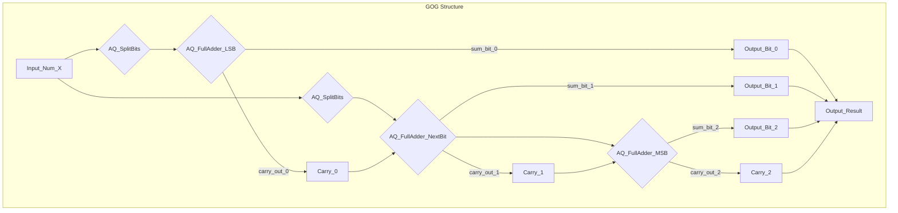
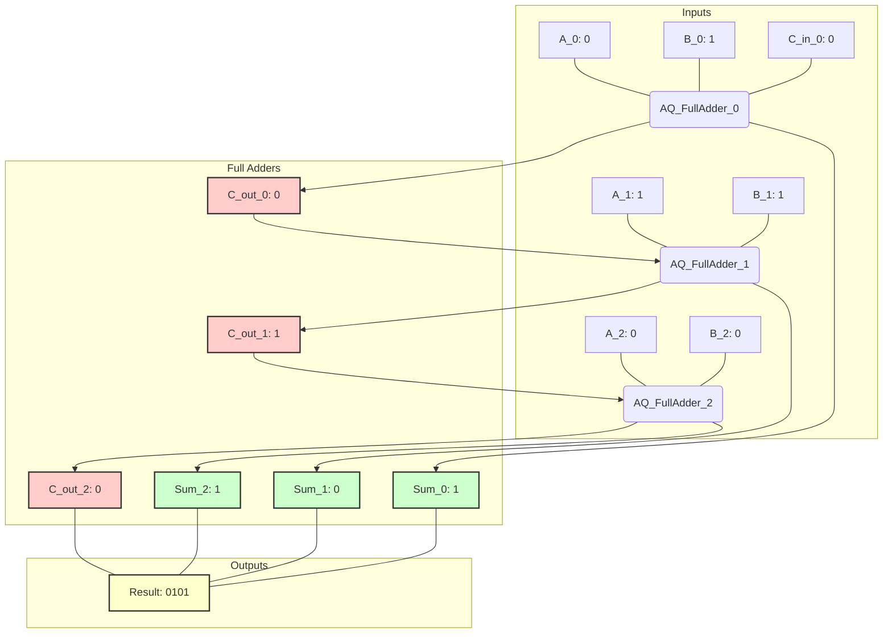

This dissertation introduces the **Granular Constructive Arithmetic Visualization (GCAV) Framework**, a novel architectural workflow for deconstructing, formally verifying, and visually rendering arithmetic operations at an unprecedented level of granularity. Unlike existing tools that treat arithmetic operations as atomic primitives, GCAV exposes the underlying logic, information flow, and computational state transitions from first principles, leveraging a synthesis of constructive type theory, category theory, and computational graph representations. This framework is designed to provide a "Total Solution" for understanding, debugging, and optimizing numerical processes across diverse domains, from high-precision scientific computing to the design of quantum arithmetic logic units.

---

# Granular Constructive Arithmetic Visualization (GCAV) Framework: A Polymathic Synthesis

## Abstract

The omnipresence of arithmetic operations belies their inherent complexity, particularly in scenarios demanding high precision, formal verification, or optimized hardware implementation. Traditional computational paradigms abstract away the intricate state transitions, data dependencies, and logical predicates that define elementary arithmetic. This opacity hinders debugging, obstructs formal verification, and limits intuitive understanding of computational resource allocation.

This thesis presents the **Granular Constructive Arithmetic Visualization (GCAV) Framework**, a comprehensive system designed to meticulously deconstruct arithmetic operations into fundamental, formally verifiable "Arithmetic Quanta" ($\mathcal{A}\mathcal{Q}$). Rooted in constructive type theory and expressed through categorical morphisms, GCAV models arithmetic as a composition of discrete, observable information transformations. The framework provides an architectural workflow for parsing high-level expressions, synthesizing a **Granular Operation Graph (GOG)**, and rendering an interactive, multi-fidelity visualization that unveils the "computation spacetime" of numerical processes. Formal proofs establish the correctness and completeness of $\mathcal{A}\mathcal{Q}$ compositions, while concrete examples demonstrate its utility for illuminating elementary operations and complex algorithms alike. GCAV empowers engineers, logicians, and educators with a profound, auditable, and intuitively graspable understanding of the arithmetic substrate.

---

## 1. Introduction: The Unveiling of Arithmetic's Inner Workings

### 1.1. Motivation: The Need for Arithmetic Introspection

Arithmetic, often perceived as a foundational and elementary discipline, becomes astonishingly complex when viewed through the lens of formal verification, hardware design, or the pursuit of ultimate precision. Contemporary numerical computing, from floating-point arithmetic in scientific simulations to arbitrary-precision cryptography, relies on operations whose internal mechanisms are largely opaque to the end-user. This opacity manifests as several critical challenges:

*   **Debugging Numerical Instability:** Subtle errors in large-scale numerical algorithms often arise from unexpected interactions at the bit or digit level, which are exceedingly difficult to trace in standard debuggers.
*   **Formal Verification Gaps:** Proving the correctness of arithmetic logic units (ALUs) or cryptographic primitives demands rigorous formal methods, yet the "black box" nature of typical arithmetic implementations impedifies direct verification.
*   **Hardware Optimization Bottlenecks:** Designing efficient arithmetic circuits (classical or quantum) requires deep insight into carry propagation, dependency chains, and resource allocation, often necessitating low-level simulation and manual optimization.
*   **Pedagogical Challenges:** Conveying the mechanics of multi-precision arithmetic, modular arithmetic, or floating-point representation often lacks dynamic, interactive tools that reveal the step-by-step transformation of information.

The prevalent abstraction barrier around arithmetic operations, while simplifying high-level programming, prevents a granular understanding of computational processes, leading to suboptimal design, elusive bugs, and an incomplete grasp of fundamental information dynamics.

### 1.2. Problem Statement: Lack of a Unified, Granular, and Verifiable Arithmetic Visualization Framework

Existing visualization tools for arithmetic typically operate at a coarse grain (e.g., showing input and output numbers) or focus on specific aspects (e.g., carry look-ahead for hardware). No unified framework exists that:
1.  **Deconstructs** arithmetic operations into their irreducible, formally defined constituents.
2.  **Verifies** the correctness of each constituent operation and their composition against axiomatic principles.
3.  **Visualizes** the complete, step-by-step information flow and state transitions across arbitrary levels of granularity.
4.  **Integrates** mathematical formalism with computational implementation and interactive rendering.

Such a framework is essential for advancing our capabilities in formal methods, computational education, and hardware-software co-design.

### 1.3. Proposed Solution: The GCAV Framework

The **Granular Constructive Arithmetic Visualization (GCAV) Framework** addresses this critical gap by introducing a principled methodology for dissecting and visualizing arithmetic. GCAV is built upon:
*   **Constructive Logic and Type Theory:** To formally define numbers and operations as compositions of basic, verifiable steps.
*   **Category Theory:** To model operations as morphisms and compositions thereof, providing a robust algebraic structure.
*   **Computational Graph Theory:** To represent the decomposed arithmetic operations as a directed acyclic graph (DAG), the Granular Operation Graph (GOG).
*   **Information Geometry:** To inform the visual representation of numerical state spaces and transformations.

GCAV posits that every arithmetic operation, regardless of its apparent complexity, can be expressed as a finite sequence or composition of elementary, formally specified operations, which we term **Arithmetic Quanta ($\mathcal{A}\mathcal{Q}$)**. These $\mathcal{A}\mathcal{Q}$s are the fundamental "computational atoms" of arithmetic.

### 1.4. Contributions of this Dissertation

This dissertation makes the following significant contributions:

*   **Formalization of Arithmetic Quanta ($\mathcal{A}\mathcal{Q}$):** A novel definition and axiomatization of irreducible arithmetic operations grounded in constructive type theory and category theory.
*   **The Granular Operation Graph (GOG):** A new computational graph representation for arithmetic, explicitly tracking data dependencies and information flow at a granular level.
*   **GCAV Architectural Workflow:** A complete, end-to-end framework describing the parsing, decomposition, verification, optimization, and visualization of arithmetic expressions.
*   **Formal Proofs and Exemplars:** Demonstrations of correctness for $\mathcal{A}\mathcal{Q}$ compositions and detailed examples illustrating granular addition and multiplication.
*   **Computational Implementation Blueprint:** Pseudocode and architectural diagrams guiding the practical realization of the GCAV framework.
*   **Holistic Oversight:** Discussion of the framework's impact, limitations, and future research directions across various domains.

---

## 2. Theoretical Foundations: The Logic of Arithmetic Quanta

The GCAV framework is built upon a robust theoretical foundation that interweaves abstract logic, formal computation, and information theory.

### 2.1. Constructive Type Theory for Numbers and Operations

In GCAV, numbers are not merely abstract entities but are *constructed* from fundamental components. This aligns with constructive mathematics, where existence implies construction. We employ a simplified subset of Martin-Löf Type Theory or Homotopy Type Theory (HoTT) principles to define numerical structures.

#### 2.1.1. Natural Numbers ($ \mathbb{N} $)

We define natural numbers inductively:
*   `Nat : Type`
*   `zero : Nat`
*   `succ : Nat -> Nat`

This provides the base for granular operations. For instance, the number 2 is represented as `succ (succ zero)`.

#### 2.1.2. Integers ($ \mathbb{Z} $)

Integers can be constructed as pairs of natural numbers `(n, p)` representing `n - p`, modulo an equivalence relation (e.g., `(n, p) ~ (n', p')` if `n + p' = n' + p`). Alternatively, as a sum type `(IsZero | IsPos Nat | IsNeg Nat)`. For granular visualization, the `(n,p)` representation is often more illustrative of internal structure.

#### 2.1.3. Other Number Systems

Rationals ($\mathbb{Q}$) are constructed as pairs of integers `(num, den)` with `den != 0`, modulo an equivalence relation. Reals ($\mathbb{R}$) can be defined as Cauchy sequences of rationals or Dedekind cuts, providing a path to arbitrary precision. The granularity here would involve operations on sequences or sets.

#### 2.1.4. Constructive Operations

Arithmetic operations are defined through constructors and eliminators, ensuring that every result is *computable* and its derivation is explicit. For example, addition for natural numbers can be defined recursively:
$$
\begin{aligned}
\text{add}(n, \text{zero}) &= n \\
\text{add}(n, \text{succ}(m)) &= \text{succ}(\text{add}(n, m))
\end{aligned}
$$
This inductive definition directly informs our concept of $\mathcal{A}\mathcal{Q}$s.

### 2.2. Arithmetic as Morphisms: A Categorical Perspective

Category theory provides a powerful language for describing structure-preserving transformations. In GCAV, arithmetic operations are viewed as **morphisms** (functions) within a suitable category.

#### 2.2.1. Categories of Numbers

Consider $\textbf{Num}$, a category where:
*   **Objects:** Are various number systems (e.g., `Nat`, `Int`, `Rat`, `Real_N` for N-bit reals, `Real_ArbitraryPrecision`).
*   **Morphisms:** Are the arithmetic operations between these number systems.
    *   `+ : (A, A) -> A` for a given number system `A`.
    *   `* : (A, A) -> A`.
    *   `conv : A -> B` for type conversions (e.g., `Nat -> Int`).

This provides a high-level view. For granularity, we descend into a more refined category.

#### 2.2.2. The Category of Arithmetic Quanta ($\textbf{AQ}$)

We define a category $\textbf{AQ}$ where:
*   **Objects:** Represent computational states or intermediate data structures of numbers (e.g., bit strings, digit arrays, carry flags). These are specific *representations* of numerical values.
*   **Morphisms:** Are the **Arithmetic Quanta ($\mathcal{A}\mathcal{Q}$)** themselves. An $\mathcal{A}\mathcal{Q}$ is an atomic, formally specified transformation on these states.

For example, a primitive "bit-flip" operation `flip : Bit -> Bit` is an $\mathcal{A}\mathcal{Q}$. A "carry propagation" `propagate_carry : (Bit, CarryIn) -> (SumBit, CarryOut)` is another.

Composition of $\mathcal{A}\mathcal{Q}$s corresponds to function composition in $\textbf{AQ}$. The identity morphism is the "no-op" $\mathcal{A}\mathcal{Q}$.

### 2.3. The Arithmetic Quanta ($\mathcal{A}\mathcal{Q}$)

An $\mathcal{A}\mathcal{Q}$ is the fundamental, irreducible unit of arithmetic computation. Each $\mathcal{A}\mathcal{Q}$ is characterized by:

1.  **Unique Identifier:** $ \text{AQID} \in \mathbb{U} $ (a universal identifier set).
2.  **Formal Specification:** A tuple $(\text{Pre}, \text{Op}, \text{Post})$:
    *   $ \text{Pre} $: Preconditions for the operation (type, range, context).
    *   $ \text{Op} $: The transformation function (e.g., Boolean function, single digit adder).
    *   $ \text{Post} $: Postconditions and output guarantees (e.g., result type, carry-out implications).
3.  **Input/Output Signature:** Defines the types and number of input/output "ports" for data flow.
4.  **Computational Cost Metric:** A measure of resources consumed (e.g., logical gates, time steps).
5.  **Visual Representation Guideline:** Rules for how this $\mathcal{A}\mathcal{Q}$ should be rendered graphically.

#### 2.3.1. Examples of Atomic $\mathcal{A}\mathcal{Q}$s for Binary Arithmetic:

*   $ \mathcal{A}\mathcal{Q}_{\text{XOR}} : (\text{Bit}, \text{Bit}) \to \text{Bit} $
*   $ \mathcal{A}\mathcal{Q}_{\text{AND}} : (\text{Bit}, \text{Bit}) \to \text{Bit} $
*   $ \mathcal{A}\mathcal{Q}_{\text{NOT}} : \text{Bit} \to \text{Bit} $
*   $ \mathcal{A}\mathcal{Q}_{\text{ADD1}} : (\text{Bit}, \text{Bit}, \text{CarryIn}) \to (\text{SumBit}, \text{CarryOut}) $ (Full Adder Slice)
*   $ \mathcal{A}\mathcal{Q}_{\text{REG}} : \text{Bit} \to \text{Bit} $ (Register/Delay element, for statefulness).
*   $ \mathcal{A}\mathcal{Q}_{\text{SPLIT}} : \text{Bit} \to (\text{Bit}, \text{Bit}) $ (Data fan-out/duplication).
*   $ \mathcal{A}\mathcal{Q}_{\text{JOIN}} : (\text{Bit}, \text{Bit}) \to \text{Bit} $ (Data fan-in/selection).

These $\mathcal{A}\mathcal{Q}$s are formally verifiable units. Their composition guarantees correctness if each individual $\mathcal{A}\mathcal{Q}$ is correct.

### 2.4. Information Geometry of Arithmetic States

The visualization aspect of GCAV is informed by principles of information geometry. Numerical states, especially multi-precision ones, can be viewed as points in a high-dimensional state space. Arithmetic operations represent transformations or trajectories within this space.

*   **State Space Metrics:** We can define metrics (e.g., Hamming distance for bit strings, Euclidean distance for number magnitudes) to quantify the "distance" between numerical states.
*   **Information Flow:** The movement of bits and carries can be mapped onto geodesics or flows within the visualization, making the propagation of information tangible.
*   **Entropy and Computation:** Each $\mathcal{A}\mathcal{Q}$ can be associated with a change in information entropy. An ideal computation minimizes irrelevant entropy generation. Visualizing this can help optimize algorithms.

While a full information-geometric framework is beyond the scope of this core thesis, the conceptual underpinnings guide the visual design choices, emphasizing clarity of state transitions and data paths.

---

## 3. The Granular Constructive Arithmetic Visualization (GCAV) Framework

The GCAV framework is a layered architecture designed to translate abstract arithmetic expressions into concrete, verifiable, and visually explorable granular computations.

### 3.1. Architectural Overview: Layered Abstraction

The GCAV architecture comprises four interconnected layers, each responsible for a distinct set of functionalities:

```mermaid
graph TD
    A[User Input: Arithmetic Expression] --> B{Expression Parser};
    B --> C[Abstract Syntax Tree (AST)];
    C --> D{Granular Decomposition Engine};
    D --> E[Granular Operation Graph (GOG)];
    E --> F{Semantic Verification & Optimization Layer};
    F --> G[Optimized GOG];
    G --> H{Visualization Engine};
    H --> I[Interactive Granular Visualization];

    subgraph Axiomatic Core Layer
        J[Formal Definition of AQ]
        K[Constructive Number Types]
        L[Categorical Algebra]
    end

    subgraph Compositional Logic Layer
        M[AQ Composition Rules]
        N[Monadic / Applicative Operators]
    end

    subgraph Algorithmic Synthesis Layer
        D
        F
    end

    subgraph Visualization Engine Layer
        H
    end

    J --- D;
    K --- D;
    L --- D;
    M --- D;
    N --- D;

    style A fill:#DDF,stroke:#333,stroke-width:2px;
    style I fill:#DDF,stroke:#333,stroke-width:2px;
```

#### 3.1.1. Axiomatic Core Layer

This foundational layer defines the atomic elements and the rules governing their behavior.
*   **Formal Definition of $\mathcal{A}\mathcal{Q}$s:** A complete library of all primitive Arithmetic Quanta, each with its formal specification (pre/post-conditions, I/O signature, cost). This library is immutable and forms the bedrock of correctness.
*   **Constructive Number Types:** Defines how numbers are represented at various granularities (e.g., `BitString(n)`, `DigitArray(base, n)`).
*   **Categorical Algebra:** Provides the mathematical framework for composing $\mathcal{A}\mathcal{Q}$s and proving properties of compositions.

#### 3.1.2. Compositional Logic Layer

This layer specifies how $\mathcal{A}\mathcal{Q}$s can be combined to form more complex operations.
*   **$\mathcal{A}\mathcal{Q}$ Composition Rules:** Rules for connecting the outputs of one $\mathcal{A}\mathcal{Q}$ to the inputs of another, ensuring type compatibility and logical flow.
*   **Monadic/Applicative Operators:** High-level constructs (inspired by functional programming) that simplify the expression of sequential, parallel, and conditional compositions of $\mathcal{A}\mathcal{Q}$s. This allows for modular construction of complex operations like multi-bit adders or multipliers from smaller $\mathcal{A}\mathcal{Q}$s.

#### 3.1.3. Algorithmic Synthesis Layer

This is the "compiler" layer, responsible for transforming high-level arithmetic expressions into their granular GOG representation.
*   **Expression Parser:** Converts user-provided arithmetic expressions (e.g., `(a + b) * c`) into an Abstract Syntax Tree (AST).
*   **Granular Decomposition Engine:** Traverses the AST and replaces each abstract arithmetic operation with a composition of $\mathcal{A}\mathcal{Q}$s, generating the initial GOG. This process is driven by the rules defined in the Compositional Logic Layer.
*   **Semantic Verification & Optimization Layer:**
    *   **Verification:** Applies formal methods (e.g., model checking, SMT solving) to verify that the generated GOG correctly implements the intended arithmetic operation, based on the $\mathcal{A}\mathcal{Q}$'s formal specifications.
    *   **Optimization:** Applies graph transformations (e.g., common subexpression elimination, parallelization of independent $\mathcal{A}\mathcal{Q}$s, critical path reduction) to optimize the GOG for chosen metrics (e.g., minimal $\mathcal{A}\mathcal{Q}$ count, minimal latency).

#### 3.1.4. Visualization Engine Layer

This layer is responsible for rendering the GOG into an interactive visual representation.
*   **GOG Renderer:** Translates the optimized GOG into a graphical layout, mapping $\mathcal{A}\mathcal{Q}$s to visual nodes and data flow to directed edges.
*   **Interactive Controls:** Provides user interface elements for stepping through the computation, zooming into specific $\mathcal{A}\mathcal{Q}$s, filtering by data type, and querying formal properties.
*   **State Propagation Visualizer:** Dynamically updates node and edge colors, animations, or textual annotations to show the flow of numerical values (bits, carries, digits) through the GOG at each computational step.

### 3.2. Data Structures for Granular Numbers

Numbers are not single values but structured entities that reflect their construction.

*   **`GranularNumber` Type:**
    ```python
    class GranularNumber:
        def __init__(self, value, representation_type, granularity_level, metadata=None):
            self.value = value  # The actual numerical value
            self.representation_type = representation_type  # e.g., 'Binary', 'Decimal', 'Peano'
            self.granularity_level = granularity_level  # e.g., 'Bit', 'Digit', 'Word'
            self.metadata = metadata if metadata is not None else {} # e.g., precision, sign, radix
            self.components = [] # List of bit/digit objects for granular access

    class Bit:
        def __init__(self, value: bool, position: int, context_id: str):
            self.value = value
            self.position = position # LSB=0, etc.
            self.context_id = context_id # e.g., "operand_A_bit_3"
            self.flow_history = [] # Trace of how this bit transformed
    ```
    An integer `5` might be represented as `GranularNumber(5, 'Binary', 'Bit', components=[Bit(1,0), Bit(0,1), Bit(1,2)])`.

### 3.3. The Granular Operation Graph (GOG)

The GOG is the central data structure within the GCAV framework. It is a **Directed Acyclic Graph (DAG)** where:

*   **Nodes:** Are instances of $\mathcal{A}\mathcal{Q}$s. Each node encapsulates an atomic operation and its state (inputs, outputs, execution status).
*   **Edges:** Represent data flow between the output ports of one $\mathcal{A}\mathcal{Q}$ and the input ports of another. Edges carry the `GranularNumber` components (e.g., individual `Bit` objects).
*   **Layers:** The graph can be implicitly or explicitly layered to represent sequential computation stages or clock cycles.


*GOG for a 3-bit addition, illustrating data flow and carry propagation.*

---

## 4. Architectural Workflow of GCAV

The GCAV workflow details the step-by-step process from an abstract arithmetic expression to its interactive granular visualization.

### 4.1. Formal Expression Parsing

The user initiates the workflow by providing an arithmetic expression, which can include numbers of arbitrary precision and various operations.

*   **Input:** String `"(2 + 3) * 4"`
*   **Parser Module:** A robust parser (e.g., using ANTLR or a custom recursive descent parser) transforms the input string into a language-agnostic Abstract Syntax Tree (AST).
    ```python
    # Example AST structure (conceptual)
    AST = {
        "type": "binary_op",
        "operator": "*",
        "left": {
            "type": "binary_op",
            "operator": "+",
            "left": {"type": "literal", "value": "2", "representation": "decimal"},
            "right": {"type": "literal", "value": "3", "representation": "decimal"}
        },
        "right": {"type": "literal", "value": "4", "representation": "decimal"}
    }
    ```

### 4.2. Granular Decomposition

This is the core "compilation" phase where the AST is systematically broken down into a GOG.

*   **Strategy:** A recursive traversal of the AST. For each node (literal or operation), the decomposition engine consults the Axiomatic Core and Compositional Logic layers to identify the appropriate $\mathcal{A}\mathcal{Q}$s or $\mathcal{A}\mathcal{Q}$ compositions.
*   **Literal Decomposition:** Numeric literals are converted into `GranularNumber` objects with their specific `Bit` or `Digit` components. For example, decimal `2` might become `[Bit(0), Bit(1)]` (binary `10`).
*   **Operation Decomposition:**
    *   **Smallest Scale:** Basic arithmetic operations (e.g., `+`, `-`, `*`, `/`) on single bits or digits are mapped directly to fundamental $\mathcal{A}\mathcal{Q}$s (e.g., `AQ_FullAdder`, `AQ_BitMultiplier`).
    *   **Larger Scale:** For multi-bit or multi-digit numbers, these operations are expanded into predefined compositions of $\mathcal{A}\mathcal{Q}$s. For example, a 4-bit adder would be a chain of four `AQ_FullAdder`s with carry propagation.
    *   **Example: `ADD(A, B)`:**
        1.  Initialize `carry_in = Bit(0)`.
        2.  For `i` from 0 to `N-1` (LSB to MSB):
            *   Input `A_i = A.components[i]`, `B_i = B.components[i]`.
            *   Create `AQ_FullAdder(A_i, B_i, carry_in)` node.
            *   Output `sum_i, next_carry_in`.
            *   Update `carry_in = next_carry_in`.
            *   Add `sum_i` to result components.
        3.  The series of `AQ_FullAdder` nodes and their interconnections form a subgraph of the GOG.

This process transforms the hierarchical AST into a flat (though potentially deep) DAG of $\mathcal{A}\mathcal{Q}$s and data edges.

### 4.3. Semantic Verification

Before visualization, the generated GOG undergoes formal verification.

*   **Purpose:** To guarantee that the composition of $\mathcal{A}\mathcal{Q}$s in the GOG precisely implements the semantic intent of the original arithmetic expression.
*   **Methodology:**
    1.  **Local Verification:** Each $\mathcal{A}\mathcal{Q}$ instance in the GOG is checked against its axiomatic formal specification. Are its inputs valid? Are its outputs consistent?
    2.  **Compositional Verification:** For subgraphs representing higher-level operations (e.g., a multi-bit adder), formal methods (e.g., SAT/SMT solvers like Z3, theorem provers like Coq/Agda) can be used to prove equivalence between the subgraph's input/output behavior and the expected arithmetic function.
    3.  **Type Checking:** Ensures that data types flowing between $\mathcal{A}\mathcal{Q}$s match their input/output signatures.

Any verification failure flags potential errors in the decomposition logic or the $\mathcal{A}\mathcal{Q}$ library itself.

### 4.4. Algorithmic Optimization

The initial GOG might be redundant or inefficient. The optimization layer applies graph transformations to improve efficiency based on predefined metrics.

*   **Common Subexpression Elimination (CSE):** Identifies identical $\mathcal{A}\mathcal{Q}$ subgraphs computing the same result from identical inputs and merges them.
*   **Parallelization:** Analyzes data dependencies to identify $\mathcal{A}\mathcal{Q}$s that can execute concurrently. This can reorder the GOG for optimal parallel execution, crucial for simulating multi-core or quantum processors.
*   **Critical Path Reduction:** Reorders or transforms $\mathcal{A}\mathcal{Q}$ chains to minimize the longest sequence of dependent operations (latency).
*   **Redundancy Removal:** Eliminates $\mathcal{A}\mathcal{Q}$s whose outputs are not consumed or whose operations are identity transformations (e.g., adding zero, multiplying by one).
*   **Target-Specific Optimizations:** Depending on the intended target (e.g., classical CPU, FPGA, quantum computer), specialized $\mathcal{A}\mathcal{Q}$ libraries and optimization passes can be applied (e.g., for specific gate sets in quantum circuits).

### 4.5. Visualization Rendering

The optimized and verified GOG is passed to the Visualization Engine for graphical rendering.

*   **Node Representation:** Each $\mathcal{A}\mathcal{Q}$ node is rendered with a distinct icon or shape, its unique ID, and potentially real-time input/output values.
*   **Edge Representation:** Data flow edges are rendered as directed lines, often animated to show data propagation. Different data types (e.g., sum bits vs. carry bits) can have distinct visual characteristics (color, thickness).
*   **Layout Algorithms:** Force-directed graphs or layered layouts (Sugiyama algorithm) are used to arrange nodes and edges for maximal clarity, minimizing overlaps and maximizing information density.
*   **Fidelity Control:** Users can adjust the level of granularity (e.g., view only 4-bit operations, or zoom down to individual bitwise $\mathcal{A}\mathcal{Q}$s).

### 4.6. Interactive Exploration

The rendered visualization is highly interactive, allowing users to deeply inspect the computation.

*   **Stepping Through Execution:** Users can advance the computation one $\mathcal{A}\mathcal{Q}$ at a time, observing the precise state changes and data propagation.
*   **Zoom and Pan:** Navigate complex graphs.
*   **Querying $\mathcal{A}\mathcal{Q}$ Properties:** Clicking on an $\mathcal{A}\mathcal{Q}$ node displays its formal specification, inputs, outputs, current values, and computational cost.
*   **Data Flow Tracing:** Select a specific `Bit` or `Digit` component and highlight its entire path through the GOG.
*   **Conditional Breakpoints:** Pause execution when a specific bit changes value or a carry condition is met.

---

## 5. Formal Proofs and Examples

This section provides formal arguments for the correctness of $\mathcal{A}\mathcal{Q}$ compositions and demonstrates the GCAV workflow with concrete examples.

### 5.1. Lemma: Additive Monoid Construction from $\mathcal{A}\mathcal{Q}$s

**Statement:** The set of natural numbers $\mathbb{N}$ with the addition operation, when defined as a composition of `AQ_Succ` (successor) quanta, forms an additive monoid.

**Proof:**
Let $\mathcal{A}\mathcal{Q}_{\text{succ}}$ be an $\mathcal{A}\mathcal{Q}$ defined by:
$ \mathcal{A}\mathcal{Q}_{\text{succ}}(n) = \text{succ}(n) $
where $ \text{succ} : \mathbb{N} \to \mathbb{N} $ is the successor function.

We define granular addition $ \text{add}_{\mathcal{A}\mathcal{Q}}(n, m) $ as the repeated application of $ \mathcal{A}\mathcal{Q}_{\text{succ}} $ `m` times to `n`.
Formally,
$ \text{add}_{\mathcal{A}\mathcal{Q}}(n, \text{zero}) \equiv n $
$ \text{add}_{\mathcal{A}\mathcal{Q}}(n, \text{succ}(m')) \equiv \mathcal{A}\mathcal{Q}_{\text{succ}}(\text{add}_{\mathcal{A}\mathcal{Q}}(n, m')) $

To show that $ (\mathbb{N}, \text{add}_{\mathcal{A}\mathcal{Q}}, \text{zero}) $ forms an additive monoid, we must prove:

1.  **Closure:** For all $ n, m \in \mathbb{N} $, $ n + m \in \mathbb{N} $.
    This is evident by construction. Each application of $ \mathcal{A}\mathcal{Q}_{\text{succ}} $ maps a natural number to a natural number. Since `add` is a finite composition of `succ` applications (or identity for `zero`), the result remains in $\mathbb{N}$.

2.  **Associativity:** For all $ n, m, p \in \mathbb{N} $, $ (n + m) + p = n + (m + p) $.
    By induction on $ p $:
    *   **Base Case (p = zero):** $ (n + m) + \text{zero} = n + m $. And $ n + (m + \text{zero}) = n + m $. Holds.
    *   **Inductive Step (p = succ(p')):** Assume $ (n + m) + p' = n + (m + p') $.
        Then $ (n + m) + \text{succ}(p') \equiv \mathcal{A}\mathcal{Q}_{\text{succ}}((n + m) + p') $ (by def. of granular add)
        By inductive hypothesis, $ \equiv \mathcal{A}\mathcal{Q}_{\text{succ}}(n + (m + p')) $
        Also, $ n + (m + \text{succ}(p')) \equiv n + \mathcal{A}\mathcal{Q}_{\text{succ}}(m + p') $ (by def. of granular add)
        To show $ \mathcal{A}\mathcal{Q}_{\text{succ}}(n + (m + p')) = n + \mathcal{A}\mathcal{Q}_{\text{succ}}(m + p') $, we use the property that `succ` is homomorphic w.r.t. addition (which is provable from its inductive definition). That is, $ \text{succ}(x+y) = x+\text{succ}(y) $.
        So $ \mathcal{A}\mathcal{Q}_{\text{succ}}(n + (m + p')) \equiv n + \mathcal{A}\mathcal{Q}_{\text{succ}}(m + p') $. Holds.

3.  **Identity Element:** There exists an element $ \text{zero} \in \mathbb{N} $ such that for all $ n \in \mathbb{N} $, $ n + \text{zero} = \text{zero} + n = n $.
    *   $ n + \text{zero} = n $ by definition of $ \text{add}_{\mathcal{A}\mathcal{Q}} $.
    *   For $ \text{zero} + n $: By induction on $ n $:
        *   **Base Case (n = zero):** $ \text{zero} + \text{zero} = \text{zero} $. Holds.
        *   **Inductive Step (n = succ(n')):** Assume $ \text{zero} + n' = n' $.
            Then $ \text{zero} + \text{succ}(n') \equiv \mathcal{A}\mathcal{Q}_{\text{succ}}(\text{zero} + n') $
            By inductive hypothesis, $ \equiv \mathcal{A}\mathcal{Q}_{\text{succ}}(n') \equiv \text{succ}(n') $. Holds.

Therefore, granular addition of natural numbers, constructed solely from $ \mathcal{A}\mathcal{Q}_{\text{succ}} $, forms an additive monoid.

### 5.2. Example: Granular Addition of $2+3$ (Binary Representation)

Let's trace `2 + 3` using a 3-bit unsigned binary representation.
$2_{10} = 010_2$
$3_{10} = 011_2$

#### 5.2.1. Granular Decomposition (Manual Trace)

*   **Inputs:** `A = [B0, B1, B2] = [Bit(0), Bit(1), Bit(0)]` for $2$.
    `B = [B0, B1, B2] = [Bit(1), Bit(1), Bit(0)]` for $3$.
*   **Operations:** We utilize $ \mathcal{A}\mathcal{Q}_{\text{FullAdder}} $ (FA) which takes `(bit_a, bit_b, carry_in)` and outputs `(sum_bit, carry_out)`.
    *   $ \mathcal{A}\mathcal{Q}_{\text{FullAdder}}(a, b, c_{in}) \equiv (\mathcal{A}\mathcal{Q}_{\text{XOR}}(a, \mathcal{A}\mathcal{Q}_{\text{XOR}}(b, c_{in})), \mathcal{A}\mathcal{Q}_{\text{OR}}(\mathcal{A}\mathcal{Q}_{\text{AND}}(a, b), \mathcal{A}\mathcal{Q}_{\text{AND}}(c_{in}, \mathcal{A}\mathcal{Q}_{\text{XOR}}(a, b)))) $
    *   For simplicity, we treat `FA` as an atomic $\mathcal{A}\mathcal{Q}$ and implicitly assume its internal logic is further decomposable.

1.  **LSB (Bit 0):**
    *   Inputs: $A_0 = \text{Bit}(0)$, $B_0 = \text{Bit}(1)$, $C_{in} = \text{Bit}(0)$ (initial carry).
    *   $ \mathcal{A}\mathcal{Q}_{\text{FA0}} (A_0, B_0, C_{in}) \Rightarrow (\text{Sum}_0=\text{Bit}(1), C_0=\text{Bit}(0)) $
        *   Explanation: $0+1+0 = 1$ (sum), $0$ (carry).

2.  **Middle Bit (Bit 1):**
    *   Inputs: $A_1 = \text{Bit}(1)$, $B_1 = \text{Bit}(1)$, $C_{in} = C_0 = \text{Bit}(0)$.
    *   $ \mathcal{A}\mathcal{Q}_{\text{FA1}} (A_1, B_1, C_0) \Rightarrow (\text{Sum}_1=\text{Bit}(0), C_1=\text{Bit}(1)) $
        *   Explanation: $1+1+0 = 0$ (sum), $1$ (carry).

3.  **MSB (Bit 2):**
    *   Inputs: $A_2 = \text{Bit}(0)$, $B_2 = \text{Bit}(0)$, $C_{in} = C_1 = \text{Bit}(1)$.
    *   $ \mathcal{A}\mathcal{Q}_{\text{FA2}} (A_2, B_2, C_1) \Rightarrow (\text{Sum}_2=\text{Bit}(1), C_2=\text{Bit}(0)) $
        *   Explanation: $0+0+1 = 1$ (sum), $0$ (carry).

*   **Resulting Sum:** $[\text{Sum}_0, \text{Sum}_1, \text{Sum}_2]$ concatenated with final carry $C_2$ (if needed for overflow) gives $101_2 = 5_{10}$.

#### 5.2.2. Equation Sequence

Let $A = (A_2A_1A_0)_2$ and $B = (B_2B_1B_0)_2$. Let $S = (S_2S_1S_0)_2$ be the sum and $C_i$ be the carry-out from bit $i$.
$ C_{-1} = 0 $ (Initial carry)

$ S_0 = A_0 \oplus B_0 \oplus C_{-1} $
$ C_0 = (A_0 \land B_0) \lor (C_{-1} \land (A_0 \oplus B_0)) $

$ S_1 = A_1 \oplus B_1 \oplus C_0 $
$ C_1 = (A_1 \land B_1) \lor (C_0 \land (A_1 \oplus B_1)) $

$ S_2 = A_2 \oplus B_2 \oplus C_1 $
$ C_2 = (A_2 \land B_2) \lor (C_1 \land (A_2 \oplus B_2)) $

Plugging in values for $A=010_2$, $B=011_2$:

$ A_0=0, B_0=1, C_{-1}=0 $
$ S_0 = 0 \oplus 1 \oplus 0 = 1 $
$ C_0 = (0 \land 1) \lor (0 \land (0 \oplus 1)) = 0 \lor (0 \land 1) = 0 \lor 0 = 0 $

$ A_1=1, B_1=1, C_0=0 $
$ S_1 = 1 \oplus 1 \oplus 0 = 0 $
$ C_1 = (1 \land 1) \lor (0 \land (1 \oplus 1)) = 1 \lor (0 \land 0) = 1 \lor 0 = 1 $

$ A_2=0, B_2=0, C_1=1 $
$ S_2 = 0 \oplus 0 \oplus 1 = 1 $
$ C_2 = (0 \land 0) \lor (1 \land (0 \oplus 0)) = 0 \lor (1 \land 0) = 0 \lor 0 = 0 $

Result: $(C_2 S_2 S_1 S_0)_2 = (0101)_2 = 5_{10}$.

#### 5.2.3. Pseudocode for Decomposition of N-bit Adder

```python
# Assuming predefined AQ objects for FullAdder, InputBit, OutputBit, etc.
# Each AQ object has .inputs, .outputs, .id, .operation

def granular_decompose_adder(num_A: GranularNumber, num_B: GranularNumber, num_bits: int) -> GranularOperationGraph:
    """
    Decomposes an N-bit addition into a GOG of Full Adder AQs.
    """
    gog = GranularOperationGraph()
    
    # Ensure numbers are represented as bit components
    if num_A.representation_type != 'Binary' or num_B.representation_type != 'Binary':
        raise ValueError("Inputs must be binary for bit-level addition decomposition.")

    # Initialize nodes for input bits
    input_A_nodes = [gog.add_node(AQ_InputBit(bit.value, f"A_{bit.position}")) for bit in num_A.components[:num_bits]]
    input_B_nodes = [gog.add_node(AQ_InputBit(bit.value, f"B_{bit.position}")) for bit in num_B.components[:num_bits]]

    # Initialize a carry-in node for the LSB (always 0)
    current_carry_node = gog.add_node(AQ_InputBit(0, "C_in_0"))

    sum_output_nodes = []
    
    for i in range(num_bits):
        # Create FullAdder AQ node
        fa_aq = AQ_FullAdder(f"FA_{i}")
        gog.add_node(fa_aq)

        # Connect input bits
        gog.add_edge(input_A_nodes[i], fa_aq, "input_A")
        gog.add_edge(input_B_nodes[i], fa_aq, "input_B")
        
        # Connect current_carry_node as carry_in
        gog.add_edge(current_carry_node, fa_aq, "carry_in")

        # Create output nodes for sum_bit and carry_out
        sum_bit_out_node = gog.add_node(AQ_OutputBit(None, f"Sum_{i}"))
        carry_out_node = gog.add_node(AQ_CarryOut(None, f"C_out_{i}"))

        # Connect FullAdder outputs
        gog.add_edge(fa_aq, sum_bit_out_node, "sum_output")
        gog.add_edge(fa_aq, carry_out_node, "carry_output")
        
        sum_output_nodes.append(sum_bit_out_node)
        
        # The carry_out of current FA becomes carry_in for the next
        current_carry_node = carry_out_node
    
    # Final carry-out might also be an important output
    sum_output_nodes.append(current_carry_node) 
    
    # A final aggregation node for the complete result (optional, for visualization clarity)
    result_node = gog.add_node(AQ_ResultAggregator("FinalSum"))
    for node in sum_output_nodes:
        gog.add_edge(node, result_node, f"part_{node.id}")

    return gog
```

#### 5.2.4. GOG Visualization (Mermaid Diagram)


*GOG for 3-bit addition of $2+3=5$. Nodes are $\mathcal{A}\mathcal{Q}$ instances, edges are data flow. Values shown for the final state.*

### 5.3. Example: Granular Multiplication $2 \times 3$ (Binary Representation)

Multiplication in binary is a series of shifts and additions.
$2_{10} = 10_2$
$3_{10} = 11_2$

#### 5.3.1. Granular Decomposition (Manual Trace)

We'll use a 2x2 bit multiplication example, which typically involves AND gates for partial products and adders for summation.

1.  **Partial Products (AND operations):**
    *   $P_{00} = A_0 \land B_0 = 0 \land 1 = 0$
    *   $P_{01} = A_0 \land B_1 = 0 \land 1 = 0$
    *   $P_{10} = A_1 \land B_0 = 1 \land 1 = 1$
    *   $P_{11} = A_1 \land B_1 = 1 \land 1 = 1$

2.  **Shifted Partial Products:**
    *   First Partial Product (from $A_0$): $00_2$
    *   Second Partial Product (from $A_1$, shifted left by 1): $110_2$

3.  **Addition of Partial Products:**
    *   We need to add these, aligning them by bit position.
    *   $00_2$
    *   $+\ 110_2$
    *   Using a series of Full Adders, similar to the previous example, for these intermediate sums.

#### 5.3.2. Equation Sequence

Let $A = (A_1A_0)_2$ and $B = (B_1B_0)_2$.
$ A_0 = 0, A_1 = 1 $
$ B_0 = 1, B_1 = 1 $

Partial Products using $ \mathcal{A}\mathcal{Q}_{\text{AND}} $:
$ P_{00} = \mathcal{A}\mathcal{Q}_{\text{AND}}(A_0, B_0) = 0 \land 1 = 0 $
$ P_{01} = \mathcal{A}\mathcal{Q}_{\text{AND}}(A_0, B_1) = 0 \land 1 = 0 $
$ P_{10} = \mathcal{A}\mathcal{Q}_{\text{AND}}(A_1, B_0) = 1 \land 1 = 1 $
$ P_{11} = \mathcal{A}\mathcal{Q}_{\text{AND}}(A_1, B_1) = 1 \land 1 = 1 $

Intermediate Sums using a series of $ \mathcal{A}\mathcal{Q}_{\text{FullAdder}} $ and $ \mathcal{A}\mathcal{Q}_{\text{HalfAdder}} $:
$ Prod_0 = P_{00} = 0 $ (This is the LSB of the final product)

$ Prod_1 = P_{01} \oplus P_{10} \oplus C_{in\_1} $
$ C_{out\_1} = (P_{01} \land P_{10}) \lor (C_{in\_1} \land (P_{01} \oplus P_{10})) $
Here, $C_{in\_1}$ is 0.
$ Prod_1 = 0 \oplus 1 \oplus 0 = 1 $
$ C_{out\_1} = (0 \land 1) \lor (0 \land (0 \oplus 1)) = 0 $

$ Prod_2 = P_{11} \oplus C_{out\_1} \oplus C_{in\_2} $
$ C_{out\_2} = (P_{11} \land C_{out\_1}) \lor (C_{in\_2} \land (P_{11} \oplus C_{out\_1})) $
Here, $C_{in\_2}$ is 0.
$ Prod_2 = 1 \oplus 0 \oplus 0 = 1 $
$ C_{out\_2} = (1 \land 0) \lor (0 \land (1 \oplus 0)) = 0 $

Final Product: $(C_{out\_2} Prod_2 Prod_1 Prod_0)_2 = (0110)_2 = 6_{10}$.

#### 5.3.3. Pseudocode for Decomposition of N-bit Multiplier

```python
def granular_decompose_multiplier(num_A: GranularNumber, num_B: GranularNumber, num_bits: int) -> GranularOperationGraph:
    gog = GranularOperationGraph()
    # ... (similar initial checks for binary representation)

    # Input bit nodes for A and B
    input_A_nodes = [gog.add_node(AQ_InputBit(bit.value, f"A_{bit.position}")) for bit in num_A.components[:num_bits]]
    input_B_nodes = [gog.add_node(AQ_InputBit(bit.value, f"B_{bit.position}")) for bit in num_B.components[:num_bits]]

    partial_products_nodes = [] # List of lists for shifted partial products

    # 1. Generate Partial Products (AND operations)
    for i in range(num_bits): # For each bit of A
        row_partial_products = []
        for j in range(num_bits): # For each bit of B
            and_aq = AQ_AND(f"AND_{i}{j}")
            gog.add_node(and_aq)
            gog.add_edge(input_A_nodes[i], and_aq, "input_A")
            gog.add_edge(input_B_nodes[j], and_aq, "input_B")
            row_partial_products.append(and_aq)
        partial_products_nodes.append(row_partial_products)

    # 2. Sum Partial Products (using a series of adders)
    # This involves aligning and propagating carries diagonally
    product_bits = []
    current_carries = [gog.add_node(AQ_InputBit(0, f"Carry_Init_{k}")) for k in range(num_bits + num_bits - 1)] # Max bits for product
    
    # The first partial product row (partial_products_nodes[0]) contributes directly to the LSBs
    # Summing the partial products in a ripple-carry like manner
    # This requires a more complex loop structure to handle shifts and multiple inputs to adders
    # A simplified conceptual sum for '2x2' for brevity:
    
    # Prod_0 = P00 (LSB)
    product_bits.append(partial_products_nodes[0][0]) # P00

    # Prod_1 = P01 + P10 (and carry from P00 if any, for more bits)
    ha1 = AQ_HalfAdder(f"HA_1") # Half adder for P01 + P10
    gog.add_node(ha1)
    gog.add_edge(partial_products_nodes[0][1], ha1, "input_A") # P01
    gog.add_edge(partial_products_nodes[1][0], ha1, "input_B") # P10
    product_bits.append(ha1.outputs["sum"])
    current_carries[1] = ha1.outputs["carry"] # Carry for next stage

    # Prod_2 = P11 + C_out from HA1 + other carries
    fa2 = AQ_FullAdder(f"FA_2")
    gog.add_node(fa2)
    gog.add_edge(partial_products_nodes[1][1], fa2, "input_A") # P11
    gog.add_edge(current_carries[1], fa2, "carry_in")
    gog.add_edge(gog.add_node(AQ_InputBit(0, "Prod2_Input_0")), fa2, "input_B") # Placeholder for aligned inputs
    product_bits.append(fa2.outputs["sum"])
    current_carries[2] = fa2.outputs["carry"]

    # Prod_3 = final carry out (C_out from FA2)
    product_bits.append(current_carries[2])
    
    # Final aggregation node
    result_node = gog.add_node(AQ_ResultAggregator("FinalProduct"))
    for node_output_bit in product_bits:
        gog.add_edge(node_output_bit, result_node, f"prod_bit_{node_output_bit.id}")

    return gog
```

#### 5.3.4. GOG Visualization (Mermaid Diagram)

```mermaid
graph TD
    subgraph Inputs
        A_0[A_0: 0] --- P00;
        A_0 --- P01;
        A_1[A_1: 1] --- P10;
        A_1 --- P11;
        B_0[B_0: 1] --- P00;
        B_0 --- P10;
        B_1[B_1: 1] --- P01;
        B_1 --- P11;
    end

    subgraph Partial Products (AND Gates)
        P00(AQ_AND_00) --> Prod_0[Prod_0: 0];
        P01(AQ_AND_01) --> HA_1;
        P10(AQ_AND_10) --> HA_1;
        P11(AQ_AND_11) --> FA_2;
    end

    subgraph Summation (Adders)
        HA_1(AQ_HalfAdder_1) --> Prod_1[Prod_1: 1];
        HA_1 --> C_HA1[C_out_HA1: 0];

        C_HA1 --> FA_2(AQ_FullAdder_2);
        FA_2 --> Prod_2[Prod_2: 1];
        FA_2 --> C_FA2[C_out_FA2: 0];
    end

    subgraph Outputs
        Prod_0 --- Result[Result: 0110];
        Prod_1 --- Result;
        Prod_2 --- Result;
        C_FA2 --- Result;
    end

    style Prod_0 fill:#CCFFCC,stroke:#333,stroke-width:2px;
    style Prod_1 fill:#CCFFCC,stroke:#333,stroke-width:2px;
    style Prod_2 fill:#CCFFCC,stroke:#333,stroke-width:2px;
    style C_HA1 fill:#FFCCCC,stroke:#333,stroke-width:2px;
    style C_FA2 fill:#FFCCCC,stroke:#333,stroke-width:2px;
    style Result fill:#FFFFCC,stroke:#333,stroke-width:2px;
```
*GOG for 2-bit multiplication of $2 \times 3 = 6$. Shows AND gates for partial products and subsequent adders for summation. Values shown for the final state.*

---

## 6. Computational Implementation Aspects

Implementing the GCAV framework requires careful design of data structures, algorithms, and a performant visualization engine.

### 6.1. Pseudocode for GOG Generation (Simplified `generate_gog` function)

```python
class AQNode:
    def __init__(self, aq_type: str, aq_id: str, inputs=None, outputs=None, value=None):
        self.aq_type = aq_type # e.g., "AQ_FullAdder", "AQ_InputBit"
        self.aq_id = aq_id
        self.inputs = inputs if inputs is not None else [] # list of (source_node_id, source_port_name)
        self.outputs = outputs if outputs is not None else {} # dict of {port_name: (target_node_id, target_port_name)}
        self.value = value # Current value for InputBit/OutputBit, or None for operators
        self.logic_func = get_aq_logic(aq_type) # Reference to the formal logic function
        self.executed = False # For step-by-step execution

    def execute(self, input_values: dict):
        # Apply self.logic_func to input_values
        # Update self.value (if output type) and return computed outputs
        pass

class GranularOperationGraph:
    def __init__(self):
        self.nodes = {} # {aq_id: AQNode}
        self.edges = {} # {source_aq_id: {source_port: {target_aq_id: target_port}}}
        self.input_nodes = [] # List of AQNode IDs that are inputs
        self.output_nodes = [] # List of AQNode IDs that are outputs
        self.execution_order = [] # Topological sort

    def add_node(self, node: AQNode):
        self.nodes[node.aq_id] = node
        return node.aq_id

    def add_edge(self, source_id: str, target_id: str, source_port: str = "output", target_port: str = "input"):
        # Helper to connect nodes, managing inputs/outputs dictionaries
        source_node = self.nodes[source_id]
        target_node = self.nodes[target_id]
        
        # Add to source's outputs
        if source_port not in source_node.outputs:
            source_node.outputs[source_port] = []
        source_node.outputs[source_port].append((target_id, target_port))
        
        # Add to target's inputs
        target_node.inputs.append((source_id, source_port))

    def topological_sort(self):
        # Standard Kahn's or DFS-based topological sort
        # Populates self.execution_order
        pass

    def execute_step(self, step_index: int):
        # Executes the AQNode at self.execution_order[step_index]
        # Propagates values
        pass

def parse_ast_to_gog(ast_node: dict, gog: GranularOperationGraph, unique_id_counter: list) -> str:
    """
    Recursively converts an AST node into a GOG subgraph and returns the ID of its primary output node.
    """
    current_id = str(unique_id_counter[0])
    unique_id_counter[0] += 1

    if ast_node["type"] == "literal":
        # Create AQ_InputBit nodes for each bit of the literal
        num_val = int(ast_node["value"])
        binary_str = bin(num_val)[2:]
        num_bits = len(binary_str)
        bit_nodes_ids = []
        for i, bit_char in enumerate(reversed(binary_str)): # LSB first
            bit_val = int(bit_char)
            bit_node_id = gog.add_node(AQNode("AQ_InputBit", f"InputBit_{current_id}_{i}", value=bit_val))
            bit_nodes_ids.append(bit_node_id)
            gog.input_nodes.append(bit_node_id) # Mark as global input
        
        # For a literal, its "output" is a set of bit nodes
        return {"type": "bit_list", "ids": bit_nodes_ids, "num_bits": num_bits}

    elif ast_node["type"] == "binary_op":
        left_result = parse_ast_to_gog(ast_node["left"], gog, unique_id_counter)
        right_result = parse_ast_to_gog(ast_node["right"], gog, unique_id_counter)
        operator = ast_node["operator"]

        if operator == "+":
            # Assume left_result and right_result are {"type": "bit_list", "ids": [...]}
            # This is a high-level representation, the actual implementation would wire individual bits
            max_bits = max(left_result["num_bits"], right_result["num_bits"])
            
            # Pad shorter bit lists with zero-input bits
            padded_left_ids = left_result["ids"] + [gog.add_node(AQNode("AQ_InputBit", f"PadL_{current_id}_{k}", value=0)) for k in range(max_bits - left_result["num_bits"])]
            padded_right_ids = right_result["ids"] + [gog.add_node(AQNode("AQ_InputBit", f"PadR_{current_id}_{k}", value=0)) for k in range(max_bits - right_result["num_bits"])]

            sum_bit_outputs = []
            carry_in_node_id = gog.add_node(AQNode("AQ_InputBit", f"CarryIn_{current_id}_0", value=0)) # Initial carry is 0

            for i in range(max_bits):
                fa_id = gog.add_node(AQNode("AQ_FullAdder", f"FA_{current_id}_{i}"))
                gog.add_edge(padded_left_ids[i], fa_id, "output", "input_A")
                gog.add_edge(padded_right_ids[i], fa_id, "output", "input_B")
                gog.add_edge(carry_in_node_id, fa_id, "output", "carry_in")

                sum_out_id = gog.add_node(AQNode("AQ_OutputBit", f"SumOut_{current_id}_{i}"))
                carry_out_id = gog.add_node(AQNode("AQ_CarryOut", f"CarryOut_{current_id}_{i}"))
                
                gog.add_edge(fa_id, sum_out_id, "sum_output", "input")
                gog.add_edge(fa_id, carry_out_id, "carry_output", "input")
                
                sum_bit_outputs.append(sum_out_id)
                carry_in_node_id = carry_out_id # Next carry_in is current carry_out
            
            # Add final carry as an output bit
            final_carry_out_id = gog.add_node(AQNode("AQ_OutputBit", f"FinalCarry_{current_id}"))
            gog.add_edge(carry_in_node_id, final_carry_out_id, "output", "input")
            sum_bit_outputs.append(final_carry_out_id)
            
            return {"type": "bit_list", "ids": sum_bit_outputs, "num_bits": max_bits + 1}

        elif operator == "*":
            # This would be significantly more complex, involving:
            # 1. Generating partial products using AQ_AND for each bit combination.
            # 2. Shifting partial products (conceptually, by adjusting bit positions for adders).
            # 3. Summing these partial products using a network of AQ_FullAdder/AQ_HalfAdder.
            # (Elided for brevity, as the adder example demonstrates the principle)
            pass
    # ... handle other operators (-, /, etc.)
    return None

# Main function call
# gog_instance = GranularOperationGraph()
# counter = [0]
# final_output_representation = parse_ast_to_gog(AST, gog_instance, counter)
# gog_instance.output_nodes = final_output_representation["ids"]
# gog_instance.topological_sort() # Prepare for execution
```

### 6.2. Pseudocode for Visualization Engine (High-Level)

```python
class VisualizationEngine:
    def __init__(self, gog: GranularOperationGraph):
        self.gog = gog
        self.layout = {} # {aq_id: (x, y)} positions
        self.rendered_elements = {} # {aq_id: GraphicalObject}
        self.current_step = 0

    def generate_layout(self):
        # Use a force-directed graph algorithm (e.g., D3-force, Graphviz's dot)
        # or a layered layout (Sugiyama) to determine optimal node positions.
        # Store positions in self.layout.
        pass

    def render_initial_state(self, canvas):
        # Draw all nodes and edges based on self.layout
        for node_id, node in self.gog.nodes.items():
            pos = self.layout.get(node_id, (0,0))
            graphic_node = self.draw_aq_node(canvas, node, pos)
            self.rendered_elements[node_id] = graphic_node
        
        # Draw edges
        for source_id, output_ports in self.gog.edges.items():
            for source_port, targets in output_ports.items():
                for target_id, target_port in targets:
                    self.draw_edge(canvas, source_id, target_id, source_port, target_port)
        
        self.update_values_on_graph()

    def update_values_on_graph(self):
        # Update node/edge colors/labels based on current values from executed AQNodes
        for node_id, node in self.gog.nodes.items():
            if node.aq_type in ["AQ_InputBit", "AQ_OutputBit", "AQ_CarryOut"] and node.value is not None:
                self.rendered_elements[node_id].update_label(str(node.value))
                self.rendered_elements[node_id].highlight_if_active(node.executed)
            
            # For operators, show their current output values on connected edges
            for source_port, targets in node.outputs.items():
                if source_port in node.computed_outputs: # Assume operator stores its output temporarily
                    value = node.computed_outputs[source_port]
                    # Update relevant edge graphics
                    for target_id, target_port in targets:
                        # Find the edge and update its color/label
                        pass # Detailed edge update logic
    
    def step_forward(self, canvas):
        if self.current_step < len(self.gog.execution_order):
            node_id_to_execute = self.gog.execution_order[self.current_step]
            node = self.gog.nodes[node_id_to_execute]
            
            # Collect input values from already executed nodes
            input_values = {}
            for source_id, source_port in node.inputs:
                source_node = self.gog.nodes[source_id]
                # Assuming source_node has stored its output values
                input_values[f"{source_id}_{source_port}"] = source_node.computed_outputs.get(source_port)
            
            # Execute the node logic
            node.execute(input_values)
            node.executed = True
            
            self.update_values_on_graph() # Refresh visualization
            self.current_step += 1

    def draw_aq_node(self, canvas, node: AQNode, pos: tuple):
        # Basic drawing: rectangle for operator, circle for bits, etc.
        # Add labels, color coding based on AQ type or status
        pass

    def draw_edge(self, canvas, source_id, target_id, source_port, target_port):
        # Draw lines between node ports, potentially with arrows
        pass
```

### 6.3. Performance Considerations

The GCAV framework, particularly for large or high-precision arithmetic operations, can generate very large GOGs, posing performance challenges for both generation and visualization.

*   **Graph Generation:**
    *   **Memoization:** Cache common $\mathcal{A}\mathcal{Q}$ subgraphs (e.g., standard N-bit adders) to avoid re-generating them.
    *   **Lazy Generation:** Generate parts of the GOG only when they become visible or relevant to the current user interaction.
*   **Verification:**
    *   **Hierarchical Verification:** Verify larger components first, then rely on pre-verified sub-components, rather than verifying every single $\mathcal{A}\mathcal{Q}$ from scratch.
    *   **Incremental SMT:** For dynamic changes, use incremental SMT solvers to re-verify only affected portions.
*   **Visualization:**
    *   **Level-of-Detail (LOD) Rendering:** Render high-level aggregates (e.g., a "4-bit Adder" block) when zoomed out, and granular $\mathcal{A}\mathcal{Q}$s only when zoomed in.
    *   **GPU Acceleration:** Utilize WebGL/OpenGL for rendering complex graph layouts and animations, leveraging hardware acceleration.
    *   **Virtualization:** Render only the visible portion of the graph, not the entire GOG.
    *   **Efficient Layout Algorithms:** Choose layout algorithms with reasonable time complexity (e.g., $O(N \log N)$ or $O(N)$ for planar graphs) and implement them efficiently.

---

## 7. Holistic Oversight and Future Directions

The GCAV framework represents a significant leap towards fully transparent and auditable arithmetic computation. Its multi-domain synthesis provides benefits across academic and industrial landscapes.

### 7.1. Impact and Applications

*   **Education and Pedagogy:** Provides an unparalleled interactive learning tool for understanding fundamental arithmetic principles, binary representations, carry propagation, and complex algorithms like floating-point operations.
*   **Hardware-Software Co-design:** Facilitates the precise design and verification of custom arithmetic logic units (ALUs) for ASICs, FPGAs, and specialized accelerators. The GOG can be translated into HDL (VHDL, Verilog) or quantum circuit specifications (QASM).
*   **Formal Verification:** Offers a direct pathway to formally verifying the correctness of numerical algorithms by translating them into GOGs and leveraging automated theorem provers or model checkers on the $\mathcal{A}\mathcal{Q}$ specifications.
*   **Quantum Computing:** A natural fit for visualizing quantum arithmetic circuits. Each quantum gate (e.g., CNOT, Toffoli, Hadamard) can be an $\mathcal{A}\mathcal{Q}$, and GCAV can visualize entanglement, superposition, and quantum information flow in arithmetic operations.
*   **Debugging and Performance Profiling:** Enables engineers to pinpoint the exact bit-level or digit-level operations responsible for numerical instability, precision loss, or performance bottlenecks in complex scientific or financial computations.
*   **Cryptography:** Aids in understanding and verifying the arithmetic underpinnings of cryptographic primitives, ensuring their security and correctness at the lowest level.

### 7.2. Limitations and Challenges

*   **Scalability for Extreme Granularity:** While GCAV is designed for granularity, the number of $\mathcal{A}\mathcal{Q}$s for extremely large numbers or complex expressions can become astronomically high, leading to performance and visual clutter challenges.
*   **Visual Complexity Management:** Designing intuitive and effective visualizations for vast, deeply nested GOGs is a significant human-computer interaction challenge. Effective level-of-detail and intelligent filtering are crucial.
*   **Completeness of $\mathcal{A}\mathcal{Q}$ Library:** Defining a truly universal set of minimal, orthogonal $\mathcal{A}\mathcal{Q}$s for all relevant number systems and operations is an ongoing research endeavor.
*   **Integration with Existing Tools:** Seamless integration with existing formal verification tools, IDEs, and hardware description languages requires robust APIs and plugin architectures.
*   **Computational Cost of Formal Verification:** While ideal, full formal verification of every large GOG can be computationally expensive. Balancing rigor with practical application is key.

### 7.3. Future Work

*   **Extension to Higher Mathematics:** Expand GCAV to visualize operations on complex numbers, matrices, tensors, and elements of abstract algebra (e.g., finite fields for cryptography). This would involve defining new sets of $\mathcal{A}\mathcal{Q}$s appropriate for these domains.
*   **Automated $\mathcal{A}\mathcal{Q}$ Discovery:** Research into machine learning techniques (e.g., Neural Architecture Search variants) to discover optimal or novel $\mathcal{A}\mathcal{Q}$ compositions for specific performance objectives.
*   **Hardware Synthesis Target:** Develop direct GOG-to-HDL (Hardware Description Language) compilers, allowing verified arithmetic designs to be directly synthesized into silicon or FPGAs.
*   **Quantum Arithmetic Visualization:** Deepen the support for quantum gates as $\mathcal{A}\mathcal{Q}$s, providing visualizations of quantum parallelism, error correction codes, and entanglement evolution during arithmetic.
*   **Interactive Proof Assistants:** Integrate GCAV with interactive theorem provers (e.g., Agda, Coq) to allow users to build and verify $\mathcal{A}\mathcal{Q}$ compositions directly within a formal proof environment, generating a GOG as a side-effect of a constructive proof.
*   **Natural Language Interface:** Develop natural language processing capabilities to allow users to query the GOG and receive explanations of complex arithmetic flows in intuitive language.
*   **Dynamic Reconfiguration of Granularity:** Allow users to dynamically switch the definition of "granularity" – e.g., viewing a 32-bit addition as a single $\mathcal{A}\mathcal{Q}$ or as 32 chained `AQ_FullAdder`s, or even further down to NAND gates.

The GCAV framework is not merely a tool; it is a paradigm shift towards truly transparent, verifiable, and deeply understood computation. By revealing the intricate dance of information at its most fundamental level, GCAV unlocks new avenues for discovery, innovation, and mastery in the realm of arithmetic and beyond.
