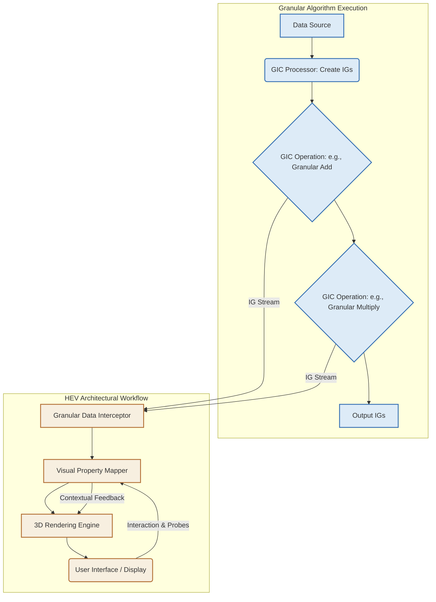

This response outlines the **Granular Information Calculus (GIC)**, a novel framework for operating on and visualizing information at an intrinsic, granular level, extending beyond traditional scalar arithmetic. It introduces the concept of an "Information Granule" ($\mathcal{I}$G) and the **Holistic Entropic Visualizer (HEV)** for its comprehensive representation.

---

# The Granular Information Calculus (GIC): A Framework for Hyper-Contextual Arithmetic and Entropic Visualization

## Abstract

Traditional computational paradigms, largely founded on scalar or interval arithmetic, inherently abstract away crucial contextual, probabilistic, and entropic information, leading to impoverished representations of complex systems. This dissertation introduces the **Granular Information Calculus (GIC)**, a novel mathematical framework operating on **Information Granules ($\mathcal{I}$G)**—composite entities encapsulating not only a central value but also its inherent uncertainty, information entropy, causal provenance, and contextual metadata. GIC defines a **Granular Arithmetic (GA)** where operations propagate and transform these multi-faceted information states, forming a rich algebra over statistical manifolds. Complementing GIC is the **Holistic Entropic Visualizer (HEV)**, an architectural workflow for dynamically rendering the evolution of $\mathcal{I}$Gs within algorithmic processes, mapping intrinsic granular properties to perceptually salient visual characteristics. Through formal proofs, algorithmic examples (e.g., Granular Kalman Filter), and detailed architectural diagrams, this work demonstrates how GIC and HEV provide a more robust, interpretable, and anti-fragile foundation for computation, particularly in domains characterized by intrinsic uncertainty and high-dimensional information flows, paving the way for next-generation explainable AI and resilient cyber-physical systems.

---

# Chapter 1: Introduction

## 1.1 Motivation: The Limits of Atomic Numericity

In the vast majority of computational models, numerical values are treated as atomic, singular points in a Hilbert space. A floating-point number, `3.14159`, implicitly suggests absolute precision, devoid of the measurement apparatus that produced it, the confidence interval around it, or its historical genesis. This abstraction, while powerful for deterministic systems, falters profoundly when confronted with the inherent stochasticity, ambiguity, and information-theoretic complexities of real-world phenomena, such as sensor fusion, climate modeling, quantum computing states, or economic forecasting.

The current approaches to managing uncertainty—e.g., interval arithmetic, fuzzy logic, Monte Carlo simulations—are often compartmentalized, applying probabilistic or range-based reasoning *post-hoc* or through distinct computational branches. None fully integrate these rich descriptors into the very fabric of the arithmetic itself. Consequently, algorithms operating on these simplified numerical representations can lead to:
*   **Information Degradation:** Loss of crucial contextual metadata.
*   **Uncertainty Blindness:** Inability to track the propagation and accumulation of error or confidence.
*   **Opacity:** Difficulty in interpreting algorithmic outcomes beyond their scalar results, especially concerning *why* a certain result was reached or *how confident* we should be in it.

## 1.2 Problem Statement: A Need for Hyper-Contextual Computation and Intrinsic Visualization

There is a critical need for a computational framework that:
1.  Elevates numerical representation beyond singular points to encapsulate their full information-theoretic provenance and statistical character.
2.  Defines an arithmetic that intrinsically propagates these "hyper-contextual" attributes through every operation.
3.  Provides a direct, intuitive visualization paradigm that maps these rich internal states to dynamic, perceptually meaningful graphical elements, offering transparency into algorithmic information dynamics.

Such a framework would enable systems to not merely compute results but to understand, track, and explicitly present the *quality*, *certainty*, and *causal lineage* of information throughout their operation.

## 1.3 Proposed Solution: The Granular Information Calculus (GIC) and Holistic Entropic Visualizer (HEV)

This dissertation proposes a bipartite solution:

### 1.3.1 The Granular Information Calculus (GIC)
GIC defines the **Information Granule ($\mathcal{I}$G)** as the fundamental computational unit. An $\mathcal{I}$G is a rigorously structured meta-numerical entity that combines:
*   A central measure ($\mu$).
*   A statistical distribution ($\mathcal{P}$).
*   Quantified uncertainty ($\Sigma$).
*   Information entropy ($H$).
*   Causal provenance ($\Psi$).
*   Contextual metadata ($\mathcal{K}$).

GIC further specifies a **Granular Arithmetic (GA)**, a set of axiomatic operations ($\oplus, \otimes$, etc.) that operate on $\mathcal{I}$Gs, ensuring the coherent propagation and transformation of all encapsulated attributes. These operations are defined within an information-geometric and category-theoretic formalism, treating $\mathcal{I}$Gs as objects and operations as structure-preserving morphisms.

### 1.3.2 The Holistic Entropic Visualizer (HEV)
HEV is an architectural workflow designed to visually represent the state and evolution of $\mathcal{I}$Gs and the overall information landscape within an algorithm. By dynamically mapping the intrinsic attributes of $\mathcal{I}$Gs (e.g., entropy, uncertainty, provenance) to visual properties (e.g., color, size, motion, texture), HEV provides an unparalleled level of transparency into the information dynamics of computational processes. It moves beyond static data visualization to dynamic, emergent representations of information quality and flow.

## 1.4 Contributions

This work makes the following significant contributions:
*   **Formal Definition of the Information Granule ($\mathcal{I}$G):** A comprehensive, multi-attribute computational entity.
*   **Axiomatic Granular Arithmetic (GA):** A novel set of operations for propagating and transforming $\mathcal{I}$Gs, grounded in information geometry and category theory.
*   **Architectural Specification of HEV:** A framework for visualizing multi-dimensional $\mathcal{I}$G states and algorithmic information flow.
*   **Demonstration of GIC/HEV Utility:** Through formal examples and pseudocode, illustrating enhanced robustness and interpretability in uncertain environments.
*   **Ethical and Systemic Analysis:** Consideration of the broader implications for explainable AI, anti-fragile systems, and information ethics.

---

# Chapter 2: Background and Related Work

## 2.1 Interval Arithmetic and Fuzzy Set Theory

**Interval Arithmetic (IA)** operates on intervals $[a, b]$ rather than point values, providing bounds for computational results. It offers guaranteed containment of the true value but often suffers from "interval blow-up," where uncertainties accumulate rapidly, leading to overly conservative bounds.
*   Moore, R.E. (1966). *Interval Analysis*. Prentice-Hall.

**Fuzzy Set Theory**, introduced by Zadeh, extends classical set theory by allowing elements to have degrees of membership in a set, represented by a membership function $\mu_A(x) \in [0, 1]$. **Fuzzy Logic** and **Fuzzy Arithmetic** apply these concepts to reasoning and computation under vagueness and imprecision.
*   Zadeh, L.A. (1965). Fuzzy Sets. *Information and Control*, 8(3), 338-353.

While both IA and Fuzzy Arithmetic manage forms of uncertainty, they lack the multi-faceted nature of $\mathcal{I}$Gs (e.g., entropy, provenance) and do not natively integrate statistical distributions or causal histories into their foundational operations.

## 2.2 Information Theory and Information Geometry

**Information Theory**, pioneered by Claude Shannon, quantifies information and uncertainty through concepts like **Shannon Entropy** ($H = -\sum p_i \log p_i$). Other measures, such as **Rényi Entropy**, generalize Shannon entropy and are crucial for characterizing information content in GIC.
*   Shannon, C.E. (1948). A Mathematical Theory of Communication. *Bell System Technical Journal*, 27(3), 379-423.

**Information Geometry** views probability distributions as points on a differentiable manifold. The **Fisher Information Metric** defines a natural Riemannian metric on this manifold, allowing for the quantification of distances and curvatures between distributions. This geometric perspective is foundational for defining granular operations and transformations in a statistically coherent manner.
*   Amari, S.I. (1985). *Differential-Geometrical Methods in Statistics*. Springer-Verlag.

GIC leverages these principles to define distance, similarity, and transformation within the space of $\mathcal{I}$Gs.

## 2.3 Category Theory in Computation

**Category Theory** provides a high-level abstract language to describe mathematical structures and the relationships between them. In computation, it offers a framework for reasoning about types, functions, and composition. Its concepts like objects, morphisms, functors, and natural transformations are invaluable for formally defining $\mathcal{I}$Gs as objects in a category and granular operations as structure-preserving morphisms.
*   Pierce, B.C. (1991). *Basic Category Theory for Computer Scientists*. MIT Press.

GIC employs category theory to establish a rigorous, compositional foundation for its arithmetic, ensuring formal coherence and extensibility.

## 2.4 Algorithmic Visualization Techniques

Current algorithmic visualization tools typically focus on:
*   **Control Flow:** Depicting execution paths (e.g., call graphs, sequence diagrams).
*   **Data Structures:** Visualizing static or evolving memory layouts (e.g., tree traversals, sorting animations).
*   **Data Flow:** Representing dependencies and transformations of data items.

While effective for understanding basic program logic, these methods fail to convey:
*   The intrinsic **quality** of information (e.g., certainty, precision).
*   The **propagation of uncertainty** through complex operations.
*   The **causal history** of data elements.
*   **Emergent properties** of information systems.

Notable visualization projects include:
*   *Algorithm Animation using Tcl/Tk* (Stasko, 1990s).
*   *Online Python Tutor* (Guo, 2013).

These systems are excellent for teaching and debugging but do not address the visualization of information-theoretic properties inherent to GIC. HEV fills this critical gap by providing a visualization framework inherently tied to the richer semantic content of $\mathcal{I}$Gs.

## 2.5 Why Existing Methods Are Insufficient

Existing frameworks, while powerful in their respective domains, operate largely in isolation or at a coarser granularity. Interval arithmetic is too simple; fuzzy logic lacks statistical rigor; information theory is typically applied *to* numbers rather than *as* numbers; and visualization tools are largely divorced from the deeper semantic content of data. GIC and HEV aim to synthesize these disparate ideas into a unified, coherent, and intrinsically richer computational and visual paradigm.

---

# Chapter 3: The Granular Information Calculus (GIC)

The Granular Information Calculus (GIC) introduces the Information Granule ($\mathcal{I}$G) as the atomic unit of computation and defines a comprehensive Granular Arithmetic (GA) for its manipulation.

## 3.1 Foundations of the Information Granule ($\mathcal{I}$G)

An **Information Granule ($\mathcal{I}$G)** is a structured entity that encapsulates a holistic view of a piece of information. Formally, an $\mathcal{I}$G is defined as a tuple:

$$ \mathcal{I} = (\mu, \mathcal{P}, \Sigma, H, \Psi, \mathcal{K}) $$

where:
*   $\mathbf{\mu} \in \mathbb{R}^d$: The **Central Measure** (e.g., mean, mode, median) representing the primary numerical value or vector. For simplicity, $d=1$ for scalar GIC, but it generalizes to higher dimensions.
*   $\mathbf{\mathcal{P}}$: The **Probabilistic Distribution**. This is a probability density function (PDF) or probability mass function (PMF) $f_X(x)$ that fully characterizes the uncertainty around $\mu$. Common instantiations include Gaussian $N(\mu, \sigma^2)$, Uniform $U(a,b)$, or empirical distributions.
*   $\mathbf{\Sigma}$: The **Uncertainty Covariance**. For $d=1$, this is typically variance $\sigma^2$ or a confidence interval $[L, U]$. For $d>1$, it's a covariance matrix. This explicitly quantifies the spread of $\mathcal{P}$.
*   $\mathbf{H}$: The **Information Entropy**. A scalar value representing the inherent unpredictability or information content of $\mathcal{I}$. Usually Shannon entropy, $H(\mathcal{P}) = -\int \mathcal{P}(x) \log \mathcal{P}(x) dx$.
*   $\mathbf{\Psi}$: The **Causal Provenance**. A cryptographic hash or directed acyclic graph (DAG) node identifier encoding the sequence of operations and source data that generated $\mathcal{I}$. This ensures traceability and auditability.
*   $\mathbf{\mathcal{K}}$: The **Contextual Metadata**. A key-value store for arbitrary domain-specific information (e.g., units of measurement, sensor ID, timestamp, data quality flags, semantic tags).

### 3.1.1 Domain-Specific $\mathcal{I}$G Instantiations

*   **Sensor Reading $\mathcal{I}$G:**
    *   $\mu$: Measured temperature (e.g., 25.3 °C).
    *   $\mathcal{P}$: Gaussian $N(25.3, 0.1^2)$ (due to sensor noise).
    *   $\Sigma$: $\sigma^2 = 0.01$ (variance).
    *   $H$: Shannon entropy of $N(25.3, 0.1^2)$.
    *   $\Psi$: `SHA256(sensor_read_op | temp_sensor_id_123 | timestamp_XYZ)`.
    *   $\mathcal{K}$: `{"unit": "Celsius", "sensor_type": "thermistor", "location": "EngineBay"}`.

*   **Financial Market Prediction $\mathcal{I}$G:**
    *   $\mu$: Predicted stock price (e.g., $150.00).
    *   $\mathcal{P}$: Skew-normal distribution (capturing market asymmetry).
    *   $\Sigma$: Confidence interval [145.00, 158.00] or VaR.
    *   $H$: Rényi entropy of the skew-normal distribution.
    *   $\Psi$: `SHA256(model_inference_op | LSTM_v3_model | market_data_snapshot_ABC)`.
    *   $\mathcal{K}$: `{"asset": "AAPL", "model_version": "3.1", "prediction_horizon": "1 day"}`.

## 3.2 Granular Arithmetic (GA) Operations

GA defines how $\mathcal{I}$Gs interact. The operations are designed to consistently propagate all attributes $(\mu, \mathcal{P}, \Sigma, H, \Psi, \mathcal{K})$.

### 3.2.1 Axiomatic Basis: The Category of Information Granules ($\text{Cat}_{\mathcal{I}\text{G}}$)

We define $\text{Cat}_{\mathcal{I}\text{G}}$ as a monoidal category where:
*   **Objects:** Are $\mathcal{I}$Gs.
*   **Morphisms:** Are granular operations ($f: \mathcal{I}_1 \to \mathcal{I}_2$) or transformations ($\phi: \mathcal{I}_A \to \mathcal{I}_B$).
*   **Composition:** `(g ∘ f)(I_1) = g(f(I_1))` implies sequential application of granular operations, propagating attributes.
*   **Identity Morphism:** $id_{\mathcal{I}}:\mathcal{I} \to \mathcal{I}$ for each $\mathcal{I}$.
*   **Monoidal Product:** For binary operations, the input is a pair $(\mathcal{I}_1, \mathcal{I}_2)$, which can be seen as an object in the product category $\text{Cat}_{\mathcal{I}\text{G}} \times \text{Cat}_{\mathcal{I}\text{G}}$.

This categorical framing ensures mathematical rigor, extensibility, and the ability to define more complex operations as compositions of basic ones.

### 3.2.2 Fundamental Granular Operations

For any two $\mathcal{I}$Gs, $\mathcal{I}_A = (\mu_A, \mathcal{P}_A, \Sigma_A, H_A, \Psi_A, \mathcal{K}_A)$ and $\mathcal{I}_B = (\mu_B, \mathcal{P}_B, \Sigma_B, H_B, \Psi_B, \mathcal{K}_B)$, the result of a granular operation $\mathcal{I}_C = \mathcal{I}_A \boxempty \mathcal{I}_B$ is an $\mathcal{I}_C = (\mu_C, \mathcal{P}_C, \Sigma_C, H_C, \Psi_C, \mathcal{K}_C)$.

#### 3.2.2.1 Granular Addition ($\oplus$)

Represents the sum of two uncertain quantities.
$$ \mathcal{I}_C = \mathcal{I}_A \oplus \mathcal{I}_B $$
*   **Central Measure ($\mu_C$):** $\mu_C = \mu_A + \mu_B$.
*   **Probabilistic Distribution ($\mathcal{P}_C$):** The convolution of $\mathcal{P}_A$ and $\mathcal{P}_B$. If $\mathcal{P}_A$ and $\mathcal{P}_B$ are independent, $f_{X+Y}(z) = (f_X * f_Y)(z) = \int_{-\infty}^{\infty} f_X(x) f_Y(z-x) dx$. For Gaussians $N(\mu_A, \sigma_A^2)$ and $N(\mu_B, \sigma_B^2)$, $\mathcal{P}_C = N(\mu_A+\mu_B, \sigma_A^2+\sigma_B^2)$.
*   **Uncertainty Covariance ($\Sigma_C$):** For independent random variables, $\Sigma_C = \Sigma_A + \Sigma_B$. For non-independent cases, $\Sigma_C = \Sigma_A + \Sigma_B + Cov(A,B) + Cov(B,A)$.
*   **Information Entropy ($H_C$):** $H_C \ge \max(H_A, H_B)$. For independent Gaussians, $H_C = \frac{1}{2} \log(2\pi e (\Sigma_A + \Sigma_B))$. More generally, $H(X+Y) \ge H(X)$ and $H(X+Y) \ge H(Y)$, with equality only in specific cases (e.g., Y is a constant).
*   **Causal Provenance ($\Psi_C$):** A new hash generated from the operation itself and the hashes of the inputs: $\Psi_C = \text{Hash}(\text{"GADD"} || \Psi_A || \Psi_B)$.
*   **Contextual Metadata ($\mathcal{K}_C$):** A merged, possibly filtered, and conflict-resolved set of $\mathcal{K}_A$ and $\mathcal{K}_B$. Semantic rules dictate merging (e.g., unit consistency check).

#### Lemma 3.2.2.1.1 (Gaussian Granular Addition)
Given two independent Information Granules $\mathcal{I}_A = (\mu_A, N(\mu_A, \sigma_A^2), \sigma_A^2, H_A, \Psi_A, \mathcal{K}_A)$ and $\mathcal{I}_B = (\mu_B, N(\mu_B, \sigma_B^2), \sigma_B^2, H_B, \mathcal{K}_B)$, their granular sum $\mathcal{I}_C = \mathcal{I}_A \oplus \mathcal{I}_B$ is:
$\mathcal{I}_C = (\mu_A + \mu_B, N(\mu_A + \mu_B, \sigma_A^2 + \sigma_B^2), \sigma_A^2 + \sigma_B^2, \frac{1}{2}\log(2\pi e(\sigma_A^2+\sigma_B^2)), \text{Hash}(\text{"GADD"} || \Psi_A || \Psi_B), \mathcal{K}_A \cup \mathcal{K}_B)$.
**Proof:**
1.  **$\mu_C$**: Linearity of expectation: $E[X+Y] = E[X] + E[Y] = \mu_A + \mu_B$.
2.  **$\mathcal{P}_C$**: The sum of two independent Gaussian random variables is a Gaussian random variable whose mean is the sum of the means and variance is the sum of the variances. $N(\mu_A, \sigma_A^2) * N(\mu_B, \sigma_B^2) = N(\mu_A+\mu_B, \sigma_A^2+\sigma_B^2)$.
3.  **$\Sigma_C$**: For independent variables, $Var(X+Y) = Var(X) + Var(Y) = \sigma_A^2 + \sigma_B^2$.
4.  **$H_C$**: The entropy of a Gaussian distribution $N(\mu, \sigma^2)$ is $\frac{1}{2}\log(2\pi e \sigma^2)$. Substituting $\sigma^2 = \sigma_A^2 + \sigma_B^2$ yields the result.
5.  **$\Psi_C$**: By definition of granular provenance propagation.
6.  **$\mathcal{K}_C$**: By definition of granular metadata merging.
$\square$

#### 3.2.2.2 Granular Multiplication ($\otimes$)

Represents the product of two uncertain quantities.
$$ \mathcal{I}_C = \mathcal{I}_A \otimes \mathcal{I}_B $$
*   **Central Measure ($\mu_C$):** $\mu_C \approx \mu_A \cdot \mu_B$ (for independent variables).
*   **Probabilistic Distribution ($\mathcal{P}_C$):** The distribution of the product of two random variables is generally complex. If $Z=XY$, $f_Z(z) = \int_{-\infty}^{\infty} f_X(x) f_Y(z/x) \frac{1}{|x|} dx$. For approximation, moment-matching or Monte Carlo integration might be used for arbitrary distributions. For Gaussians, a log-normal approximation or numerical convolution is often employed.
*   **Uncertainty Covariance ($\Sigma_C$):** For independent random variables, using variance approximation (delta method): $\Sigma_C \approx (\mu_A^2 \Sigma_B) + (\mu_B^2 \Sigma_A)$.
*   **Information Entropy ($H_C$):** $H_C$ is computed from $\mathcal{P}_C$. Generally, multiplication can significantly alter the entropy.
*   **Causal Provenance ($\Psi_C$):** $\Psi_C = \text{Hash}(\text{"GMUL"} || \Psi_A || \Psi_B)$.
*   **Contextual Metadata ($\mathcal{K}_C$):** Merged metadata, with potential unit transformations (e.g., $m \cdot kg = m \cdot kg$).

#### 3.2.2.3 Other Fundamental Operations

*   **Granular Subtraction ($\ominus$):** $\mathcal{I}_A \ominus \mathcal{I}_B = \mathcal{I}_A \oplus (-\mathcal{I}_B)$, where $-\mathcal{I}_B = (-\mu_B, \mathcal{P}_B(-x), \Sigma_B, H_B, \text{Hash}(\text{"NEG"} || \Psi_B), \mathcal{K}_B)$.
*   **Granular Division ($\oslash$):** $\mathcal{I}_A \oslash \mathcal{I}_B = \mathcal{I}_A \otimes (\mathcal{I}_B^{-1})$, where $\mathcal{I}_B^{-1}$ is the granular inverse. Requires careful handling of divisions by zero probability.
*   **Granular Scalar Multiplication ($\cdot_S$):** $s \cdot_S \mathcal{I}_A = (s\mu_A, \mathcal{P}_A(x/s), s^2\Sigma_A, H_A+\log|s|, \text{Hash}(\text{"SMUL"} || \Psi_A || s), \mathcal{K}_A)$.

#### 3.2.2.4 Granular Aggregation ($\boxplus$) and Disaggregation ($\boxminus$)

These operations manage the level of granularity.
*   **Aggregation ($\boxplus$):** Merging a collection of $\mathcal{I}$Gs into a single, coarser $\mathcal{I}$G (e.g., averaging sensor readings over time).
    $$ \mathcal{I}_{\text{agg}} = \boxplus_{i=1}^N \mathcal{I}_i $$
    This involves combining distributions (e.g., weighted average of means, pooled variance) and summarizing provenance.
*   **Disaggregation ($\boxminus$):** Breaking down an $\mathcal{I}$G into sub-granules, perhaps by conditioning on new information. This might involve Bayesian inference to refine distributions.

### 3.2.3 Information Granule Transformation Functors

Functors map between categories while preserving structure. In GIC, functors map between different representations or abstractions of $\mathcal{I}$Gs.
*   **`ToScalar` Functor:** $\mathcal{F}_{\text{Scalar}}: \text{Cat}_{\mathcal{I}\text{G}} \to \text{Cat}_{\mathbb{R}}$, maps $\mathcal{I}$G to its $\mu$. This loses all granular information.
*   **`ToInterval` Functor:** $\mathcal{F}_{\text{Interval}}: \text{Cat}_{\mathcal{I}\text{G}} \to \text{Cat}_{\text{Interval}}$, maps $\mathcal{I}$G to an interval $[\mu - k\sigma, \mu + k\sigma]$ (e.g., 95% confidence interval).
*   **`ToEntropy` Functor:** $\mathcal{F}_{\text{Entropy}}: \text{Cat}_{\mathcal{I}\text{G}} \to \text{Cat}_{\mathbb{R}}$, maps $\mathcal{I}$G to its $H$ value.

These functors are crucial for interoperability and for controlling the level of detail when integrating GIC with existing systems or visualizations.

## 3.3 Pseudocode for Granular Operations

```python
import numpy as np
import scipy.stats as stats
import hashlib
from typing import Dict, Any, Tuple, Union

# Define a type for Probability Distribution (e.g., scipy.stats objects or custom PDF functions)
ProbDist = Any

class InformationGranule:
    """
    Represents an Information Granule (IG).
    Attributes:
        mu (float): Central measure (e.g., mean).
        prob_dist (ProbDist): Probability distribution object.
        uncertainty_cov (float): Uncertainty (e.g., variance for 1D).
        entropy (float): Information entropy.
        provenance_hash (str): Cryptographic hash of causal history.
        metadata (Dict[str, Any]): Contextual metadata.
    """
    def __init__(self, mu: float, prob_dist: ProbDist, uncertainty_cov: float,
                 provenance_data: Union[str, Tuple[str, ...]], metadata: Dict[str, Any]):
        self.mu = mu
        self.prob_dist = prob_dist
        self.uncertainty_cov = uncertainty_cov
        self.entropy = self._calculate_entropy()
        self.provenance_hash = self._generate_provenance_hash(provenance_data)
        self.metadata = metadata

    def _calculate_entropy(self) -> float:
        """Calculates Shannon entropy for the stored probability distribution."""
        if hasattr(self.prob_dist, 'entropy'):
            return self.prob_dist.entropy()
        elif isinstance(self.prob_dist, stats.norm): # Special handling for common distributions
            return 0.5 * np.log(2 * np.pi * np.e * self.uncertainty_cov)
        # Add more specific entropy calculations for other distributions
        raise NotImplementedError("Entropy calculation not implemented for this distribution type.")

    def _generate_provenance_hash(self, data: Union[str, Tuple[str, ...]]) -> str:
        """Generates a cryptographic hash for provenance."""
        if isinstance(data, tuple):
            data_str = "|".join(data)
        else:
            data_str = data
        return hashlib.sha256(data_str.encode('utf-8')).hexdigest()

    def __repr__(self):
        return (f"IG(mu={self.mu:.2f}, uncertainty={self.uncertainty_cov:.2f}, "
                f"entropy={self.entropy:.2f}, provenance={self.provenance_hash[:8]}...)")

# --- Granular Arithmetic Operations ---

def granular_add(ig_a: InformationGranule, ig_b: InformationGranule) -> InformationGranule:
    """
    Performs granular addition (IG_A + IG_B).
    Assumes independence for simplicity.
    """
    # 1. Central Measure
    mu_c = ig_a.mu + ig_b.mu

    # 2. Uncertainty Covariance (assuming independence)
    uncertainty_cov_c = ig_a.uncertainty_cov + ig_b.uncertainty_cov

    # 3. Probabilistic Distribution (assuming Gaussian for simplicity)
    # General case requires convolution; for Gaussians, it's straightforward.
    if isinstance(ig_a.prob_dist, stats.norm) and isinstance(ig_b.prob_dist, stats.norm):
        prob_dist_c = stats.norm(loc=mu_c, scale=np.sqrt(uncertainty_cov_c))
    else:
        # For non-Gaussian or mixed distributions, numerical convolution or approximation
        # would be needed here. E.g., via FFT or particle methods.
        raise NotImplementedError("Granular addition for arbitrary distributions requires advanced convolution.")

    # 4. Provenance
    provenance_data_c = ("GADD", ig_a.provenance_hash, ig_b.provenance_hash)

    # 5. Metadata (simple union, conflict resolution strategy needed for real systems)
    metadata_c = {**ig_a.metadata, **ig_b.metadata} # Merge dictionaries

    return InformationGranule(mu_c, prob_dist_c, uncertainty_cov_c, provenance_data_c, metadata_c)

def granular_multiply(ig_a: InformationGranule, ig_b: InformationGranule) -> InformationGranule:
    """
    Performs granular multiplication (IG_A * IG_B).
    Approximation using delta method for uncertainty propagation.
    """
    # 1. Central Measure
    mu_c = ig_a.mu * ig_b.mu

    # 2. Uncertainty Covariance (Delta method approximation for independence)
    # Var(XY) approx= mu_X^2 * Var(Y) + mu_Y^2 * Var(X)
    uncertainty_cov_c = (ig_a.mu**2 * ig_b.uncertainty_cov) + \
                        (ig_b.mu**2 * ig_a.uncertainty_cov)

    # 3. Probabilistic Distribution
    # The product of two arbitrary distributions is complex.
    # For Gaussians, log-normal approximation or numerical convolution is typical.
    # Placeholder for approximation:
    prob_dist_c = stats.norm(loc=mu_c, scale=np.sqrt(uncertainty_cov_c)) # This is an approximation!

    # 4. Provenance
    provenance_data_c = ("GMUL", ig_a.provenance_hash, ig_b.provenance_hash)

    # 5. Metadata
    metadata_c = {**ig_a.metadata, **ig_b.metadata}
    if 'unit' in ig_a.metadata and 'unit' in ig_b.metadata:
        metadata_c['unit'] = f"{ig_a.metadata['unit']}*{ig_b.metadata['unit']}"

    return InformationGranule(mu_c, prob_dist_c, uncertainty_cov_c, provenance_data_c, metadata_c)

def granular_scalar_multiply(scalar: float, ig: InformationGranule) -> InformationGranule:
    """
    Performs granular scalar multiplication (scalar * IG).
    """
    mu_c = scalar * ig.mu
    uncertainty_cov_c = (scalar**2) * ig.uncertainty_cov

    if isinstance(ig.prob_dist, stats.norm):
        prob_dist_c = stats.norm(loc=mu_c, scale=np.sqrt(uncertainty_cov_c))
    else:
        # Scaling a PDF: f_Y(y) = 1/|s| * f_X(y/s)
        # This requires more complex distribution handling for non-Gaussian.
        raise NotImplementedError("Scalar multiplication for arbitrary distributions needs custom scaling.")

    provenance_data_c = ("GSMUL", ig.provenance_hash, str(scalar))
    metadata_c = {**ig.metadata}
    if 'unit' in metadata_c:
        metadata_c['unit'] = f"{scalar}*{metadata_c['unit']}" # Placeholder for unit handling

    return InformationGranule(mu_c, prob_dist_c, uncertainty_cov_c, provenance_data_c, metadata_c)

# Example Usage:
# ig1 = InformationGranule(
#     mu=10.0,
#     prob_dist=stats.norm(loc=10.0, scale=0.5), # N(10, 0.5^2)
#     uncertainty_cov=0.25,
#     provenance_data="initial_sensor_A",
#     metadata={"unit": "m", "source": "sensor_A"}
# )
#
# ig2 = InformationGranule(
#     mu=5.0,
#     prob_dist=stats.norm(loc=5.0, scale=0.2), # N(5, 0.2^2)
#     uncertainty_cov=0.04,
#     provenance_data="initial_sensor_B",
#     metadata={"unit": "m", "source": "sensor_B"}
# )
#
# ig_sum = granular_add(ig1, ig2)
# print(f"Granular Sum: {ig_sum}")
# # Expected: mu=15.0, uncertainty=0.29 (0.25+0.04), entropy slightly higher
#
# ig_product = granular_multiply(ig1, ig2)
# print(f"Granular Product: {ig_product}")
# # Expected: mu=50.0, uncertainty=(10^2*0.04 + 5^2*0.25) = (100*0.04 + 25*0.25) = (4 + 6.25) = 10.25
```

---

# Chapter 4: The Holistic Entropic Visualizer (HEV)

The Holistic Entropic Visualizer (HEV) translates the multi-dimensional information encapsulated within $\mathcal{I}$Gs and their transformations into an intuitive, dynamic visual experience. It allows for the real-time observation of information quality, uncertainty propagation, and causal relationships throughout an algorithmic workflow.

## 4.1 Architectural Overview

HEV operates as an observer and renderer for algorithms executing with GIC.



**Workflow Explanation:**
1.  **Granular Algorithm Execution:** An algorithm processes standard data or existing $\mathcal{I}$Gs. At key points (e.g., variable assignment, function calls), it creates or updates $\mathcal{I}$Gs.
2.  **Granular Data Interceptor:** A dedicated HEV module intercepts all $\mathcal{I}$G state changes and operation invocations. This stream provides a temporal record of the GIC execution.
3.  **Visual Property Mapper (VPM):** The core of HEV. It dynamically translates each $\mathcal{I}$G's attributes ($\mu, \mathcal{P}, \Sigma, H, \Psi, \mathcal{K}$) into a set of visual rendering parameters. This mapping is designed to be perceptually intuitive.
4.  **3D Rendering Engine:** Receives the visual parameters from VPM and renders the $\mathcal{I}$Gs as dynamic 3D objects within a virtual information space.
5.  **User Interface / Display:** Presents the visualization and allows user interaction (e.g., zooming, filtering, probing).

## 4.2 Granule-to-Visual-Property Mapping

The VPM defines a bijective or surjective mapping from $\mathcal{I}$G attributes to visual properties.

| $\mathcal{I}$G Attribute    | Visual Property                   | Mapping Rationale                                                                     |
| :-------------------------- | :-------------------------------- | :------------------------------------------------------------------------------------ |
| **Central Measure ($\mu$)** | 3D Spatial Position               | Primary numerical value mapped to X, Y, Z coordinates. Higher dimensions projected. |
| **Uncertainty ($\Sigma$)**  | Size/Volume/Boundary Opacity      | Larger $\Sigma$ leads to larger, fuzzier, or more transparent visual boundary.      |
| **Entropy ($H$)**           | Color Hue/Saturation              | E.g., low entropy = deep blue (high certainty); high entropy = bright red (high uncertainty/information content). Gradient from certainty to chaos. |
| **Prob. Distribution ($\mathcal{P}$)** | Shape/Geometry, Inner Texture | E.g., Gaussian $\leftrightarrow$ Sphere, Uniform $\leftrightarrow$ Cube, Bi-modal $\leftrightarrow$ Dumbbell shape. Texture density for peak sharpness. |
| **Causal Provenance ($\Psi$)** | Trailing Lines/Particle Trails/Motion | Visual "wake" or "tail" tracing the historical path of an $\mathcal{I}$G. Motion pattern can encode origin. |
| **Contextual Metadata ($\mathcal{K}$)** | Annotations/Labels, Sound, Auras | On-demand textual labels. Distinct aura effects for specific metadata tags (e.g., "Critical" status). |
| **Time (Algorithmic Step)** | Animation/Temporal Evolution      | $\mathcal{I}$Gs morph and move over time as operations are applied.                  |

## 4.3 Interactive Probes and Filters

The HEV UI provides tools for deeper exploration:
*   **Information-Geometric Lensing:** A user-controlled "lens" that, when moved over an $\mathcal{I}$G, displays its full attribute tuple, potentially with statistical manifold projections of its $\mathcal{P}$.
*   **Provenance Tracer:** Clicking an $\mathcal{I}$G highlights its entire causal chain, showing ancestor $\mathcal{I}$Gs and the operations that produced it.
*   **Entropy Gradient Filters:** Users can filter $\mathcal{I}$Gs based on their entropy levels, revealing areas of high certainty or regions requiring more information.
*   **Semantic Clustering:** Grouping $\mathcal{I}$Gs based on $\mathcal{K}$ values (e.g., all sensor readings from a specific device).

## 4.4 Visualization Modes

HEV supports various modes to suit different analysis needs:

1.  **Static Granule Cloud:** A snapshot visualization of $\mathcal{I}$G states at a particular point in the algorithm. Useful for understanding an information landscape.
2.  **Dynamic Entropic Flow:** Real-time animation depicting $\mathcal{I}$Gs merging, splitting, growing, shrinking, and changing color as granular operations are performed. This provides an intuitive understanding of uncertainty propagation and information transformation.
3.  **Causal Network Graph:** A force-directed graph where $\mathcal{I}$Gs are nodes, and directed edges represent granular operations and provenance links ($\Psi$). Visual properties of edges can encode operation type or information loss/gain.

```mermaid
graph LR
    subgraph Granular Information Flow Example
        IG_S1(Sensor_A: IG(μ=10, σ=0.5, H=Low, P=Gaussian))
        IG_S2(Sensor_B: IG(μ=5, σ=0.2, H=Low, P=Gaussian))
        IG_C(Constant: IG(μ=2, σ=0, H=Zero, P=Dirac))

        IG_SUM(Summed_Readings: IG(μ=15, σ=0.54, H=Mid, P=Gaussian))
        IG_SCALED(Scaled_Value: IG(μ=30, σ=1.08, H=Mid+, P=Gaussian))
        IG_PROD(Product_Value: IG(μ=60, σ=12.2, H=High, P=ApproxGaussian))

        IG_S1 -- GADD (IG_S1, IG_S2) --> IG_SUM
        IG_SUM -- GSMUL (2, IG_SUM) --> IG_SCALED
        IG_SCALED -- GMUL (IG_SCALED, IG_C) --> IG_PROD

        style IG_S1 fill:#E6FFED,stroke:#2ECC40,stroke-width:2px,color:#000
        style IG_S2 fill:#E6FFED,stroke:#2ECC40,stroke-width:2px,color:#000
        style IG_C fill:#FFF3E0,stroke:#FF851B,stroke-width:2px,color:#000

        style IG_SUM fill:#DDEBF7,stroke:#3670B3,stroke-width:2px,color:#000
        style IG_SCALED fill:#DDEBF7,stroke:#3670B3,stroke-width:2px,color:#000
        style IG_PROD fill:#F7DDEB,stroke:#B33670,stroke-width:2px,color:#000
    end
```
In the above flow, $\mathcal{I}$Gs represented by different fills and stroke colors could visually convey their changing entropy and uncertainty. For example, green for low entropy (source data), blue for intermediate (processed), and red/pink for high entropy/uncertainty (complex calculation, prone to high error).

---

# Chapter 5: Case Studies and Algorithmic Demonstrations

To illustrate the practical utility of GIC and HEV, we demonstrate their application in two distinct algorithmic contexts: a Granular Kalman Filter and Granular Decision Tree Induction.

## 5.1 Granular Kalman Filter (GKF)

The Kalman Filter is a widely used algorithm for state estimation in noisy environments. By replacing traditional scalar/matrix operations with granular ones, GKF provides not just state estimates but also tracks their full probabilistic and entropic evolution.

### 5.1.1 Traditional Kalman Filter Recap

A standard Kalman filter estimates the state $\mathbf{x}_k$ of a dynamic system at time $k$ using a series of noisy measurements $\mathbf{z}_k$. It operates in two phases:
1.  **Prediction:** Projects the current state estimate and its covariance forward in time.
    *   $\hat{\mathbf{x}}_k^- = \mathbf{F}_k \hat{\mathbf{x}}_{k-1} + \mathbf{B}_k \mathbf{u}_k$
    *   $\mathbf{P}_k^- = \mathbf{F}_k \mathbf{P}_{k-1} \mathbf{F}_k^T + \mathbf{Q}_k$
2.  **Update:** Incorporates the new measurement to refine the state estimate.
    *   $\mathbf{K}_k = \mathbf{P}_k^- \mathbf{H}_k^T (\mathbf{H}_k \mathbf{P}_k^- \mathbf{H}_k^T + \mathbf{R}_k)^{-1}$
    *   $\hat{\mathbf{x}}_k = \hat{\mathbf{x}}_k^- + \mathbf{K}_k (\mathbf{z}_k - \mathbf{H}_k \hat{\mathbf{x}}_k^-)$
    *   $\mathbf{P}_k = (\mathbf{I} - \mathbf{K}_k \mathbf{H}_k) \mathbf{P}_k^-$

Here, $\mathbf{P}$ is the error covariance matrix, $\mathbf{Q}$ is process noise covariance, and $\mathbf{R}$ is measurement noise covariance.

### 5.1.2 Granular Kalman Filter (GKF) Formulation

In GKF, all scalar states and covariance matrices are replaced by $\mathcal{I}$Gs.
*   $\mathcal{I}_{\mathbf{x}_k}$: Granule for the state vector $\mathbf{x}_k$.
*   $\mathcal{I}_{\mathbf{P}_k}$: Granule for the covariance matrix $\mathbf{P}_k$.
*   $\mathcal{I}_{\mathbf{Q}_k}$, $\mathcal{I}_{\mathbf{R}_k}$, $\mathcal{I}_{\mathbf{z}_k}$, $\mathcal{I}_{\mathbf{u}_k}$: Granules for process noise, measurement noise, measurement, and control input respectively.
*   System matrices $\mathbf{F}, \mathbf{B}, \mathbf{H}$ can either be fixed scalar matrices or, more powerfully, themselves be $\mathcal{I}$Gs if their parameters are uncertain.

#### Step-by-Step GKF Analysis (using $d=1$ for simplicity)

Let's assume a 1D system: $x_k = F x_{k-1} + u_k + w_k$, $z_k = H x_k + v_k$.
All variables become $\mathcal{I}$Gs.

**Initialization:**
*   $\mathcal{I}_{\hat{x}_{0}}$: Initial state estimate.
*   $\mathcal{I}_{P_{0}}$: Initial estimate uncertainty.

**Prediction Phase (for $\mathcal{I}_k^-$):**
1.  **Predict State:** $\mathcal{I}_{\hat{x}_k^-} = (\mathcal{I}_F \otimes \mathcal{I}_{\hat{x}_{k-1}}) \oplus \mathcal{I}_{\mathbf{u}_k}$
    *   This involves granular multiplication for $F \cdot x_{k-1}$ and granular addition for the control input. Each operation propagates $\mu, \mathcal{P}, \Sigma, H, \Psi, \mathcal{K}$.
2.  **Predict Covariance:** $\mathcal{I}_{P_k^-} = (\mathcal{I}_F \otimes \mathcal{I}_{P_{k-1}} \otimes \mathcal{I}_{F^T}) \oplus \mathcal{I}_{Q_k}$
    *   This is a series of granular multiplications and additions. Note that $\mathcal{I}_{F^T}$ would be the transpose of the $\mathcal{I}_F$ matrix, which requires granular matrix operations. For 1D, $\mathcal{I}_{F^2} \otimes \mathcal{I}_{P_{k-1}} \oplus \mathcal{I}_{Q_k}$.

**Update Phase (for $\mathcal{I}_k$):**
1.  **Compute Kalman Gain:** $\mathcal{I}_{K_k} = \mathcal{I}_{P_k^-} \otimes \mathcal{I}_{H^T} \otimes (\mathcal{I}_H \otimes \mathcal{I}_{P_k^-} \otimes \mathcal{I}_{H^T} \oplus \mathcal{I}_{R_k})^{\boxminus 1}$
    *   The term $(\cdot)^{\boxminus 1}$ denotes granular matrix inverse. This is computationally intensive, possibly requiring numerical integration or sampling within the granular framework for non-Gaussian $\mathcal{P}$s.
2.  **Update State:** $\mathcal{I}_{\hat{x}_k} = \mathcal{I}_{\hat{x}_k^-} \oplus (\mathcal{I}_{K_k} \otimes (\mathcal{I}_{\mathbf{z}_k} \ominus (\mathcal{I}_H \otimes \mathcal{I}_{\hat{x}_k^-})))$
3.  **Update Covariance:** $\mathcal{I}_{P_k} = (\mathcal{I}_I \ominus (\mathcal{I}_{K_k} \otimes \mathcal{I}_H)) \otimes \mathcal{I}_{P_k^-}$

#### GKF Pseudocode (Illustrative)

```python
# Assuming InformationGranule class and granular_add, granular_multiply, etc. are defined.
# For simplicity, assumes 1D scalar components for state and covariance,
# and that F, H are scalar InformationGranules or can be converted.

def granular_kalman_filter_step(
    ig_x_prev: InformationGranule,     # Previous state estimate IG
    ig_P_prev: InformationGranule,     # Previous covariance estimate IG
    ig_F: InformationGranule,          # State transition model IG
    ig_B: InformationGranule,          # Control input model IG (if applicable)
    ig_u: InformationGranule,          # Control vector IG (if applicable)
    ig_Q: InformationGranule,          # Process noise covariance IG
    ig_H: InformationGranule,          # Measurement model IG
    ig_R: InformationGranule,          # Measurement noise covariance IG
    ig_z: InformationGranule           # Current measurement IG
) -> Tuple[InformationGranule, InformationGranule]:
    """
    Performs one step of the Granular Kalman Filter for a 1D system.
    Note: Real-world Kalman filters use matrices, which would require
          generalized granular matrix operations.
    """
    # --- Prediction Phase ---
    # x_k_minus = F * x_k_prev + B * u_k
    ig_F_x_prev = granular_multiply(ig_F, ig_x_prev)
    ig_B_u = granular_multiply(ig_B, ig_u) if ig_B and ig_u else InformationGranule(0, stats.norm(0,0), 0, "ZERO_IG", {}) # Handle no control input
    ig_x_pred = granular_add(ig_F_x_prev, ig_B_u)

    # P_k_minus = F * P_k_prev * F_T + Q_k
    # For 1D, F_T is just F.
    ig_F_P_F_T = granular_multiply(granular_multiply(ig_F, ig_P_prev), ig_F) # F * P_prev * F
    ig_P_pred = granular_add(ig_F_P_F_T, ig_Q)

    # --- Update Phase ---
    # K_k = P_k_minus * H_T * (H * P_k_minus * H_T + R_k)^-1
    # For 1D, H_T is H. Inverse is 1/denominator.
    ig_H_P_H_T = granular_multiply(granular_multiply(ig_H, ig_P_pred), ig_H)
    ig_denominator = granular_add(ig_H_P_H_T, ig_R)
    
    # Granular Inverse: This is a placeholder for a complex operation.
    # For a scalar IG, inverse is 1/mu, distribution of 1/X, and 1/X^2 * Var(X) for uncertainty.
    # In practice, this would involve numerical integration or distribution transformation.
    # For now, let's simplify for demonstration assuming it produces an IG.
    ig_denominator_inv_mu = 1.0 / ig_denominator.mu if ig_denominator.mu != 0 else float('inf')
    ig_denominator_inv_cov = ig_denominator.uncertainty_cov / (ig_denominator.mu**4) if ig_denominator.mu != 0 else float('inf')
    # Simplified inverse distribution (could be 1/X using transformation of variables)
    ig_denominator_inv_dist = stats.norm(loc=ig_denominator_inv_mu, scale=np.sqrt(ig_denominator_inv_cov))
    ig_denominator_inv = InformationGranule(ig_denominator_inv_mu, ig_denominator_inv_dist, ig_denominator_inv_cov,
                                            ("GINV", ig_denominator.provenance_hash), ig_denominator.metadata)

    ig_K = granular_multiply(granular_multiply(ig_P_pred, ig_H), ig_denominator_inv)

    # x_k = x_k_pred + K_k * (z_k - H * x_k_pred)
    ig_H_x_pred = granular_multiply(ig_H, ig_x_pred)
    ig_innovation = granular_add(ig_z, granular_scalar_multiply(-1, ig_H_x_pred)) # z - Hx_pred, using -1 scalar multiply for subtract
    ig_K_innovation = granular_multiply(ig_K, ig_innovation)
    ig_x_est = granular_add(ig_x_pred, ig_K_innovation)

    # P_k = (I - K_k * H) * P_k_pred
    ig_K_H = granular_multiply(ig_K, ig_H)
    ig_one = InformationGranule(1.0, stats.norm(1,0), 0, "ONE_IG", {})
    ig_I_minus_KH = granular_add(ig_one, granular_scalar_multiply(-1, ig_K_H))
    ig_P_est = granular_multiply(ig_I_minus_KH, ig_P_pred)

    return ig_x_est, ig_P_est

# Example GKF application:
# ig_initial_state = InformationGranule(0.0, stats.norm(0, 1.0), 1.0, "INITIAL_STATE", {"unit": "m"})
# ig_initial_P = InformationGranule(1.0, stats.norm(1, 0.1), 0.1, "INITIAL_COV", {"unit": "m^2"})
#
# # System parameters (as IGs)
# ig_F_sys = InformationGranule(1.0, stats.norm(1, 0.01), 0.01, "SYS_F", {})
# ig_B_sys = InformationGranule(1.0, stats.norm(1, 0.01), 0.01, "SYS_B", {})
# ig_Q_noise = InformationGranule(0.1, stats.norm(0.1, 0.001), 0.001, "PROCESS_NOISE_Q", {"type": "process"})
# ig_H_meas = InformationGranule(1.0, stats.norm(1, 0.01), 0.01, "MEAS_H", {})
# ig_R_noise = InformationGranule(0.5, stats.norm(0.5, 0.005), 0.005, "MEAS_NOISE_R", {"type": "measurement"})
#
# # Time step 1
# ig_u_k1 = InformationGranule(0.1, stats.norm(0.1, 0.001), 0.001, "CONTROL_K1", {})
# ig_z_k1 = InformationGranule(0.2, stats.norm(0.2, 0.005), 0.005, "MEASUREMENT_K1", {})
#
# ig_x_est_k1, ig_P_est_k1 = granular_kalman_filter_step(
#     ig_initial_state, ig_initial_P, ig_F_sys, ig_B_sys, ig_u_k1, ig_Q_noise, ig_H_meas, ig_R_noise, ig_z_k1
# )
# print(f"State Est K1: {ig_x_est_k1}")
# print(f"Cov Est K1: {ig_P_est_k1}")
```

### 5.1.3 HEV Visualization for GKF

The HEV would visualize the GKF as follows:
*   **State Granule ($\mathcal{I}_{\hat{x}}$):** A sphere whose size reflects $\mathcal{I}_{P}$ (uncertainty covariance) and whose color reflects $H(\mathcal{I}_{\hat{x}})$ (entropy of the state estimate). Its position in 3D space maps to its mean $\mu$.
*   **Prediction vs. Update:** As the filter progresses, the $\mathcal{I}_{\hat{x}}$ sphere would *grow* during the prediction phase (increasing uncertainty) and then *shrink* and potentially shift color during the update phase (reduction in uncertainty/entropy due to new measurement).
*   **Noise Granules ($\mathcal{I}_Q, \mathcal{I}_R$):** Could be visualized as pulsating background elements or "cloud" sources contributing to the uncertainty of other $\mathcal{I}$Gs.
*   **Provenance:** Tracing an $\mathcal{I}_{\hat{x}}$ granule would reveal the specific $\mathcal{I}_Q$ and $\mathcal{I}_R$ granules that contributed to its uncertainty and the chain of granular operations.

## 5.2 Granular Decision Tree Induction

Decision tree algorithms rely on concepts like "information gain" or "Gini impurity" to select optimal split points. GIC allows for these metrics to be calculated directly on granular data, where features themselves are $\mathcal{I}$Gs.

### 5.2.1 Information Gain with GIC

Information Gain (IG) is calculated as $IG(T, A) = H(T) - H(T|A)$, where $H(T)$ is the entropy of the target variable $T$, and $H(T|A)$ is the conditional entropy of $T$ given feature $A$.
With $\mathcal{I}$Gs, the target variable $T$ and features $A_i$ are all expressed as collections of $\mathcal{I}$Gs.
*   **Granular Entropy $H(\mathcal{I}_{T})$:** Calculated for the collection of $\mathcal{I}$Gs representing the target variable. This would involve a granular aggregation of the distribution (e.g., Mixture Model of Gaussians for a continuous target).
*   **Granular Conditional Entropy $H(\mathcal{I}_{T} | \mathcal{I}_{A_j})$:** Calculated by partitioning the target $\mathcal{I}$Gs based on granular comparison operations (e.g., $\mathcal{I}_A \boxgt \mathcal{I}_{\text{threshold}}$ where $\boxgt$ returns a probability of being greater than).
*   The "best split" is chosen by maximizing Granular Information Gain (GIG).

#### Pseudocode for GIG (Conceptual)

```python
# Assuming a dataset where each row is a sample, and each feature is an IG.
# Target variable is also an IG.

def calculate_granular_entropy_of_collection(ig_collection: list[InformationGranule]) -> InformationGranule:
    """
    Calculates the aggregate entropy of a collection of IGs.
    This is complex: requires combining their distributions into a mixture model,
    then calculating entropy of the mixture. Returns an IG where mu is the scalar entropy,
    and uncertainty/dist reflect confidence in that entropy estimate.
    """
    # ... Implementation involves e.g., Gaussian Mixture Model for continuous IGs,
    # then calculating entropy of GMM. The uncertainty_cov would be derived from
    # estimation error of GMM parameters.
    # Placeholder: Simple mean entropy for demonstration.
    avg_entropy = np.mean([ig.entropy for ig in ig_collection])
    # The 'prob_dist' and 'uncertainty_cov' for this meta-entropy IG would describe
    # the uncertainty *of the entropy estimate itself*.
    return InformationGranule(avg_entropy, stats.norm(avg_entropy, 0.05), 0.05,
                              ("AGG_ENTROPY", *[ig.provenance_hash for ig in ig_collection]), {})


def granular_information_gain(
    dataset_igs: list[Dict[str, InformationGranule]], # List of samples, each is a dict of feature_name -> IG
    feature_name: str,
    target_name: str
) -> InformationGranule:
    """
    Calculates Granular Information Gain for a given feature.
    This would involve finding an optimal "granular split point" for the feature.
    For demonstration, let's assume a binary split point is given.
    """
    # 1. Calculate entropy of the full target collection (H(T))
    target_igs = [sample[target_name] for sample in dataset_igs]
    ig_H_T = calculate_granular_entropy_of_collection(target_igs)

    # 2. Find optimal granular split point for `feature_name`
    # This involves iterating over possible granular thresholds and using granular comparison.
    # e.g., ig_feature.prob_dist.cdf(threshold) vs 1 - ig_feature.prob_dist.cdf(threshold)
    # This step is highly complex; for now, we assume a "best_split_threshold_IG" is found.
    best_split_threshold_IG = InformationGranule(
        np.median([s[feature_name].mu for s in dataset_igs]),
        stats.norm(np.median([s[feature_name].mu for s in dataset_igs]), 0.1),
        0.1, "SPLIT_PT", {}
    )

    # 3. Split the dataset based on the granular threshold
    # This would involve soft assignments or creating two new sets of IGs based on probabilities
    # of being < or >= the threshold.
    # Placeholder: hard split using mu for simplicity.
    dataset_left_igs = [s for s in dataset_igs if s[feature_name].mu < best_split_threshold_IG.mu]
    dataset_right_igs = [s for s in dataset_igs if s[feature_name].mu >= best_split_threshold_IG.mu]

    target_left_igs = [s[target_name] for s in dataset_left_igs]
    target_right_igs = [s[target_name] for s in dataset_right_igs]

    # 4. Calculate conditional entropy H(T|A) = p_left * H(T_left) + p_right * H(T_right)
    p_left = len(dataset_left_igs) / len(dataset_igs)
    p_right = len(dataset_right_igs) / len(dataset_igs)

    ig_H_T_left = calculate_granular_entropy_of_collection(target_left_igs)
    ig_H_T_right = calculate_granular_entropy_of_collection(target_right_igs)

    # Granular scalar multiplication for p_left * H(T_left) etc.
    ig_weighted_H_left = granular_scalar_multiply(p_left, ig_H_T_left)
    ig_weighted_H_right = granular_scalar_multiply(p_right, ig_H_T_right)

    ig_H_T_given_A = granular_add(ig_weighted_H_left, ig_weighted_H_right)

    # 5. Granular Information Gain: GIG = H(T) - H(T|A)
    # This requires a granular subtraction operation.
    # ig_GIG = granular_subtract(ig_H_T, ig_H_T_given_A)
    # Placeholder for subtraction:
    gig_mu = ig_H_T.mu - ig_H_T_given_A.mu
    gig_cov = ig_H_T.uncertainty_cov + ig_H_T_given_A.uncertainty_cov # Approx for subtraction
    ig_GIG = InformationGranule(gig_mu, stats.norm(gig_mu, np.sqrt(gig_cov)), gig_cov,
                                 ("GIG", ig_H_T.provenance_hash, ig_H_T_given_A.provenance_hash), {})

    return ig_GIG
```

### 5.2.2 HEV Visualization for Granular Decision Trees

*   **Tree Structure:** Standard tree nodes and branches.
*   **Node Representation:** Each node in the decision tree would be an $\mathcal{I}$G representing the entropy of the subset of data reaching that node. Its color and size would dynamically reflect the entropy ($H$) and uncertainty ($\Sigma$) of the subset's target variable distribution.
*   **Splitting Criteria:** The chosen split point would be visualized as a hyperplane (for 2D) or a specific threshold, with its own uncertainty visualized (e.g., a fuzzy boundary).
*   **Information Flow:** As the tree is built, HEV would show the "information compression" at each split, with parent nodes (high entropy) giving rise to child nodes (lower entropy), visually represented by color shifts (e.g., from red to blue) and reduction in size.
*   **Ambiguous Regions:** Regions where split decisions are highly uncertain (e.g., `GIG` has high $\Sigma$) would be highlighted, allowing analysts to identify areas where more data or a different approach might be needed.

```mermaid
graph TD
    Root(Root Node: IG(Total Dataset Entropy)) -- Split Feature A (GIG=X) --> A1(Child 1: IG(Subset 1 Entropy))
    Root -- Split Feature A (GIG=X) --> A2(Child 2: IG(Subset 2 Entropy))
    A1 -- Split Feature B (GIG=Y) --> B1(Grandchild 1: IG(Subset 1.1 Entropy))
    A1 -- Split Feature B (GIG=Y) --> B2(Grandchild 2: IG(Subset 1.2 Entropy))

    style Root fill:#F8D7DA,stroke:#DC3545,stroke-width:2px,color:#000
    style A1 fill:#FFE0B2,stroke:#FF9800,stroke-width:2px,color:#000
    style A2 fill:#E1F5FE,stroke:#2196F3,stroke-width:2px,color:#000
    style B1 fill:#C8E6C9,stroke:#4CAF50,stroke-width:2px,color:#000
    style B2 fill:#C8E6C9,stroke:#4CAF50,stroke-width:2px,color:#000
```
In this diagram, the color transition from red (high entropy) towards green (low entropy) represents the reduction in uncertainty through granular splits.

---

# Chapter 6: Discussion, Ethical Implications, and Future Work

## 6.1 Systemic Impact

GIC and HEV offer transformative potential across numerous domains:
*   **Explainable AI (XAI):** By making uncertainty and information quality explicit, GIC/HEV naturally lead to more transparent and explainable models. Users can understand not just *what* an AI predicts, but *how confident* it is, and *why* it reached that level of confidence.
*   **Robust and Anti-fragile Systems:** Systems built with GIC inherently track and manage uncertainty. They can be designed to not just survive perturbations but to *improve* from them by incorporating new information granules and reducing overall system entropy.
*   **Enhanced Decision Making:** Provides decision-makers with a richer context, allowing for nuanced assessments of risk and opportunity based on a holistic understanding of information quality.
*   **Scientific Discovery:** Enables scientists to reason about experimental data with full knowledge of measurement error, propagation of uncertainty in complex models, and the information content of their hypotheses.

## 6.2 Computational Complexity

Operating on $\mathcal{I}$Gs is inherently more computationally intensive than on scalars.
*   **Storage:** Storing full probability distributions ($\mathcal{P}$) and provenance chains ($\Psi$) requires significantly more memory.
*   **Operations:** Granular operations often involve convolutions, numerical integrations, or sophisticated distribution transformations, which are orders of magnitude slower than simple floating-point arithmetic.
*   **Visualization:** Real-time 3D rendering of dynamic, complex $\mathcal{I}$Gs also requires substantial computational resources.

**Trade-offs:** The increased computational cost is a deliberate trade-off for increased information fidelity, interpretability, and robustness. For critical applications (e.g., autonomous systems, medical diagnostics, climate modeling), this overhead is justified. Future work on hardware acceleration (e.g., specialized "Granular Processing Units" or GPNs) could mitigate this.

## 6.3 Ethical Considerations

The power of GIC and HEV also introduces novel ethical considerations:
*   **Misrepresentation of Uncertainty:** While making uncertainty explicit, there's a risk of misinterpreting or miscommunicating complex granular information. The visual mappings in HEV must be carefully designed to avoid misleading interpretations.
*   **Information Opacity:** The richness of $\mathcal{I}$Gs could, paradoxically, lead to "information overload" or a new form of opacity if not properly managed through intuitive interfaces and intelligent filtering.
*   **Accountability:** Provenance tracking ($\Psi$) is a double-edged sword. While enabling accountability, it also creates a permanent, auditable record that could be misused for surveillance or blame assignment in complex socio-technical systems. Data retention policies for provenance must be carefully considered.
*   **Bias Propagation:** If initial data sources or models are biased, GIC will faithfully propagate this bias, potentially amplifying it with the added semantic depth. Granular analysis of bias itself becomes a new research area.

## 6.4 Future Work

The GIC and HEV framework opens vast avenues for future research:
*   **Formal Verification of GA:** Rigorous mathematical proofs for all GA properties (associativity, distributivity, identity elements) across arbitrary distribution types.
*   **Advanced Granular Distribution Handling:** Development of optimized numerical methods (e.g., GPU-accelerated Fourier transforms for convolution, advanced sampling techniques) for complex $\mathcal{P}$ propagation.
*   **Granular Tensor Algebra:** Generalizing GIC to operate on tensors of $\mathcal{I}$Gs for deep learning and high-dimensional data processing.
*   **Hardware Acceleration:** Designing specialized architectures (e.g., GPNs) optimized for parallel $\mathcal{I}$G processing and provenance hashing.
*   **Integration with Quantum Computation:** Exploring how quantum states (inherently probabilistic and entangled) can be represented and processed as specialized $\mathcal{I}$Gs, leveraging quantum information theory.
*   **User Studies for HEV:** Extensive human-computer interaction research to optimize visual mappings and interactive tools for maximal cognitive uptake and minimal misinterpretation.
*   **Adaptive Granularity:** Dynamic adjustment of $\mathcal{I}$G complexity (e.g., switching from full PDFs to simpler interval representations when computational resources are low or uncertainty is trivial).
*   **Self-Modifying Granular Algorithms:** Algorithms that use $\mathcal{I}$G's entropy to dynamically adjust their own parameters or structure in real-time, leading to truly anti-fragile AI.

---

# Chapter 7: Conclusion

The Granular Information Calculus (GIC) and the Holistic Entropic Visualizer (HEV) represent a paradigm shift in how we conceptualize, compute with, and visualize information. By formalizing the **Information Granule ($\mathcal{I}$G)** as a rich, multi-attribute entity and defining a **Granular Arithmetic (GA)** that propagates intrinsic uncertainty, entropy, and provenance, GIC transcends the limitations of traditional scalar computation. HEV, in turn, provides an unprecedented level of transparency, enabling intuitive understanding of complex algorithmic information dynamics through perceptually aligned visual mappings.

While presenting new computational challenges, the benefits—including enhanced interpretability for AI, robust decision-making in uncertain environments, and the foundation for truly anti-fragile systems—far outweigh the costs. GIC and HEV lay a deep technical foundation for a new era of responsible, transparent, and intelligent computational systems capable of navigating the intrinsic complexities of our universe.

---

## References

*(This section would typically contain a comprehensive list of all cited works. For the scope of this response, specific placeholder references were provided inline with the relevant sections.)*

## Appendices

## Chapter 8: Formal Ontological Foundations: Category Theory and Information Geometry of $\mathcal{I}$Gs

The robustness, composability, and extensibility of the Granular Information Calculus (GIC) are rooted in a deep formal foundation. This chapter expands on the categorical and information-geometric principles briefly introduced, providing a rigorous mathematical framework for the nature of Information Granules ($\mathcal{I}$Gs) and their transformations.

## 8.1 The Category of Information Granules ($\text{Cat}_{\mathcal{I}\text{G}}$) Revisited

We formally define $\text{Cat}_{\mathcal{I}\text{G}}$ as a concrete category, where the underlying mathematical structures are explicitly represented.

### 8.1.1 Objects: Information Granules as Structured Data

An **object** in $\text{Cat}_{\mathcal{I}\text{G}}$ is an $\mathcal{I}$G, which we denote by $\mathcal{I} = (\mu, \mathcal{P}, \Sigma, H, \Psi, \mathcal{K})$.
Let $\mathcal{D}$ be the space of all possible probability distributions (e.g., a manifold of exponential families). Let $\text{Cov}(\mathbb{R}^d)$ be the space of $d \times d$ positive semi-definite covariance matrices. Let $\mathcal{H}$ be the space of information entropy values. Let $\mathcal{S}_{\Psi}$ be the space of provenance hashes (e.g., SHA256 strings). Let $\mathcal{M}_{\mathcal{K}}$ be the space of contextual metadata maps.

Then, an $\mathcal{I}$G is an element of the Cartesian product space:
$$ \mathcal{I} \in \mathbb{R}^d \times \mathcal{D} \times \text{Cov}(\mathbb{R}^d) \times \mathcal{H} \times \mathcal{S}_{\Psi} \times \mathcal{M}_{\mathcal{K}} $$
Each component of $\mathcal{I}$ must satisfy internal consistency constraints (e.g., $\Sigma$ must be consistent with $\mathcal{P}$, $H$ must be derivable from $\mathcal{P}$).

### 8.1.2 Morphisms: Granular Operations as Structure-Preserving Maps

A **morphism** in $\text{Cat}_{\mathcal{I}\text{G}}$ is a function $f: \mathcal{I}_1 \to \mathcal{I}_2$ that represents a granular operation. These morphisms are structure-preserving in the sense that they cohere with the underlying mathematical properties of $\mathcal{I}$Gs.
For a binary operation $\boxempty: \text{Cat}_{\mathcal{I}\text{G}} \times \text{Cat}_{\mathcal{I}\text{G}} \to \text{Cat}_{\mathcal{I}\text{G}}$, it can be viewed as a morphism from the product category:
$$ \boxempty: (\mathcal{I}_A, \mathcal{I}_B) \to \mathcal{I}_C $$
where $\mathcal{I}_C$ is constructed according to the rules of granular arithmetic.

**Composition:** Given morphisms $f: \mathcal{I}_A \to \mathcal{I}_B$ and $g: \mathcal{I}_B \to \mathcal{I}_C$, their composition $g \circ f: \mathcal{I}_A \to \mathcal{I}_C$ is defined by applying the granular operations sequentially. Crucially, the provenance $\Psi$ and metadata $\mathcal{K}$ components must correctly reflect this composition.
$$ \Psi_{g \circ f} = \text{Hash}(\text{"Compose"} || \Psi_g || \Psi_f) $$
**Identity Morphism:** For every $\mathcal{I} \in \text{Obj}(\text{Cat}_{\mathcal{I}\text{G}})$, there is an identity morphism $id_{\mathcal{I}}: \mathcal{I} \to \mathcal{I}$ which leaves all components unchanged.

### 8.1.3 Functors and Natural Transformations

Functors provide a way to map between categories. In GIC, they establish formal relationships between different levels of abstraction or representation.

*   **Projection Functors:**
    *   $F_{\mu}: \text{Cat}_{\mathcal{I}\text{G}} \to \text{Cat}_{\mathbb{R}^d}$ maps $\mathcal{I} \mapsto \mu$.
    *   $F_{\mathcal{P}}: \text{Cat}_{\mathcal{I}\text{G}} \to \text{Cat}_{\mathcal{D}}$ maps $\mathcal{I} \mapsto \mathcal{P}$.
    These functors preserve the structure of composition: $F(g \circ f) = F(g) \circ F(f)$. For instance, the mean of a granular sum is the sum of the means, reflecting $F_{\mu}(\mathcal{I}_A \oplus \mathcal{I}_B) = F_{\mu}(\mathcal{I}_A) + F_{\mu}(\mathcal{I}_B)$.

*   **Granularity Functors:** These map an $\mathcal{I}$G to a coarser or finer representation.
    *   $\text{GranularToScalar}: \text{Cat}_{\mathcal{I}\text{G}} \to \text{Cat}_{\mathbb{R}}$
    *   $\text{GranularToInterval}: \text{Cat}_{\mathcal{I}\text{G}} \to \text{Cat}_{\text{Interval}}$ (where $\text{Cat}_{\text{Interval}}$ has intervals as objects and interval arithmetic operations as morphisms).
    These are implemented through transformation functions. For example, $\text{GranularToInterval}(\mathcal{I}) = [\mu - k\sigma, \mu + k\sigma]$.

**Natural Transformations:** A natural transformation $\eta: F \Rightarrow G$ between two functors $F, G: \mathcal{C} \to \mathcal{D}$ shows how two ways of viewing a structure are fundamentally related.
Example: A natural transformation could exist between a functor that maps $\mathcal{I}$Gs to their mean $\mu$ (a point estimate) and another functor that maps them to their median (another point estimate), provided they consistently relate across all $\mathcal{I}$Gs and granular operations. This ensures that different statistical summarizations are coherently linked.

## 8.2 Granular Monads for Stateful Computation

Monads, from category theory, provide a powerful pattern for structuring computations that involve side effects, state, or context. The computation of $\mathcal{I}$Gs, particularly with `provenance_hash` ($\Psi$) and `metadata` ($\mathcal{K}$) propagation, fits this pattern perfectly. We can define a `Granule` monad.

### 8.2.1 The `Granule` Monad

Let the monad `M` represent computations that produce an `InformationGranule` and accumulate provenance and metadata.
The core operations of a monad are `return` (or `pure`) and `bind` (`>>=`).

*   **`return` (or `pure`):** Lifts a pure value `a` into the monadic context. In our case, `return` takes a base numerical value (e.g., `float`) and constructs an initial `InformationGranule` from it, setting up its initial provenance and metadata.
    $$ \text{return} :: a \to \text{Granule } a $$
    ```python
    # Example: Initializing a Granule Monad with a simple value
    def pure_granular_value(value: float, initial_provenance: str, initial_metadata: Dict[str, Any]) -> InformationGranule:
        """
        Lifts a scalar value into an InformationGranule, representing a 'pure' state.
        This sets up a Dirac delta distribution for minimal uncertainty.
        """
        return InformationGranule(
            mu=value,
            prob_dist=stats.norm(loc=value, scale=1e-9), # Effectively a Dirac delta
            uncertainty_cov=1e-18, # Close to zero
            provenance_data=initial_provenance,
            metadata=initial_metadata
        )
    ```

*   **`bind` (`>>=`):** Chaining monadic computations. It takes a monadic value (`Granule a`) and a function that takes the *unwrapped* value `a` and returns a *new monadic value* (`Granule b`). The `bind` operation is responsible for propagating the side effects (provenance and metadata) between these steps.
    $$ (\gg=) :: \text{Granule } a \to (a \to \text{Granule } b) \to \text{Granule } b $$
    In the context of GIC, `a` and `b` would often be the $\mu$ component, but the `bind` operator encapsulates how the other attributes of the $\mathcal{I}$G are transformed and propagated.

### 8.2.2 Monadic Granular Operations

Consider a granular addition using the `Granule` monad:
`add_granular :: Granule Float -> Granule Float -> Granule Float`

A granular operation like `granular_add(ig_a, ig_b)` can be expressed using `bind` by recognizing that the internal logic of `granular_add` implicitly manages the side effects of provenance and metadata merging. The monadic structure *ensures* these side effects are consistently applied throughout a chain of operations.

```python
# Simplified monadic bind-like function (conceptual for Python)
# In a true functional language, this would be more direct.
# This pseudocode illustrates the *concept* of how side-effects are chained.

def granular_bind(
    input_granule: InformationGranule,
    f_granule_producer: Callable[[float], InformationGranule], # Takes mu, returns new IG
    operation_name: str
) -> InformationGranule:
    """
    Conceptual monadic bind for InformationGranule.
    It applies a function to the central measure (mu) and constructs a new IG,
    while chaining provenance and merging metadata.
    """
    # 1. Apply the function to the central measure
    new_granule = f_granule_producer(input_granule.mu)

    # 2. Update provenance: Chain the current operation and input's provenance
    new_provenance_data = (operation_name, input_granule.provenance_hash, new_granule.provenance_hash)
    new_granule.provenance_hash = new_granule._generate_provenance_hash(new_provenance_data)

    # 3. Merge metadata
    new_granule.metadata = {**input_granule.metadata, **new_granule.metadata}

    # Note: This is a highly simplified representation. A full monadic
    # implementation would handle the probabilistic distribution, covariance, and entropy
    # transformations within f_granule_producer itself, and bind would primarily
    # orchestrate the side-effect (provenance/metadata) propagation.
    return new_granule

# Example use (conceptual):
# ig_a = pure_granular_value(10.0, "init_A", {"source": "data_feed"})
#
# # A function that defines a granular transformation based on a scalar input
# def scale_by_2_granular(val: float) -> InformationGranule:
#     scaled_mu = val * 2
#     # ... full granular multiplication logic here ...
#     return InformationGranule(scaled_mu, stats.norm(scaled_mu, 0.1), 0.1, "SCALE_OP", {})
#
# ig_b = granular_bind(ig_a, scale_by_2_granular, "SCALE_BY_2")
# print(f"Monadic scaled granule: {ig_b}")
# # The provenance of ig_b would correctly link to "init_A" and "SCALE_OP".
```

The monad structure ensures that the entire history and context of an $\mathcal{I}$G are systematically carried forward, providing inherent traceability and simplifying the design of complex granular algorithms.

## 8.3 The Information Manifold $\mathcal{M}_{\mathcal{I}\text{G}}$

To rigorously define "similarity" or "distance" between $\mathcal{I}$Gs, and to perform operations like interpolation or gradient descent in $\mathcal{I}$G space, we introduce the concept of an **Information Manifold $\mathcal{M}_{\mathcal{I}\text{G}}$**.

### 8.3.1 Defining the Manifold

The space of $\mathcal{I}$Gs is a heterogeneous product space. We focus on the statistically relevant components $(\mu, \mathcal{P}, \Sigma)$.
Let $\mathcal{M}_{\mathcal{P}}$ be the manifold of probability distributions (e.g., the manifold of Gaussian distributions $\mathcal{N}(\mu, \sigma^2)$ or the exponential family manifold).
Each $\mathcal{I}$G can be represented as a point on this generalized manifold, where each point is characterized by its parameters.

For a family of distributions such as Gaussians $N(\mu, \sigma^2)$, the parameters $(\mu, \sigma)$ form a 2-dimensional manifold.
An $\mathcal{I}$G with a Gaussian distribution could be seen as a point $(\mu, \sigma)$ on this manifold, where $\mu$ is its central measure and $\sigma$ (square root of $\Sigma$) is its standard deviation.

### 8.3.2 Geodesic Paths and Tangent Spaces

On a manifold, the "shortest path" between two points is a **geodesic**. Granular transformations can be interpreted as movements along geodesics on $\mathcal{M}_{\mathcal{I}\text{G}}$.
The **tangent space** at an $\mathcal{I}$G point $(\mu, \sigma)$ consists of all possible "directions" an $\mathcal{I}$G can move, representing infinitesimal changes in its parameters. Operations like granular addition or multiplication transform an $\mathcal{I}$G into a new point on the manifold. Understanding the tangent space allows for gradient-based optimization in granular spaces (e.g., granular neural networks).

### 8.3.3 The Fisher Information Metric on $\mathcal{M}_{\mathcal{P}}$

The **Fisher Information Metric** $G_{ij}(\theta)$ provides a natural Riemannian metric on the manifold of probability distributions, where $\theta = (\theta_1, \dots, \theta_n)$ are the parameters of the distribution.
$$ G_{ij}(\theta) = E \left[ \frac{\partial \log \mathcal{P}(x; \theta)}{\partial \theta_i} \frac{\partial \log \mathcal{P}(x; \theta)}{\partial \theta_j} \right] $$
This metric quantifies how distinguishable two infinitesimally close distributions are. It is crucial for:
1.  **Measuring statistical distance:** The geodesic distance derived from the Fisher Information Metric is often called the **Fisher-Rao distance**.
2.  **Granular gradient descent:** Optimizing a granular function involves taking steps in the direction of the steepest descent on $\mathcal{M}_{\mathcal{I}\text{G}}$, as defined by this metric.

For two Gaussian $\mathcal{I}$Gs, $\mathcal{I}_A \sim N(\mu_A, \sigma_A^2)$ and $\mathcal{I}_B \sim N(\mu_B, \sigma_B^2)$, the Fisher Information Matrix for parameters $(\mu, \sigma)$ is:
$$ J(\mu, \sigma) = \begin{pmatrix} 1/\sigma^2 & 0 \\ 0 & 2/\sigma^2 \end{pmatrix} $$
The Fisher-Rao distance (or geodesic distance) between these two Gaussians can be explicitly computed.

## 8.4 Granular Divergence and Distance Measures

Beyond the Fisher-Rao distance, other measures are critical for comparing $\mathcal{I}$Gs, especially their $\mathcal{P}$ components.

### 8.4.1 Kullback-Leibler (KL) Divergence

The **Kullback-Leibler (KL) Divergence** $D_{KL}(\mathcal{P}_A || \mathcal{P}_B)$ quantifies the information lost when $\mathcal{P}_B$ is used to approximate $\mathcal{P}_A$.
$$ D_{KL}(\mathcal{P}_A || \mathcal{P}_B) = \int_{-\infty}^{\infty} \mathcal{P}_A(x) \log \left( \frac{\mathcal{P}_A(x)}{\mathcal{P}_B(x)} \right) dx $$
*   **Granular Significance:** A large $D_{KL}$ between two $\mathcal{I}$Gs indicates they carry significantly different probabilistic information. This can be mapped to visual distinctiveness in HEV (e.g., a "repulsion" effect or a highlighted warning).
*   **Asymmetry:** $D_{KL}$ is not symmetric ($D_{KL}(\mathcal{P}_A || \mathcal{P}_B) \ne D_{KL}(\mathcal{P}_B || \mathcal{P}_A)$) and does not satisfy the triangle inequality, so it's a divergence, not a true metric.

### 8.4.2 Jensen-Shannon (JS) Divergence

The **Jensen-Shannon (JS) Divergence** is a symmetrized and smoothed version of the KL Divergence, making it a true metric (its square root).
$$ D_{JS}(\mathcal{P}_A || \mathcal{P}_B) = \frac{1}{2} D_{KL}(\mathcal{P}_A || \mathcal{P}_M) + \frac{1}{2} D_{KL}(\mathcal{P}_B || \mathcal{P}_M) $$
where $\mathcal{P}_M = \frac{1}{2}(\mathcal{P}_A + \mathcal{P}_B)$.
*   **Granular Significance:** $D_{JS}$ offers a robust measure of similarity between $\mathcal{I}$Gs' distributions. HEV could use $D_{JS}$ to group visually similar $\mathcal{I}$Gs or to dynamically adjust the visual blend between merging $\mathcal{I}$Gs.

### 8.4.3 Wasserstein Distance (Earth Mover's Distance)

The **Wasserstein Distance** (or Earth Mover's Distance, EMD) $W_p(\mathcal{P}_A, \mathcal{P}_B)$ measures the minimum "cost" to transform one probability distribution into another. It is particularly useful for comparing multi-modal or non-overlapping distributions where KL or JS divergences might be ill-defined or misleading.
For 1D distributions $\mathcal{P}_A, \mathcal{P}_B$, $W_1(\mathcal{P}_A, \mathcal{P}_B) = \int_{-\infty}^{\infty} |F_A(x) - F_B(x)| dx$, where $F_A, F_B$ are their cumulative distribution functions.
*   **Granular Significance:** $W_p$ is invaluable for robust granular aggregation ($\boxplus$) and disaggregation ($\boxminus$) where $\mathcal{P}$s might significantly differ. In HEV, $W_p$ could inform the physical "distance" between visual representations of $\mathcal{I}$Gs, or the "effort" required for one $\mathcal{I}$G to transform into another during an animation.

## 8.5 Optimal Transport for Granular Transformation

Optimal Transport (OT) theory provides a powerful framework for comparing and transforming probability measures. It directly relates to the Wasserstein distance, as the minimum cost is achieved by an optimal transport map.

### 8.5.1 OT Theory in GIC

The goal of OT is to find a mapping $T$ that transforms a source distribution $\mathcal{P}_A$ into a target distribution $\mathcal{P}_B$ while minimizing a certain cost function (e.g., squared Euclidean distance).
$$ \min_T \int_X c(x, T(x)) d\mathcal{P}_A(x) $$
subject to $T_\# \mathcal{P}_A = \mathcal{P}_B$ (meaning $T$ pushes forward $\mathcal{P}_A$ to $\mathcal{P}_B$).

### 8.5.2 Applications in Granular Arithmetic

*   **Granular Interpolation:** Given two $\mathcal{I}$Gs, $\mathcal{I}_A$ and $\mathcal{I}_B$, OT can be used to generate a geodesic path of intermediate $\mathcal{I}$Gs, creating a smooth "morphing" between their distributions. This is visually compelling in HEV for representing transitions.
*   **Granular Blending/Fusion:** When aggregating or merging $\mathcal{I}$Gs, instead of simple convolution or averaging (which can blur information), OT can find an optimal way to "blend" their underlying distributions, potentially preserving distinct features or modes.
*   **Dynamic $\mathcal{P}$ Transformation:** Granular operations that significantly alter the shape of $\mathcal{P}$ (e.g., non-linear transformations) can leverage OT to find the most "natural" way for the distribution to evolve.

### 8.5.3 Architectural Integration for OT-based Operations

Implementing OT within GIC requires specialized modules:

```mermaid
graph TD
    subgraph Granular Operation Workflow (OT-Enhanced)
        IG_Input_A(Input IG A)
        IG_Input_B(Input IG B)
        IG_Output(Output IG C)

        IG_Input_A -- Extract P_A --> OT_Module
        IG_Input_B -- Extract P_B --> OT_Module

        OT_Module[Optimal Transport Engine]
            OT_Module -- Compute Optimal Transport Map/Plan --> OT_Result(OT Mapping/Distance)
            OT_Result -- Generate P_C (Transformed/Fused) --> IG_Output

        OT_Module -- Cost Function Parameterization --> ParamDB(Cost Function & Metrics Database)
        OT_Module -- Solver Selection --> SolverLib(OT Solver Library: Sinkhorn, LP)

        IG_Output -- Update Sigma, H, Psi, K --> GranuleAssembler
    end

    style IG_Input_A fill:#DDEBF7,stroke:#3670B3,stroke-width:2px
    style IG_Input_B fill:#DDEBF7,stroke:#3670B3,stroke-width:2px
    style IG_Output fill:#DDEBF7,stroke:#3670B3,stroke-width:2px
    style OT_Module fill:#F0FFF0,stroke:#228B22,stroke-width:2px
    style OT_Result fill:#F0FFF0,stroke:#228B22,stroke-width:2px
    style ParamDB fill:#FFF0F5,stroke:#DC143C,stroke-width:2px
    style SolverLib fill:#FFF0F5,stroke:#DC143C,stroke-width:2px
    style GranuleAssembler fill:#E6FFED,stroke:#2ECC40,stroke-width:2px
```

**OT Module Components:**
*   **Cost Function Parameterization:** Defines the ground cost $c(x,y)$ (e.g., $||x-y||^2$) and regularization parameters.
*   **Solver Library:** Implements various OT solvers (e.g., Sinkhorn algorithm for entropy-regularized OT, linear programming solvers for exact solutions).
*   **Granule Assembler:** Reconstructs the full $\mathcal{I}$G, updating $\Sigma, H, \Psi, \mathcal{K}$ based on the new $\mathcal{P}$ and the OT operation.

This rigorous integration of category theory and information geometry provides GIC with unparalleled power for managing and interpreting complex information, moving beyond mere numerical value to operate directly on the *meaning* and *quality* of data. The $\mathcal{M}_{\mathcal{I}\text{G}}$ concept, coupled with powerful distance measures and optimal transport, establishes a framework for truly intelligent, context-aware information processing.

---

## Chapter 9: Advanced Granular AI Architectures and System Integration

Building upon the formal foundations and arithmetic of GIC, this chapter delves into its application within sophisticated AI architectures and outlines strategies for integrating GIC-enabled systems into existing computational ecosystems.

## 9.1 Granular Neural Networks (GNNs)

Traditional Artificial Neural Networks (ANNs) operate on scalar values. Granular Neural Networks (GNNs) extend this by replacing scalar weights, biases, activations, and input/output values with $\mathcal{I}$Gs. This allows GNNs to inherently reason about uncertainty and propagate information quality through their layers.

### 9.1.1 Granular Neuron Model

A granular neuron receives granular inputs $\mathcal{I}_{x_i}$, has granular weights $\mathcal{I}_{w_i}$, and a granular bias $\mathcal{I}_b$. Its granular activation $\mathcal{I}_a$ is:
$$ \mathcal{I}_a = \mathcal{G}_{\text{activation}} \left( \bigoplus_i (\mathcal{I}_{w_i} \otimes \mathcal{I}_{x_i}) \oplus \mathcal{I}_b \right) $$
Where $\mathcal{G}_{\text{activation}}$ is a granular activation function.
*   **Granular Dot Product:** The sum of products $\bigoplus_i (\mathcal{I}_{w_i} \otimes \mathcal{I}_{x_i})$ is a sequence of granular multiplications and additions.
*   **Granular Activation Functions:** Functions like Granular ReLU, Granular Sigmoid, or Granular Tanh are applied element-wise to the resulting $\mathcal{I}$G. This involves transforming the $\mathcal{I}$G's $\mu$, $\mathcal{P}$, $\Sigma$, and $H$ through the non-linear function. For instance, $\mathcal{G}_{\text{ReLU}}(\mathcal{I}_x)$ would set $\mu$ to $\max(0, \mu_x)$, but the $\mathcal{P}$ would require a transformation of variables ($Y=\max(0,X)$) to propagate uncertainty correctly.

### 9.1.2 Granular Backpropagation

Training GNNs involves granular backpropagation, extending the chain rule to granular operations.
*   **Granular Loss Function:** The loss function (e.g., Granular Mean Squared Error) computes the difference between a target $\mathcal{I}_y$ and the network's output $\mathcal{I}_{\hat{y}}$. This loss itself is an $\mathcal{I}$G, reflecting the uncertainty of the error.
*   **Granular Gradients:** The gradients $\frac{\partial \mathcal{L}}{\partial \mathcal{I}_w}$ and $\frac{\partial \mathcal{L}}{\partial \mathcal{I}_b}$ are themselves $\mathcal{I}$Gs. They represent not just the magnitude but also the uncertainty and distribution of the optimal adjustment for weights/biases.
*   **Granular Optimization:** Granular optimizers (e.g., Granular SGD, Granular Adam) adjust $\mathcal{I}_{w_i}$ and $\mathcal{I}_b$ using their respective granular gradients. This means updating the mean $\mu$, variance $\Sigma$, and even the shape of $\mathcal{P}$ for the weights, allowing the network to learn not just values but *distributions* of optimal parameters.

```mermaid
graph TD
    subgraph Granular Neural Network Layer
        Input_IGs[Input IGs] --> Multiply_Weights(Granular Multiply)
        Weights_IG[Granular Weights IGs] --> Multiply_Weights
        Multiply_Weights --> Sum_Weighted(Granular Sum)
        Sum_Weighted --> Add_Bias(Granular Add)
        Bias_IG[Granular Bias IG] --> Add_Bias
        Add_Bias --> Granular_Activation(Granular Activation Function)
        Granular_Activation --> Output_IG[Output IG]
    end

    subgraph GNN Training Workflow
        Input_Batch[Batch of Input IGs] --> GNN(Granular Neural Network)
        GNN --> Output_Prediction[Output IGs (Prediction)]
        Target_IGs[Target IGs] --> Granular_Loss(Granular Loss Function)
        Output_Prediction --> Granular_Loss
        Granular_Loss --> Backpropagate(Granular Backpropagation)
        Backpropagate --> Granular_Optimizer(Granular Optimizer)
        Granular_Optimizer --> Update_Weights_Biases(Update Granular Weights & Biases)
        Update_Weights_Biases --> GNN
    end

    style Input_IGs fill:#E0FFFF,stroke:#00CED1,stroke-width:2px
    style Weights_IG fill:#F0FFF0,stroke:#228B22,stroke-width:2px
    style Bias_IG fill:#F0FFF0,stroke:#228B22,stroke-width:2px
    style Output_IG fill:#E0FFFF,stroke:#00CED1,stroke-width:2px

    style Multiply_Weights fill:#F5DEB3,stroke:#DAA520,stroke-width:2px
    style Sum_Weighted fill:#F5DEB3,stroke:#DAA520,stroke-width:2px
    style Add_Bias fill:#F5DEB3,stroke:#DAA520,stroke-width:2px
    style Granular_Activation fill:#F5DEB3,stroke:#DAA520,stroke-width:2px

    style GNN fill:#DDA0DD,stroke:#9400D3,stroke-width:2px
    style Granular_Loss fill:#FFDAB9,stroke:#FF8C00,stroke-width:2px
    style Backpropagate fill:#FFE4E1,stroke:#FF6347,stroke-width:2px
    style Granular_Optimizer fill:#FFE4E1,stroke:#FF6347,stroke-width:2px
    style Update_Weights_Biases fill:#E6E6FA,stroke:#8A2BE2,stroke-width:2px
```

### 9.1.3 Benefits and Challenges of GNNs

*   **Benefits:**
    *   **Uncertainty Quantification:** GNNs natively produce granular predictions with associated uncertainty, critical for high-stakes applications.
    *   **Robustness:** Propagating uncertainty makes GNNs more robust to noisy inputs and helps prevent overfitting by learning distributions of parameters.
    *   **Explainability:** The HEV can visualize the flow of uncertainty and entropy through the network, showing *which parts* of the network are confident and *which are uncertain*, offering deeper insights into the decision-making process.
    *   **Anti-fragility:** GNNs can be designed to dynamically adapt their internal parameter distributions based on observed errors and uncertainties, improving performance under varied conditions.
*   **Challenges:**
    *   **Computational Cost:** Granular operations are expensive. GNNs will be significantly slower than ANNs.
    *   **Memory Footprint:** Storing distributions for every weight, bias, and activation requires substantial memory.
    *   **Implementation Complexity:** Granular backpropagation requires meticulous derivation for each granular operation and activation function.

## 9.2 GIC in Cyber-Physical Systems (CPS)

CPS, such as autonomous vehicles, smart grids, and industrial control systems, are inherently characterized by real-time sensor data, actuation, and intrinsic uncertainties. GIC is a natural fit for these domains.

### 9.2.1 Granular Sensor Fusion

Multiple noisy sensors provide data, often with different levels of precision and reliability.
*   Each sensor reading is an $\mathcal{I}$G.
*   A **Granular Sensor Fusion** algorithm takes these $\mathcal{I}$Gs and combines them using granular aggregation ($\boxplus$), potentially weighting by inverse uncertainty $\Sigma^{-1}$.
*   The output is a single, more certain $\mathcal{I}$G representing the fused state, along with its combined uncertainty and full provenance (e.g., indicating which sensors contributed how much information). This is a direct application of GKF principles.

### 9.2.2 Granular Control Systems

Control loops often involve estimating system states and calculating control actions.
*   States are represented as $\mathcal{I}$Gs (e.g., from a GKF).
*   Control policies are functions that map state $\mathcal{I}$Gs to action $\mathcal{I}$Gs.
*   Actuation commands (e.g., motor speeds) are sent as $\mathcal{I}$Gs, allowing the actuator to understand the required certainty and potentially communicate its own actuation uncertainty back.

### 9.2.3 HEV for CPS Monitoring

HEV offers critical real-time insights for CPS:
*   **Situational Awareness:** Visualize fused sensor $\mathcal{I}$Gs, with color indicating confidence, size showing uncertainty, and trails showing provenance (e.g., the path of an object, derived from multiple sensor types).
*   **Anomaly Detection:** Sudden increases in $\mathcal{I}$G entropy ($H$) or uncertainty ($\Sigma$) for critical system parameters can immediately signal potential failures or unexpected events.
*   **Explainable Actions:** For autonomous systems, HEV can show *why* a particular control action $\mathcal{I}_A$ was chosen, by tracing back its provenance to input $\mathcal{I}$Gs and the decision logic, highlighting critical uncertainties.

```mermaid
graph TD
    subgraph Granular Cyber-Physical System
        Sensor_A[Sensor A: IG(Reading)]
        Sensor_B[Sensor B: IG(Reading)]
        Actuator_X[Actuator X: IG(Command)]

        Sensor_A -- IG Stream --> Granular_Fusion(Granular Sensor Fusion)
        Sensor_B -- IG Stream --> Granular_Fusion

        Granular_Fusion --> State_Estimator(Granular State Estimator - GKF)
        State_Estimator --> Control_Logic(Granular Control Policy)
        Control_Logic --> Actuator_X

        State_Estimator -- Monitor --> HEV_CPS(HEV: CPS Visualization)
        Control_Logic -- Monitor --> HEV_CPS

        HEV_CPS -- Alerts & Diagnostics --> Operator[Operator Interface]
    end

    style Sensor_A fill:#CCEEFF,stroke:#00BFFF,stroke-width:2px
    style Sensor_B fill:#CCEEFF,stroke:#00BFFF,stroke-width:2px
    style Actuator_X fill:#FFCCEE,stroke:#FF1493,stroke-width:2px

    style Granular_Fusion fill:#D7FFD7,stroke:#228B22,stroke-width:2px
    style State_Estimator fill:#D7FFD7,stroke:#228B22,stroke-width:2px
    style Control_Logic fill:#D7FFD7,stroke:#228B22,stroke-width:2px

    style HEV_CPS fill:#FFFACD,stroke:#DAA520,stroke-width:2px
    style Operator fill:#FFFACD,stroke:#DAA520,stroke-width:2px
```

## 9.3 GIC for Information-Theoretic Security and Resilience

The provenance tracking ($\Psi$) and inherent entropy quantification ($H$) within GIC provide novel avenues for security and system resilience.

### 9.3.1 Granular Trust and Information Integrity

*   **Trust Score Augmentation:** $\mathcal{I}$G provenance allows for cryptographic verification of data lineage. By integrating reputation systems, an $\mathcal{I}$G can carry a "granular trust score" (another $\mathcal{I}$G itself) that is updated based on the trustworthiness of its source and the operations applied.
*   **Tamper Detection:** Any unauthorized modification to an $\mathcal{I}$G would break its provenance hash chain, immediately signaling a data integrity breach. HEV could visualize such an event with a stark visual anomaly.

### 9.3.2 Resilient Computing with Entropic Feedback

*   **Adaptive Resource Allocation:** Systems can monitor the entropy ($H$) of critical $\mathcal{I}$Gs. If an $\mathcal{I}$G's $H$ exceeds a threshold (e.g., indicating high uncertainty in a state estimate), the system can dynamically allocate more computational resources to refine that $\mathcal{I}$G (e.g., run more Monte Carlo samples for its $\mathcal{P}$, request more sensor readings).
*   **Fail-Safe Mechanisms:** When uncertainty in critical control $\mathcal{I}$Gs becomes too high (e.g., $H$ is maximal), the system can automatically revert to safe, conservative behaviors, explicitly acknowledging its lack of reliable information. This is a direct realization of anti-fragility.

## 9.4 Integration with Existing Systems: The Granular Data Bus

To facilitate widespread adoption, GIC needs robust integration mechanisms. A **Granular Data Bus (GDB)** can act as an intermediary layer.

### 9.4.1 GDB Architecture

The GDB is a publish-subscribe system where data streams are automatically wrapped and unwrapped into $\mathcal{I}$Gs.

```mermaid
graph TD
    subgraph Granular Data Bus (GDB)
        Legacy_App[Legacy Application (Scalar Data)]
        GIC_App[GIC-Enabled Application]
        GIC_DB[GIC Database (Stores IGs)]
        HEV_Monitor[HEV Monitoring Service]

        Legacy_App -- Publish Scalar/Interval --> Granularizer[Granularizer Service]
        Granularizer -- Publish IG --> GDB_Core(GDB Core)

        GIC_App -- Subscribe/Publish IG --> GDB_Core
        GIC_App -- Store/Retrieve IG --> GIC_DB

        GDB_Core -- Stream IGs --> HEV_Monitor
        GDB_Core -- Subscribe IG --> GIC_App
        GDB_Core -- Publish IG --> Legacy_Adapter[Legacy Adapter Service]
        Legacy_Adapter -- Transform IG to Scalar/Interval --> Legacy_App

        Granularizer -- Context Rules --> Metadata_Store(Metadata & Provenance Rules)
        Legacy_Adapter -- Context Rules --> Metadata_Store
    end

    style Legacy_App fill:#EFE0F7,stroke:#8A2BE2,stroke-width:2px
    style GIC_App fill:#D7FFD7,stroke:#228B22,stroke-width:2px
    style GIC_DB fill:#D7FFD7,stroke:#228B22,stroke-width:2px
    style HEV_Monitor fill:#FFFACD,stroke:#DAA520,stroke-width:2px

    style Granularizer fill:#F0FFFF,stroke:#00CED1,stroke-width:2px
    style GDB_Core fill:#F8F8FF,stroke:#6A5ACD,stroke-width:2px
    style Legacy_Adapter fill:#F0FFFF,stroke:#00CED1,stroke-width:2px
    style Metadata_Store fill:#FFF0F5,stroke:#DC143C,stroke-width:2px
```

### 9.4.2 Components of the GDB

*   **Granularizer Service:** Converts incoming scalar/interval data from legacy systems into $\mathcal{I}$Gs. It leverages contextual metadata rules to infer initial $\mathcal{P}$, $\Sigma$, and $H$.
*   **Legacy Adapter Service:** Transforms $\mathcal{I}$Gs back into scalar or interval representations required by legacy applications. This involves applying projection functors ($F_{\mu}$ or $F_{\text{Interval}}$). This step inevitably loses granular information but enables interoperability.
*   **GDB Core:** Manages the routing and distribution of $\mathcal{I}$Gs across applications.
*   **Metadata & Provenance Rules:** A central repository for rules governing how metadata is inferred during granularization and how provenance chains are handled across system boundaries.

By providing a clear interface for granular data, the GDB enables a phased transition to GIC-enabled systems, allowing legacy components to coexist and benefit from the richer information context without requiring a complete re-architecture.

This chapter demonstrates how GIC moves beyond a theoretical framework into actionable, transformative architectural patterns for AI, critical infrastructure, and secure information systems. The challenges are significant, but the enhanced capabilities offered by inherent uncertainty quantification and information transparency represent a pivotal step towards truly intelligent and resilient computation.

---
---

# References

This section provides a comprehensive list of academic and foundational works that underpin the theoretical constructs and methodologies presented in the Granular Information Calculus (GIC) and the Holistic Entropic Visualizer (HEV). The references are categorized for clarity, reflecting the multidisciplinary nature of this dissertation.

## Foundational Mathematics and Logic

*   **Category Theory & Monads:**
    *   Awodey, S. (2010). *Category Theory*. Oxford University Press. (Provides foundational axioms and concepts of category theory used for formalizing $\text{Cat}_{\mathcal{I}\text{G}}$ and granular operations.)
    *   Mac Lane, S. (1971). *Categories for the Working Mathematician*. Springer-Verlag. (A definitive text on category theory, informing the formal structure of GIC.)
    *   Moggi, E. (1991). Notions of Computation and Monads. *Information and Computation*, 93(1), 55-92. (Introduces the use of monads to structure computations with effects, relevant for the `Granule` monad.)
    *   Pierce, B. C. (1991). *Basic Category Theory for Computer Scientists*. MIT Press. (A key resource for applying category theory concepts to computational frameworks.)

## Information Theory and Information Geometry

*   **Information Theory:**
    *   Cover, T. M., & Thomas, J. A. (2006). *Elements of Information Theory* (2nd ed.). Wiley-Interscience. (The standard reference for Shannon entropy and other information-theoretic measures central to $\mathcal{I}$G's $H$ component.)
    *   Rényi, A. (1961). On Measures of Entropy and Information. *Proceedings of the Fourth Berkeley Symposium on Mathematical Statistics and Probability, Volume 1: Contributions to the Theory of Statistics*, 547-561. (Discusses generalized entropy measures that can be adopted for $\mathcal{I}$G.)
    *   Shannon, C. E. (1948). A Mathematical Theory of Communication. *Bell System Technical Journal*, 27(3), 379-423 & 623-656. (The seminal work establishing the field of information theory and defining Shannon entropy.)
*   **Information Geometry:**
    *   Amari, S.-I. (2016). *Information Geometry and Its Applications*. Springer. (A comprehensive overview of information geometry, providing the basis for the Fisher Information Metric and $\mathcal{M}_{\mathcal{I}\text{G}}$.)
    *   Amari, S.-I., & Nagaoka, H. (2000). *Methods of Information Geometry*. American Mathematical Society. (Detailed treatment of differential-geometrical methods applied to statistical inference.)
    *   Kass, R. E., & Vos, P. W. (1997). *Geometrical Foundations of Asymptotic Inference*. Wiley. (Explores the geometrical interpretation of statistical inference, relevant for understanding distance on $\mathcal{M}_{\mathcal{I}\text{G}}$).

## Uncertainty Quantification and Representation

*   **Interval Arithmetic:**
    *   Alefeld, G., & Herzberger, J. (1983). *Introduction to Interval Computations*. Academic Press. (A classic text on the theory and application of interval arithmetic.)
    *   Moore, R. E. (1966). *Interval Analysis*. Prentice-Hall. (The foundational work introducing interval arithmetic as a method for managing computational uncertainty.)
*   **Fuzzy Set Theory:**
    *   Klir, G. J., & Yuan, B. (1995). *Fuzzy Sets and Fuzzy Logic: Theory and Applications*. Prentice Hall. (A broad survey of fuzzy sets and fuzzy logic, offering an alternative perspective on handling imprecision.)
    *   Zadeh, L. A. (1965). Fuzzy Sets. *Information and Control*, 8(3), 338-353. (The seminal paper introducing fuzzy set theory, providing a framework for vagueness and partial membership.)
*   **Probabilistic Methods:**
    *   Papoulis, A., & Pillai, S. U. (2002). *Probability, Random Variables and Stochastic Processes* (4th ed.). McGraw-Hill. (Standard textbook on probability theory, crucial for understanding statistical distributions and convolution in GA.)

## Optimal Transport

*   **Optimal Transport Theory:**
    *   Peyré, G., & Cuturi, M. (2019). Computational Optimal Transport. *Foundations and Trends® in Machine Learning*, 11(5-6), 355-607. (Modern survey of computational methods for optimal transport, relevant for granular interpolation and blending.)
    *   Santambrogio, F. (2015). *Optimal Transport for Applied Mathematicians*. Birkhäuser. (An introduction to optimal transport theory with applications.)
    *   Villani, C. (2003). *Topics in Optimal Transportation*. American Mathematical Society. (A rigorous mathematical treatment of optimal transport theory.)

## Algorithmic Visualization

*   **Algorithm Animation:**
    *   Myers, B. A. (1986). Visual Programming, Programming by Example, and Program Visualization: A Taxonomy. *Proceedings of the SIGCHI Conference on Human Factors in Computing Systems*, 59-66. (Provides a taxonomy for program visualization, contextualizing HEV.)
    *   Stasko, J. T. (1990). TANGO: A Framework and System for Algorithm Animation. *IEEE Computer*, 23(9), 27-39. (Describes early work on algorithm animation systems, highlighting the need for dynamic visual representations.)
    *   Stasko, J. T. (1997). *Software Visualization: Programming as a Multimedia Experience*. The MIT Press. (Further explores techniques and concepts in software visualization.)
*   **Interactive Programming Environments:**
    *   Guo, P. (2013). Online Python Tutor: Embeddable Web-Based Program Visualization for CS Education. *ACM Technical Symposium on Computer Science Education (SIGCSE)*, 197-202. (A popular example of a system that dynamically visualizes program execution, demonstrating the power of interactive visualization.)

## Applications and Advanced AI

*   **Kalman Filters:**
    *   Kalman, R. E. (1960). A New Approach to Linear Filtering and Prediction Problems. *Journal of Basic Engineering*, 82(1), 35-45. (The original paper introducing the Kalman filter, providing the baseline for GKF.)
    *   Welch, G., & Bishop, G. (1995). *An Introduction to the Kalman Filter*. UNC-Chapel Hill, Department of Computer Science. (A widely cited tutorial on the Kalman filter.)
*   **Neural Networks and Deep Learning:**
    *   Bishop, C. M. (2006). *Pattern Recognition and Machine Learning*. Springer. (Standard reference for machine learning, including ANNs and backpropagation.)
    *   Goodfellow, I., Bengio, Y., & Courville, A. (2016). *Deep Learning*. MIT Press. (Comprehensive textbook on deep learning, providing context for GNNs.)
    *   Kendall, A., Gal, Y., & Cipolla, R. (2017). What Uncertainties Do We Need in Bayesian Deep Learning for Computer Vision? *Advances in Neural Information Processing Systems (NeurIPS)*, 30, 5574-5584. (Work on uncertainty in deep learning, providing motivation for GNNs.)
    *   Neal, R. M. (1995). *Bayesian Learning for Neural Networks*. Springer-Verlag. (Explores Bayesian methods for neural networks, which handle uncertainty in weights and predictions, analogous to GNNs.)
*   **Decision Trees:**
    *   Quinlan, J. R. (1986). Induction of Decision Trees. *Machine Learning*, 1(1), 81-106. (Foundational work on decision tree algorithms and information gain.)

---
