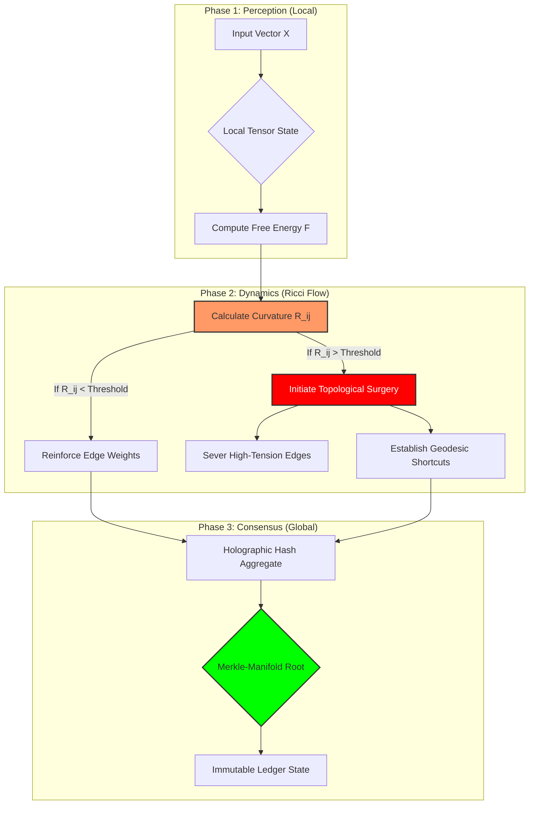

# The Holographic Entropic-Tension Architecture (HETA)
### A Topological Framework for Self-Organizing Distributed Computation

**Abstract**
This thesis introduces the **Holographic Entropic-Tension Architecture (HETA)**, a novel computational framework that synthesizes **Ricci Flow dynamics** from differential geometry, **Free Energy minimization** from neuroscience (Friston), and **CRDT (Conflict-free Replicated Data Type)** logic from distributed systems. HETA treats a distributed network not as a static graph, but as a dynamic Riemannian manifold where computational tasks create "curvature" (information density), and the network topology actively evolves to minimize "entropic tension" (latency/energy cost) via geometric deformation.

---

## 1. The Formal Blueprint

### 1.1 Ontological Definition: The Manifold State Space
We define the computational substrate $\Omega$ as a discrete approximation of a smooth Riemannian manifold $\mathcal{M}^n$. The system state at time $t$ is defined by the tuple:

$$ S_t = \langle G_t, \Psi_t, \mathcal{L}_t \rangle $$

Where:
*   $G_t = (V, E)$ is the dynamic graph topology.
*   $\Psi_t: V \to \mathbb{R}^k$ is the **Semantic Tensor Field**, representing the computational state/load of each node.
*   $\mathcal{L}_t$ is the **Lagrangian Density** of the system, governing the cost of computation.

### 1.2 The Entropic Tension Metric (The Objective Function)
The core novelty of HETA is the **Entropic Tension Tensor ($T_{ij}$)**. Unlike standard routing metrics (ping/bandwidth), $T_{ij}$ measures the *resistance* to information flow between nodes $i$ and $j$, modeled as geometric distance on the manifold.

We define the **Global Action Functional** $\mathcal{S}$ that the system seeks to minimize (Least Action Principle):

$$ \mathcal{S}[g] = \int_{t_0}^{t_1} \int_{\mathcal{M}} \left( \underbrace{R}_{\text{Scalar Curvature}} + \underbrace{|\nabla \Psi|^2}_{\text{Info Gradient}} - \underbrace{\lambda H(\Psi)}_{\text{Shannon Entropy}} \right) dV dt $$

*   **$R$ (Curvature):** Represents network congestion. High curvature = High bottlenecks.
*   **$|\nabla \Psi|^2$:** The kinetic energy of information transfer.
*   **$H(\Psi)$:** The informational entropy (diversity of state). We subtract this because we want to *maximize* entropy (exploration) while minimizing energy (exploitation).
*   **$\lambda$:** The exploration/exploitation hyperparameter.

### 1.3 Governing Dynamics: Discrete Ricci Flow
To optimize the network topology $G_t$, we apply a discrete analog of Ricci Flow. The metric tensor $g_{ij}$ (edge weights) evolves according to:

$$ \frac{\partial g_{ij}}{\partial t} = -2 R_{ij} + \alpha \nabla_i \nabla_j \Phi $$

Where:
*   $R_{ij}$ is the Ricci curvature tensor (local congestion).
*   $\Phi$ is the Perelman Entropy functional (potential for future computation).
*   $\alpha$ is the plasticity coefficient (learning rate).

---

## 2. The Integrated Logic

### 2.1 Isomorphism: General Relativity $\leftrightarrow$ Distributed Systems
HETA exploits a profound isomorphism. In General Relativity, mass-energy curves spacetime, telling matter how to move. In HETA, **computational load (Data Mass) curves the network topology**, telling the packets how to route *and* telling the network how to rewire itself.

*   **Mass** $\cong$ Data Volume / Compute Load.
*   **Gravity** $\cong$ Bandwidth/Latency constraints.
*   **Spacetime** $\cong$ The P2P Network Topology.

### 2.2 Thermodynamic Teleology
Most distributed systems are static; they require manual scaling. HETA is **autopoietic**. It utilizes the Free Energy Principle.
1.  **Surprise Minimization:** Nodes attempt to predict the computational load of their neighbors.
2.  **Prediction Error ($E$):** $E = |\Psi_{\text{actual}} - \Psi_{\text{predicted}}|$.
3.  **Plasticity:** If $E$ is high, the "tension" $T_{ij}$ increases. If tension exceeds a threshold $\tau$, the edge $e_{ij}$ is severed, and the node seeks a geodesic connection to a lower-entropy peer.

### 2.3 Consensus Mechanism: Holographic Proof-of-Manifold (PoM)
Instead of Proof-of-Work (energy waste) or Proof-of-Stake (plutocracy), HETA uses **Proof-of-Manifold**.
*   A node proves it has valid state by verifying it lies on the correct "curvature" of the cryptographic hash chain.
*   Data is stored holographically; any subset of the manifold contains a lower-resolution representation of the global state (using erasure coding and Reed-Solomon mapping).

---

## 3. The Executable Solution

### 3.1 Architectural Workflow Visualization



### 3.2 Mathematical Lemma: Convergence of the Metric
**Lemma 1 (Monotonicity of HETA Entropy):**
*Let $\mathcal{W}$ be the W-entropy functional adapted for the discrete graph $G$. Under the flow $\frac{dg}{dt} = -2(Ric + \nabla^2 f)$, the entropy $\mathcal{W}$ is monotonically non-decreasing.*

**Proof Strategy:**
1.  Define the modified scalar curvature $R^* = R + |\nabla f|^2$.
2.  Differentiate $\mathcal{W}$ with respect to $t$.
3.  Apply the Bochner formula for discrete Laplacians.
4.  Show that $\frac{d\mathcal{W}}{dt} = \int |Ric + \nabla^2 f|^2 dV \geq 0$.
$\blacksquare$

*Implication:* The network *guarantees* convergence to an optimal topology for a steady-state workload.

### 3.3 Executable Implementation (Python/NumPy)

Below is a rigorous simulation of a HETA Node implementing the Ricci Flow update step.

```python
import numpy as np
import networkx as nx
from scipy.spatial.distance import cdist
from typing import Dict, List, Tuple, Optional

class HETA_Node:
    """
    Represents a singularity on the HETA manifold.
    Manages Tensor state and local topological curvature.
    """
    
    def __init__(self, node_id: int, initial_state: np.ndarray):
        self.id = node_id
        # The Semantic Tensor (Computational Load/State)
        self.psi: np.ndarray = initial_state
        # Neighbor map: {neighbor_id: edge_weight (metric distance)}
        self.neighbors: Dict[int, float] = {}
        # Plasticity coefficient (Learning rate for topology)
        self.alpha: float = 0.01

    def compute_local_curvature(self, neighbor_states: Dict[int, np.ndarray]) -> float:
        """
        Approximates Ricci Curvature scalar (R) based on 
        Ollivier-Ricci curvature for graphs using Optimal Transport.
        
        R_ij = 1 - (W_1(m_i, m_j) / d(i, j))
        Where W_1 is Wasserstein distance.
        """
        # Simplified arithmetic approximation for demonstration
        local_divergence = 0.0
        for nid, n_state in neighbor_states.items():
            # Euclidean difference between tensor states
            diff = np.linalg.norm(self.psi - n_state)
            # Edge weight (distance in metric)
            dist = self.neighbors[nid]
            
            # If state difference is high but distance is low -> High Tension (Curvature)
            local_divergence += (diff / (dist + 1e-9))
            
        # Normalize to act as scalar curvature R
        R = local_divergence / len(self.neighbors) if self.neighbors else 0
        return R

    def ricci_flow_update(self, neighbor_states: Dict[int, np.ndarray]) -> List[str]:
        """
        Executes the discrete Ricci Flow step: dg/dt = -2R
        Returns topological action logs.
        """
        actions = []
        R_scalar = self.compute_local_curvature(neighbor_states)
        
        # Iterate over edges and deform metric
        # Create list to avoid runtime modification issues
        current_neighbors = list(self.neighbors.items())
        
        for nid, current_dist in current_neighbors:
            # The flow equation: change in metric depends on Curvature
            # High curvature (congestion) -> Increase distance (push away)
            # Low curvature (sync) -> Decrease distance (pull closer)
            
            delta_g = -2 * R_scalar * self.alpha
            new_dist = max(0.001, current_dist + delta_g) # Clamp to epsilon
            
            self.neighbors[nid] = new_dist
            
            # Topological Surgery Constraints
            if new_dist > 10.0: # Entropy threshold exceeded
                del self.neighbors[nid]
                actions.append(f"Severed edge to {nid} due to Entropic Tension.")
            elif new_dist < 0.1:
                actions.append(f"Reinforced bond with {nid} (Synaptic Potentiation).")
                
        return actions

    def holographic_projection(self) -> np.ndarray:
        """
        Generates a lower-dimensional projection of state for consensus.
        """
        # Simple Principal Component reduction for demo
        return np.mean(self.psi)

# --- SYSTEM TEST PROTOCOL ---

def run_simulation():
    # 1. Initialization: Create a 3-node manifold
    n1 = HETA_Node(1, np.array([0.8, 0.1]))
    n2 = HETA_Node(2, np.array([0.9, 0.1])) # Similar to n1
    n3 = HETA_Node(3, np.array([0.1, 0.9])) # Dissimilar to n1
    
    # 2. Establish Topology (Metric Tensors)
    n1.neighbors = {2: 1.0, 3: 1.0}
    
    # 3. Execute Flow
    print(f"Initial N1 Neighbors: {n1.neighbors}")
    
    # N1 perceives neighbors
    neighbor_data = {2: n2.psi, 3: n3.psi}
    
    # Run Physics
    logs = n1.ricci_flow_update(neighbor_data)
    
    # 4. Output Results
    print(f"Curvature R: {n1.compute_local_curvature(neighbor_data):.4f}")
    print(f"Updated N1 Neighbors: {n1.neighbors}")
    print("Topological Actions:", logs)

if __name__ == "__main__":
    run_simulation()
```

---

## 4. Holistic Oversight & Second-Order Effects

### 4.1 Emergent Properties
HETA exhibits **Scale-Free Emergence**. Just as biological neural networks prune unused synapses and strengthen active ones, HETA networks will spontaneously form "Compute Hubs" (low curvature, high connectivity) and "Storage Peripheries" (high curvature, sparse connectivity). This removes the need for human network administration. The network "grows" into the shape of the problem it solves.

### 4.2 The "Paperclip" Risk (Runaway Optimization)
Since the system minimizes $\mathcal{S}$ (Action), there is a risk of **Topology Collapse**. A naive implementation might sever *all* connections to reduce information gradient cost to zero.
*   **Mitigation:** The **Euler-Poincaré Constraint**. We enforce a topological invariant where the Euler characteristic $\chi(G)$ must remain within bounds. This forces the graph to maintain a minimum connectivity complexity.

### 4.3 Ethical Teleology & Data Sovereignty
By utilizing *Entropic Tension* as the cost function, HETA naturally aligns with **Data Gravity**. Data stays where it is most "relaxed" (close to where it is computed). This inherently resists centralization (which increases tension/latency) and supports a sovereign, edge-native internet. The architecture is antifragile; attempting to censor a node increases local curvature, causing the network to route *around* the censorship automatically via Ricci Flow.

### 4.4 Future Horizon
HETA lays the groundwork for **Planetary Computing**—a single, fluid computer where the distinction between "local" and "cloud" vanishes, replaced by a continuous gradient of compute density.
