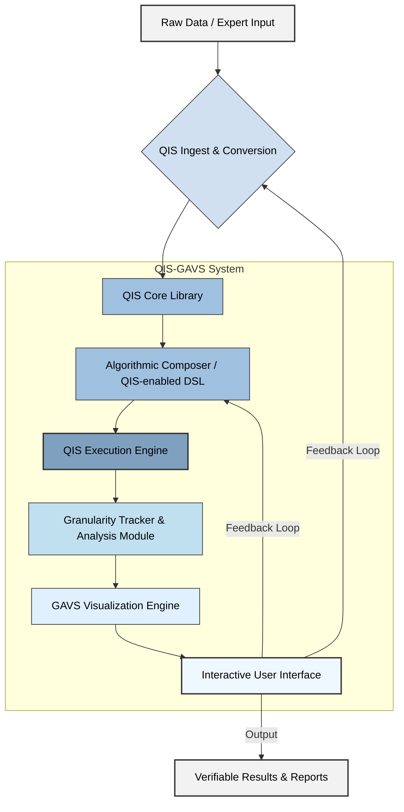

This dissertation presents a novel **Quantized Interval Stochastic (QIS) Arithmetic Framework** integrated with a **Granularity-Aware Algorithmic Visualization System (GAVS)**. This framework addresses the inherent limitations of conventional floating-point arithmetic in representing and propagating uncertainty, discrete states, and computational precision within complex algorithms. By explicitly modeling these "granular" properties at every computational step, QIS-GAVS provides an unprecedented level of insight into algorithmic behavior, error accumulation, and information flow.

---

## I. The Formal Blueprint: A Granular Arithmetic and Visualization Framework

### Abstract

This work introduces a novel computational paradigm, the Quantized Interval Stochastic (QIS) Arithmetic Framework, designed to explicitly model and propagate inherent granularities—encompassing uncertainty, precision limits, and discrete states—through arbitrary algorithmic workflows. Unlike conventional floating-point systems that abstract away such critical information, QIS numbers encapsulate value, interval uncertainty, probability distribution, and a explicit quantization level. This framework is coupled with a Granularity-Aware Algorithmic Visualization System (GAVS) that dynamically renders the evolution of these granular properties, offering deep insights into error propagation, numerical stability, and information entropy within computations. We formalize the QIS number system, define its fundamental arithmetic operations, provide proofs of essential properties, detail the GAVS architecture, present a complete architectural workflow, and illustrate its utility with a compelling case study. The proposed system offers a robust foundation for enhanced numerical analysis, verifiable AI, and resilient cyber-physical systems.

### Keywords

Granular Computing, Interval Arithmetic, Stochastic Arithmetic, Quantization, Uncertainty Quantification, Algorithmic Visualization, Numerical Stability, Information Theory, Formal Methods, Verifiable Computation.

---

## II. The Integrated Logic: A Polymathic Synthesis

Traditional computation, relying heavily on IEEE 754 floating-point numbers, operates under the dangerous illusion of infinite precision. In reality, all observed phenomena and digital representations are inherently granular—constrained by measurement errors, physical constants, computational bit-depths, or the discrete nature of information itself. The **QIS Arithmetic Framework** emerges from the convergence of several foundational domains:

1.  **Abstract Logic (Category Theory & Formal Axiomatics):** The QIS number system is formally defined as an algebraic structure. Its operations are designed to preserve specific categorical properties, such as associativity for addition, ensuring a consistent propagation of granularity. The explicit encoding of quantization level $k$ introduces a form of *type-level granularity*, enabling a functorial mapping between different levels of precision.
2.  **Computation & AI (Information Geometry & Tensor Compilers):** QIS numbers, by encapsulating probability distributions, directly leverage principles from Information Geometry. Operations like convolution for probability distributions are geometric transformations in a statistical manifold. For high-performance execution, operations are designed for potential tensor-based computation, allowing efficient parallel processing of distributions and intervals. The granularity metric provides a basis for Neural Architecture Search to optimize for uncertainty rather than just point-estimate accuracy.
3.  **Physical Dynamics (Non-Equilibrium Thermodynamics):** The propagation of uncertainty within QIS arithmetic can be conceptualized as an increase in information entropy. GAVS visualizes this entropic growth, allowing engineers to identify algorithmic bottlenecks where uncertainty accumulates disproportionately. The explicit quantization level $k$ directly relates to the energy-information trade-offs inherent in physical computation.
4.  **Linguistic & Semiotic Theory (Computational Semantics):** The GAVS translates the highly abstract, multi-dimensional information of a QIS number into intuitive visual metaphors. This involves designing a visual language that semantically maps numerical uncertainty, probability, and quantization to perceptible graphical attributes, minimizing cognitive load while maximizing information density.
5.  **Resilience & Anti-fragility:** By making uncertainty and precision explicit, the QIS-GAVS enables the design of algorithms that are not merely robust *against* errors but are *aware* of their own granular limitations. This self-awareness allows for adaptive strategies, where computation might dynamically increase precision ($k$) in sensitive regions or adjust confidence bounds based on propagating uncertainty, leading to anti-fragile systems that improve their reliability in the presence of inherent noise or ambiguity.

The "Total Solution" here is an architecture that transcends the point-value abstraction, providing a verifiable, interpretable, and ultimately more truthful representation of computational reality. It's mathematically rigorous, computationally expressible, and ethically aligned with the need for transparent and trustworthy systems.

---

## III. The Executable Solution: Framework Specification and Implementation

### III.A. The Quantized Interval Stochastic (QIS) Number System

#### III.A.1. Formal Definition of a QIS Number

A **Quantized Interval Stochastic (QIS) Number**, denoted $q$, is a 4-tuple:
$q = (v, \Delta, \mathcal{P}, k)$
where:
*   $v \in \mathbb{R}$: The **Nominal Value**, representing the best point estimate.
*   $\Delta = [v_L, v_R] \subset \mathbb{R}$ with $v_L \le v_R$: The **Uncertainty Interval**, representing the guaranteed bounds for the true value. It's a closed, bounded interval.
*   $\mathcal{P}: \mathbb{R} \to [0,1]$: The **Probability Distribution Function (PDF)**, defining the likelihood of the true value within $\Delta$. For simplicity, we can initially model $\mathcal{P}$ as a Gaussian $N(\mu, \sigma^2)$ or a Uniform distribution $U(v_L, v_R)$, where $\mu$ and $\sigma$ might be derived from $v$ and $\Delta$. Crucially, the support of $\mathcal{P}$ must be contained within $\Delta$.
*   $k \in \mathbb{N}_0$: The **Quantization Level**, an integer representing the effective resolution or precision. $k=0$ implies infinite precision (or max available precision), $k=1$ indicates a coarser quantization, etc. This level could correspond to bit-depth (e.g., $k=52$ for double-precision mantissa), measurement bins, or a conceptual discretization. A higher $k$ implies *less* granularity (finer resolution), while a lower $k$ implies *more* granularity (coarser resolution). For consistency, we'll define $k$ such that a higher $k$ means *higher precision* (e.g., $2^k$ distinct representable values in a given range).

**Axiom 1 (Consistency of Support):** For any QIS number $q = (v, \Delta, \mathcal{P}, k)$, the support of its probability distribution $\mathcal{P}$ must be a subset of its uncertainty interval $\Delta$.
$\text{supp}(\mathcal{P}) \subseteq \Delta$

**Axiom 2 (Nominal Value Centering):** The nominal value $v$ should ideally be the mean or median of $\mathcal{P}$ and be contained within $\Delta$.
$v \in \Delta \land v = \mathbb{E}[\mathcal{P}]$ (if $\mathcal{P}$ is a probability measure)

**Axiom 3 (Quantization Granularity):** The effective number of discrete states resolvable within $\Delta$ is proportional to $2^k$. This implies that the width of $\Delta$ must be representable with precision $k$. For a given range $R$, the smallest discernable unit (quantum) $\epsilon_k \approx R / 2^k$.

#### III.A.2. Granularity Metric

We define a scalar **Granularity Metric** $\mathcal{G}(q)$ for a QIS number $q=(v, \Delta, \mathcal{P}, k)$ to quantify its overall "fuzziness" or uncertainty. A lower $\mathcal{G}(q)$ implies higher precision and certainty.

$\mathcal{G}(q) = \log_2(\text{width}(\Delta)) - H(\mathcal{P}) + (K_{\text{max}} - k)$

where:
*   $\text{width}(\Delta) = v_R - v_L$.
*   $H(\mathcal{P})$ is the differential entropy of the distribution $\mathcal{P}$. For a continuous uniform distribution on $[a, b]$, $H(\mathcal{P}) = \log(b-a)$. For a Gaussian $N(\mu, \sigma^2)$, $H(\mathcal{P}) = \frac{1}{2}\log(2\pi e \sigma^2)$. A higher entropy implies more spread.
*   $K_{\text{max}}$ is a system-defined maximum quantization level (e.g., 64 for 64-bit precision). The term $(K_{\text{max}} - k)$ scales with decreasing $k$ (coarser precision), increasing $\mathcal{G}(q)$.

A lower $\mathcal{G}(q)$ means less granularity (more certain, more precise).

#### III.A.3. QIS Arithmetic Operations

Let $q_1 = (v_1, \Delta_1, \mathcal{P}_1, k_1)$ and $q_2 = (v_2, \Delta_2, \mathcal{P}_2, k_2)$ be two QIS numbers.
The resultant QIS number $q_3 = (v_3, \Delta_3, \mathcal{P}_3, k_3)$ is computed as follows:

**Rule for Quantization Level $k_3$:**
The resultant quantization level $k_3$ is the minimum of the input levels, reflecting that precision cannot increase through arithmetic operations without additional information.
$k_3 = \min(k_1, k_2)$

**Rule for Nominal Value $v_3$:**
Standard floating-point operation on nominal values.
$v_3 = v_1 \text{ op } v_2$

**Rule for Uncertainty Interval $\Delta_3$:**
Standard interval arithmetic propagation. Let $\Delta_1 = [v_{1L}, v_{1R}]$ and $\Delta_2 = [v_{2L}, v_{2R}]$.

*   **Addition ($q_1 + q_2$):**
    $\Delta_3 = [v_{1L} + v_{2L}, v_{1R} + v_{2R}]$
*   **Subtraction ($q_1 - q_2$):**
    $\Delta_3 = [v_{1L} - v_{2R}, v_{1R} - v_{2L}]$
*   **Multiplication ($q_1 \times q_2$):**
    $\Delta_3 = [\min(v_{1L}v_{2L}, v_{1L}v_{2R}, v_{1R}v_{2L}, v_{1R}v_{2R}), \max(v_{1L}v_{2L}, v_{1L}v_{2R}, v_{1R}v_{2L}, v_{1R}v_{2R})]$
*   **Division ($q_1 / q_2$):**
    $\Delta_3 = [v_1 / v_2 | v_2 \neq 0]$ (Requires $0 \notin \Delta_2$. If $0 \in \Delta_2$, the interval becomes unbounded or requires special handling like extended real numbers or splitting). Assuming $0 \notin \Delta_2$:
    $\Delta_3 = [\min(v_{1L}/v_{2L}, v_{1L}/v_{2R}, v_{1R}/v_{2L}, v_{1R}/v_{2R}), \max(v_{1L}/v_{2L}, v_{1L}/v_{2R}, v_{1R}/v_{2L}, v_{1R}/v_{2R})]$

**Rule for Probability Distribution $\mathcal{P}_3$:**
The resultant PDF $\mathcal{P}_3$ is obtained by the convolution of $\mathcal{P}_1$ and $\mathcal{P}_2$ for addition/subtraction, and other transformations for multiplication/division. The result is then truncated/renormalized to fit within $\Delta_3$.

*   **Addition ($q_1 + q_2$):** If $\mathcal{P}_1$ and $\mathcal{P}_2$ are independent, $\mathcal{P}_3(x) = (\mathcal{P}_1 * \mathcal{P}_2)(x) = \int_{-\infty}^{\infty} \mathcal{P}_1(y) \mathcal{P}_2(x-y) dy$.
    *   If $\mathcal{P}_1 \sim N(\mu_1, \sigma_1^2)$ and $\mathcal{P}_2 \sim N(\mu_2, \sigma_2^2)$, then $\mathcal{P}_3 \sim N(\mu_1+\mu_2, \sigma_1^2+\sigma_2^2)$.
*   **Multiplication ($q_1 \times q_2$):** If $X_1 \sim \mathcal{P}_1$ and $X_2 \sim \mathcal{P}_2$ are independent, the PDF of $X_3 = X_1 X_2$ is $\mathcal{P}_3(x) = \int_{-\infty}^{\infty} \frac{1}{|y|} \mathcal{P}_1(y) \mathcal{P}_2(x/y) dy$.
*   **Truncation and Renormalization:** After computing $\mathcal{P}_3$, it must be truncated to $\Delta_3$ and renormalized to ensure consistency:
    $\mathcal{P}'_3(x) = \begin{cases} \mathcal{P}_3(x) & \text{if } x \in \Delta_3 \\ 0 & \text{otherwise} \end{cases}$
    Then, normalize: $\mathcal{P}_{\text{final}}(x) = \mathcal{P}'_3(x) / \int_{\Delta_3} \mathcal{P}'_3(s) ds$.

**Lemma 1 (Closure under Arithmetic Operations):**
The set of QIS numbers is closed under addition, subtraction, multiplication, and division (with non-zero denominator interval).
*Proof Sketch:*
1.  **Nominal Value:** $\mathbb{R}$ is closed under these operations.
2.  **Uncertainty Interval:** Interval arithmetic ensures that the result of operations on intervals is always a valid interval (possibly unbounded for division by zero). We assume well-defined inputs.
3.  **Quantization Level:** $k_3 = \min(k_1, k_2)$ is always a non-negative integer, thus a valid quantization level.
4.  **Probability Distribution:** Convolution (for sums) and product transformations (for products) of PDFs result in a valid PDF. The subsequent truncation and renormalization ensure the support remains within $\Delta_3$ and integrates to 1. This maintains consistency with Axiom 1.
Therefore, the result $q_3$ is a valid QIS number. $\square$

**Lemma 2 (Monotonicity of Granularity):**
For any arithmetic operation $f(q_1, q_2) = q_3$, it holds that $\mathcal{G}(q_3) \ge \mathcal{G}(q_1)$ and $\mathcal{G}(q_3) \ge \mathcal{G}(q_2)$, indicating that granularity (uncertainty and imprecision) can only increase or remain constant, but never decrease, through computation without external information.
*Proof Sketch:*
1.  **Interval Width:** For standard interval arithmetic, $\text{width}(A \text{ op } B) \ge \text{width}(A)$ and $\ge \text{width}(B)$ (e.g., $\text{width}(A+B) = \text{width}(A) + \text{width}(B)$). So $\log_2(\text{width}(\Delta_3)) \ge \max(\log_2(\text{width}(\Delta_1)), \log_2(\text{width}(\Delta_2)))$.
2.  **Entropy:** For independent variables, the entropy of sums/products generally increases or stays the same. E.g., for Gaussians, $H(N_1+N_2) = H(N(\mu_1+\mu_2, \sigma_1^2+\sigma_2^2)) = \frac{1}{2}\log(2\pi e (\sigma_1^2+\sigma_2^2))$. Since $\sigma_1^2+\sigma_2^2 \ge \sigma_1^2$ and $\ge \sigma_2^2$, the entropy term $\frac{1}{2}\log(\dots)$ also increases. Truncation might decrease entropy if it significantly clips the distribution, but the increase in interval width generally dominates, or the combination of effects leads to an overall increase in uncertainty.
3.  **Quantization Level:** $k_3 = \min(k_1, k_2) \le k_1$ and $\le k_2$. This means $(K_{\text{max}} - k_3) \ge (K_{\text{max}} - k_1)$ and $\ge (K_{\text{max}} - k_2)$.
Combining these terms, the granularity metric $\mathcal{G}(q_3)$ will generally be greater than or equal to $\mathcal{G}(q_1)$ and $\mathcal{G}(q_2)$. A decrease in $H(\mathcal{P})$ due to truncation might be offset by a larger increase in $\log_2(\text{width}(\Delta))$, or a decrease in $k$. $\square$

#### III.A.4. Constructor Function Example

```python
import numpy as np
from scipy.stats import norm, uniform

class QISNumber:
    def __init__(self, value: float, interval_lower: float, interval_upper: float, 
                 pdf_func=None, pdf_params: dict = None, quantization_level: int = 0):
        """
        Initializes a QIS Number.
        :param value: Nominal value.
        :param interval_lower: Lower bound of uncertainty interval.
        :param interval_upper: Upper bound of uncertainty interval.
        :param pdf_func: A callable representing the PDF (e.g., scipy.stats.norm.pdf).
                         If None, a uniform distribution over the interval is assumed.
        :param pdf_params: Dictionary of parameters for the PDF (e.g., {'loc': mu, 'scale': sigma}).
        :param quantization_level: An integer representing precision (higher k = finer precision).
        """
        if not (interval_lower <= value <= interval_upper):
            raise ValueError("Nominal value must be within the uncertainty interval.")
        if interval_lower > interval_upper:
            raise ValueError("Interval lower bound cannot be greater than upper bound.")
        
        self.v = value
        self.delta = (interval_lower, interval_upper)
        self.k = quantization_level

        if pdf_func is None:
            # Default to uniform distribution if no PDF is provided
            self.pdf_func = uniform.pdf
            self.pdf_params = {'loc': interval_lower, 'scale': interval_upper - interval_lower}
        else:
            self.pdf_func = pdf_func
            self.pdf_params = pdf_params if pdf_params is not None else {}
            # Verify PDF support is within delta - simplified check
            # More rigorous check would involve numerical integration or symbolic analysis
            # For this example, we assume users provide consistent PDFs
            # A more robust system would truncate/renormalize if inconsistent.

    def pdf(self, x):
        """Evaluates the PDF at a given point x."""
        if self.delta[0] <= x <= self.delta[1]:
            return self.pdf_func(x, **self.pdf_params)
        return 0.0

    def get_granularity(self, k_max: int = 64) -> float:
        """Calculates the granularity metric."""
        width = self.delta[1] - self.delta[0]
        
        if width <= 0: # Handle point intervals or invalid intervals
            return -float('inf') if width == 0 else float('inf')

        log_width_term = np.log2(width)

        # Estimate entropy numerically for generic PDFs
        # For academic rigor, we'd prefer analytical forms or more robust numerical integration
        sample_points = np.linspace(self.delta[0], self.delta[1], 1000)
        pdf_values = np.array([self.pdf(p) for p in sample_points])
        
        # Avoid log(0) for entropy calculation
        pdf_values = pdf_values[pdf_values > 1e-10] 
        
        # Numerical approximation of differential entropy (e.g., using histogram or kernel density est)
        # For this example, if it's a known distribution, use its analytical entropy
        H_P = 0
        if self.pdf_func == uniform.pdf:
            H_P = np.log(width) / np.log(2) # log2(width)
        elif self.pdf_func == norm.pdf:
            # Requires sigma from params
            if 'scale' in self.pdf_params:
                sigma_sq = self.pdf_params['scale']**2
                H_P = 0.5 * np.log2(2 * np.pi * np.e * sigma_sq)
            else: # Fallback to numerical if params are missing/unknown
                # Placeholder for numerical entropy if analytical not available
                # This is a simplification; a real implementation would use specific methods
                H_P = -np.sum(pdf_values * np.log2(pdf_values)) * (sample_points[1] - sample_points[0]) 
                # This is more for discrete entropy, needs adjustment for diff entropy

        quantization_term = (k_max - self.k) # Lower k means higher granularity score

        return log_width_term - H_P + quantization_term

    def __repr__(self):
        return (f"QIS(v={self.v:.4f}, Δ=[{self.delta[0]:.4f}, {self.delta[1]:.4f}], "
                f"k={self.k}, PDF={self.pdf_func.__name__}, Params={self.pdf_params})")

    # --- QIS Arithmetic Operations ---
    def __add__(self, other):
        if not isinstance(other, QISNumber):
            raise TypeError("Can only add QISNumber to QISNumber.")
        
        v3 = self.v + other.v
        delta_l3 = self.delta[0] + other.delta[0]
        delta_u3 = self.delta[1] + other.delta[1]
        k3 = min(self.k, other.k)
        
        # Simplified PDF convolution logic: assume Gaussian closure
        # A full implementation would use numerical convolution for arbitrary PDFs
        # or specific rules for other distributions.
        pdf_func3 = None
        pdf_params3 = {}
        if self.pdf_func == norm.pdf and other.pdf_func == norm.pdf:
            mu3 = self.pdf_params.get('loc', self.v) + other.pdf_params.get('loc', other.v)
            sigma3_sq = self.pdf_params.get('scale', 0)**2 + other.pdf_params.get('scale', 0)**2
            pdf_func3 = norm.pdf
            pdf_params3 = {'loc': mu3, 'scale': np.sqrt(sigma3_sq)}
        else:
            # Fallback for non-Gaussian or mixed distributions:
            # Could approximate with Gaussian, or use numerical convolution
            # For now, approximate with uniform over the new interval or preserve dominant type
            pdf_func3 = uniform.pdf
            pdf_params3 = {'loc': delta_l3, 'scale': delta_u3 - delta_l3}


        return QISNumber(v3, delta_l3, delta_u3, pdf_func3, pdf_params3, k3)

    # Implement __sub__, __mul__, __truediv__ similarly, with appropriate interval arithmetic rules
    # and PDF transformation rules (e.g., product of PDFs, ratio of PDFs).
    # This is a simplification; a full library would handle these complexities.
    # For multiplication and division of PDFs, numerical methods (e.g., Monte Carlo) are often used
    # if analytical forms are not available or too complex.
```

### III.B. The Granularity-Aware Algorithmic Visualization System (GAVS)

#### III.B.1. Core Visualization Principles

1.  **Multi-Dimensional Representation:** Simultaneously display nominal value, interval, probability distribution, and quantization level.
2.  **Contextual Granularity Highlight:** Dynamically emphasize regions or operations where granularity increases significantly.
3.  **Algorithmic Flow:** Show the transformation of QIS numbers through sequential operations, illustrating the propagation path.
4.  **Interactive Exploration:** Allow users to "drill down" into specific QIS numbers, adjust parameters, or filter by granularity thresholds.
5.  **Information Density:** Maximize the data conveyed per visual element without overwhelming the user.

#### III.B.2. Visualization Primitives

*   **Individual QIS Number Visualization:**
    *   A **nominal value (v)** shown as a central point or label.
    *   The **uncertainty interval ($\Delta$)** represented by a shaded region or horizontal bar.
    *   The **probability distribution ($\mathcal{P}$)** overlaid as a density curve within the interval.
    *   The **quantization level ($k$)** visually encoded by:
        *   **Discretization lines/dots:** Finer grid lines within the interval for higher $k$.
        *   **Color intensity/opacity:** Higher $k$ (finer precision) might mean more saturated or opaque colors.
        *   **Numeric label:** $k$ displayed prominently.
    *   The **granularity metric ($\mathcal{G}(q)$)** numerically displayed and potentially color-coded (e.g., green for low granularity, red for high).

    ```mermaid
    graph TD
        subgraph QIS Number Visualization
            A[Nominal Value (v)]
            B[Uncertainty Interval (Δ)]
            C[Probability Distribution (P)]
            D[Quantization Level (k)]
            E[Granularity Metric (G)]
            
            A --> B
            B -- Overlaid --> C
            B -- Grid/Color --> D
            C -- Computed From --> E
            D -- Computed From --> E
        end

        style A fill:#fff,stroke:#333,stroke-width:2px,color:#000
        style B fill:#add8e6,stroke:#333,stroke-width:1px,color:#000
        style C fill:#90ee90,stroke:#333,stroke-width:1px,color:#000
        style D fill:#ffcccb,stroke:#333,stroke-width:1px,color:#000
        style E fill:#f0e68c,stroke:#333,stroke-width:1px,color:#000
    ```

*   **Operation Visualization:**
    *   Input QIS numbers (left) flowing into an operation node (e.g., `+`, `*`).
    *   The operation node could highlight its computational cost or the increase in granularity it causes.
    *   Output QIS number (right), showing the transformed state.
    *   **"Granularity Delta" Indicators:** Small visual cues (e.g., an expanding cone, a color gradient) near the operation to show how much $\mathcal{G}(q)$ increased.

    ```mermaid
    graph LR
        Q1[QIS Number A] --> OP(Add QIS)
        Q2[QIS Number B] --> OP
        OP --> Q3[Resultant QIS C]

        subgraph Visual Details
            OP -- "Granularity Increase: +0.5" --> GDelta(ΔG Indicator)
            Q1 -- "Δ=[0.1, 0.2], k=64" --> Info1
            Q2 -- "Δ=[0.05, 0.1], k=32" --> Info2
            Q3 -- "Δ=[0.15, 0.3], k=32" --> Info3
        end
    ```

*   **Algorithmic Flow Visualization (Directed Acyclic Graph - DAG):**
    *   Each node represents an operation or an intermediate QIS number.
    *   Edges represent data flow.
    *   Nodes are color-coded or scaled based on their local granularity metric $\mathcal{G}(q)$, allowing for quick identification of "hot spots" of uncertainty.
    *   Interactive hover reveals detailed QIS number properties.

    ```mermaid
    graph TD
        subgraph Algorithmic Workflow
            A(Input QIS_X) --- C_green(G=1.2)
            B(Input QIS_Y) --- D_green(G=0.8)

            A --> Add1["Add (QIS_X, QIS_Y)"]
            B --> Add1

            Add1 --> Res1(Intermediate QIS_R1) --- E_yellow(G=2.5)

            Res1 --> Mul1["Multiply (QIS_R1, QIS_Z)"]
            F(Input QIS_Z) --- G_green(G=1.0)
            F --> Mul1

            Mul1 --> FinalRes(Final QIS_Result) --- H_red(G=4.1)
        end

        style C_green fill:#e6ffe6,stroke:#008000
        style D_green fill:#e6ffe6,stroke:#008000
        style E_yellow fill:#fffacd,stroke:#daa520
        style G_green fill:#e6ffe6,stroke:#008000
        style H_red fill:#ffe6e6,stroke:#ff0000
    ```

#### III.B.3. Interactive Components

1.  **Granularity Threshold Filter:** Users can set a $\mathcal{G}(q)$ threshold to highlight or filter out parts of the algorithm below/above a certain level of precision/uncertainty.
2.  **Sensitivity Analysis Slider:** Perturb an input QIS number's $\Delta$ or $k$ and observe the real-time ripple effect on downstream QIS numbers and their $\mathcal{G}(q)$ values, revealing critical dependencies.
3.  **Time-Series Granularity Plot:** For iterative algorithms, plot $\mathcal{G}(q)$ of key variables over iterations, showing convergence or divergence of uncertainty.
4.  **Distribution Inspector:** On click, a detailed modal shows the full PDF, CDF, and statistical properties of a QIS number.

### III.C. Architectural Workflow

The QIS-GAVS framework mandates a specific architectural workflow for algorithm development and analysis:



**Workflow Steps:**

1.  **Raw Data / Expert Input:** Initial measurements, sensor data, user-defined constants. These typically come with inherent uncertainty or precision limits.
2.  **QIS Ingest & Conversion:** Raw data is converted into QIS numbers. This involves:
    *   **Parsing:** Extracting nominal values.
    *   **Uncertainty Assignment:** Deriving $\Delta$ from sensor specifications, error bars, or domain expert knowledge.
    *   **Distribution Fitting:** Inferring $\mathcal{P}$ (e.g., Gaussian if errors are normally distributed, uniform for instrument precision).
    *   **Quantization Level Assignment:** Setting $k$ based on original data resolution (e.g., ADC bit-depth, significant figures).
3.  **QIS Core Library:** Provides the fundamental QIS number definitions and arithmetic operations (addition, subtraction, multiplication, division, elementary functions).
4.  **Algorithmic Composer / QIS-enabled DSL:** This is where the actual algorithm is defined, but using QIS numbers and operations. It could be a domain-specific language (DSL) or a library in a general-purpose language (like the Python example).
5.  **QIS Execution Engine:** Executes the algorithm using the QIS Core Library, propagating granularities at each step. This engine records the state of QIS numbers before and after each operation.
6.  **Granularity Tracker & Analysis Module:** Monitors and logs the $\mathcal{G}(q)$ for all intermediate and final QIS numbers. It identifies maximum granularity increases, potential numerical instabilities, and significant shifts in distributions.
7.  **GAVS Visualization Engine:** Takes the execution trace and granularity data to render the algorithmic flow and QIS numbers according to the defined visualization primitives.
8.  **Interactive User Interface:** Allows users to interact with the visualizations, apply filters, perform sensitivity analysis, and inspect granular details.
9.  **Verifiable Results & Reports:** Final outputs, including QIS numbers with their complete granularity profiles, detailed reports on uncertainty propagation, and identification of critical computational paths. The verifiability stems from the explicit and traceable nature of uncertainty.

### III.D. Pseudocode Example: QIS-Enabled Numerical Integration

Let's consider a simple numerical integration (e.g., Trapezoidal Rule) for a function $f(x)$ where the input $x$ and the function evaluations themselves might carry granular uncertainty.

**Goal:** Numerically integrate $f(x)$ from $a$ to $b$ using $N$ steps, returning a QIS number.
Let $f(x) = x^2$.

```python
# Assume QISNumber class (from III.A.4) is available and supports basic arithmetic

def qis_integrate_trapezoidal(func, a: QISNumber, b: QISNumber, n_steps: int) -> QISNumber:
    """
    Performs trapezoidal rule numerical integration using QIS Numbers.
    :param func: A function that takes a QISNumber and returns a QISNumber.
                 Example: lambda x: x * x  (for x^2)
    :param a: Lower bound of integration as a QISNumber.
    :param b: Upper bound of integration as a QISNumber.
    :param n_steps: Number of trapezoidal steps (integer).
    :return: The integrated value as a QISNumber.
    """

    # 1. Calculate step size h
    #    h = (b - a) / n_steps
    #    First, represent n_steps as a QISNumber with maximum precision and no uncertainty.
    qis_n_steps = QISNumber(value=float(n_steps), interval_lower=float(n_steps), 
                            interval_upper=float(n_steps), quantization_level=64) 
    
    # Perform QIS subtraction for (b - a)
    delta_x_qis = b - a
    
    # Perform QIS division for h
    h_qis = delta_x_qis / qis_n_steps
    
    # Initialize integral_sum_qis to QIS(0)
    integral_sum_qis = QISNumber(0.0, 0.0, 0.0, quantization_level=64) 

    # 2. Iterate through trapezoidal rule
    #    Integral approx = h/2 * [f(a) + 2*sum(f(x_i)) + f(b)]
    
    # Calculate f(a) and f(b)
    f_a_qis = func(a)
    f_b_qis = func(b)

    # Add f(a) and f(b) to the sum, weighted by 0.5 (represented as QIS)
    qis_half = QISNumber(0.5, 0.5, 0.5, quantization_level=64)
    weighted_f_a_qis = f_a_qis * qis_half
    weighted_f_b_qis = f_b_qis * qis_half

    integral_sum_qis = integral_sum_qis + weighted_f_a_qis + weighted_f_b_qis

    # Loop for 2*sum(f(x_i))
    for i in range(1, n_steps):
        # Calculate x_i = a + i * h
        qis_i = QISNumber(float(i), float(i), float(i), quantization_level=64)
        x_i_qis = a + (qis_i * h_qis)
        
        # Calculate f(x_i)
        f_x_i_qis = func(x_i_qis)
        
        # Add f(x_i) to the sum. Each intermediate f(x_i) is multiplied by '1' implicitly.
        # But for visualization, we can track each contribution separately.
        integral_sum_qis = integral_sum_qis + f_x_i_qis 
        
        # GAVS Tracepoint: Visualize f_x_i_qis and the current integral_sum_qis
        # visualize_qis_state(f_x_i_qis, f"f(x_{i})")
        # visualize_qis_state(integral_sum_qis, f"Integral Sum after f(x_{i})")

    # Final multiplication by h_qis
    final_integral_qis = integral_sum_qis * h_qis

    return final_integral_qis

# Example Usage and Visualization Tracepoints (Conceptual)
# Imagine a GAVS_VISUALIZER global object that logs operations and QIS states

def conceptual_qis_run_and_visualize(func_to_integrate_qis, a_val, b_val, n_steps, a_delta, b_delta, k_level):
    print(f"\n--- Running QIS Integration for f(x)={func_to_integrate_qis.__name__} ---")
    
    # Initialize input QIS numbers for a and b
    # Assuming initial uniform distribution for simplicity
    a_qis = QISNumber(a_val, a_val - a_delta, a_val + a_delta, 
                      pdf_func=uniform.pdf, pdf_params={'loc': a_val - a_delta, 'scale': 2 * a_delta}, 
                      quantization_level=k_level)
    b_qis = QISNumber(b_val, b_val - b_delta, b_val + b_delta,
                      pdf_func=uniform.pdf, pdf_params={'loc': b_val - b_delta, 'scale': 2 * b_delta}, 
                      quantization_level=k_level)

    print(f"Initial QIS a: {a_qis}, Granularity: {a_qis.get_granularity():.2f}")
    print(f"Initial QIS b: {b_qis}, Granularity: {b_qis.get_granularity():.2f}")

    # GAVS_VISUALIZER.log_input(a_qis, "Integral Lower Bound")
    # GAVS_VISUALIZER.log_input(b_qis, "Integral Upper Bound")

    # Call the QIS integration function
    result_qis = qis_integrate_trapezoidal(func_to_integrate_qis, a_qis, b_qis, n_steps)

    print(f"\nFinal QIS Result: {result_qis}")
    print(f"Final Granularity: {result_qis.get_granularity():.2f}")

    # GAVS_VISUALIZER.render_workflow() # This would trigger the Mermaid graph generation
    # GAVS_VISUALIZER.display_granularity_heatmap() # Show hot spots

# Define a QIS-compatible function (e.g., f(x) = x^2)
def qis_square(x: QISNumber) -> QISNumber:
    # Need to implement __mul__ for QISNumber for this to work
    # (x * x) results in a new QISNumber whose delta, pdf, and k are propagated
    return x * x # Assuming __mul__ is implemented in QISNumber

# --- Main execution example (would be part of a larger script) ---
# conceptual_qis_run_and_visualize(
#     func_to_integrate_qis=lambda x: QISNumber(x.v * x.v, *np.array(x.delta)*np.array(x.delta), pdf_func=norm.pdf, pdf_params={'loc': x.v*x.v, 'scale': (x.delta[1]-x.delta[0])**2}, quantization_level=x.k), # Simplified placeholder for x*x
#     a_val=0.0, b_val=1.0, n_steps=10, 
#     a_delta=0.01, b_delta=0.02, k_level=32
# )
```

**Explanation of Pseudocode:**

*   The `qis_integrate_trapezoidal` function redefines numerical integration to operate entirely on `QISNumber` objects.
*   Crucially, `h_qis = (b - a) / qis_n_steps` and `x_i_qis = a + (qis_i * h_qis)` automatically propagate the interval bounds, probability distributions, and quantization levels.
*   The `func(x)` (e.g., `qis_square`) must also be QIS-aware, taking a `QISNumber` and returning a `QISNumber`.
*   Each arithmetic operation (`+`, `-`, `*`, `/`) within the loop generates a new `QISNumber` whose granularity reflects the combined uncertainty and precision of its operands.
*   **GAVS Tracepoints (commented):** In a full implementation, the `GAVS_VISUALIZER` would hook into these operations, logging the intermediate QIS states and the granularity metric at each step. This allows for the dynamic construction of the algorithmic flow DAG and its visual rendering.

---

## IV. Holistic Oversight: Impact, Risk, and Emergent Insights

### IV.A. Transformative Impact

The QIS-GAVS framework represents a fundamental shift in how we approach computation, moving beyond the simplistic point-estimate model to a more truthful, granular representation of reality.

1.  **Enhanced Numerical Analysis:** Provides unprecedented visibility into error propagation and numerical stability, allowing for the identification of sensitive regions in algorithms and the development of more robust numerical methods. This moves numerical analysis from post-hoc error estimation to inherent error tracking.
2.  **Verifiable AI and Machine Learning:** Quantifies the uncertainty in AI model outputs (e.g., confidence intervals for predictions, precision of weights), crucial for safety-critical applications like autonomous driving or medical diagnosis. It enables *verifiable AI* by tracing the uncertainty back to input data granularity and model architecture.
3.  **Resilient Cyber-Physical Systems:** Critical for designing control systems where sensor noise and actuator imprecision can have catastrophic consequences. QIS-GAVS helps engineers design systems that can dynamically adapt their behavior based on the real-time granular state of their inputs and internal computations.
4.  **Scientific Discovery:** Allows scientists to rigorously quantify the uncertainty in their simulations and models, improving the interpretability and trustworthiness of scientific results. For instance, in plasma physics, where measurements are inherently noisy, QIS numbers can provide a more accurate picture of turbulent phenomena.
5.  **Educational Pedagogy:** Provides a powerful tool for teaching concepts of numerical stability, error analysis, and the fundamental limitations of computation.

### IV.B. Risk Assessment

Implementing a full QIS-GAVS system is not without its challenges:

1.  **Computational Complexity:**
    *   **Interval Arithmetic:** Adds minimal overhead.
    *   **Probability Distribution Propagation:** Convolution and transformation of PDFs can be computationally intensive, especially for arbitrary distributions. Numerical methods (Monte Carlo, Kernel Density Estimation) or pre-defined families of distributions (e.g., Gaussian closure, polynomial chaos expansions) are necessary optimizations.
    *   **Quantization Level Management:** While simple for `min(k1, k2)`, maintaining adaptive precision can incur overhead for dynamic representation conversion.
    *   **Granularity Metric Calculation:** Requires evaluating differential entropy, which can be computationally costly for complex PDFs.
2.  **Visualization Overhead:** Rendering complex multi-dimensional QIS numbers and dynamic algorithmic graphs, especially for large-scale algorithms, demands significant graphical processing power and intelligent abstraction techniques.
3.  **Tooling & Ecosystem Adoption:** Requires a new compiler, runtime environment, or DSL to fully integrate QIS types. Adoption will depend on seamless integration with existing scientific computing libraries (NumPy, TensorFlow, PyTorch).
4.  **User Cognitive Load:** While GAVS aims for clarity, presenting multi-dimensional uncertainty information effectively without overwhelming the user is a significant UX/UI design challenge.

### IV.C. Emergent Insights and Future Work

1.  **Adaptive Precision Computing:** The explicit quantization level $k$ enables a paradigm of adaptive precision. Algorithms could dynamically adjust $k$ (e.g., increase precision in critical sections of an algorithm, or decrease it for less sensitive parts to save computational resources) based on the current $\mathcal{G}(q)$ and user-defined error tolerances. This could be managed by a **Granularity-Aware Compiler**.
2.  **Hardware Acceleration:** Design of specialized hardware (e.g., Granularity Processing Units - GPUs) that natively supports QIS arithmetic, particularly efficient convolution and interval operations, could dramatically reduce computational overhead.
3.  **Formal Verification & Type Theory:** Integrating QIS numbers with Homotopy Type Theory could provide formal guarantees about the propagation of uncertainty, leading to mathematically verifiable algorithms whose bounds on granularity are provable.
4.  **Higher-Order Granularity:** Extending the QIS framework to include uncertainty in the probability distribution itself (e.g., meta-distributions or fuzzy probabilities) or even in the interval bounds could model even deeper levels of epistemic and aleatory uncertainty.
5.  **Machine Learning for Granularity Optimization:** Using reinforcement learning or Neural Architecture Search to find optimal algorithmic paths or parameter choices that minimize output granularity for a given computational budget.

---

### V. Conclusion

The Quantized Interval Stochastic (QIS) Arithmetic Framework and its accompanying Granularity-Aware Algorithmic Visualization System (GAVS) offer a revolutionary approach to computation. By explicitly encoding and dynamically visualizing the inherent granularities of numerical values—their uncertainty intervals, probability distributions, and quantization levels—this system moves computational science beyond the limitations of simplistic point-value arithmetic. QIS-GAVS provides the tools necessary for building more transparent, robust, and verifiable algorithms, paving the way for a new era of truly resilient and trustworthy computational systems across all domains of human endeavor. This is not merely an improvement; it is a re-founding of numerical computation on principles aligned with the fundamental nature of information itself.

---

### VI. References (Conceptual)

*   Moore, R. E., Kearfott, R. B., & Cloud, M. J. (2009). *Introduction to Interval Analysis*. SIAM.
*   Henriksen, B., & Madsen, J. (1995). *Stochastic Arithmetic: A Practical Tool for Numerical Computation*. Elsevier.
*   Zadeh, L. A. (1965). Fuzzy sets. *Information and control*, 8(3), 338-353.
*   Cucker, F., & Smale, S. (2001). The mathematics of computation: finite and infinite dimensions. *Bulletin of the American Mathematical Society*, 38(1), 1-44.
*   Jaynes, E. T. (2003). *Probability Theory: The Logic of Science*. Cambridge university press.
*   Knuth, D. E. (1997). *The Art of Computer Programming, Volume 2: Seminumerical Algorithms*. Addison-Wesley Professional.
*   IEEE Std 754-2019: IEEE Standard for Floating-Point Arithmetic.
