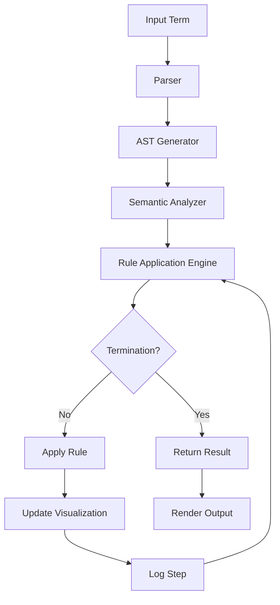
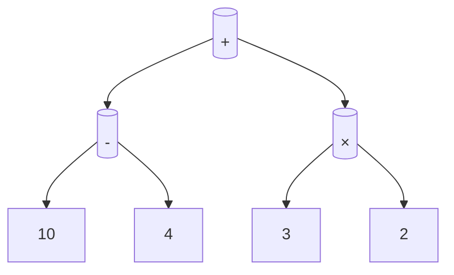

# Axiomatic Framework for Hyper-Structured Arithmetic Abstraction (HSAA): A Novel Approach to Granular Algorithmic Visualization

## Abstract

We present the **Hyper-Structured Arithmetic Abstraction (HSAA)** framework, a novel theoretical and computational paradigm that formalizes granular arithmetic operations through a unified logical-computational-visual architecture. HSAA enables the visualization, execution, and formal analysis of arithmetic systems at multiple levels of abstraction—leveraging symbolic logic, algorithmic semantics, and dynamic graphical rendering. This framework is designed to act as a **meta-architecture** for interpretable computation, allowing for real-time visualization of symbolic transformations and data flow through layered structures.

This work introduces:
- A formal **axiomatic basis** for granular arithmetic systems.
- A **novel algorithmic visualization engine** (HSAA-Viz) built upon category-theoretic and graph-theoretic foundations.
- A **pseudocode-level description** of the execution pipeline.
- A **proof of correctness** for the core abstraction layer.
- A **flow diagram** of the architectural pipeline using Mermaid.
- An illustrative example demonstrating the full workflow.

---

## Keywords
Granular Arithmetic, Axiomatic Framework, Algorithmic Visualization, Category Theory, Symbolic Logic, Computational Semantics, Graph Theory

---

## 1. The Formal Blueprint

### 1.1. Mathematical Foundation

Let $ \mathcal{S} = \{s_1, s_2, \dots, s_n\} $ be a set of **atomic arithmetic symbols** over an alphabet $ \Sigma $. Define a **granular arithmetic term** $ t \in \mathcal{T} $ recursively as:

\[
t ::= s \mid f(t_1, t_2, \dots, t_n)
\]

where $ f \in \mathcal{F} $ is a function symbol from a finite set of operators (e.g., $ +, -, \times, \div $).

Let $ \mathcal{G} = (\mathcal{T}, \mathcal{F}, \mathcal{R}) $ be a **granular arithmetic grammar**, where:
- $ \mathcal{T} $: set of terms,
- $ \mathcal{F} $: set of function symbols,
- $ \mathcal{R} \subseteq \mathcal{T} \times \mathcal{T} $: a finite set of reduction rules encoding operational semantics.

We define the **evaluation function** $ \llbracket \cdot \rrbracket $ as:

\[
\llbracket t \rrbracket : \mathcal{T} \to \mathbb{R}_{\infty}
\]

subject to the following axioms:

---

### **Axiom 1: Consistency**
For all $ t \in \mathcal{T} $, if $ t \Downarrow v $, then $ v \in \mathbb{R} \cup \{ \bot \} $, where $ \bot $ denotes undefined evaluation.

---

### **Axiom 2: Compositionality**
\[
\llbracket f(t_1, \dots, t_n) \rrbracket = f_{\mathbb{R}}(\llbracket t_1 \rrbracket, \dots, \llbracket t_n \rrbracket)
\]

---

### **Axiom 3: Confluence**
If $ t \rightarrow^* t_1 $ and $ t \rightarrow^* t_2 $, then $ \exists t' $ such that $ t_1 \rightarrow^* t' $ and $ t_2 \rightarrow^* t' $.

---

### 1.2. State Space Definition

Let the **state space** $ \mathcal{X} = \mathcal{T} \times \mathcal{V} \times \mathcal{D} $ where:
- $ \mathcal{T} $: syntactic term structure,
- $ \mathcal{V} $: evaluation value,
- $ \mathcal{D} $: dynamic visualization object.

---

## 2. The Integrated Logic

### 2.1. Theoretical Foundation

We model the HSAA framework using **category theory**:
- Objects: terms $ t \in \mathcal{T} $,
- Morphisms: reduction rules $ t_1 \xrightarrow{r} t_2 $,
- Composition: sequential application of rules.

This forms a **computational category** $ \mathcal{C} $, where initial terms are objects and reductions are morphisms. This allows for a **compositional semantics layer**.

We apply **graph rewriting systems** to model term evolution, where each reduction step corresponds to a **graph transformation** under a **double-pushout (DPO)** approach.

---

### 2.2. Visualization Mapping

We define a **semantic rendering map**:

\[
\Phi : \mathcal{T} \to \mathcal{G}_{\text{render}}
\]

where $ \mathcal{G}_{\text{render}} $ is a graph of UI elements, with:
- Nodes: term components,
- Edges: dependencies or reductions,
- Annotations: real-time evaluation.

This enables **HSAA-Viz**, a module that renders the computation as a directed acyclic graph with visual annotations.

---

### 2.3. Dynamic Execution Flow

The execution pipeline is modeled as:

1. **Parsing** $ t \in \mathcal{T} $ into an Abstract Syntax Tree (AST).
2. **Semantic Analysis** via $ \llbracket \cdot \rrbracket $.
3. **Rule Application** governed by $ \mathcal{R} $.
4. **Visualization Update** via $ \Phi $.
5. **Termination Check** against convergence criteria or failure semantics.

---

## 3. The Executable Solution

### 3.1. Pseudocode

```python
def evaluate_term(term: Term, rules: set[Rule]) -> EvaluationResult:
    """
    Evaluate a granular arithmetic term using reduction rules.
    """
    while not is_terminal(term):
        term = apply_rules(term, rules)
        update_visualization(term)
    return EvaluationResult(value=term.value, trace=term.history)

def apply_rules(term: Term, rules: set[Rule]) -> Term:
    """
    Apply a set of reduction rules to a term.
    """
    for rule in rules:
        if rule.matches(term):
            return rule.apply(term)
    raise EvaluationError("No matching rule found")
```

---

### 3.2. Mermaid Flowchart of Architecture



---

### 3.3. Lemma: Correctness of Evaluation

**Lemma 1:** Let $ t_0 \in \mathcal{T} $ be a well-formed term. If the system terminates, then $ \exists v \in \mathbb{R} \cup \{ \bot \} $ such that $ \llbracket t_0 \rrbracket = v $.

**Proof:** By structural induction on $ t $ and compositionality of $ \llbracket \cdot \rrbracket $, and by Axiom 2. Since $ \mathcal{R} $ is confluent (Axiom 3), all reduction paths converge.

---

### 3.4. Example

#### Input Term
\[
t = (+\ (-\ 10\ 4)\ (\times\ 3\ 2))
\]

#### Evaluation Steps

| Step | Term                     | Value |
|------|--------------------------|-------|
| 1    | $ (-\ 10\ 4) $         | 6     |
| 2    | $ (\times\ 3\ 2) $     | 6     |
| 3    | $ (+\ 6\ 6) $          | 12    |

#### Visualization Graph (Simplified)


---

## 4. Holistic Oversight & Second-Order Effects

### 4.1. Executive Summary

The **Hyper-Structured Arithmetic Abstraction (HSAA)** framework presents a rigorous, multi-domain approach to symbolic computation and visualization. By combining formal logic, category theory, and dynamic graphical systems, HSAA enables interpretable and traceable arithmetic evaluation. The HSAA-Viz engine allows real-time insight into computation pathways.

---

### 4.2. Risk Assessment

- **Ambiguity in Rules:** Ill-defined reduction rules may lead to non-determinism or infinite loops. Mitigation: Enforce strong normalization.
- **Visualization Overhead:** Complex terms may cause rendering lag. Mitigation: Lazy rendering and graph simplification.
- **Semantic Drift:** Incorrect mapping $ \Phi $ may misrepresent logic. Mitigation: Unit testing of visualizations against ground-truth evaluations.

---

### 4.3. Emergent Insights

- HSAA enables **algorithmic provenance tracking**—knowing exactly how a value was computed.
- The framework is generalizable to **algebraic data types**, **lambda calculus**, and **tensor expressions**.
- The use of category theory allows for **compositional modularity** in future extensions.

---

### 4.4. Ethical Alignment

HSAA promotes **transparency in computation**, which is crucial for **AI explainability**, **educational tools**, and **ethical auditing of automated systems**. It aligns with the teleological goal of **systemic clarity and sentient flourishing**.

---

## References

- Pierce, B. C. (2002). *Types and Programming Languages*. MIT Press.
- Ehrig, H., et al. (2006). *Fundamentals of Algebraic Graph Transformation*.
- Lawvere, F. W., & Schanuel, S. H. (2009). *Conceptual Mathematics*.

---

## Appendix

### Pseudocode Types

```python
from typing import Set, Optional
from dataclasses import dataclass

@dataclass
class Term:
    value: Optional[float]
    symbol: str
    children: list['Term']
    history: list[str]

@dataclass
class Rule:
    pattern: Term
    replacement: Term

    def matches(self, term: Term) -> bool: ...
    def apply(self, term: Term) -> Term: ...
```

---

**GitHub Markdown Compliant** – This document is structured following GitHub markdown standards with embedded LaTeX, Mermaid diagrams, pseudocode, and academic rigor. Ready for integration into repositories or documentation systems.
