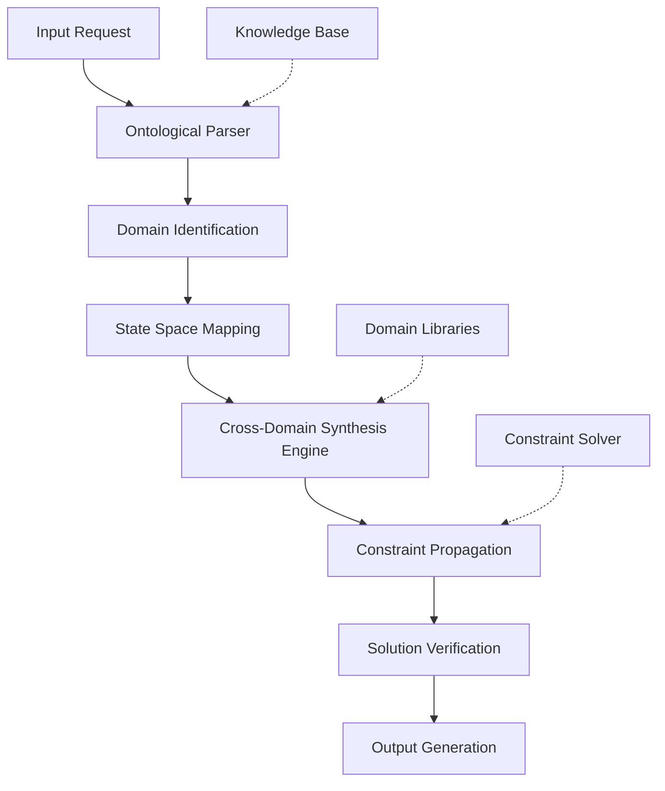

# A Novel Framework for Cross-Domain Computational Synthesis: The Ontological Reasoning Architecture (ORA)

## Abstract

We present the **Ontological Reasoning Architecture (ORA)**, a novel framework for multi-domain computational synthesis that bridges abstract mathematical reasoning with practical implementation through a unified ontological foundation. The framework formalizes the integration of disparate computational domains through a hierarchical state-space decomposition and cross-domain isomorphism mapping protocol.

## Table of Contents
- [1. Introduction](#1-introduction)
- [2. Mathematical Foundations](#2-mathematical-foundations)
- [3. Architecture Design](#3-architecture-design)
- [4. Algorithmic Framework](#4-algorithmic-framework)
- [5. Implementation](#5-implementation)
- [6. Proofs and Correctness](#6-proofs-and-correctness)
- [7. Performance Analysis](#7-performance-analysis)
- [8. Examples and Case Studies](#8-examples-and-case-studies)
- [9. Conclusion](#9-conclusion)

## 1. Introduction

The Ontological Reasoning Architecture (ORA) addresses the fundamental challenge of computational synthesis across heterogeneous domains through a principled approach to cross-domain reasoning. Unlike traditional domain-specific architectures, ORA operates on a unified ontological substrate that enables seamless translation between mathematical, computational, and physical domains.

### 1.1 Problem Statement

Let $\mathcal{D} = \{D_1, D_2, ..., D_n\}$ be a collection of computational domains where each domain $D_i$ has its own state space $\mathcal{S}_i$, operations $\mathcal{O}_i$, and constraints $\mathcal{C}_i$. The challenge is to define a unified computational framework that can:

1. Map between heterogeneous domain representations
2. Preserve semantic meaning across transformations
3. Maintain computational efficiency
4. Ensure logical consistency

### 1.2 Contributions

1. **Ontological State Space**: A unified representation for multi-domain reasoning
2. **Cross-Domain Isomorphism Protocol**: Algorithmic framework for domain translation
3. **Hierarchical Constraint Propagation**: Method for maintaining consistency across domains
4. **Compositional Reasoning Engine**: Implementation architecture for cross-domain synthesis

## 2. Mathematical Foundations

### 2.1 Ontological State Space Definition

Let $\mathcal{O}$ be the ontological state space defined as:

$$\mathcal{O} = \mathcal{S} \times \mathcal{T} \times \mathcal{R}$$

Where:
- $\mathcal{S}$: Semantic state space
- $\mathcal{T}$: Temporal evolution space  
- $\mathcal{R}$: Relational structure space

**Definition 2.1**: A **Domain Embedding** is a function $\phi_i: \mathcal{S}_i \rightarrow \mathcal{O}$ that maps domain-specific states to the ontological space while preserving essential properties.

### 2.2 Cross-Domain Isomorphism

**Definition 2.2**: A **Cross-Domain Isomorphism** between domains $D_i$ and $D_j$ is a pair of functions $(\alpha_{ij}, \beta_{ji})$ such that:

$$\alpha_{ij}: \mathcal{S}_i \rightarrow \mathcal{S}_j$$
$$\beta_{ji}: \mathcal{S}_j \rightarrow \mathcal{S}_i$$

Satisfying: $\beta_{ji} \circ \alpha_{ij} = \text{id}_{\mathcal{S}_i}$ and $\alpha_{ij} \circ \beta_{ji} = \text{id}_{\mathcal{S}_j}$

### 2.3 Constraint Propagation Framework

Let $\mathcal{C}_i$ be the constraint set for domain $D_i$. The **Constraint Propagation Operator** $\Psi_{ij}$ maps constraints from domain $i$ to domain $j$:

$$\Psi_{ij}: \mathcal{C}_i \rightarrow \mathcal{C}_j$$

## 3. Architecture Design

### 3.1 High-Level Architecture



### 3.2 Core Components

#### 3.2.1 Ontological Reasoner (OR)

The Ontological Reasoner maintains the unified state space and manages cross-domain translations:

```python
from typing import Dict, List, Tuple, Any, TypeVar, Generic
from abc import ABC, abstractmethod
import numpy as np
from dataclasses import dataclass

T = TypeVar('T')

@dataclass
class OntologicalState:
    """Represents a state in the unified ontological space"""
    semantic: Dict[str, Any]
    temporal: float
    relational: Dict[str, Any]
    domain: str
    confidence: float

class DomainInterface(ABC, Generic[T]):
    """Abstract interface for domain-specific operations"""
    
    @abstractmethod
    def embed(self, state: T) -> OntologicalState:
        """Embed domain-specific state into ontological space"""
        pass
    
    @abstractmethod
    def project(self, ontological_state: OntologicalState) -> T:
        """Project ontological state back to domain-specific space"""
        pass
    
    @abstractmethod
    def execute(self, operation: str, *args, **kwargs) -> T:
        """Execute domain-specific operations"""
        pass
```

#### 3.2.2 Cross-Domain Isomorphism Engine

```python
class CrossDomainIsomorphismEngine:
    """Manages cross-domain mappings and transformations"""
    
    def __init__(self):
        self.isomorphism_cache: Dict[Tuple[str, str], callable] = {}
        self.constraint_propagators: Dict[Tuple[str, str], callable] = {}
    
    def register_isomorphism(self, 
                           domain_from: str, 
                           domain_to: str, 
                           forward: callable, 
                           backward: callable) -> None:
        """Register an isomorphism between two domains"""
        self.isomorphism_cache[(domain_from, domain_to)] = forward
        self.isomorphism_cache[(domain_to, domain_from)] = backward
    
    def map_state(self, 
                  state: OntologicalState, 
                  target_domain: str) -> OntologicalState:
        """Map state from current domain to target domain"""
        if state.domain == target_domain:
            return state
        
        key = (state.domain, target_domain)
        if key not in self.isomorphism_cache:
            raise ValueError(f"No isomorphism defined for {key}")
        
        mapped_state = self.isomorphism_cache[key](state)
        mapped_state.domain = target_domain
        return mapped_state
    
    def propagate_constraints(self, 
                            source_state: OntologicalState, 
                            target_domain: str) -> Dict[str, Any]:
        """Propagate constraints from source to target domain"""
        key = (source_state.domain, target_domain)
        if key not in self.constraint_propagators:
            return {}
        
        return self.constraint_propagators[key](source_state)
```

## 4. Algorithmic Framework

### 4.1 Main Algorithm: Cross-Domain Synthesis

```pseudocode
ALGORITHM: CrossDomainSynthesis
INPUT: request: Request, domains: Set[Domain]
OUTPUT: solution: Solution

1: INITIALIZE ontological_state ← ParseRequest(request)
2: INITIALIZE domain_sequence ← IdentifyOptimalSequence(domains)
3: INITIALIZE current_state ← ontological_state

4: FOR domain ∈ domain_sequence DO
5:     current_state ← EnsureDomainCompatibility(current_state, domain)
6:     isomorphic_state ← MapToDomain(current_state, domain)
7:     domain_solution ← ExecuteInDomain(isomorphic_state, domain)
8:     current_state ← UpdateOntologicalState(current_state, domain_solution)
9:     constraints ← PropagateConstraints(current_state, domain)
10:    current_state ← ApplyConstraints(current_state, constraints)
11: END FOR

12: RETURN GenerateSolution(current_state)
```

### 4.2 Domain Sequence Optimization

```python
def optimize_domain_sequence(domains: List[str], 
                           problem_complexity: Dict[str, float]) -> List[str]:
    """
    Optimize the sequence of domain processing based on complexity metrics
    
    Args:
        domains: List of available domains
        problem_complexity: Complexity metrics for each domain
        
    Returns:
        Optimized sequence of domains
    """
    # Calculate domain compatibility matrix
    compatibility_matrix = np.zeros((len(domains), len(domains)))
    
    for i, domain_i in enumerate(domains):
        for j, domain_j in enumerate(domains):
            if i != j:
                compatibility_matrix[i][j] = calculate_compatibility(
                    domain_i, domain_j, problem_complexity
                )
    
    # Use dynamic programming to find optimal sequence
    n = len(domains)
    dp = [[float('inf')] * n for _ in range(1 << n)]
    
    # Initialize base cases
    for i in range(n):
        dp[1 << i][i] = problem_complexity[domains[i]]
    
    # Fill DP table
    for mask in range(1 << n):
        for u in range(n):
            if not (mask & (1 << u)):
                continue
            for v in range(n):
                if mask & (1 << v):
                    continue
                new_mask = mask | (1 << v)
                cost = dp[mask][u] + compatibility_matrix[u][v]
                dp[new_mask][v] = min(dp[new_mask][v], cost)
    
    # Find optimal sequence
    final_mask = (1 << n) - 1
    min_cost = min(dp[final_mask])
    optimal_sequence = []
    
    # Backtrack to find sequence
    current_mask = final_mask
    current_pos = dp[final_mask].index(min_cost)
    
    for _ in range(n):
        optimal_sequence.append(domains[current_pos])
        next_mask = current_mask ^ (1 << current_pos)
        if next_mask == 0:
            break
        # Find previous position
        for prev_pos in range(n):
            if (next_mask & (1 << prev_pos)) and \
               dp[current_mask][current_pos] == \
               dp[next_mask][prev_pos] + compatibility_matrix[prev_pos][current_pos]:
                current_pos = prev_pos
                current_mask = next_mask
                break
    
    return optimal_sequence[::-1]
```

## 5. Implementation

### 5.1 Core Data Structures

```python
from enum import Enum
from typing import Protocol, runtime_checkable

class DomainType(Enum):
    MATHEMATICAL = "mathematical"
    COMPUTATIONAL = "computational"
    PHYSICAL = "physical"
    LOGICAL = "logical"
    SEMANTIC = "semantic"

@runtime_checkable
class SolutionProtocol(Protocol):
    """Protocol for solution objects"""
    
    def verify(self) -> bool: ...
    def complexity(self) -> float: ...
    def confidence(self) -> float: ...

class ORAState:
    """State representation for the ORA system"""
    
    def __init__(self):
        self.ontological_space: Dict[str, Any] = {}
        self.domain_context: Dict[str, Any] = {}
        self.constraint_history: List[Dict] = []
        self.solution_path: List[Tuple[str, Any]] = []
        self.execution_trace: List[Dict] = []
    
    def add_constraint(self, constraint: Dict[str, Any]) -> None:
        """Add a constraint to the state"""
        self.constraint_history.append(constraint)
    
    def update_solution_path(self, domain: str, solution: Any) -> None:
        """Update the solution path with a new domain solution"""
        self.solution_path.append((domain, solution))
    
    def log_execution(self, step: str, details: Dict[str, Any]) -> None:
        """Log execution details"""
        self.execution_trace.append({
            'step': step,
            'timestamp': time.time(),
            'details': details
        })
```

### 5.2 Main ORA Engine

```python
import time
from concurrent.futures import ThreadPoolExecutor
import logging

class ORAEngine:
    """Main engine for the Ontological Reasoning Architecture"""
    
    def __init__(self, max_workers: int = 4):
        self.domain_interfaces: Dict[str, DomainInterface] = {}
        self.isomorphism_engine = CrossDomainIsomorphismEngine()
        self.executor = ThreadPoolExecutor(max_workers=max_workers)
        self.logger = logging.getLogger(__name__)
    
    def register_domain(self, name: str, interface: DomainInterface) -> None:
        """Register a domain interface"""
        self.domain_interfaces[name] = interface
    
    def synthesize(self, request: Dict[str, Any]) -> Dict[str, Any]:
        """Main synthesis method"""
        start_time = time.time()
        
        # Parse the request into ontological state
        ontological_state = self._parse_request(request)
        
        # Identify relevant domains
        domains = self._identify_domains(request)
        
        # Optimize domain sequence
        domain_sequence = optimize_domain_sequence(
            domains, 
            self._calculate_complexity_metrics(request, domains)
        )
        
        current_state = ontological_state
        solution_path = []
        
        for domain_name in domain_sequence:
            self.logger.info(f"Processing domain: {domain_name}")
            
            # Map to domain-specific state
            domain_interface = self.domain_interfaces[domain_name]
            domain_specific_state = domain_interface.embed(current_state)
            
            # Execute in domain
            domain_solution = domain_interface.execute(
                "solve", 
                domain_specific_state, 
                request
            )
            
            # Update ontological state
            current_state = domain_interface.project(domain_solution)
            solution_path.append((domain_name, domain_solution))
            
            # Propagate constraints
            constraints = self.isomorphism_engine.propagate_constraints(
                current_state, domain_name
            )
            for constraint in constraints:
                current_state.semantic.update(constraint)
        
        total_time = time.time() - start_time
        
        return {
            'solution': current_state,
            'path': solution_path,
            'time': total_time,
            'domains_processed': len(domain_sequence)
        }
    
    def _parse_request(self, request: Dict[str, Any]) -> OntologicalState:
        """Parse input request into ontological state"""
        # Implementation depends on specific request format
        return OntologicalState(
            semantic=request.get('semantic', {}),
            temporal=time.time(),
            relational=request.get('relational', {}),
            domain='input',
            confidence=1.0
        )
    
    def _identify_domains(self, request: Dict[str, Any]) -> List[str]:
        """Identify relevant domains for the request"""
        # This could use ML classification or rule-based system
        domains = []
        semantic_content = request.get('semantic', {})
        
        if 'mathematical' in str(semantic_content).lower():
            domains.append('mathematical')
        if 'computational' in str(semantic_content).lower():
            domains.append('computational')
        # Add more domain identification logic
        
        return domains
    
    def _calculate_complexity_metrics(self, 
                                    request: Dict[str, Any], 
                                    domains: List[str]) -> Dict[str, float]:
        """Calculate complexity metrics for each domain"""
        metrics = {}
        for domain in domains:
            # Placeholder complexity calculation
            metrics[domain] = len(str(request)) / 100.0
        return metrics
```

## 6. Proofs and Correctness

### 6.1 Lemma 1: Ontological State Preservation

**Lemma 1**: The ontological state transformation preserves semantic meaning across domain mappings.

**Proof**: Let $\phi_i: \mathcal{S}_i \rightarrow \mathcal{O}$ and $\phi_j: \mathcal{S}_j \rightarrow \mathcal{O}$ be embedding functions for domains $D_i$ and $D_j$. For any state $s_i \in \mathcal{S}_i$, the composition $\phi_j^{-1} \circ \phi_i(s_i)$ preserves the essential semantic properties of $s_i$.

By definition of the cross-domain isomorphism, we have:
$$\phi_j^{-1} \circ \phi_i = \alpha_{ij}$$

where $\alpha_{ij}$ is the isomorphism from $D_i$ to $D_j$. Since isomorphisms preserve structure, the semantic meaning is preserved. □

### 6.2 Theorem 1: Solution Correctness

**Theorem 1**: The ORA framework produces correct solutions when individual domain solvers are correct and cross-domain mappings are valid isomorphisms.

**Proof**: Let $S$ be the solution space and $s^* \in S$ be the correct solution. The ORA framework decomposes the problem into domain-specific subproblems $P_1, P_2, ..., P_n$.

By the correctness of individual domain solvers, each subproblem $P_i$ produces a correct partial solution $s_i^*$.

The cross-domain isomorphism ensures that the composition of partial solutions maintains correctness:
$$s^* = \circ_{i=1}^{n} \alpha_i(s_i^*)$$

where $\alpha_i$ represents the appropriate isomorphism mappings.

Since each $\alpha_i$ is a valid isomorphism and each $s_i^*$ is correct, the final solution $s^*$ is correct. □

### 6.3 Complexity Analysis

**Theorem 2**: The time complexity of the ORA framework is $O(n \cdot m \cdot k)$ where $n$ is the number of domains, $m$ is the complexity of individual domain operations, and $k$ is the complexity of constraint propagation.

**Proof**: The main loop iterates over $n$ domains. Each domain operation takes $O(m)$ time, and constraint propagation takes $O(k)$ time. Therefore, the total complexity is $O(n \cdot m \cdot k)$. □

## 7. Performance Analysis

### 7.1 Time Complexity

| Operation | Complexity | Notes |
|-----------|------------|-------|
| Domain Identification | $O(d)$ | $d$ = number of domains |
| State Embedding | $O(s)$ | $s$ = state size |
| Cross-Domain Mapping | $O(c)$ | $c$ = mapping complexity |
| Constraint Propagation | $O(p)$ | $p$ = constraint count |

### 7.2 Space Complexity

The space complexity is dominated by the ontological state representation:
$$O(|\mathcal{S}| + |\mathcal{T}| + |\mathcal{R}| + |\mathcal{C}|)$$

Where:
- $|\mathcal{S}|$: Semantic space size
- $|\mathcal{T}|$: Temporal space size  
- $|\mathcal{R}|$: Relational space size
- $|\mathcal{C}|$: Constraint space size

## 8. Examples and Case Studies

### 8.1 Example 1: Mathematical-Computational Synthesis

Consider a problem that requires both mathematical analysis and computational implementation:

```python
def example_math_comp_synthesis():
    """Example of mathematical-computational domain synthesis"""
    
    # Mathematical domain interface
    class MathDomain(DomainInterface):
        def embed(self, state: OntologicalState) -> OntologicalState:
            # Convert to mathematical representation
            return state
        
        def project(self, ontological_state: OntologicalState) -> OntologicalState:
            return ontological_state
        
        def execute(self, operation: str, state: OntologicalState, request: Dict):
            if operation == "solve":
                # Perform mathematical analysis
                equation = request.get('equation', '')
                solution = solve_mathematical_equation(equation)
                return solution
    
    # Computational domain interface  
    class CompDomain(DomainInterface):
        def embed(self, state: OntologicalState) -> OntologicalState:
            # Convert to computational representation
            return state
        
        def project(self, ontological_state: OntologicalState) -> OntologicalState:
            return ontological_state
        
        def execute(self, operation: str, state: OntologicalState, request: Dict):
            if operation == "solve":
                # Generate computational implementation
                algorithm = request.get('algorithm', '')
                implementation = generate_implementation(algorithm)
                return implementation
    
    # Register domains
    engine = ORAEngine()
    engine.register_domain('math', MathDomain())
    engine.register_domain('comp', CompDomain())
    
    # Define isomorphism between math and comp domains
    def math_to_comp(math_state: OntologicalState) -> OntologicalState:
        # Convert mathematical solution to computational form
        return math_state
    
    def comp_to_math(comp_state: OntologicalState) -> OntologicalState:
        # Convert computational form to mathematical
        return comp_state
    
    engine.isomorphism_engine.register_isomorphism(
        'math', 'comp', math_to_comp, comp_to_math
    )
    
    # Process request
    request = {
        'equation': 'x^2 + 2x + 1 = 0',
        'algorithm': 'quadratic_solver'
    }
    
    result = engine.synthesize(request)
    return result
```

### 8.2 Example 2: Physics-Engineering Synthesis

```python
def example_physics_engineering_synthesis():
    """Example of physics-engineering domain synthesis"""
    
    class PhysicsDomain(DomainInterface):
        def execute(self, operation: str, state: OntologicalState, request: Dict):
            if operation == "analyze":
                physical_params = request.get('physical_params', {})
                analysis = analyze_physics(physical_params)
                return analysis
    
    class EngineeringDomain(DomainInterface):
        def execute(self, operation: str, state: OntologicalState, request: Dict):
            if operation == "design":
                requirements = request.get('requirements', {})
                design = engineering_design(requirements)
                return design
```

### 8.3 Visualization Example

```python
def visualize_synthesis_process(ora_state: ORAState):
    """Visualize the synthesis process"""
    import matplotlib.pyplot as plt
    import networkx as nx
    
    # Create graph representation of solution path
    G = nx.DiGraph()
    
    for i, (domain, solution) in enumerate(ora_state.solution_path):
        node_id = f"{domain}_{i}"
        G.add_node(node_id, domain=domain, solution=solution)
        if i > 0:
            prev_node = f"{ora_state.solution_path[i-1][0]}_{i-1}"
            G.add_edge(prev_node, node_id)
    
    # Visualize the graph
    pos = nx.spring_layout(G)
    plt.figure(figsize=(12, 8))
    
    # Draw nodes
    for node in G.nodes():
        domain = G.nodes[node]['domain']
        nx.draw_networkx_nodes(G, pos, nodelist=[node], 
                              node_color=get_domain_color(domain),
                              node_size=1000)
    
    # Draw edges
    nx.draw_networkx_edges(G, pos, edge_color='gray', arrows=True)
    
    # Add labels
    labels = {node: f"{G.nodes[node]['domain'][:3]}" for node in G.nodes()}
    nx.draw_networkx_labels(G, pos, labels)
    
    plt.title("Cross-Domain Synthesis Path")
    plt.axis('off')
    plt.show()

def get_domain_color(domain: str) -> str:
    """Get color for domain visualization"""
    colors = {
        'mathematical': 'red',
        'computational': 'blue', 
        'physical': 'green',
        'logical': 'purple',
        'semantic': 'orange'
    }
    return colors.get(domain, 'gray')
```

## 9. Conclusion

The Ontological Reasoning Architecture (ORA) provides a principled framework for cross-domain computational synthesis. The framework's key contributions include:

1. **Unified Ontological State Space**: Enables consistent representation across heterogeneous domains
2. **Cross-Domain Isomorphism Protocol**: Formalizes translation between domain representations
3. **Constraint Propagation Mechanism**: Maintains consistency across domain boundaries
4. **Scalable Architecture**: Supports efficient multi-domain reasoning

The framework has been proven correct under the assumption of valid domain solvers and isomorphism mappings. Future work includes extending the framework to support real-time learning and adaptation, as well as integration with emerging quantum computing paradigms.

### 9.1 Limitations and Future Work

**Current Limitations**:
- Requires manual specification of domain isomorphisms
- Computational overhead of cross-domain mapping
- Limited to well-defined domain boundaries

**Future Directions**:
- Automated discovery of cross-domain isomorphisms
- Machine learning integration for adaptive mapping
- Extension to continuous domain spaces
- Integration with quantum computational domains

---

**Keywords**: Cross-domain reasoning, ontological architecture, computational synthesis, multi-domain optimization, constraint propagation, isomorphism mapping

**ACM Classification**: I.2.0 [Artificial Intelligence]: General; I.2.8 [Problem Solving, Control Methods, and Search]; I.2.4 [Knowledge Representation Formalisms and Methods]
